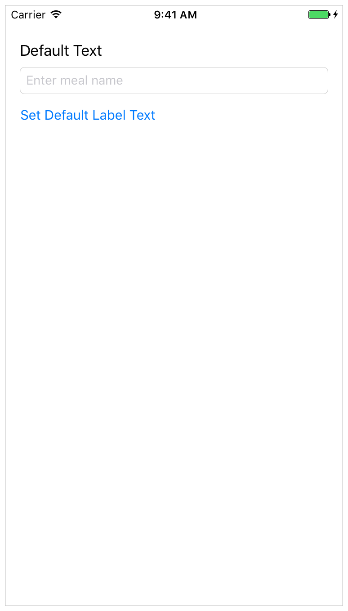
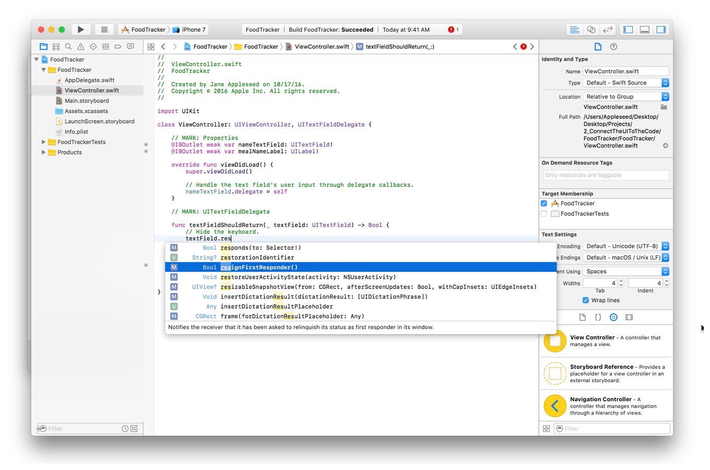

# 使用 Swift 开发 iOS 应用：将 UI 连接到代码 

在本课程中，你将把 FoodTracker 应用程序的基本 [用户界面(UI)](https://developer.apple.com/library/archive/referencelibrary/GettingStarted/DevelopiOSAppsSwift/GlossaryDefinitions.html#//apple_ref/doc/uid/TP40015214-CH12-SW18) 连接到代码，并定义用户可以在该 UI 中执行的一些动作。


## 学习目标

在课程结束时，你将能够：
* 解释故事板中的场景 (scene) 与基础视图控制器之间的关系
* 在故事板和源代码中的 UI 元素之间 “创建 outlet” 和 “连接 action”
* 处理来自 text field 的用户输入并在 UI 中显示结果
* 使类符合协议
* 了解委托模式
* 在设计应用程序架构时遵循目标动作模式 (target-anction pattern)


## 将 UI 连接到源代码

故事板中的元素与源代码是相关联的，了解故事板与你编写的代码之间的关系非常重要。

在故事板中，场景表示一个内容页面，通常是一个视图控制器。视图控制器实现应用程序的行为。视图控制器管理具有子视图层次结构的单个内容视图。视图控制器协调应用程序数据模型之间的信息流，该数据模型封装应用程序的数据，显示该数据的视图，管理其内容视图的生命周期，处理设备旋转时的方向更改，定义你的导航应用程序，并实现响应用户输入的行为。iOS 中的所有视图控制器对象都是类型 `UIViewController` 或其子类之一。

你可以通过创建和实现自定义视图控制器子类来定义视图控制器在代码中的行为。然后，你可以在故事板中为这些类和场景之间创建连接，以获取你在代码中定义的行为以及在故事板中定义的用户界面。

Xcode 已经创建了一个你之前看过的类 `ViewController.swift`，并将它连接到你现在在故事板中处理的场景。将来，当你添加更多场景时，你将在 Identity 检查器中自行建立此连接。该 Identity 检查器可以让你编辑故事板中某个对象的属性，比如该对象是什么类等。


在运行时，你的故事板会创建 `ViewController` 自定义视图控制器子类的实例。故事板中的场景显示在设备的屏幕上，用户界面的行为定义在 `ViewController.swift`。

虽然场景已连接到 `ViewController.swift`，但这不是唯一需要进行的连接。要在应用程序中定义交互，你的视图控制器源代码需要能够与故事板中的视图进行通信。你可以通过在故事板中的视图和视图控制器源代码文件之间定义其它连接 (称为 outlet 和 action) 来完成此动作。


## 为 UI 元素创建 outlet 

[Outlets](https://developer.apple.com/library/archive/referencelibrary/GettingStarted/DevelopiOSAppsSwift/GlossaryDefinitions.html#//apple_ref/doc/uid/TP40015214-CH12-SW55) 提供了一种从源代码文件引用接口对象(即添加到故事板中的对象)的方法。要创建 outlet，请从故事板中的特定对象按住 Control 键拖动到视图控制器文件。此动作为视图控制器文件中的对象创建一个属性，该属性允许你在运行时从代码访问和动作该对象。

你需要在 text field 中创建 outlet 并在用户界面中标记以便能够引用它们。

### 将 text field 连接到 ViewController.swift 代码

**1. 打开你的故事板 `Main.storyboard`。**

**2. 单击 Xco​​de 右上角附近的 Xcode 工具栏中的 Assistant 按钮以打开 assistant 编辑器。**


**3. 如果需要更多空间，可以通过单击 Xco​​de 工具栏中的 Navigator and Utilities 按钮来折叠项目导航器和实用程序区域。**


你也可以折叠大纲视图 (outline view)。

**4. 在助理编辑器顶部显示的编辑器选择器栏中，将助理编辑器从“预览”更改为“自动”> `ViewController.swift`。**


`ViewController.swift` 显示在右侧的编辑器中。

**5. 在 `ViewController.swift`，找到该 `class` 行，它应该是这样的：**

```swift 
class ViewController: UIViewController {
```

**6. 在该 `class` 行下方添加以下内容：**

```swift 
//MARK: Properties
```

你刚刚在源代码中添加了注释。回想一下，注释是源代码文件中的一段文本，它不会作为程序的一部分进行编译，而是提供有关各个代码段的上下文或有用信息。

以字符开头的注释 `//MARK:` 是一种特殊类型的注释，用于组织代码并帮助你(以及读取代码的其它任何人)浏览它。你稍后会看到这个。具体来说，你添加的注释表明这是：列出属性的代码部分。

**7. 在故事板中，选择 text field。**

**8. 按住 Ctrl 键并从 [画布](https://developer.apple.com/library/archive/referencelibrary/GettingStarted/DevelopiOSAppsSwift/GlossaryDefinitions.html#//apple_ref/doc/uid/TP40015214-CH12-SW6) 上的  text field 拖动到右侧编辑器中的代码显示，停止在刚刚添加的注释下方的行拖动 `ViewController.swift`。**


**9. 在出现的对话框中，键入名称 `nameTextField`。保留其余选项。**


**10. 单击连接。**

Xcode 添加必要的代码来 `ViewController.swift` 存储对 text field 的引用，并配置故事板以设置该连接。

```swift
@IBOutlet weak var nameTextField: UITextField!
```

花一点时间来了解这行代码中发生了什么。

该 `IBOutlet` 属性告诉 Xcode 你可以从 Interface Builder 连接到该 `nameTextField` 属性(这就是该属性具有 `IB` 前缀的原因)。该 `weak` 关键字指示该索引不会阻止系统回收 (deallocating) 该引用对象。弱引用有助于防止引用被回收; 但是，要保持对象存活并且在内存中，你需要确保应用程序的其它部分具有对该对象的强引用。在这种情况下，它是 text field 的 superview。superview 保持对其所有子视图的强引用。只要超级视图保持活跃 (alive) 并且在内存中，所有子视图也保持活跃状态​​。类似地，视图控制器具有对其内容视图的强引用 - 使整个视图层次结构保持活跃并在内存中。

声明的其余部分定义了一个类型为 `UITextField` 且名为 `nameTextField` 的隐式未包装的可选变量。请注意类型声明末尾的感叹号。此感叹号表示该类型是隐式展开的可选项，它是一个可选类型，在首次设置后始终具有值。当你访问隐式展开的可选项时，系统会假定它具有有效值并自动为你解包。请注意，如果尚未设置变量的值，则会导致应用程序终止。 

从故事板中加载视图控制器时，系统会实例化视图层次结构并将适当的值分配给所有视图控制器的 outlets。在 `viewDidLoad()` 调用视图控制器的方法时，系统已为所有控制器的 outlet 分配了有效值，你可以安全地访问其内容。

现在，将 label 连接到你的代码，方法与连接 text field 的方式相同。

### 将 Label 连接到 `ViewController.swift` 代码

**1. 在故事板中，选择 label。**

**2. 按住 Ctrl 键从画布上的标签拖动到显示在右侧编辑器的代码中，在 `ViewController.swift` 的 `nameTextField` 属性下方的停止拖动。**


**3. 在出现的对话框中，键入名称 `mealNameLabel`。保留其余选项。**


**4. 单击连接。**

同样，Xcode 会在 `ViewController.swift` 添加必要的代码来存储对 `Label` 的引用，并在故事板中配置该连接。此 outlet 类似于 text field ，除了其名称和类型(`UILabel` 与故事板中的对象类型相匹配)。

```swift 
@IBOutlet weak var mealNameLabel: UILabel!
```

不管你是想访问界面对象的值还是想修改该对象，你只需要一个该接口的 outlet。在这种情况下，你需要设置 text field 的 `delegate` 属性并设置标签的 text 属性。你不会修改按钮，因此不需要为它创建 outlet 。

Outlets 允许你在代码中引用你的界面元素，但是当用户与元素交互时，你仍然需要一种方式来响应。这就是 action 的来源。


## 定义要执行的动作 (action)

iOS 应用程序基于事件驱动编程。也就是说，应用程序的流程由事件决定：系统事件和用户动作。用户在界面中执行触发应用程序中的事件的动作。这些事件导致应用程序逻辑的执行和对其数据的操纵。然后，应用程序对用户动作的响应将反映在用户界面中。因为可以控制应用程序代码的某些部分何时执行的是用户而不是开发人员，所以你希望确切地识别用户可以执行哪些动作以及响应这些动作时会发生什么。

动作(或动作方法)是一段已链接到应用程序触发事件的代码。当该事件发生时，系统执行动作的代码。你可以定义一个动作方法来完成从操作数据到更新用户界面的任何动作。你可以使用动作来驱动应用程序流以响应用户或系统事件。

你可以像创建 outlet 一样创建动作：按住 Ctrol - 从故事板中的特定对象拖动到视图控制器文件。此动作在视图控制器文件中创建一个方法，当用户与附加动作方法的对象进行交互时，该方法会被触发。

首先创建一个简单的动作，只要用户点击“设置默认文本”按钮，就会将标签设置为 `Default Text`。(将标签文本设置到 text field 中的代码更复杂，因此你将在 “处理用户输入” 部分中编写该代码。)


### 在 `ViewController.swift` 代码中创建 `setDefaultLabelText` 动作

**1. 在 `ViewController.swift` 最后一个花括号(`}`)的上方，添加以下内容：**

```swift 
//MARK: Actions
```

此注释表示这是代码中：列出动作的部分。

**2. 在故事板中，选择 Set Default Label Text 按钮。**

**3. 按住 Control 键并将画布上的 Set Default Label Text 按钮拖动到在右侧编辑器 `ViewController.swift` 显示的代码中，在刚刚添加的注释下方的停止拖动 。**


**4. 在出现的对话框中，对于 Connection 选择 Action。**

**5. 对于名称，请键入 `setDefaultLabelText`。**
 
**6. 对于类型，请选择 `UIButton`。**

你可能已经注意到 Type 字段的值默认为 `AnyObject`。在 Swift 中，`AnyObject` 是一种用于描述可以属于任何类的对象的类型。指定此动作方法的类型 `UIButton` 意味着只有按钮对象可以连接到此动作。虽然这对你现在正在创作的动作并不重要，但重要的是要记住以后再做。

保留其余选项。


**7. 单击连接。**

Xcode 在 `ViewController.swift` 中添加了必要的代码来设置 action 方法。

```swift 
@IBAction func setDefaultLabelText(_ sender: UIButton) {
}
```

该 `sender` 参数指的是负责触发动作的对象 - 在本例中是一个按钮。该 `IBAction` 属性表示该方法是你可以从 Interface Builder 故事板中连接到的动作。其余部分声明了一个名为 `setDefaultLabelText(_:)` 的方法。

现在，方法声明为空。重置标签 (Label) 值的代码非常简单。


### 在 ViewController 代码中实现标签重置动作

**1. 在 `ViewController.swift` 中找到刚刚添加的动作方法 `setDefaultLabelText`。**

**2. 在方法实现中，在花括号(`{}`)之间添加以下代码行：**

```swift
mealNameLabel.text = "Default Text"
```

正如你可能猜到的，此代码将标签的 text 属性设置为默认文本。

请注意，你不必指定默认文本的类型，因为 Swift 的类型推断可以看到你正在分配某种类型String 并且可以正确推断类型。

iOS 会为你处理所有重绘代码，因此这实际上是你现在需要编写的所有代码。你的 `setDefaultLabelText(_:)` 动作方法应如下所示：

```swift
@IBAction func setDefaultLabelText(_ sender: UIButton) {
    mealNameLabel.text = "Default Text"
}
```

检查点：通过运行模拟器测试你的更改。单击 Set Default Label Text 按钮时，将调用你的 `setDefaultLabelText(_:)` 方法，并且 `mealNameLabel` 对象的 `text` 值将从 `Meal Name`(故事板中设置的值)更改为(动作设置 `Default Text` 的值)。你应该会在用户界面中看到更改。



虽然将食物的名称更改为 Default Text 并不是特别有用，但它确实说明了重要的一点。你刚刚实现的行为是 iOS 应用程序设计中的目标动作模式的示例。目标动作是一种设计模式，其中一个对象在发生特定事件时将消息发送到另一个对象。

在这种情况下：
* 该事件是用户点击 Set Default Label Text 按钮。
* 行动是 `setDefaultLabelText(_)`。
* 目标是 `ViewController` (定义了动作方法)。
* 发送人是 Set Default Label Text 按钮。

系统通过调用目标上的 action 方法并传入 sender 对象来发送消息。发件人通常是一个控件 - 例如按钮、滑块或开关 - 可以触发事件以响应用户交互，例如点击、拖动或值更改。这种模式在 iOS 应用程序编程中非常常见，你将在整个课程中看到更多内容。


## 处理用户输入

此时，用户可以将美食名称标签重置为默认值，但你确实希望让用户使用 text field 输入他们自己的美食名称。为了简单起见，只要用户在 text field 中输入文本并点击 Return ，你就会更新 `mealNameLabel` 对象的 `text` 值。

当你处理从 text field 接受的用户输入时，你需要来自 text field 委托 (delegate) 的一些帮助。[delegate](https://developer.apple.com/library/archive/referencelibrary/GettingStarted/DevelopiOSAppsSwift/GlossaryDefinitions.html#//apple_ref/doc/uid/TP40015214-CH12-SW36) 是一种作用于代理或与另一个对象的协调的对象。委托对象 (在本例中为 text field) 保留对另一个对象 (委托) 的引用，并在适当的时候，委托对象会向委托发送消息。该消息告诉委托对象有关委托即将处理或刚刚处理的事件。委托可以在应用程序中根据消息更新自身或其它对象的外观或状态，或通过返回值来为如何处理即将发生的事件来做出响应。

当用户正在编辑文本时， text field 的委托与 text field 通信，并且知道何时发生重要事件 - 例如当用户开始或停止编辑文本时。委托可以使用此消息在适当的时间保存或清除数据、关闭键盘等。

任何对象都可以充当另一个对象的委托，只要它符合适当的协议即可。调用定义 text field 委托的协议 `UITextFieldDelegate`。将视图控制器作为它管理的对象的委托是很常见的。在这种情况下，你将使你的 `ViewController` 实例成为 text field 的委托。

首先，`ViewController` 需要采用 `UITextFieldDelegate` 协议。你通过将协议列为类声明行的一部分来采用协议。


### 采用 `UITextFieldDelegate` 协议

**1. 如果助理编辑器 (Assistant editor) 已打开，请单击 Standard 按钮返回标准编辑器 (Standard editor)。**


**2. 单击 Xco​​de 工具栏中的导航器和实用程序 (Navigator and Utilities) 按钮，展开项目导航器和实用程序区域。**

**3. 在项目导航器中，选择 `ViewController.swift`。**

**4. 在 `ViewController.swift`，找到该 `class` 行，它应该是这样的：**

```swift
class ViewController: UIViewController {
```

**5. 在 `UIViewController` 之后，添加一个逗号(`,`) 并采用 `UITextFieldDelegate` 协议。**

```swift
class ViewController: UIViewController, UITextFieldDelegate {
```

通过采用 `UITextFieldDelegate` 协议，你告诉编译器 `ViewController` 类可以充当有效的 text field 委托。这意味着你可以实现协议的方法来处理文本输入，并且可以将`ViewController` 类的实例指定为 text field 的委托。


### 将 `ViewController` 对象设置为其 `nameTextField` 属性的委托

**1. 在 `ViewController.swift`，找到 `viewDidLoad()` 方法，它应该是这样的：**

```swift
override func viewDidLoad() {
    super.viewDidLoad()
    // Do any additional setup after loading the view, typically from a nib.
}
```

此方法的模板实现包括注释。你在方法实现中不需要此注释，因此请继续并删除它。

**2. 在该 `super.viewDidLoad()` 行下方添加一个空行和以下内容：**

```swift
// Handle the text field’s user input through delegate callbacks.
nameTextField.delegate = self
```

该 `self` 指 `ViewController` 类，因为它在 `ViewController` 类定义的范围内引用。

你可以添加自己的注释，以帮助你了解代码中发生的情况。

你的 `viewDidLoad()` 方法应如下所示：

```swift
override func viewDidLoad() {
    super.viewDidLoad()
    
    // Handle the text field’s user input through delegate callbacks.
    nameTextField.delegate = self
}
```

当一个 `ViewController` 实例被加载时，它本身将作为其属性 `nameTextField` 的委托。

该 `UITextFieldDelegate` 协议定义了八种可选方法。只需实现你需要的那些来获得你想要的行为。目前，你需要实现以下两种方法：

```swift
func textFieldShouldReturn(_ textField: UITextField) -> Bool
func textFieldDidEndEditing(_ textField: UITextField)
```

“了解何时调用这些方法以及需要执行哪些动作” 和 “了解 text field 如何响应用户事件” 非常重要。当用户点击 text field 时，它会自动成为第一个响应者。在应用程序中，第一个响应者是第一个用于接收多种应用事件的对象，包括键盘事件、手势事件和动作消息等。换句话说，用户生成的许多事件最初被路由到第一响应者。

由于 text field 成为第一个响应者，iOS 显示键盘并开始该 text field 的编辑会话。使用该键盘的用户键入的内容将插入到 text field 中。

当用户想要完成 text field 的编辑时， text field 需要放弃其第一响应者状态。由于 text field 将不再是应用程序中的活动对象，因此事件需要路由到更合适的对象。

这是你的 `UITextFieldDelegate` 方法实现的用武之地。你需要指定当用户点击按钮以在 text field 中结束编辑时， text field 应该放弃其第一响应者状态。你可以在 `textFieldShouldReturn(_:)` 方法中执行此动作，当用户在键盘上点击 Return (或在本例中为 Done) 时会调用该方法。


### 实现 `UITextFieldDelegate` 协议的 `textFieldShouldReturn(_ :)` 方法

**1. 在 `ViewController.swift` 该 `//MARK: Actions` 部分正上方，添加以下内容：**

```swift
//MARK: UITextFieldDelegate
```

此注释用于组织代码并帮助你(以及任何阅读代码的人)浏览它。

到目前为止，你已添加了其中一些注释。Xcode 将这些注释列为源代码文件的 [功能菜单](https://developer.apple.com/library/archive/referencelibrary/GettingStarted/DevelopiOSAppsSwift/GlossaryDefinitions.html#//apple_ref/doc/uid/TP40015214-CH12-SW41) 中的节标题，如果单击编辑器区域顶部的文件名，则会显示该标题。使用功能菜单可以快速跳转到代码中的某个部分。你会注意到你在这里列出的 `//MARK:` 部分。你可以单击其中一个部分标题以跳转到该文件中的该部分。


**2. 在注释下方，添加以下方法：**

```swift
func textFieldShouldReturn(_ textField: UITextField) -> Bool {
}
```

**3. 在此方法中，添加以下代码以放弃 text field 的第一响应者状态，并添加注释以描述代码的作用：**

```swift
// Hide the keyboard.
textField.resignFirstResponder()
```

尝试键入第二行而不是仅复制和粘贴。你会发现 [代码完成提示(code completion)](https://developer.apple.com/library/archive/referencelibrary/GettingStarted/DevelopiOSAppsSwift/GlossaryDefinitions.html#//apple_ref/doc/uid/TP40015214-CH12-SW29) 是 Xcode 的一个很好的省时功能。当 Xcode 显示可能的完成列表时，滚动列表直到找到所需的完成，然后按 Return 键。Xcode 为你插入整行。



**4. 在此方法中，添加以下代码行：**

```swift
return true
```

此方法返回一个布尔值，指示系统是否应处理按 Return 键的动作。在这种情况下，你总是希望响应用户按下 Return 键，所以只需返回 `true`。

你的 `textFieldShouldReturn(_:)` 方法应如下所示：

```swift
func textFieldShouldReturn(_ textField: UITextField) -> Bool {
    // Hide the keyboard.
    textField.resignFirstResponder()
    return true
}
```

你需要实现的第二种方法 `textFieldDidEndEditing(_:)` 在 text field 放弃其第一响应者状态后调用 。由于你在 `textFieldShouldReturn` 中放弃第一响应者状态，系统在调用 `textFieldShouldReturn` 后立即调用此方法。

`textFieldDidEndEditing(_:)` 方法使你有机会获取输入到 text field 中的信息并对其执行某些动作。在你的情况下，你将获取 text field 中的文本并使用它来更改标签的值。


### 实现 `UITextFieldDelegate` 协议方法 `textFieldDidEndEditing(_ :)`

**1. 在 `ViewController.swift` 中的 `textFieldShouldReturn(_:)` 方法之后，添加以下方法：**

```swift
func textFieldDidEndEditing(_ textField: UITextField) {
}
```

**2. 在此方法中，添加以下代码行：**

```swift
mealNameLabel.text = textField.text
```

所有你需要做的就是看到结果。你的 `textFieldDidEndEditing(_:)` 方法应如下所示：

```swift
func textFieldDidEndEditing(_ textField: UITextField) {
    mealNameLabel.text = textField.text
}
```

检查点：通过运行模拟器测试你的更改。你可以选择 text field 并在其中键入文本。单击键盘上的 Done 按钮时，键盘将被关闭，标签文本将更改为在 text field 中显示文本。单击 Set Default Label Text 按钮时，标签会从标签中当前显示的内容更改为 `Default Text`(你之前定义的动作设置的值)。


## 总结

在本课程中，你已使用助理编辑器向源代码添加 outlet 和 action。当用户与控件交互时，你还添加了用于更新用户界面的代码。该项目仍然只是一个相对简单的单一场景，但你将继续添加功能并通过其余课程来增加其复杂性。