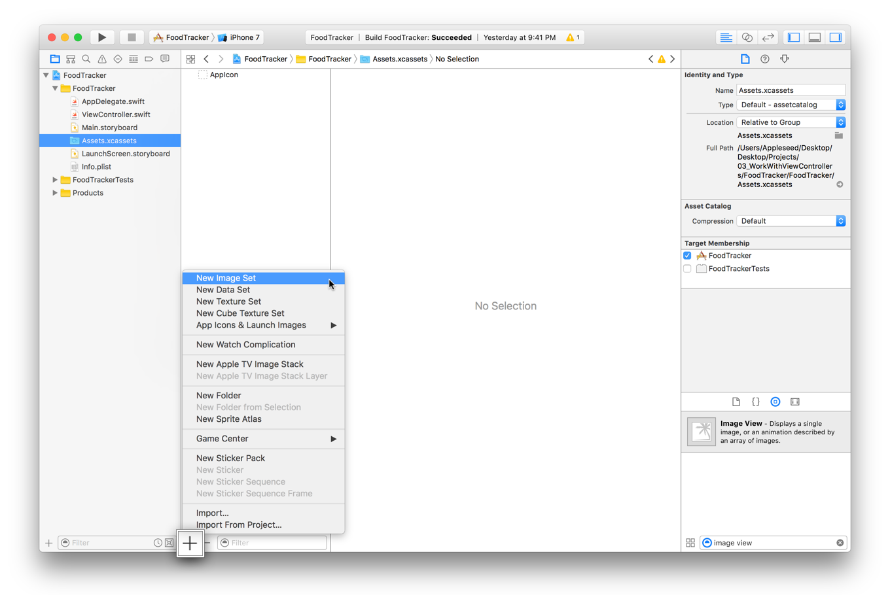

# 使用 Swift 开发 iOS 应用：使用视图控制器 

在本课程中，你将继续使用 FoodTracker 应用程序中的用餐页面的 UI。你将向场景 (scene) 中添加图像视图，并使用图像选择器让用户选择用餐图像。


## 学习目标

在课程结束时，你将能够：
* 理解视图控制器生命周期及其回调(例如 `viewDidLoad`、`viewWillAppear` 和 `viewDidAppear`) 
* 在视图控制器之间传递数据
* 关闭视图控制器
* 使用手势识别器生成事件
* 基于 `UIView` / `UIControl` class 层次结构预测对象行为 
* 使用 asset 目录将图像资源添加到项目中


## 了解 View Controller 生命周期

到目前为止，FoodTracker 应用程序只有一个 [场景](https://developer.apple.com/library/archive/referencelibrary/GettingStarted/DevelopiOSAppsSwift/GlossaryDefinitions.html#//apple_ref/doc/uid/TP40015214-CH12-SW62)，其用户界面由单个视图控制器管理。当你构建更复杂的应用程序时，你将创建更多场景，并且需要管理加载和卸载视图，因为它们在页面上移动和移出。

`UIViewController` 类(及其子类)的对象带有一组管理其视图层次结构的方法。当视图控制器在状态之间转换时，iOS 会在适当的时候自动调用这些方法。当你创建视图控制器子类(就像 你一直使用的 `ViewController` 类)时，它继承了 `UIViewController` 定义的方法 并允许你为每个方法添加自己的自定义行为。了解系统何时调用这些方法非常重要，这样你就可以在该过程中的相应步骤中设置或拆除你正在显示的视图 - 这些都是你在课程后面需要做的事情。


iOS 调用 `UIViewController` 方法如下：

* `viewDidLoad()` - 在从故事板创建和加载视图控制器的内容视图(其视图层次结构的顶部)时调用。在调用此方法时，视图控制器的 outlet 保证具有有效值。使用此方法执行视图控制器所需的任何其它设置。  
通常，iOS `viewDidLoad()` 首次创建内容视图时只调用一次; 但是，在首次实例化控制器时，不一定要创建内容视图。相反，它是在系统或任何代码第一次访问控制器的 view 属性时延迟创建的。

* `viewWillAppear()` - 在视图控制器的内容视图添加到应用程序的视图层次结构之前调用。使用此方法可以触发在页面上显示内容视图之前需要执行的任何操作。尽管名称含义上表明视图将要出现，但只是因为系统调用此方法，其实它并不保证内容视图将变得可见。视图可能被其它视图遮挡或隐藏。此方法仅表示内容视图即将添加到应用程序的视图层次结构中。

* `viewDidAppear()` - 在视图控制器的内容视图添加到应用程序的视图层次结构后立即调用。使用此方法可以在页面上显示视图时立即触发任何需要执行的操作，例如获取数据或显示动画。尽管名称尽管名称含义上表明视图已经出现，但只是因为系统调用此方法，其实它不保证内容视图是可见的。视图可能被其它视图遮挡或隐藏。此方法仅表示内容视图已添加到应用程序的视图层次结构中。

* `viewWillDisappear()` - 在视图控制器的内容视图从应用程序的视图层次结构中删除之前。使用此方法执行清除任务，例如提交更改或放弃第一响应者状态。尽管名称如此，但系统不会仅仅因为内容视图被隐藏或隐藏而调用此方法。仅在将要从应用程序的视图层次结构中删除内容视图时调用此方法。

* `viewDidDisappear()` - 在视图控制器的内容视图已从应用程序的视图层次结构中删除之后。使用此方法执行其它拆卸活动。尽管名称如此，但系统并不仅仅因为内容视图已隐藏或隐藏而调用此方法。仅在从应用程序的视图层次结构中删除内容视图时才调用此方法。

你将在 FoodTracker 应用程序中使用其中一些方法来加载和显示你的数据。事实上，如果你还记得，你已经在 `ViewController` 的 `viewDidLoad()` 方法中编写了以下代码 ：

```swift 
override func viewDidLoad() {
    super.viewDidLoad()
    
    // Handle the text field’s user input through delegate callbacks.
    nameTextField.delegate = self
}
```

这种应用程序设计风格称：视图控制器作为视图和数据模型之间的通信管道，称为 MVC (模型-视图-控制器)。在此模式中，模型会跟踪应用程序的数据，视图显示用户界面并构成应用程序的内容，控制器可以管理你的视图。通过响应用户操作并使用数据模型中的内容填充视图，控制器充当模型和视图之间通信的网关。MVC 是任何 iOS 应用程序的良好设计的核心，到目前为止，FoodTracker 应用程序已经按照 MVC 原则构建。

当你在设计应用程序的其余部分时牢记 MVC 模式，是时候将你的基本用户界面提升到一个新的水平，并将图像添加到用餐场景中。


## 添加餐照片

完成用餐场景的下一步是添加一种显示特定美食照片的方法。为此，你将使用图像视图(`UIImageView`)，即显示图片的用户界面元素。

### 将图像视图添加到场景中

**1. 打开你的故事板，`Main.storyboard`。**

**2. 在实用程序区域中打开对象库。(或者，选择 View >  Utilities > Show Object Library)。**


**3. 在 Object 库中，键入 image view 过滤器字段以快速查找 Image View 对象。**

**4. 将 Image View 对象从 Object 库拖到场景中，使其位于按钮下方的堆栈视图中。**


**5. 选择图像视图后，在实用程序区域中点击  打开 Size 检查器 。**

回想一下，当你从检查器选择器栏中的左侧选择第五个按钮时，将出现 Size 检查器。它允许你编辑故事板中对象的大小和位置。


**6. 在 Intrinsic Size 字段中，选择 Placeholder。(此字段位于 Size 检查器的底部，因此你需要向下滚动到该字段。)**

**7. 在宽度和高度字段中都键入 320。按 Return 键。**

视图的「内在内容大小」(intrinsic content size) 是视图基于其内容的首选大小。空图像视图没有固有内容大小。只要将图像添加到视图，其「内在内容大小」就会设置为图像的大小。提供占位符 (placeholder) 大小可为图像提供临时「内在内容大小」，你可以在设计用户界面时使用该大小。该值仅在 Interface Builder 中设计界面时使用; 在运行时，布局引擎使用视图的实际内在内容大小。


**8. 在画布的右下角，打开 Pin 菜单。**


**9. 选中纵横比 (Aspect Ratio) 旁边的复选框。**


**10. 在 Pin 菜单中，单击 Add 1 Constraints 按钮。**

你的图片视图现在具有 1:1 的宽高比，因此它始终为正方形。


**11. 选择图像视图后，通过  打开属性检查器 (Attributes inspector)。**

回想一下，当你从检查器选择器栏中的左侧选择第四个按钮时，将显示属性检查器。它允许你编辑故事板中对象的属性。

**12. 在属性检查器中，找到交互 (Interaction) 字段，然后选中 User Interaction Enabled 复选框。**

稍后你将需要此功能，以便用户与图像视图进行交互。


## 显示默认照片

添加占位符图像，让用户知道他们可以与图像视图进行交互以选择照片。使用本 `Images/` 课程结尾处可下载文件的文件夹中的此图像，或使用你自己的图像。


### 将图像添加到项目中

**1. 在项目导航器中，选择 `Assets.xcassets` 查看 asset 目录。**

该 asset 目录是存储和整理你应用程序图片资源的地方。

**2. 在左下角，单击加号(`+`)按钮，然后从弹出菜单中选择 New Image Set。**



**3. 双击图像集名称并将其重命名为 `defaultPhoto`。**

**4. 在计算机上，选择要添加的图像。**

**5. 将图像拖放到 `2x` 图像集的插槽中。**


2x是你在这些课程中使用的iPhone 7 模拟器的显示分辨率，因此图像在此分辨率下看起来最佳。

> **进一步探索**
>
> 有关图像分辨率的更多信息，请参阅 iOS 人机界面指南中的 Graphics > Image Size and Resolution。

将默认占位符图像添加到项目中后，设置图像视图以显示它。


### 在图像视图中显示默认图像

**1. 打开你的故事板。**

**2. 在故事板中，选择图像视图。**

**3. 选择图像视图后，通过  在实用程序区域中打开属性检查器。**

**4. 在属性检查器中，找到标记为 Image 的字段并选择 `defaultPhoto`。**

检查点：运行你的应用程序，默认图像显示在图像视图中。


## 将图像视图连接到代码

现在，你需要实现在运行时更改此图像视图中的图像的功能。首先，你需要将图像视图连接到 `ViewController.swift` 代码中。

### 将图像视图连接到 `ViewController.swift` 代码

**1. 单击 Xco​​de 右上角附近的 Xcode 工具栏中的 Assistant 按钮以打开助理编辑器。**


**2. 如果需要更多空间，可以通过单击 Xco​​de 工具栏中的 Navigator and Utilities 按钮来折叠项目导航器和实用程序区域。**


你也可以折叠大纲视图 (outline view)。

**3. 在故事板中，选择图像视图。**

**4. 按住 Ctrol 拖拽画布中的图像视图到右侧编辑器显示的 `ViewController.swift` 代码中，在现有的 outlets 下方停止拖动。**


**5. 在出现的对话框中，键入名称 `photoImageView`。保留其余选项。**


**6. 单击连接。**

Xcode 在 `ViewController.swift` 中添加了必要的代码来存储对图像视图的引用，并配置故事板以设置该连接。

```swift 
@IBOutlet weak var photoImageView: UIImageView!
```

你现在可以从代码访问图像视图以更改其图像，但你如何知道何时更改图像？你需要为用户提供一种方式来指示他们想要更改图像 - 例如，通过点击图像视图。然后，你将定义一个动作方法，以便在点击发生时更改图像。

视图和控件之间存在细微差别，它们是以特定方式响应用户操作的视图的专用版本。视图显示内容，而控件用于以某种方式修改内容。control (`UIControl`) 是 `UIView` 的子类。实际上，你已经在界面中使用了视图 (标签、图像视图) 和控件 (文本字段、按钮)。 


## 创建一个手势识别器

图像视图不是控件，因此它不是设计为以与按钮或滑块相同的方式响应输入。例如，你不能简单地创建在用户点击图像视图时触发的操作方法。(如果你尝试按住 Control 键 - 从图像视图拖动到代码，你会注意到无法在 Connection 字段中选择 action。)

幸运的是，通过向其添加手势识别器，可以很容易地为视图提供与控件相同的功能。手势识别器是附加到视图的对象，允许视图以控件的方式响应用户。手势识别器解释触摸以确定它们是否对应于特定手势，例如滑动、捏合或旋转。你可以编写一个在手势识别器识别其指定手势时调用的操作方法，这正是你需要对图像视图执行的操作。

将点击手势识别器 (`UITapGestureRecognizer`) 附加到图像视图，该图像视图将识别用户何时点击图像视图。你可以在故事板中轻松完成此操作。

### 向图像视图添加点按手势识别器

**1. 打开对象库 (选择 View > Utilities > Show Object Library)。**

**2. 在对象库中，键入 `tap gesture` 过滤器字段以快速查找 Tap Gesture Recognizer 对象。**

**3. 将 Tap Gesture Recognizer 对象从 Object 库拖到场景中，并将其放在图像视图的顶部。**


Tap Gesture Recognizer 对象出现在用餐场景停靠栏 (scene dock)中。


## 将手势识别器连接到代码

现在，将该手势识别器连接到代码中的操作方法。

### 将手势识别器连接到 `ViewController.swift` 代码

**1. 按住 Control 键拖动场景停靠栏中的识别手势到在右边编辑器显示的 `ViewController.swift` 代码中，在 `//MARK: Actions` 一行注释的下方停止拖拽。**


**2. 在出现的对话框中，对于 Connection，选择Action。**

**3. 对于名称，请键入 `selectImageFromPhotoLibrary`。**

**4. 对于类型，请选择 `UITapGestureRecognizer。`**


**5. 单击连接。**

Xcode 在 `ViewController.swift` 中添加了必要的代码来设置操作。

```swift
@IBAction func selectImageFromPhotoLibrary(_ sender: UITapGestureRecognizer) {
}
```


## 创建一个图像选择器以响应用户点击

当用户点击图像视图时，他们应该能够从一组照片中选择一张照片，或者选择他们自己的照片。幸运的是， `UIImagePickerController` 类内置了这种行为。图像选择器控制器管理用户界面以进行照片拍摄或选择已保存图像。就像在处理 text field 时需要 text field delegate 一样，你需要一个图像选择器控制器委托来处理图像选择器控制器。该委托协议的名称是 `UIImagePickerControllerDelegate`，你将定义图像选择器控制器的委托对象为 `ViewController`.

首先，`ViewController` 需要采用 `UIImagePickerControllerDelegate` 协议。因为 `ViewController` 将负责呈现图像选择器控制器，所以它还需要采用 `UINavigationControllerDelegate` 协议，这只是 `ViewController` 承担一些基本的导航责任 (responsibilities)。

### 采用 `UIImagePickerControllerDelegate` 和 `UINavigationControllerDelegate` 协议

**1. 单击 Standard 按钮返回标准编辑器。**


单击 Xco​​de 工具栏中的 Navigator and Utilities 按钮，展开项目导航器和实用程序区域。

**2. 在项目导航器中，选择 `ViewController.swift`。**

**3. 在 `ViewController.swift`，找到该 `class` 行，它应该是这样的：**

```swift
class ViewController: UIViewController, UITextFieldDelegate {
```

**4. 在 `UITextFieldDelegate` 后面，添加一个逗号(`,`) 并采用 `UIImagePickerControllerDelegate` 协议。**

```swift
class ViewController: UIViewController, UITextFieldDelegate, UIImagePickerControllerDelegate {
```

**5. 在 `UIImagePickerControllerDelegate` 后面，添加一个逗号(`,`)并采用 `UINavigationControllerDelegate` 协议。**

```swift
class ViewController: UIViewController, UITextFieldDelegate, UIImagePickerControllerDelegate, UINavigationControllerDelegate {
```

此时，你可以返回到你定义的操作方法 `selectImageFromPhotoLibrary(_:)`，并完成其实现。

### 实现 `selectImageFromPhotoLibrary(_ :)` 动作方法

**1. 在 `ViewController.swift` 中找到你之前添加的动作方法 `selectImageFromPhotoLibrary(_:)` 。**

它应该如下所示：

```swift
@IBAction func selectImageFromPhotoLibrary(_ sender: UITapGestureRecognizer) {
}
```

**2. 在方法实现中，在花括号(`{}`)之间添加以下代码：**

```swift
// Hide the keyboard.
nameTextField.resignFirstResponder()
```

此代码确保如果用户在 text field 中键入时轻触图像视图，则键盘将被正确解除。

**3. 添加此代码以创建图像选取器控制器：**

```swift
// UIImagePickerController is a view controller that lets a user pick media from their photo library.
let imagePickerController = UIImagePickerController()
```

**4. 添加此代码：**

```swift
// Only allow photos to be picked, not taken.
imagePickerController.sourceType = .photoLibrary
```

这行代码设置了图像选择器控制器的源类型，或它获取图像的位置。该 `.photoLibrary` 选项使用模拟器的相机胶卷 (camera roll)。

`imagePickerController.sourceType ` 的类型是已知的 `UIImagePickerControllerSourceType` 枚举。这意味着你可以将其值写为缩写形式 `.photoLibrary`，而不是 `UIImagePickerControllerSourceType.photoLibrary`。回想一下，只要枚举值的类型已知，就可以使用缩写形式。

**5. 添加此代码以将图像选择器控制器的委托设置为 `ViewController`：**

```swift
// Make sure ViewController is notified when the user picks an image.
imagePickerController.delegate = self
```

**6. 在上一行下方，添加以下代码行：**

```swift
present(imagePickerController, animated: true, completion: nil)
```

`present(_:animated:completion:)` 是一种在 `ViewController` 中被调用的方法。虽然它没有明确写入，但此方法是在隐式 `self` 对象上执行的。该方法要求 `ViewController` 呈现定义的视图控制器 `imagePickerController`。传递 `true` 给 `animated` 参数可以设置图像选取器控制器的显示动画。该 `completion` 参数引用完成处理程序，即在此方法完成后执行的一段代码。因为你不需要执行任何其它操作，所以通过传入 `nil` 表明你不需要执行完成处理程序。

你的 `selectImageFromPhotoLibrary(_:)` 操作方法应如下所示：

```swift
@IBAction func selectImageFromPhotoLibrary(_ sender: UITapGestureRecognizer) {
    
    // Hide the keyboard.
    nameTextField.resignFirstResponder()
    
    // UIImagePickerController is a view controller that lets a user pick media from their photo library.
    let imagePickerController = UIImagePickerController()
    
    // Only allow photos to be picked, not taken.
    imagePickerController.sourceType = .photoLibrary
    
    // Make sure ViewController is notified when the user picks an image.
    imagePickerController.delegate = self
    present(imagePickerController, animated: true, completion: nil)
}
```

显示图像选择器控制器后，你将通过委托方法与其进行交互。为了让用户能够选择图片，你需要实现以下定义的两个委托方法 `UIImagePickerControllerDelegate`：

```swift
func imagePickerControllerDidCancel(_ picker: UIImagePickerController)
func imagePickerController(_ picker: UIImagePickerController, didFinishPickingMediaWithInfo info: [String : Any])
```

其中的第一个，`imagePickerControllerDidCancel(_:)`，当用户点击图像选择器的 Cancel 按钮时会调用。此方法使你有机会解除 `UIImagePickerController` (并且可选地执行任何必要的清理)。


### 实现 `imagePickerControllerDidCancel(_ :)` 方法

1. 在 `ViewController.swift` 的 `//MARK: Actions` 部分正上方，添加以下内容：

```swift
//MARK: UIImagePickerControllerDelegate
```

这是一个注释，可以帮助你 (以及其它读取你代码的人) 浏览你的代码并确定此部分适用于图像选择器实现。

**2. 在你刚添加的注释下方，添加以下方法：**

```swift
func imagePickerControllerDidCancel(_ picker: UIImagePickerController) {
}
```

**3. 在此方法中，添加以下代码行：**

```swift
// Dismiss the picker if the user canceled.
dismiss(animated: true, completion: nil)
```

此代码动画 dismiss 图像选择器控制器。

你的 `imagePickerControllerDidCancel(_:)` 方法应如下所示：

```swift
func imagePickerControllerDidCancel(_ picker: UIImagePickerController) {
    // Dismiss the picker if the user canceled.
    dismiss(animated: true, completion: nil)
}
```

需要实现的 `UIImagePickerControllerDelegate` 第二个方法 `imagePickerController(_:didFinishPickingMediaWithInfo:)`，当用户选择照片时被调用。此方法使你有机会对用户从选取器中选择的图像执行某些操作。在你的情况下，你将拍摄所选图像并将其显示在图像视图中。

### 实现 `imagePickerController(_：didFinishPickingMediaWithInfo :)` 方法

**1. 在 `imagePickerControllerDidCancel(_:)` 方法下方，添加以下方法：**

```swift
func imagePickerController(_ picker: UIImagePickerController, didFinishPickingMediaWithInfo info: [String : Any]) {
}
```

**2. 在此方法中，添加以下代码行：**

```swift
// The info dictionary may contain multiple representations of the image. You want to use the original.
guard let selectedImage = info[UIImagePickerControllerOriginalImage] as? UIImage else {
    fatalError("Expected a dictionary containing an image, but was provided the following: \(info)")
}
```

该 `info` 字典总是包含有选择器选择的原始图像。它还可能包含该图像的编辑版本(如果存在)。为了简单起见，你将使用未经编辑的原始图像作美食图片。

此代码访问 `info` 字典中未经编辑的原始图像。它安全地解开字典返回的可选项并将其作为 `UIImage` 对象进行转换。期望是 unwrapping 和 casting 操作永远不会失败。如果他们这样做，则表示你的应用中在设计时需要修复错误。该 `fatalError()` 方法将错误消息记录到控制台，包括 `info` 字典的内容，然后使应用程序终止 - 防止它继续处于无效状态。

**3. 添加以下代码行以在先前创建的图像视图插座中设置所选图像：**

```swift
// Set photoImageView to display the selected image.
photoImageView.image = selectedImage
```

**4. 添加以下代码行以关闭图像选择器：**

```swift
// Dismiss the picker.
dismiss(animated: true, completion: nil)
```

你的 `imagePickerController(_:didFinishPickingMediaWithInfo)` 方法应如下所示：

```swift
func imagePickerController(_ picker: UIImagePickerController, didFinishPickingMediaWithInfo info: [String : Any]) {
    
    // The info dictionary may contain multiple representations of the image. You want to use the original.
    guard let selectedImage = info[UIImagePickerControllerOriginalImage] as? UIImage else {
        fatalError("Expected a dictionary containing an image, but was provided the following: \(info)")
    }
    
    // Set photoImageView to display the selected image.
    photoImageView.image = selectedImage
    
    // Dismiss the picker.
    dismiss(animated: true, completion: nil)
}
```

检查点：运行你的应用程序。单击图像视图时会发生什么？


该应用终止于一个 SIGABRT 信号。这意味着发生的错误严重到足以导致应用程序中止。在这种情况下，当你尝试显示图像选择器时会出现问题。在访问照片库之前，系统必须要求用户许可。在iOS 10 及更高版本中，你必须提供照片库使用说明。此说明解释了你的应用想要访问照片库的原因。


### 添加照片库使用说明

**1. 在项目导航器中，选择 `Info.plist`。**

Xcode 在编辑器区域中显示属性列表编辑器。属性列表是一个结构化文本文件，其中包含有关应用程序的基本配置信息。属性列表的根是一个包含一组预定义键及其值的字典。


> **进一步探索**
>
> 有关可能 info.plist 键的更多信息，请参阅 [信息属性列表键参考](https://developer.apple.com/library/archive/documentation/General/Reference/InfoPlistKeyReference/Introduction/Introduction.html#//apple_ref/doc/uid/TP40009247)。

**2. 如果属性列表中的最后一项是数组，请确保该数组已折叠。如果将项添加到展开的数组，则会添加子项。如果将项添加到折叠数组，则会向数组添加一个兄弟。**

**3. 要添加新项目，请将鼠标悬停在属性列表中的最后一项上，然后在出现时单击添加按钮(或选择 Editor > Add Item)。**


**4. 在弹出菜单中，向下滚动并选择 Privacy - Photo Library Usage Description。**


**5. 在新行中，确保将 Type 设置为 String。然后，双击 Value 部分并输入 `Allows you to add photos to your meals`.**


**6. 完成编辑描述字符串后，按 Return 键。**

检查点：再次运行你的应用程序。这次你应该能够点击图像视图来拉出图像选择器。你需要在警告上单击 OK，该 Alert 要求允许 FoodTracker 应用程序访问照片。然后，你可以单击 Cancel 按钮以关闭选取器，或打开 Camera Roll 并单击图像以将其选中并将其设置为图像视图中的图像。


如果你查看模拟器中提供的照片，你会发现它不包含任何食物照片。你可以将自己的图像直接添加到模拟器中，以使用适当的样本内容测试 FoodTracker 应用程序。


### 将图像添加到 iOS Simulator

**1. 如有必要，请在模拟器中运行你的应用程序。**

**2. 在计算机上，选择要添加的图像。**

**3. 将图像拖放到模拟器中。**


模拟器打开照片应用程序并显示你添加的图像。


检查点：运行你的应用程序。你应该可以点按图像视图以拉出图像选择器。打开 Camera Roll，然后单击你添加到模拟器中的一个图像以将其选中并将其设置为图像视图中的图像。


## 总结

在本课程中，你已了解视图控制器生命周期方法，并使用它们来配置视图控制器的内容。你还学习了如何向视图添加手势识别器，以及如何从照片库中选择照片。场景开始看起来像一个真正的应用程序。在下一课中，你将向场景添加自定义控件。