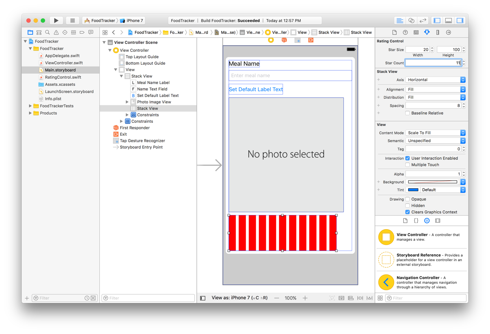
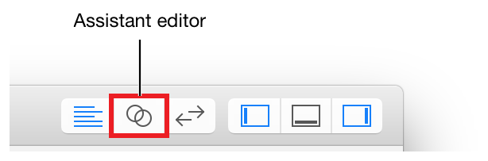
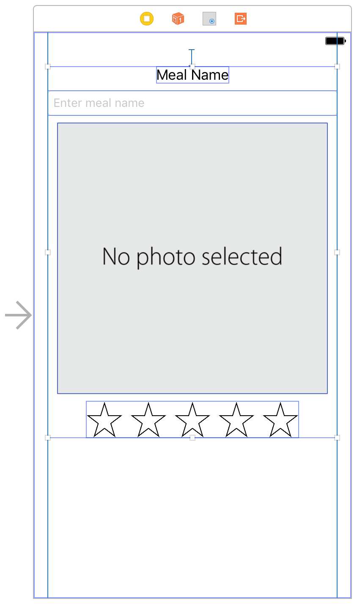

# 使用 Swift 开发 iOS 应用：实现自定义控件

在本课程中，你将为 FoodTracker 应用程序实现自定义评级控件，并将其添加到场景中。


## 学习目标

在课程结束时，你将能够：

* 创建自定义源代码文件并将其与故事板中的元素相关联
* 定义自定义类
* 在自定义类上实现初始化程序
* 使用 `UIStackView` 的容器
* 了解如何以编程方式创建视图
* 将辅助功能信息添加到自定义控件
* 使用 `@IBInspectable` 和 `@IBDesignable` 在 Interface Builder 中显示和控制自定义视图


## 创建自定义视图

为了能够为用餐评分，用户需要一个控件，让它们选择它们想要分配给用餐的星星数量。有许多方法可以实现这一点，但本课程重点介绍一种直接的方法，即通过组合现有视图和控件来构建自定义控件。你将创建一个堆栈视图子类，用于管理代表星星的一行按钮。你将完全在代码中定义自定义控件，然后将其添加到故事板中。

评级控件显示为一排星星。


用户可以选择餐费评级。当用户点击一颗星时，该星和它前面的星星都会被填充。如果用户点击最右边的星号(与当前评级相关的星号)，则清除评级并且所有星星都显示为空。

要开始设计此控件的 UI、交互和行为，请首先创建自定义堆栈视图(`UIStackView`)子类。


### 创建 `UIStackView` 的子类

**1. 选择 File > New > File (或按 Command-N)。**

**2. 在出现的对话框顶部，选择 iOS。**

**3. 选择 Cocoa Touch Class，然后单击 Next。**

**4. 在 Class 字段中，键入 `RatingControl`。**

**5. 在 Subclass 字段中，选择 `UIStackView`。**

**6. 确保语言选项设置为 Swift。**


**7. 点击下一步。**

保存位置默认为项目目录。  
Group 选项默认为你的应用名称 FoodTracker。  
在 Targets 部分中，你的应用程序已被选中，并且你的应用程序的测试未被选中。

**8. 保留这些默认值，然后单击“创建”。**

Xcode 创建一个定义为 `RatingControl` 类的文件：`RatingControl.swift`。`RatingControl` 是一个自定义视图 `UIView` 子类 。

如有必要，在项目导航器中，拖动 `RatingControl.swift` 文件，使其位于其它 Swift 文件下。


**9. 在 `RatingControl.swift` 中删除模板实现附带的注释，以便你可以开始使用空白平板 (slate)。**

实现应如下所示：

```swift
import UIKit
 
class RatingControl: UIStackView {
    
}
```

你通常以下两种方式之一创建视图：
* 通过以编程方式初始化视图。
* 或允许视图由故事板加载。

每种方式都有相应的初始化逻辑：`init(frame:)` 用于以编程方式初始化视图和 `init?(coder:)` 用于从故事板加载视图。回想一下，初始化逻辑是一种准备要使用的类实例的方法，它涉及为每个属性设置初始值并执行任何其它设置。

你需要在自定义控件中实现这两种方法。在设计应用程序时，Interface Builder 在将视图添加到画布时以编程方式实例化视图。在运行时，你的应用程序会从故事板中加载视图。

### 覆盖初始值设定项

**1. 在 `RatingControl.swift` 该 `class` 行下，添加此注释。**

```swift
//MARK: Initialization
```

**2. 在注释下方，开始输入 `init`。显示代码完成提示时停止输入。**


**3. 选择 `init(frame: CGRect)` 从列出的选项，然后按回车键。**

Xcode 为你插入初始化器骨架 (initializer skeleton)。

```swift
init(frame: CGRect) {
    
}
```

**4. 错误和警告在代码旁边显示为黄色三角形图标(警告)和红色圆圈(错误)。目前，该 `init(frame:)` 方法有错误。单击错误图标以显示有关错误的更多信息。**


**5. 双击 Fix-it 以插入 override 关键字。**

```swift
override init(frame: CGRect) {
    
}
```

Swift 编译器知道 `init(frame:)` 必须将其标记为 required，并提供修复程序以在代码中进行此更改。修复 - 它由编译器提供，作为代码中错误的潜在解决方案。

**6. 添加此行以调用超类的初始值设定项：**

```swift
super.init(frame: frame)
```

**7. 在 `init(frame:)` 方法下面，再次开始输入 `init`，并从代码完成选项中选择  `init(coder：NSCoder)`。按 Return 键。**

Xcode 为你插入初始化器骨架 (initializer skeleton)。

```swift
init(coder: NSCoder) {
    
}
```

**8. 使用 Fix-it 插入 `required` 关键字。**

> **注意**
>
> Swift 处理初始化程序的方式与其它方法不同。如果你不提供任何初始值设定项，Swift 类会自动继承其所有超类的指定初始值设定项。如果实现任何初始值设定项，则不再继承任何超类初始值设定项; 但是，超类可以将其一个或多个初始化程序标记为 `required`。子类必须实现(或自动继承)所有必需的初始值设定项。此外，子类必须将其初始化器标记为 `required`，表明它们的子类还必须实现初始化器。

**9. 添加此行以调用超类的初始化程序。**

```swift
super.init(coder: coder)
```

初始化器应如下所示：

```swift
override init(frame: CGRect) {
    super.init(frame: frame)
}
 
required init(coder: NSCoder) {
    super.init(coder: coder)
}
```

现在，你的初始值设定项是占位符，只需调用超类的实现。你将在本课程后面添加其它配置步骤。


## 显示自定义视图

要显示自定义控件，需要在故事板中添加堆栈视图，并在堆栈视图和刚编写的代码之间建立连接。

### 显示视图

**1. 打开你的故事板。**

**2. 在故事板中，使用对象库查找 Horizontal Stack View 对象，然后将其拖入故事板场景中，使其位于图像视图下方的堆栈视图中。**


**3. 选择 Horizontal Stack View 后，通过  打开 Identity 检查器图片。**

回想一下，Identity 检查器允许你编辑故事板中与该对象的标识相关的对象的属性，例如对象所属的类。


**4. 在 Identity 检查器中，找到标记为 Class 的字段并选择 `RatingControl`。**


## 向视图添加按钮

此时，你已经掌握了自定义 `UIStackView` 子类的基础知识 `RatingControl`。接下来，你需要在视图中添加按钮以允许用户选择评级。从简单的事情开始，比如在视图中显示一个红色按钮。

### 在视图中创建按钮

无论调用哪个初始值设定项，都要确保添加了该按钮。为此，请添加一个私有方法 `setupButtons()`，并从两个初始化程序中调用该方法。

**1. 在 `RatingControl.swift` 初始化方法中，添加此注释。**

```swift
//MARK: Private Methods
```

使用此注释下方的空格 `private` 在 `func` 介绍人之前使用修饰符创建私有方法 - 方法。私有方法只能由声明类中的代码调用。这使你可以封装和保护方法，确保不会意外或意外地从外部调用它们。

**2. 在注释下，添加以下方法：**

```swift
private func setupButtons() {
    
}
```

**3. 在该 `setupButtons()` 方法中，添加以下代码行以创建红色按钮：**

```swift
// Create the button
let button = UIButton()
button.backgroundColor = UIColor.red
```

在这里，你正在使用 `UIButton` 该类的一个便利初始化器。此初始化程序调用 `init(frame:)`并传入零大小的矩形。从零大小的按钮开始很好，因为你正在使用自动布局。堆栈视图将自动定义按钮的位置，你将添加约束来定义按钮的大小。

你正在使用，`red` 因此很容易看到视图的位置。如果你愿意，请使用其它预定义 `UIColor` 值之一，例如 `blue` 或 `green`。

**4. 在最后一行下方，添加按钮的约束：**

```swift
// Add constraints
button.translatesAutoresizingMaskIntoConstraints = false
button.heightAnchor.constraint(equalToConstant: 44.0).isActive = true
button.widthAnchor.constraint(equalToConstant: 44.0).isActive = true
```

第一行代码禁用按钮自动生成的约束。以编程方式实例化视图时，其 `translatesAutoresizingMaskIntoConstraints` 属性默认为 `true`。这告诉布局引擎创建约束，根据视图 `frame` 和 `autoresizingmask` 属性定义视图的大小和位置。通常，在使用“自动布局”时，你希望用自己的约束替换这些自动生成的约束。要删除自动生成的约束，请将 `translatesAutoresizingMaskIntoConstraints` 属性设置为 `false`。

> **注意**
>
> 这条线不是绝对必要的。将视图添加到堆栈视图时，堆栈视图会自动将视图的 `translatesAutoresizingMaskIntoConstraints` 属性设置为 `false`。但是，使用自动布局时，每当你以编程方式创建视图时，显式禁用自动生成的约束是一个好习惯。这样你就不会忘记在它真正重要的时候禁用它们。

以 `button.heightAnchor` 和 `button.widthAnchor` 开头的代码创建定义按钮高度和宽度的约束。每行执行以下步骤：

* 按钮 `heightAnchor` 和 `widthAnchor` 属性可以访问布局锚点。你可以使用布局锚点来创建约束 - 在这种情况下，约束分别定义视图的高度和宽度。
* anchor 的 `constraint(equalToConstant:)` 方法返回一个约束，该约束定义视图的恒定高度或宽度。
* 约束的 `isActive` 属性激活或停用约束。将此属性设置为时 `true`，系统会将约束添加到正确的视图，并激活它。

这些线一起将按钮定义为布局中的固定大小对象 (44点x 44点)。

**5. 最后，将按钮添加到堆栈：**

```swift
// Add the button to the stack
addArrangedSubview(button)
```

该 `addArrangedSubview()` 方法将你创建的按钮添加到 `RatingControl` 堆栈视图管理的视图列表中。此操作将视图添加为 `RatingControl` 的子视图，并指示 `RatingControl` 创建管理按钮在控件中的位置所需的约束。

你的 `setupButtons()` 方法应如下所示：

```swift
private func setupButtons() {
    
    // Create the button
    let button = UIButton()
    button.backgroundColor = UIColor.red
    
    // Add constraints
    button.translatesAutoresizingMaskIntoConstraints = false
    button.heightAnchor.constraint(equalToConstant: 44.0).isActive = true
    button.widthAnchor.constraint(equalToConstant: 44.0).isActive = true
    
    // Add the button to the stack
    addArrangedSubview(button)
}
```

现在从两个初始化方法中调用此方法，如下所示：

```swift
override init(frame: CGRect) {
    super.init(frame: frame)
    setupButtons()
}
 
required init(coder: NSCoder) {
    super.init(coder: coder)
    setupButtons()
}
```

检查点：运行你的应用程序。你应该能够看到里面有一个小红色方块的视图。红色方块是你在初始化程序中添加的按钮。


你需要为此按钮添加动作(以及稍后将添加的其它按钮)。最后，你将使用此按钮更改餐的评级; 但是，现在你只需检查动作是否正常。


### 向按钮添加动作

**1. 在 `RatingControl.swift` 中的 `//MARK Initialization` 部分之后，添加以下内容：**

```swift
//MARK: Button Action
```

在评论下，添加以下内容：

```swift
func ratingButtonTapped(button: UIButton) {
    print("Button pressed 👍")
}
```

使用该 `print()` 函数检查 `ratingButtonTapped(_:)` 动作是否按预期链接到按钮。此函数将消息输出到标准输出，在本例中为 Xcode 调试控制台。控制台是一个有用的调试机制，出现在编辑器区域的底部。

你将在一段时间内用真正的实现替换此调试实现。

找到 `setupButtons()` 方法：

```swift
private func setupButtons() {
    
    // Create the button
    let button = UIButton()
    button.backgroundColor = UIColor.red
    
    // Add constraints
    button.translatesAutoresizingMaskIntoConstraints = false
    button.heightAnchor.constraint(equalToConstant: 44.0).isActive = true
    button.widthAnchor.constraint(equalToConstant: 44.0).isActive = true
    
    // Add the button to the stack
    addArrangedSubview(button)
}
```

在 `// Add the button to the stack` 注释上方，添加以下代码：

```swift
// Setup the button action
button.addTarget(self, action: #selector(RatingControl.ratingButtonTapped(button:)), for: .touchUpInside)
```

在上一课中，你使用目标动作模式将故事板中的元素链接到代码中的动作方法。该 `addTarget(_, action:, for:)` 方法在代码中执行相同的动作。你将 `ratingButtonTapped(_:)` 动作方法附加到 `button` 对象，只要 `.TouchDown` 事件发生，就会触发该方法。

这段代码中有很多内容。这是一个细分：

* 目标是 `self`，它引用封闭类的当前实例。在这种情况下，它指的 `RatingControl` 是设置按钮的对象。

* 该 `#selector` 表达式返回 `Selector` 用于所提供的方法的值。选择器是标识方法的不透明值。较旧的 API 使用选择器在运行时动态调用方法。虽然较新的 API 已经在很大程度上取代了带有块的选择器，但许多类似的方法 `performSelector(_:)` 和 `addTarget(_:action:forControlEvents:)-still` 都将选择器作为参数。在此示例中，`#selector(RatingControl.ratingButtonTapped(_:))` 表达式返回 `ratingButtonTapped(_:)` 动作方法的选择器。这样，系统可以在点击按钮时调用你的动作方法。

* 该 `UIControlEvents` 选项设置定义了一些控制可以响应事件。通常，按钮会响应 `.touchUpInside` 事件。当用户触摸按钮，然后在手指仍在按钮边界内时抬起手指时，会发生这种情况。此事件相比 `.touchDown` 具有优势，因为用户可以通过在提起之前将手指拖到按钮外来取消事件。

* 注意，因为你没有使用 Interface Builder，所以你不需要使用该 `IBAction` 属性定义你的 `action` 方法; 你只需像任何其它方法一样定义动作。你可以使用不带参数的方法，该方法接受单个sender参数，或者同时接受 `sender` 和 `Event` 参数。

```swift
func doSomething()
func doSomething(sender: UIButton)
func doSomething(sender: UIButton, forEvent event: UIEvent)
```

你的 `setupButtons()` 方法现在应该如下所示：

```swift
private func setupButtons() {
    
    // Create the button
    let button = UIButton()
    button.backgroundColor = UIColor.red
    
    // Add constraints
    button.translatesAutoresizingMaskIntoConstraints = false
    button.heightAnchor.constraint(equalToConstant: 44.0).isActive = true
    button.widthAnchor.constraint(equalToConstant: 44.0).isActive = true
    
    // Setup the button action
    button.addTarget(self, action: #selector(RatingControl.ratingButtonTapped(button:)), for: .touchUpInside)
    
    // Add the button to the stack
    addArrangedSubview(button)
}
```

检查点：运行你的应用程序。单击红色方块时，应在控制台中看到“按下按钮”消息。


现在是时候考虑一​​下 RatingControl 类需要哪些信息来表示评级。你需要跟踪评级值，以及用户点击以设置该评级的按钮。你可以使用一个 `Int` 来表示评级值，将按钮表示为 `UIButton` 对象数组。

### 添加评级属性

在 `RatingControl.swift` ，找到类声明行：

```swift
class RatingControl: UIView {
```

在此行下方，添加以下代码：

```swift
// MARK: Properties
private var ratingButtons = [UIButton]()
 
var rating = 0
```

这会创建两个属性。第一个是包含按钮列表的属性。你不想让课外的任何东西 `RatingControl` 访问这些按钮; 因此，你将它们声明为私有。

第二个属性包含控件的评级。你需要能够从此类外部读取和写入此值。通过将其保留为内部访问(默认)，你可以从应用程序内的任何其它类访问它。

现在，视图中有一个按钮，但总共需要五个按钮。要创建总共五个按钮，请使用 `for- in` 循环。`for- in` 循环遍历序列(例如数字范围)以多次执行一组代码。循环将创建五个，而不是创建一个按钮。

### 共创建五个按钮

**1. 在 `RatingControl.swift` 中，找到 `setupButtons()` 方法，并添加 `for-in` 环围绕法的内容，比如：**

```swift
for _ in 0..<5 {
    // Create the button
    let button = UIButton()
    button.backgroundColor = UIColor.red
    
    // Add constraints
    button.translatesAutoresizingMaskIntoConstraints = false
    button.heightAnchor.constraint(equalToConstant: 44.0).isActive = true
    button.widthAnchor.constraint(equalToConstant: 44.0).isActive = true
    
    // Setup the button action
    button.addTarget(self, action: #selector(RatingControl.ratingButtonTapped(button:)), for: .touchUpInside)
    
    // Add the button to the stack
    addArrangedSubview(button)
}
```

通过选择所有行并按 *Control-I* 来确保 `for-in` 循环中的行正确缩进。

所述半开区间运算符 (`..<`) 不包括在上数，所以此范围内从进入 0 到 4 对总共五个循环迭代，绘制五个按钮而不是仅仅一个。下划线 (`_`) 表示一个通配符，当你不需要知道当前正在执行的循环迭代时，可以使用该通配符。

在 `for-in` 循环的右大括号 (`}`) 上方添加以下内容。

```swift
// Add the new button to the rating button array
ratingButtons.append(button)
```

在创建每个按钮时，将其添加到 `ratingButtons` 数组以跟踪它。

你的 `setupButtons()` 方法现在应该如下所示：

```swift
private func setupButtons() {
    
    for _ in 0..<5 {
        // Create the button
        let button = UIButton()
        button.backgroundColor = UIColor.red
        
        // Add constraints
        button.translatesAutoresizingMaskIntoConstraints = false
        button.heightAnchor.constraint(equalToConstant: 44.0).isActive = true
        button.widthAnchor.constraint(equalToConstant: 44.0).isActive = true
        
        // Setup the button action
        button.addTarget(self, action: #selector(RatingControl.ratingButtonTapped(button:)), for: .touchUpInside)
        
        // Add the button to the stack
        addArrangedSubview(button)
        
        // Add the new button to the rating button array
        ratingButtons.append(button)
    }
}
```

检查点：运行你的应用程序。注意堆栈视图如何布置按钮。它们是水平排列的，但它们之间没有空间 - 使它们看起来像一块红色的块。


要解决此问题，请打开 `Main.storyboard` 并选择 `RatingControl` 堆栈视图。通过  打开属性检查器，并将 Spacing 属性设置为 8。


检查点：再次运行你的应用程序。现在，按钮应按预期布局。请注意，此时单击任何按钮仍应调用 `ratingButtonTapped(button:)` 方法并将消息记录到控制台。


要折叠控制台，请使用 Debug 区域进行切换。


## 添加对 Interface Builder 的支持

如果你查看 Interface Builder 中的评级控件，你会注意到它显示为一个大的空矩形。更糟糕的是，如果选择评级控件，其边界框将变为红色，表示控件的布局存在问题。事实上，还有另外两个迹象表明某些事情可能是错误的。活动查看器右侧有一个黄色警告三角形。大纲视图中的“视图控制器场景”旁边还有一个红色错误图标。


如果单击这些图标，Xcode 会显示有关错误和警告的其它信息。


在这两种情况下，根本原因都是一样的。Interface Builder 对你的评级控件的内容一无所知。要解决此问题，请将控件定义为 `@IBDesignable`。这使 Interface Builder 可以直接在画布中实例化并绘制控件的副本。此外，现在 Interface Builder 具有控件的实时副本，其布局引擎可以正确定位和调整控件的大小。

### 将控件声明为 `@IBDesignable`

**1. 在 `RatingControl.swift`，找到类声明：**

```swift
class RatingControl: UIStackView {
```

**2. 添加 `@IBDesignable` 到行的开头，如下所示：**

```swift
@IBDesignable class RatingControl: UIStackView {
```

**3. 通过按键 Command-B (或选择 Product > Build) 重建项目。**

**4. 打开 `Main.storyboard`。构建完成后，故事板会显示你的评级控件的实时视图。**


请注意，画布现在可以正确调整大小并放置 `RatingControl` 视图。结果，警告和错误现在消失了。

Interface Builder 不仅可以显示自定义视图。你还可以指定可在属性检查器中设置的属性。将 `@IBInspectable` 属性添加到所需的属性。界面生成器支持基本类型的检查(和它们相应的自选)，包括：布尔、数字、字符串，以及 `CGRect`、`CGSize`、`CGPoint` 和 `UIColor`。


### 添加可检查的属性

**1. 在 `RatingControl.swift`，将以下属性添加到该 `//MARK: Properties` 部分的底部：**

```swift
@IBInspectable var starSize: CGSize = CGSize(width: 44.0, height: 44.0)
@IBInspectable var starCount: Int = 5
```

这些行定义了按钮的大小和控件中的按钮数。

**2. 现在你需要使用这些值。找到该 `setupButtons()` 方法，并进行以下更改：**

* 在 `for- in` 声明中，更改 `5` 为 `starCount`。

* 在 `button.heightAnchor.constraint()` 方法调用中，更改 `44.0` 为 `starSize.height`。

* 在 `button.widthAnchor.constraint()` 方法调用中，更改 `44.0` 为 `starSize.width`。

该方法应如下所示：

```swift
private func setupButtons() {
    
    for _ in 0..<starCount {
        // Create the button
        let button = UIButton()
        button.backgroundColor = UIColor.red
        
        // Add constraints
        button.translatesAutoresizingMaskIntoConstraints = false
        button.heightAnchor.constraint(equalToConstant: starSize.height).isActive = true
        button.widthAnchor.constraint(equalToConstant: starSize.width).isActive = true
        
        // Setup the button action
        button.addTarget(self, action: #selector(RatingControl.ratingButtonTapped(button:)), for: .touchUpInside)
        
        // Add the button to the stack
        addArrangedSubview(button)
        
        // Add the new button to the rating button array
        ratingButtons.append(button)
    }
}
``` 

如果切换到 `Main.storyboard` 并选择 `RatingControl`，则会在属性检查器中看到 “星形大小” 和 “星数” 设置。短划线表示控件当前正在使用默认值 (在本例中为 `44.0` 点和 `5` 星)。但是，更改这些值尚未更改控件。


要更新控件，每次这些属性更改时都需要重置控件的按钮。为此，请向每个属性添加属性观察器。一个 [属性观察者](https://developer.apple.com/library/archive/referencelibrary/GettingStarted/DevelopiOSAppsSwift/GlossaryDefinitions.html#//apple_ref/doc/uid/TP40015214-CH12-SW123) 观察和响应的属性值的变化。每次设置属性值时都会调用属性观察器，并且可以在值更改之前或之后立即执行工作。

在 `RatingControl.swift`，修改可检查属性，如下所示：

```swift
@IBInspectable var starSize: CGSize = CGSize(width: 44.0, height: 44.0) {
    didSet {
        setupButtons()
    }
}
 
@IBInspectable var starCount: Int = 5 {
    didSet {
        setupButtons()
    }
}
```

在这里，你为 `starSize` 和 `starCount` 属性定义属性观察者。具体来说，在 `didSet` 设置属性值后立即调用属性观察器。然后，你的实现将调用该 `setupButtons()` 方法。此方法使用更新的大小和计数添加新按钮; 但是，当前的实现并没有摆脱旧的按钮。

要清除旧按钮，请将以下代码添加到 `setupButtons()` 方法的开头。

```swift
// clear any existing buttons
for button in ratingButtons {
    removeArrangedSubview(button)
    button.removeFromSuperview()
}
ratingButtons.removeAll()
```

此代码遍历所有评级控件的按钮。首先，它从堆栈视图管理的视图列表中删除按钮。这告诉堆栈视图它不应再计算按钮的大小和位置 - 但按钮仍然是堆栈视图的子视图。接下来，代码完全从堆栈视图中删除按钮。最后，一旦删除了所有按钮，它就会清除 `ratingButtons` 阵列。

该 `setupButtons()` 方法现在应如下所示：

```swift
private func setupButtons() {
    
    // clear any existing buttons
    for button in ratingButtons {
        removeArrangedSubview(button)
        button.removeFromSuperview()
    }
    ratingButtons.removeAll()
    
    for _ in 0..<starCount {
        // Create the button
        let button = UIButton()
        button.backgroundColor = UIColor.red
        
        // Add constraints
        button.translatesAutoresizingMaskIntoConstraints = false
        button.heightAnchor.constraint(equalToConstant: starSize.height).isActive = true
        button.widthAnchor.constraint(equalToConstant: starSize.width).isActive = true
        
        // Setup the button action
        button.addTarget(self, action: #selector(RatingControl.ratingButtonTapped(button:)), for: .touchUpInside)
        
        // Add the button to the stack
        addArrangedSubview(button)
        
        // Add the new button to the rating button array
        ratingButtons.append(button)
    }
}
```

> **注意**
>
> 从性能角度来看，翻录和更换所有按钮不一定是最好的主意。但是，`didSet` 观察者只能在设计时由 Interface Builder 调用。当应用程序运行时，`setupButtons()` 只有在从故事板首次加载控件时才调用该方法一次。因此，无需创建更复杂的解决方案来更新现有按钮。

检查点：打开 `Main.storyboard` 并选择 `RatingControl` 对象。尝试更改星号和星号属性。画布中的控件应更改为与新设置匹配。运行应用程序，你应该在模拟器中看到更改。



完成测试后，请务必将这些设置重置为默认值。

> **进一步探索**
>
> 有关使用自定义视图的更多信息，请参阅 Lay out user interfaces > Add objects and media > Render custom views in Xcode help。


## 将星形图像添加到按钮

接下来，你将向按钮添加空的，填充的和突出显示的星形图像。


你可以在本课程结尾处的完整项目文件的 Images/ 文件夹中找到本课程中使用的星形图像，或使用你自己的图像。(确保你使用的图像名称稍后与代码中的图像名称匹配。)

### 将图像添加到项目中

**1. 在项目导航器中，选择 `Assets.xcassets` 查看 asset 目录。**

回想一下，asset 目录是存储和组织应用程序的图像资源的地方。

**2. 在左下角，单击加号(`+`)按钮，然后从弹出菜单中选择 New Folder。**


**3. 双击文件夹名称并重命名 `Rating Images`。**

**4. 选择文件夹后，在左下角单击加号(`+`)按钮，然后从弹出菜单中选择 New Image Set。**

图像集表示单个图像资源，但可以包含不同版本的图像以在不同的屏幕分辨率下显示。

**5. 双击图像集名称并重命名 `emptyStar`。**

**6. 在计算机上，选择要添加的空星图像。**

**7. 将图像拖放到 `2x` 图像集的插槽中。**


`2x` 是你在这些课程中使用的 iPhone 7 Simulator 的显示分辨率，因此图像在此分辨率下看起来最佳。

**8. 在左下角，单击加号(`+`)按钮，然后从弹出菜单中选择 New Image Set。**

**9. 双击图像集名称并重命名 `filledStar`。**

**10. 在计算机上，选择要添加的已填充星形图像。**

**11. 将图像拖放到 `2x` 图像集的插槽中。**


**12. 在左下角，单击加号(`+`)按钮，然后从弹出菜单中选择 New Image Set。**

**13. 双击图像集名称并重命名 `highlightedStar`。**

**14. 在计算机上，选择要添加的已填充星形图像。**

**15. 将图像拖放到 `2x` 图像集的插槽中。**


你的评级图片文件夹现在应包含所有三个星图像。


接下来，编写代码以在适当的时间为按钮设置适当的图像。


### 为按钮设置星形图像

**1. 在 `RatingControl.swift`，导航到 `setupButtons()` 方法，并添加正上方的这个代码 `for-in` 循环创建的按钮：**

```swift
// Load Button Images
let bundle = Bundle(for: type(of: self))
let filledStar = UIImage(named: "filledStar", in: bundle, compatibleWith: self.traitCollection)
let emptyStar = UIImage(named:"emptyStar", in: bundle, compatibleWith: self.traitCollection)
let highlightedStar = UIImage(named:"highlightedStar", in: bundle, compatibleWith: self.traitCollection)
```

这些行从 asset 目录中加载星形图像。请注意，asset 目录位于应用程序的主包中。这意味着应用程序可以使用较短的 `UIImage(named:)` 方法加载图像。但是，因为控件是 `@IBDesignable`，所以设置代码也需要在 Interface Builder 中运行。要在 Interface Builder 中正确加载图像，必须显式指定目录的包。这可确保系统可以查找并加载图像。

找到设置背景颜色 (`button.backgroundColor = UIColor.redColor()`) 的行并将其替换为以下内容：

```swift
// Set the button images
button.setImage(emptyStar, for: .normal)
button.setImage(filledStar, for: .selected)
button.setImage(highlightedStar, for: .highlighted)
button.setImage(highlightedStar, for: [.highlighted, .selected])
```

按钮有五种不同的状态：正常、突出显示、聚焦、选择和禁用。默认情况下，该按钮会根据其状态修改其外观，例如，禁用的按钮显示为灰色。按钮可以同时处于多个状态，例如禁用和突出显示按钮时。

按钮始终以正常状态开始(未突出显示、选中、聚焦或禁用)。只要用户触摸按钮，该按钮就会突出显示。你还可以以编程方式设置要选择或禁用的按钮。聚焦状态由基于焦点的界面使用，如Apple TV。

在上面的代码中，你告诉按钮将空星形图像用于正常状态。这是按钮的默认图像。只要状态或状态组合没有自己的图像，系统就会使用此图像(可能具有附加效果)。

接下来，上面的代码设置所选状态的填充图像。如果以编程方式将按钮设置为选中，则它将从空星更改为填充星。

最后，为突出显示的状态以及选定和突出显示的状态设置突出显示的图像。当用户触摸按钮时，无论是否选择该按钮，系统都将显示突出显示的按钮图像。

你的 `setupButtons()` 方法应如下所示：

```swift
private func setupButtons() {
    
    // Clear any existing buttons
    for button in ratingButtons {
        removeArrangedSubview(button)
        button.removeFromSuperview()
    }
    ratingButtons.removeAll()
    
    // Load Button Images
    let bundle = Bundle(for: type(of: self))
    let filledStar = UIImage(named: "filledStar", in: bundle, compatibleWith: self.traitCollection)
    let emptyStar = UIImage(named:"emptyStar", in: bundle, compatibleWith: self.traitCollection)
    let highlightedStar = UIImage(named:"highlightedStar", in: bundle, compatibleWith: self.traitCollection)
    
    for _ in 0..<starCount {
        // Create the button
        let button = UIButton()
        
        // Set the button images
        button.setImage(emptyStar, for: .normal)
        button.setImage(filledStar, for: .selected)
        button.setImage(highlightedStar, for: .highlighted)
        button.setImage(highlightedStar, for: [.highlighted, .selected])
        
        // Add constraints
        button.translatesAutoresizingMaskIntoConstraints = false
        button.heightAnchor.constraint(equalToConstant: starSize.height).isActive = true
        button.widthAnchor.constraint(equalToConstant: starSize.width).isActive = true
        
        // Setup the button action
        button.addTarget(self, action: #selector(RatingControl.ratingButtonTapped(button:)), for: .touchUpInside)
        
        // Add the button to the stack
        addArrangedSubview(button)
        
        // Add the new button to the rating button array
        ratingButtons.append(button)
    }
}
```

检查点：运行你的应用程序。你应该看到星星而不是红色按钮。此时点击任何按钮仍应调用 `ratingButtonTapped(_:)` 并将消息记录到控制台。当你触摸按钮时，你甚至会看到蓝色突出显示的星形，但你的按钮尚未更改为已填充的图像。你接下来会解决这个问题。


## 实现 Button Action

用户需要能够通过点击星号来选择评级，因此你将使用该 `ratingButtonTapped(_:)` 方法的实际实现替换调试实现。

### 实施评级行动

**1. 在 `RatingControl.swift`，找到 `ratingButtonTapped(button:)` 方法：**

```swift
func ratingButtonTapped(button: UIButton) {
    print("Button pressed 👍")
}
```

**2. 用这段代码替换 `print` 语句：**

```swift
func ratingButtonTapped(button: UIButton) {
    guard let index = ratingButtons.index(of: button) else {
        fatalError("The button, \(button), is not in the ratingButtons array: \(ratingButtons)")
    }
    
    // Calculate the rating of the selected button
    let selectedRating = index + 1
    
    if selectedRating == rating {
        // If the selected star represents the current rating, reset the rating to 0.
        rating = 0
    } else {
        // Otherwise set the rating to the selected star
        rating = selectedRating
    }
}
```

在上面的代码中，`indexOf(_:)` 方法尝试在按钮数组中找到所选按钮并返回找到它的索引。此方法返回一个可选项，`Int` 因为你要搜索的实例可能不存在于你正在搜索的集合中。但是，因为触发此动作的唯一按钮是你创建并添加到数组的 `indexOf(_:)` 按钮，如果该方法找不到匹配的按钮，则代码中存在严重错误。在此处抛出致命错误会终止应用程序并向控制台输出有用的错误消息，帮助你在设计和测试应用程序时查找并修复任何问题。

获得按钮的索引(在本例中为 0 到 4 之间的值)后，将 1 添加到索引以计算所选的评级(给出 1 到 5 之间的值)。如果用户点击了与当前评级相对应的星号，则将控件的 `rating` 属性重置为 0。否则，你将设置 `rating` 为所选的评级。

**3. 设置评级后，你需要一些方法来更新按钮的外观。在 `RatingControl.swift` 最后一个花括号(`}`)之前，添加以下方法：**

```swift
private func updateButtonSelectionStates() {
}
```

这是一个帮助方法，你将使用它来更新按钮的选择状态。

**4. 在该 `updateButtonSelectionStates()` 方法中，添加以下 `for-in` 循环：**

```swift
private func updateButtonSelectionStates() {
    for (index, button) in ratingButtons.enumerated() {
        // If the index of a button is less than the rating, that button should be selected.
        button.isSelected = index < rating
    }
}
```

此代码遍历按钮并根据其位置和评级设置每个选定状态。如前所述，所选状态会影响按钮的外观。如果按钮的索引小于评级，则 `isSelected` 属性设置为 `true`，并且按钮显示填充的星形图像。否则，该 `isSelected` 属性设置为 `false`，按钮显示空星形图像。

**5. 向属性添加属性观察者 `rating`，并在评级更改时让它调用 `updateButtonSelectionStates()` 方法。**

```swift
var rating = 0 {
    didSet {
        updateButtonSelectionStates()
    }
}
```

**6. 每当按钮添加到控件时，你还需要更新按钮的选择状态。在该 `setupButtons()` 方法中，在方法的右大括号(`}`)上方添加对 `updateButtonSelectionStates()`  方法的调用。该 `setupButtons()` 方法现在应如下所示：**

```swift
private func setupButtons() {
    
    // Clear any existing buttons
    for button in ratingButtons {
        removeArrangedSubview(button)
        button.removeFromSuperview()
    }
    ratingButtons.removeAll()
    
    // Load Button Images
    let bundle = Bundle(for: type(of: self))
    let filledStar = UIImage(named: "filledStar", in: bundle, compatibleWith: self.traitCollection)
    let emptyStar = UIImage(named:"emptyStar", in: bundle, compatibleWith: self.traitCollection)
    let highlightedStar = UIImage(named:"highlightedStar", in: bundle, compatibleWith: self.traitCollection)
    
    for index in 0..<starCount {
        // Create the button
        let button = UIButton()
        
        // Set the button images
        button.setImage(emptyStar, for: .normal)
        button.setImage(filledStar, for: .selected)
        button.setImage(highlightedStar, for: .highlighted)
        button.setImage(highlightedStar, for: [.highlighted, .selected])
        
        // Add constraints
        button.translatesAutoresizingMaskIntoConstraints = false
        button.heightAnchor.constraint(equalToConstant: starSize.height).isActive = true
        button.widthAnchor.constraint(equalToConstant: starSize.width).isActive = true
        
        // Setup the button action
        button.addTarget(self, action: #selector(RatingControl.ratingButtonTapped(button:)), for: .touchUpInside)
        
        // Add the button to the stack
        addArrangedSubview(button)
        
        // Add the new button to the rating button array
        ratingButtons.append(button)
    }
    
    updateButtonSelectionStates()
}
```

检查点：运行你的应用程序。你应该看到五颗星并且能够单击一个以更改评级。例如，单击第三个星可将评级更改为3。再次点击同一颗星。该控件应重置为零星级。


## 添加辅助功能信息

借助 iOS 内置的辅助功能，你可以为每位客户(包括有特殊需求的客户)提供出色的移动体验。这些功能包括 VoiceOver、开关控制、隐藏式字幕，或音频描述视频的播放、引导式访问、文本到语音等。

在大多数情况下，用户可以从这些功能中受益，而无需你做任何额外的工作。然而，VoiceOver通常需要一点关注。VoiceOver 是一款革命性的屏幕阅读器，适用于盲人和低视力用户。VoiceOver 会向用户读取你的用户界面。虽然内置控件的默认描述提供了一个很好的起点，但你可能需要优化用户界面的显示，尤其是自定义视图和控件。

对于评级控件，你需要为每个按钮提供三条额外的信息，

* **辅助功能标签**：简洁的本地化单词或短语，简洁地描述控件或视图，但不识别元素的类型。例如“添加”或“播放”。
* **可访问性值**：当值未由标签表示时元素的当前值。例如，滑块的标签可能是“速度”，但其当前值可能是“50％”。
* **辅助功能提示**：一个简短的本地化短语，用于描述元素上的动作结果。例如“添加标题”或“打开购物清单”。

在评级控件中，每个按钮的辅助功能标签都描述了按钮设置的值。例如，第一个按钮的标签显示“设置1星级”，可访问性值包含控件的当前评级。例如，如果你有4星评级，则该值显示“4星设置”。最后，你为当前选定的星指定一个提示，即“点击将评级重置为零”。所有其它星星都有一个 `nil`-valued 暗示，因为它们的影响已经充分地通过其标签说明。

### 添加辅助功能标签，值和提示

* 在 `RatingControl.swift`，导航到该 `setupButtons()`方法。找到 `for-in` 声明。用 `index` 替换占位符循环变量 (`_`)，如下所示：

```swift
for index in 0..<starCount {
```

**2. 在 `for-in` 循环中，在约束之后，添加以下代码：**

```swift
// Set the accessibility label
button.accessibilityLabel = "Set \(index + 1) star rating"
```

此代码使用按钮的索引计算标签字符串，然后将其分配给按钮的 `accessibilityLabel` 属性。

该 `setupButtons()` 方法现在应如下所示：

```swift
private func setupButtons() {
    
    // Clear any existing buttons
    for button in ratingButtons {
        removeArrangedSubview(button)
        button.removeFromSuperview()
    }
    ratingButtons.removeAll()
    
    // Load Button Images
    let bundle = Bundle(for: type(of: self))
    let filledStar = UIImage(named: "filledStar", in: bundle, compatibleWith: self.traitCollection)
    let emptyStar = UIImage(named:"emptyStar", in: bundle, compatibleWith: self.traitCollection)
    let highlightedStar = UIImage(named:"highlightedStar", in: bundle, compatibleWith: self.traitCollection)
    
    for index in 0..<starCount {
        // Create the button
        let button = UIButton()
        
        // Set the button images
        button.setImage(emptyStar, for: .normal)
        button.setImage(filledStar, for: .selected)
        button.setImage(highlightedStar, for: .highlighted)
        button.setImage(highlightedStar, for: [.highlighted, .selected])
        
        // Add constraints
        button.translatesAutoresizingMaskIntoConstraints = false
        button.heightAnchor.constraint(equalToConstant: starSize.height).isActive = true
        button.widthAnchor.constraint(equalToConstant: starSize.width).isActive = true
        
        // Set the accessibility label
        button.accessibilityLabel = "Set \(index + 1) star rating"
        
        // Setup the button action
        button.addTarget(self, action: #selector(RatingControl.ratingButtonTapped(button:)), for: .touchUpInside)
        
        // Add the button to the stack
        addArrangedSubview(button)
        
        // Add the new button to the rating button array
        ratingButtons.append(button)
    }
    
    updateButtonSelectionStates()
}
```

**3. 导航到 `updateButtonSelectionStates()` 方法。在 `for-in` 循环中，在设置按钮 `isSelected` 属性的行之后添加以下代码：**

```swift
// Set the hint string for the currently selected star
let hintString: String?
if rating == index + 1 {
    hintString = "Tap to reset the rating to zero."
} else {
    hintString = nil
}
 
// Calculate the value string
let valueString: String
switch (rating) {
case 0:
    valueString = "No rating set."
case 1:
    valueString = "1 star set."
default:
    valueString = "\(rating) stars set."
}
 
// Assign the hint string and value string
button.accessibilityHint = hintString
button.accessibilityValue = valueString
```

在这里，你首先检查按钮是否是当前选定的按钮。如果是，则指定提示。如果没有，则将按钮的 `hintString` 属性设置为 `nil`。

接下来，你将根据控件的评级计算该值。`switch` 如果 `rating` 是 `0` 或 `1`，则使用语句分配自定义字符串。如果评级大于 `1`，则使用字符串插值计算提示。

最后，将这些值分配给 `accessibilityHint` 和 `accessibilityValue` 属性。

当用户在启用 VoiceOver 的情况下运行你的应用程序时，当它们触摸其中一个按钮时，VoiceOver 会读取按钮的标签，然后是单词按钮。然后它读取可访问性值 (accessibility value)。最后，它读取可访问性提示 (accessibility hint)(如果有的话)。这使用户可以知道控件的当前值和点击当前所选按钮的结果。

> **进一步探索**
>
> 有关辅助功能的更多信息，请参阅 [iOS 上的辅助功能](https://developer.apple.com/accessibility/ios/)。
>
> 此外，为了本课程的目的，你为可访问性属性分配了简单的字符串; 但是，生产应用程序应使用本地化字符串。有关国际化和本地化的更多信息，请参阅 [构建面向全球的应用程序](https://developer.apple.com/internationalization/)。


## 将评级控件连接到视图控制器

设置评级控件需要做的最后一件事是为 `ViewController` 类提供引用。

### 将评级控制插座 outlet 连接到 `ViewController.swift`

**1. 打开你的故事板。**

**2. 单击 Xco​​de 工具栏中的 Assistant 按钮以打开助理编辑器。**



**3. 如果需要更多空间，可以通过单击 Xco​​de 工具栏中的 Navigator and Utilities 按钮来折叠项目导航器和实用程序区域。**


你也可以折叠大纲视图。

**4. 选择评级控件。**

`ViewController.swift` 显示在右侧的编辑器中。(如果没有，请在编辑器选择器栏中选择 Automatic > ViewController.swift)。

**5. 按住 Ctrol 键拖拽 - 将画布上的评级控件拖动到右侧编辑器显示的 `ViewController.swift` 的代码中，在 `photoImageView` 属性下方停止拖动。**


**6. 在出现的对话框中，键入名称 `ratingControl`。保留其余选项。**


**7. 单击连接。**

在 `ViewController` 类现在有在故事板的等级控制提供参考。


## 清理项目

你即将完成用餐界面的用户界面，但首先需要进行一些清理。现在，FoodTracker 应用程序正在实现比以前的课程更高级的行为和不同的用户界面，你将需要删除不需要的部分。你还可以将堆栈视图中的元素居中，以平衡用户界面。

### 清理UI

**1. 单击 Standard 按钮返回标准编辑器。**


单击 Xco​​de 工具栏中的 Navigator and Utilities 按钮，展开项目导航器和实用程序区域。

**2. 打开你的故事板。**

**3. 选择 Set Default Label Text 按钮，然后按 Delete 键将其删除。**

堆栈视图重新排列用户界面元素以填充按钮离开的间隙。


**4. 如有必要，请打开大纲视图。选择 Stack View 对象。**


**5. 通过  打开属性”检查器。**

**6. 在属性检查器中，找到 Alignment 字段并选择 Center。**



现在，删除与你删除的按钮对应的动作方法。

### 清理代码

**1. 打开 `ViewController.swift`。**

**2. 在 `ViewController.swift`，删除 `setDefaultLabelText(_:)` 动作方法。**

```swift
@IBAction func setDefaultLabelText(sender: UIButton) {
    mealNameLabel.text = "Default Text"
}
```

这就是你现在需要删除的全部内容。你将在后面的课程中更改标签 outlet (`mealNameLabel`)。

检查点：运行你的应用程序。一切都应该像以前一样工作，但是设置默认标签文本按钮消失了，元素水平居中。按钮应该是并排的。此时单击任何按钮仍应调用 `ratingButtonTapped(_:)` 并适当更改按钮图像。

> **重要**
>
> 如果你遇到构建问题，请尝试按 Command-Shift-K 来清理项目。


## 总结

在本课程中，你学习了如何构建可在 Interface Builder 中显示的自定义控件。该控件还公开了可在属性检查器中修改的属性。最后，你添加了辅助功能信息，确保控件与 Voice Over 配合良好。

接下来，你将设计并连接应用程序的数据模型。