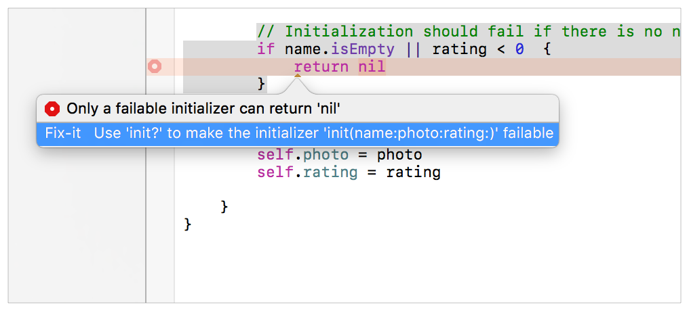
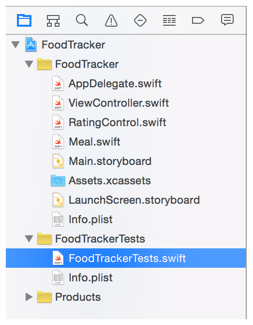
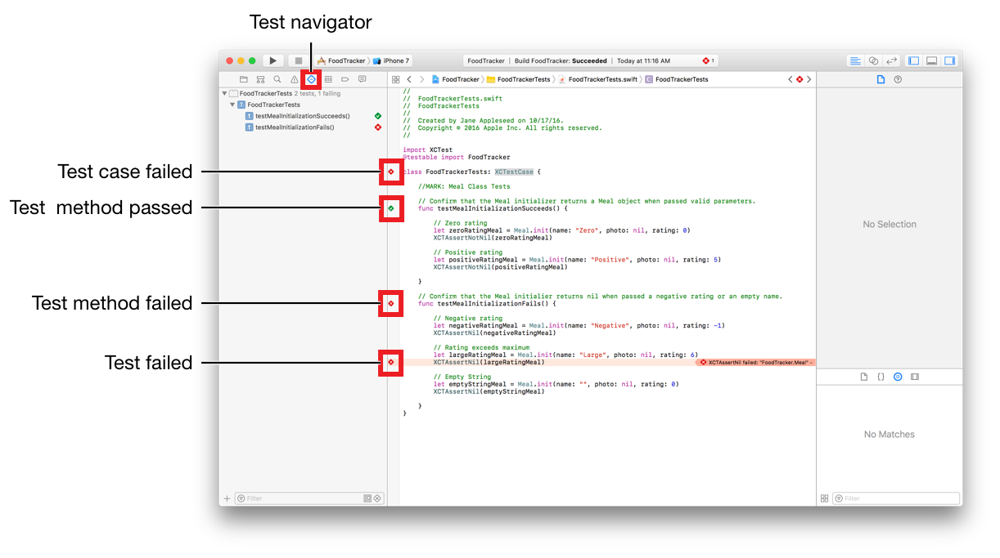
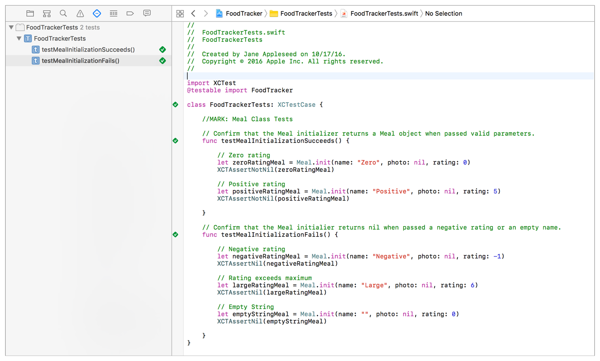

# 使用 Swift 开发 iOS 应用：定义你的数据模型

在本课程中，你将为 FoodTracker 应用程序定义和测试数据模型。数据模型表示存储在应用程序中的信息的结构。

## 学习目标

在课程结束时，你将能够：

* 创建数据模型
* 为自定义类编写可用的初始值设定项
* 展示对可用和不可用初始化器之间差异的概念性理解
* 通过编写和运行单元测试来测试数据模型

## 创建数据模型

现在，你将创建一个数据模型来存储用餐场景需要显示的信息。为此，你可以定义一个带有名称、照片和评级的简单类。

### 创建新的数据模型类

**1. 选择 File > New > File  (或按 Command-N)。**

**2. 在出现的对话框顶部，选择 iOS。**

**3. 选择 Swift File，然后单击 Next。**

* 你正在使用不同的进程来创建此类而不是你之前创建的 `RatingControl` 类 (iOS > Source > Cocoa Touch Class)，因为你正在为数据模型定义基类，这意味着它不需要继承自任何其它类。

**4. 在 Save As 字段中，键入 `Meal`。**

**5. 保存位置默认为项目目录。**

* Group 选项默认为你的应用名称 FoodTracker。

* 在 Targets 部分中，你的应用程序已被选中，并且你的应用程序的测试未被选中。

**6. 保留这些默认值，然后单击“创建”。**

* Xcode 创建一个名为 `Meal.swift` 的文件。在项目导航器中，拖动 `Meal.swift` 文件并将其放在其它 Swift 目录下，如有必要的话。

在 Swift 中，你可以使用一个 `String` 表示名称，使用一个 `UIImage` 表示照片，使用一个 `Int` 表示评级。因为一分用餐总是有一个名字和评级，但可能没有一张照片，所以将 `UIImage` 设置为可选的。


### 定义用餐的数据模型

**1. 如果助理编辑器已打开，请单击 Standard 按钮返回标准编辑器。**


**2. 打开 `Meal.swift`。**

**3. 更改 `import` 语句以导入 `UIKit` 而不是 `Foundation`：**

```swift
import UIKit
```

* 当 Xcode 创建一个新的 Swift 文件时，它默认导入 Foundation 框架，让你在代码中使用 Foundation 数据结构。你还将使用 `UIKit` 框架中的类，因此你需要导入 `UIKit`。但是，导入 `UIKit` 也可以访问 Foundation，因此你可以删除对 Foundation 的冗余导入。

**4. 在 `import` 语句下面，添加以下代码：**

```swift
class Meal {
    
    //MARK: Properties
    
    var name: String
    var photo: UIImage?
    var rating: Int
    
}
```

* 此代码定义了你需要存储的数据的基本属性。你正在定义这些变量 (`var`) 而不是常量 (`let`)，因为它们需要在 `Meal` 对象生命周期的整个过程中进行更改。

**5. 在属性下方，添加此代码以声明初始化器：**

```swift
//MARK: Initialization
 
init(name: String, photo: UIImage?, rating: Int) {
    
}
```

* 回想一下，初始化器是一种准备要使用的类实例的方法，它涉及为每个属性设置初始值并执行任何其它设置或初始化。

**6. 通过将属性设置为等于参数值来填写基本实现。**

```swift
// Initialize stored properties.
self.name = name
self.photo = photo
self.rating = rating
```

* 但是，如果你尝试使用不正确的值创建美食，例如空名称或负面评价，会发生什么？你需要返回 `nil` 以指示无法创建对象，并已设置为默认值。你需要添加代码来检查这些情况并在 `nil` 失败时返回。

**7. 在初始化器存储属性的代码上方添加以下代码。**

```swift
// Initialization should fail if there is no name or if the rating is negative.
if name.isEmpty || rating < 0  {
    return nil
}
```

* 此代码验证传入的参数，如果它们包含无效值则返回 `nil`。

* 注意，编译器应该报错，说明 “只有可用的初始值设定项才能返回 `nil`”。

**8. 单击错误图标以显示修复程序。**



**9. 双击修复它以更新初始化器。初始化器的签名现在应如下所示：**

```swift
init?(name: String, photo: UIImage?, rating: Int) {
```

* 可用的初始值设定项始终以 `init?` 或中的任何一个开头 `init!`。这些初始值设定项分别返回可选值或隐式解包的可选值。Optionals 可以包含有效值或 `nil`。你必须检查可选项是否具有值，然后在使用之前安全地解包该值。隐式解包的选项是选项，但系统会隐式地为你解开它们。

* 在这种情况下，初始化器返回一个可选 `Meal?` 对象。

此时，你的 `init?(name: String, photo: UIImage?, rating: Int)` 初始化器应如下所示：

```swift
init?(name: String, photo: UIImage?, rating: Int) {
    
    // Initialization should fail if there is no name or if the rating is negative.
    if name.isEmpty || rating < 0  {
        return nil
    }
    
    // Initialize stored properties.
    self.name = name
    self.photo = photo
    self.rating = rating
    
}
```

> **进一步探索**
>
> 正如你将在后面的课程中看到的那样，failable 初始化器更难使用，因为你需要在使用之前解包返回的可选项。一些开发人员更喜欢使用 `assert()` 或 `precondition()` 方法强制执行初始化器的契约 (contract)。如果他们测试的条件失败，这些方法会导致应用程序终止。这意味着调用代码必须在调用初始化器之前验证输入。
>
> 有关初始值设定项的更多信息，请参阅初始化。有关为代码添加内联健全性检查和先决条件的信息，请参阅 `assert(_:_:file:line:)` 和 `precondition(_:_:file:line:)`。

检查点：通过选择 Product > Build (或按 Command-B) 来构建项目。你还没有使用你的新类，但是构建它可以让编译器有机会验证你没有输入任何错误。如果有，请通过阅读编译器提供的警告或错误来修复它们，然后回顾本课程中的说明，以确保所有内容都按照此处描述的方式进行。


## 测试你的数据

虽然你的数据模型代码已构建，但尚未将其完全合并到你的应用中。因此，很难判断你是否已正确实现了所有内容，以及是否可能遇到在运行时未考虑的边缘情况。

为了解决这种不确定性，你可以编写单元测试。单元测试用于测试小的、自包含的代码片段，以确保它们的行为正确。该 `Meal` 课程是单元测试的理想选择。

Xcode 已经创建了一个单元测试文件作为 Single View Application 模板的一部分。

### 查看 FoodTracker 的单元测试文件

**1. 打开项目导航器中的 FoodTrackerTests 文件夹，单击旁边的显示三角形。**



**2. 打开 `FoodTrackerTests.swift`。**

花点时间了解到目前为止文件中的代码。

```swift
import XCTest
@testable import FoodTracker
 
class FoodTrackerTests: XCTestCase {
    
    override func setUp() {
        super.setUp()
        // Put setup code here. This method is called before the invocation of each test method in the class.
    }
    
    override func tearDown() {
        // Put teardown code here. This method is called after the invocation of each test method in the class.
        super.tearDown()
    }
    
    func testExample() {
        // This is an example of a functional test case.
        // Use XCTAssert and related functions to verify your tests produce the correct results.
    }
    
    func testPerformanceExample() {
        // This is an example of a performance test case.
        self.measure {
            // Put the code you want to measure the time of here.
        }
    }
    
}
```

代码首先导入 `XCTest` 框架和你的应用程序。

请注意，`@testable` 导入应用时代码会使用该属性。这使你的测试可以访问应用程序代码的内部元素。请记住，Swift 默认为代码中所有类型、变量、属性、初始值设定项和函数的内部访问控制。如果你没有明确将项目标记为私有或私有文件，则可以从测试中访问它。

`XCTest` 框架是 `Xcode` 的测试框架。单元测试本身是在一个 `FoodTrackerTests` 继承自 `XCTestCase` 的类中定义的。代码注释解释了这些 `setUp()` 和 `tearDown()` 方法，以及两个示例测试用例： `testExample()` 和 `testPerformanceExample()`。

你可以编写的主要测试类型是功能测试(以检查所有内容是否产生你期望的值)和性能测试(以检查你的代码是否以你期望的速度执行)。因为你还没有编写任何性能较重的代码，所以你现在只想编写功能测试。

测试用例只是系统自动运行的方法，作为单元测试的一部分。要创建测试用例，请创建一个名称以 test 开头的方法。最好为你的测试用例提供描述性名称。这些名称使以后更容易识别单个测试。例如，可以命名检查 `Meal` 类的初始化代码的测试 `testMealInitialization`。


### 为 `Meal` 对象初始化编写单元测试

**1. 在 `FoodTrackerTests.swift` 类中，你不需要使用任何模板的存根方法。删除模板的方法。你的 FoodTracker 测试应如下所示：**

```swift
import XCTest
@testable import FoodTracker
 
class FoodTrackerTests: XCTestCase {
    
}
```

**2. 在最后一个花括号(`}`)之前，添加以下内容：**

```swift
//MARK: Meal Class Tests
```

* 这是一条注释，可以帮助你(以及任何阅读你代码的人)浏览你的测试并确定它们对应的内容。

**3. 在注释下方添加一个新的测试用例：**

```swift
// Confirm that the Meal initializer returns a Meal object when passed valid parameters.
func testMealInitializationSucceeds() {
    
}
```

* 运行单元测试时，系统会自动运行此测试用例。

**4. 将测试添加到使用无评级和最高正评级的测试用例中。**

```swift
// Zero rating
let zeroRatingMeal = Meal.init(name: "Zero", photo: nil, rating: 0)
XCTAssertNotNil(zeroRatingMeal)
 
// Highest positive rating
let positiveRatingMeal = Meal.init(name: "Positive", photo: nil, rating: 5)
XCTAssertNotNil(positiveRatingMeal)
```

* 如果初始化器按预期工作，则这些调用 `init(name:, photo:, rating:)` 应该成功。`XCTAssertNotNil` 通过检查返回的 `Meal` 对象不是 `nil` 来验证这一点。

**5. 现在添加一个测试用例，其中 `Meal` 类的初始化应该失败。在`testMealInitializationSucceeds()` 下添加下面这个方法：**

```swift
// Confirm that the Meal initialier returns nil when passed a negative rating or an empty name.
func testMealInitializationFails() {
    
}
```

* 同样，系统在运行单元测试时自动运行此测试用例。

**6. 现在将测试添加到使用无效参数调用初始化器的测试用例。**

```swift
// Negative rating
let negativeRatingMeal = Meal.init(name: "Negative", photo: nil, rating: -1)
XCTAssertNil(negativeRatingMeal)
 
// Empty String
let emptyStringMeal = Meal.init(name: "", photo: nil, rating: 0)
XCTAssertNil(emptyStringMeal)
```

* 如果初始化器按预期工作，则这些调用将 `init(name:, photo:, rating:)` 失败。`XCTAssertNil` 通过检查返回的 `Meal` 是 `nil` 对象来验证这一点。

**7. 到目前为止，所有测试都应该成功。现在添加一个失败的测试。在负评级和空字符串测试之间添加以下代码：**

```swift
// Rating exceeds maximum
let largeRatingMeal = Meal.init(name: "Large", photo: nil, rating: 6)
XCTAssertNil(largeRatingMeal)
```

你的单元测试类应如下所示：

```swift
class FoodTrackerTests: XCTestCase {
```

你可以向 `FoodTrackerTests` 目标添加其它 `XCTestCase` 子类以添加其它测试用例。选择 Product > Test (或按 Command-U)，同时运行所有单元测试。你还可以运行单个测试。

检查点：通过选择 Product > Test 菜单项运行单元测试。该 `testMealInitializationSucceeds()` 测试案例应该会成功，而 `testMealInitializationFails()` 测试用例失败。

请注意，Xcode 会自动打开左侧的 Test 导航器，并突出显示失败的测试。



编辑器窗口显示当前打开文件的结果。在这种情况下，如果一个或多个测试方法失败，测试用例将失败。如果一个或多个测试失败，测试方法将失败。在此示例中，只有 `XCTAssertNil(largeRatingMeal)` 测试实际上失败了。

测试导航器还列出了按测试用例分组的各个测试方法。单击测试方法以在编辑器中导航到其代码。右侧的图标显示测试方法是成功还是失败。你可以通过将鼠标移到成功或失败图标上来重新运行测试方法。当它变成播放箭头图标时，单击它。

如你所见，单元测试有助于捕获代码中的错误。它们还有助于定义类的预期行为。在这种情况下，如果你传递空字符串或负评级，则 `Meal` 类的初始化器会失败，但如果你通过大于 5 的评级则不会失败。返回并修复它。


### 修复错误

**1. 在 `Meal.swift`，找到 `init?(name:, photo:, rating:)` 方法。**

**2. 你可以修改该 `if` 子句，但复杂的布尔表达式很难理解。而是用一系列检查替换它。此外，因为你在让代码执行之前验证数据，所以使用 `guard` 语句。**

* 一个 `guard` 语句声明后，必须为代码是真的为了一个条件 `guard` 要执行的语句。如果条件是 `false`，该 `guard` 语句的 `else` 分支必须退出当前的代码块 (例如，通过调用 `return`，`break`，`continue`，`throw`，或不返回的方法等 `fatalError(_:file:line:))`。

* 替换此代码：

```swift
// Initialization should fail if there is no name or if the rating is negative.
if name.isEmpty || rating < 0  {
    return nil
}
```

* 为以下内容：

```swift
// The name must not be empty
guard !name.isEmpty else {
    return nil
}
 
// The rating must be between 0 and 5 inclusively
guard (rating >= 0) && (rating <= 5) else {
    return nil
}
```

你的 `init?(name:, photo:, rating:)` 方法应如下所示：

```swift
init?(name: String, photo: UIImage?, rating: Int) {
    
    // The name must not be empty
    guard !name.isEmpty else {
        return nil
    }
    
    // The rating must be between 0 and 5 inclusively
    guard (rating >= 0) && (rating <= 5) else {
        return nil
    }
    
    // Initialize stored properties.
    self.name = name
    self.photo = photo
    self.rating = rating
    
}
```

检查点：你的应用程序运行你刚刚编写的单元测试。所有测试用例都应该通过。



单元测试是编写代码的重要部分，因为它可以帮助你捕获可能忽略的错误。正如他们的名字所暗示的那样，保持单元测试模块化非常重要。每个测试都应检查特定的基本行为类型。如果你编写长期或复杂的单元测试，那么很难准确找出出错的地方。


## 总结

在本课程中，你构建了一个模型类来保存应用程序的数据。你还检查了常规初始化器和可用初始化器之间的区别。最后，你添加了几个单元测试，以帮助你查找和修复代码中的错误。

在后面的课程中，你将在应用程序代码中使用模型对象来创建和管理美食列表。但是，在你这样做之前，你需要学习如何使用表格视图显示膳食列表。