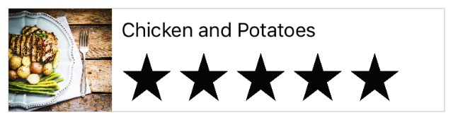

# 使用 Swift 开发 iOS 应用：创建表视图

创建表视图
在本课程中，您将创建第二个基于表视图的场景，其中列出了用户的膳食。此餐饮列表成为您应用的初始场景。您还可以设计自定义表格单元格以显示每餐。

图片：../ Art / CTV_sim_tablecellUI_2x.png)
学习目标
在课程结束时，您将能够：

创建第二个故事板场景

理解表视图的关键组件

创建和设计自定义表格视图单元格

了解表视图委托和数据源的角色

使用数组来存储和处理数据

在表视图中显示动态数据

创建膳食清单
到目前为止，FoodTracker应用程序只有一个场景，即单个内容屏幕。在故事板中，每个场景包含由视图控制器管理的视图，以及添加到控制器或其视图的任何项（例如，自动布局约束）。视图是一个矩形区域，可以绘制自己的内容并响应用户事件。视图是UIView类或其子类之一的实例。在这种情况下，场景包含视图控制器的内容视图，以及您在Interface Builder中添加的所有子视图（堆栈视图，标签，文本字段，图像视图和评级控件）。

现在是时候创建另一个场景，显示整个餐点列表。幸运的是，iOS附带了一个内置类，UITableView专门用于显示滚动的项目列表。表视图由表视图控制器（UITableViewController）管理。UITableViewController是一个子类的UIViewController，其被设计为处理表视图相关的逻辑。您将使用表视图控制器创建新场景。控制器显示和管理表视图。实际上，表视图是控制器的内容视图，并填充场景可用的整个空间。

将包含表格视图的场景添加到故事板

打开你的故事板，Main.storyboard。

在实用程序区域中 打开对象库。（或者，选择“视图”>“实用程序”>“显示对象库”。）

在Object库中，找到Table View Controller对象。

从列表中拖动Table View Controller对象，并将其放在现有场景左侧的画布上。

如果您尝试将表视图拖动到画布并且没有任何反应，则可能是拖动表视图对象而不是表视图控制器对象。表视图对象只是表示表本身的视图。与其他视图对象一样，它必须作为子视图添加到现有场景中。另一方面，表视图控制器是一个完整的场景。它包括表视图和管理表视图的控制器。

You now have two scenes, one for displaying the meal list and one for displaying the details of a single meal.

图片：../ Art / CTV_newtableview_2x.png)
It makes sense to have the meal list be the first thing users see when they launch your app, so tell Xcode that’s your intent by setting the meal list as the first scene.

To set the meal list as the initial scene

If you want more space to work, collapse the project navigator and utility area by clicking the Navigator and Utilities buttons in the Xcode toolbar.

图片：../ Art / navigator_utilities_toggle_on_2x.png)
You can also collapse the outline view.

Drag the storyboard entry point from the meal detail scene to the meal list scene.

图片：../ Art / CTV_originalinitialscene_2x.png)
The table view controller is set as the initial view controller in your storyboard, making the meal list the first scene that loads on app launch.

图片：../ Art / CTV_newinitialscene_2x.png)
检查点：运行您的应用程序。现在，您应该看到一个空的表格视图 - 一个带有多个水平分隔线的屏幕，将其分隔成行，但每行中没有内容，而不是具有文本字段，图像视图和评级控制的用餐详细信息场景。

图片：../ Art / CTV_sim_emptytv_2x.png)
您需要在此表视图上更改一些设置，以便在应用中使用它。

配置表视图

在故事板中，打开大纲视图并展开实用程序区域。

在大纲视图中，选择“表视图”。

表视图嵌套在表视图控制器场景>表视图控制器下。您可能必须单击这些对象旁边的显示三角形才能看到嵌套的表视图。

图片：../ Art / CTV_outlineview_table_2x.png)
选择表视图后，图片：../ Art /inspector_size_2x.png)在实用程序区域中打开“大小”检查器。

在“大小”检查器中，找到标记为“行高”的字段并键入90。按Return键。

在为表视图显示的界面设计界面后，您将在一段时间后回到表视图本身：它的表视图单元格。

设计定制表格单元格
表视图中的各个行由表视图单元格（UITableViewCell）管理，这些单元格负责绘制其内容。表视图单元格具有各种预定义行为和默认单元格样式; 但是，由于每个单元格中显示的内容多于默认样式允许的内容，因此您需要定义自定义单元格样式。

创建UITableViewCell的子类

展开“导航器”区域并打开“项目”导航器。

选择“文件”>“新建”>“文件”（或按Command-N）。

At the top of the dialog that appears, select iOS.

Select Cocoa Touch Class, and click Next.

In the Class field, type Meal.

In the “Subclass of” field, select UITableViewCell.

The class title changes to MealTableViewCell. Xcode makes it clear from the naming that you’re creating a custom table view cell, so leave the new name as is.

Make sure the Language option is set to Swift.

Click Next.

The save location defaults to your project directory.

The Group option defaults to your app name, FoodTracker.

In the Targets section, make sure your app is selected and the tests for your app are unselected.

Click Create.

Xcode creates a file that defines the MealTableViewCell class: MealTableViewCell.swift.

在项目导航器中，MealTableViewCell.swift根据需要在其他Swift文件下重新定位文件。

现在，再次打开你的故事板。

如果您查看故事板中的膳食列表场景，您会注意到它显示了一个表格视图单元格。

图片：../ Art / CTV_singletvcell_2x.png)
该单元格是表格的原型单元格。您可以定义此单元格的设计和行为。然后，该表可以创建此单元的实例。但首先，您需要将场景中的表格视图单元格连接到刚刚创建的自定义单元格子类。

为表视图配置自定义单元格

在大纲视图中，选择“表视图单元格”。

单元格嵌套在表视图控制器场景>表视图控制器>表视图下。您可能必须披露这些对象以查看表格视图单元格。

选择表视图单元格后，在实用程序区域中打开“ 属性”检查器 。

在“属性”检查器中，找到标记为“标识符”的字段并键入MealTableViewCell。按Return键。

您将使用此标识符来创建此原型单元的实例。

打开“大小”检查器。

在“大小”检查器中，找到标记为“行高”的字段并键入90。确保选中此字段旁边的“自定义”复选框。

按Return键在故事板中显示新的单元格高度。

打开标识检查器。

回想一下，Identity检查器允许您编辑故事板中与该对象的标识相关的对象的属性，例如对象所属的类。

在Identity检查器中，找到Class字段并选择MealTableViewCell。

配置单元后，您可以直接在故事板中设计其自定义用户界面。您需要标签，图像视图和评级控件。您可以重复使用在上一课中创建的评级控制类。然后，您的自定义界面将包含膳食名称，照片和评级。

设计自定义表格单元格的界面

使用Object库查找Image View对象并将其拖到表格单元格上。

拖动并调整图像视图的大小，使其呈正方形，与单元格的左侧，顶部和底部齐平。

选择图像视图后，在“实用程序”区域中打开“属性”检查器。

In the Attributes inspector, find the Image field and select defaultPhoto. If you didn’t add a default photo to your project in a previous lesson, add it now.

Use the Object library to find a Label object and drag it onto the table cell. You will use the label to show the meal’s name.

Drag the label so that its lined up with the guidelines to the right side of the image view and to the top margin of the table view cell.

Resize the label so that its right edge stretches to the cell’s right margin.

Use the Object library to find a Horizontal Stack View object and drag it onto the table cell.

With the stack view selected, open the Size inspector  in the utility area.

In the Size inspector, type 44 in the Height field and 252 in the Width field. Press Return.

拖动堆栈视图，使其位于标签下方，并与标签的左边距对齐。

选择视图后，打开“标识”检查器。

在Identity检查器中，找到标记为Class的字段并选择RatingControl。

如果RatingControl在弹出菜单中没有看到选项，请确保在画布上选择了堆栈视图。

选择视图后，打开“属性”检查器。

在“属性”检查器中，将“间距”设置为8.接下来，找到标记为“交互”的字段，然后取消选中“启用用户交互”复选框。

You designed your custom rating control class to be interactive, but you don’t want users to be able to change the rating from the cell view. Instead, tapping anywhere in the cell should select the cell. So it’s important to disable that interaction when it’s in this context.

Checkpoint: Run your app. The table view cells now look taller. But even though you added all the necessary user interface elements to your table view cells, they’re showing up empty, just like before. Why’s that?

在故事板中，您可以配置表视图以显示静态数据（在故事板中提供）或动态数据（由表视图控制器以编程方式提供）。默认情况下，表视图控制器使用动态数据。这意味着您在故事板中创建的界面只是您的单元格的原型。您仍然需要在代码中创建此单元格的实例，并用应用程序的数据填充它们。

现在，您可以使用助理编辑器预览单元格。

预览界面

单击Xco​​de工具栏中的“助手”按钮以打开助理编辑器。

如果需要更多空间，可以通过单击Xco​​de工具栏中的“导航器和实用程序”按钮来折叠项目导航器和实用程序区域。

You can also collapse the outline view.

In the editor selector bar, which appears at the top of the assistant editor, switch the assistant editor from Automatic to Preview > Main.storyboard (Preview).

The preview shows the image view and the label. The rating control isn’t rendered in the preview, but otherwise the table view cell looks as expected.

NOTE

If you see the wrong scene in the preview, make sure to select the table view scene by clicking its scene dock.

Add Images to Your Project
Next, you need to add a few sample images to your project. You’ll use these images when you load initial meal data into your app.

You can find sample images within the Images/ folder of the downloadable file at the end of this lesson, or use your own images. (Just make sure the names of the images you use match the image names in the code later.)

To add images to your project

If the assistant editor is open, return to the standard editor by clicking the Standard button.

Open the project navigator and utility area by clicking the Navigator and Utilities buttons in the Xcode toolbar.

In the project navigator, select Assets.xcassets to view the asset catalog.

Recall that the asset catalog is a place to store and organize your image assets for an app.

In the bottom left corner, click the plus (+) button and select New Folder from the pop-up menu.

Double-click the folder name and rename it Sample Images.

With the folder selected, in the bottom left corner, click the plus (+) button and choose New Image Set from the pop-up menu.

Double-click the image set name and rename it to a name you’ll remember when you’re writing it in code.

On your computer, select the image you want to add.

Drag and drop the image into the 2x slot in the image set.

Repeat steps 5–8 for as many images as you like. In this lesson it is assumed that you have three different images named meal1, meal2, and meal3.

Connect the Table Cell UI to Code
Before you can display dynamic data in your table view cells, you need to create outlet connections between the prototype in your storyboard and the code that represents the table view cell in MealTableViewCell.swift.

To connect the views to the MealTableViewCell.swift code

In your storyboard, select the label in the table view cell.

Click the Assistant button in the Xcode toolbar to open the assistant editor.

If you want more space to work, collapse the project navigator and utility area by clicking the Navigator and Utilities buttons in the Xcode toolbar.

In the editor selector bar, which appears at the top of the assistant editor, switch the assistant editor from Preview to Automatic > MealTableViewCell.swift.

MealTableViewCell.swift is displayed in the editor on the right.

In MealTableViewCell.swift, find the class line, which should look like this:

class MealTableViewCell: UITableViewCell {
Below the class line, add the following:

//MARK: Properties
Control-drag from the label on your canvas to the code display in the editor on the right, stopping the drag at the line below the comment you just added in MealTableViewCell.swift.

In the dialog that appears, for Name, type nameLabel. Leave the rest of the options as they are.

Click Connect.

In your storyboard, select the image view in the table view cell.

Control-drag from the image view on your canvas to the code display in the editor on the right, stopping the drag at the line just below the nameLabel property in MealTableViewCell.swift.

In the dialog that appears, for Name, type photoImageView.

Leave the rest of the options as they are, and click Connect.

In your storyboard, select the rating control in the table view cell.

Control-drag from the rating control on your canvas to the code display in the editor on the right, stopping the drag at the line just below the photoImageView property in MealTableViewCell.swift.

In the dialog that appears, for Name, type ratingControl.

Leave the rest of the options as they are, and click Connect.

Your outlets in MealTableViewCell.swift should look like this:

@IBOutlet weak var nameLabel: UILabel!
@IBOutlet weak var photoImageView: UIImageView!
@IBOutlet weak var ratingControl: RatingControl!
Load Initial Data
To display any real data in your table cells, you need to write code to load that data. At this point, you have a data model for a meal: the Meal class. You also need to keep a list of those meals. The natural place to track this is in a custom view controller subclass that’s connected to the meal list scene. This view controller will manage the view that displays the list of meals, and have a reference to the data model behind what’s shown in the user interface.

First, create a custom table view controller subclass to manage the meal list scene.

To create a subclass of UITableViewController

Choose File > New > File (or press Command-N).

At the top of the dialog that appears, select iOS, and then select Cocoa Touch Class.

Click Next.

In the Class field, type Meal.

In the “Subclass of” field, select UITableViewController.

The class title changes to MealTableViewController. Leave that as is.

Make sure the “Also create XIB file” option is unselected.

XIB files are an older way of designing the views managed by a view controller. They predate storyboards and basically represent a single scene from a storyboard. You won’t need an XIB file for this view controller, because you have already defined its content in the app’s storyboard.

Make sure the Language option is set to Swift.

Click Next.

The save location defaults to your project directory.

The Group option defaults to your app name, FoodTracker.

In the Targets section, your app is selected and the tests for your app are unselected.

Leave these defaults as they are, and click Create.

Xcode creates MealTableViewController.swift, a source code file that defines your custom table view controller subclass.

If necessary, in the Project navigator, drag the MealTableViewController.swift file so that it’s positioned with the other Swift files.

In this custom subclass, you can now define a property to store a list of Meal objects. The Swift standard library includes a structure called Array that works well for tracking lists of items.

To load the initial data

If the assistant editor is open, return to the standard editor by clicking the Standard button.

Expand the project navigator and utility area by clicking the Navigator and Utilities buttons in the Xcode toolbar.

Open MealTableViewController.swift.

Below the class line in MealTableViewController.swift, add the following code:

//MARK: Properties
 
var meals = [Meal]()
This code declares a property on MealTableViewController and initializes it with a default value (an empty array of Meal objects). By making meals a variable (var) instead of a constant, you make the array mutable, which means you can add items to it after you initialize it.

The table view controller template includes a number of method stubs and commented out methods. These are placeholder implementations that you can uncomment and expand to define the table’s appearance and behavior. You will look at these methods after you have the model data set up. For now, scroll past all the template methods, and add the following code before the final closing brace (}):

//MARK: Private Methods
 
private func loadSampleMeals() {
    
}
This is a helper method to load sample data into the app.

In the loadSampleMeals() method, start by loading the three meal images:

let photo1 = UIImage(named: "meal1")
let photo2 = UIImage(named: "meal2")
let photo3 = UIImage(named: "meal3")
Make sure the names of the images in your project match the names you write in this code.

After loading the images, create three meal objects.

guard let meal1 = Meal(name: "Caprese Salad", photo: photo1, rating: 4) else {
    fatalError("Unable to instantiate meal1")
}
 
guard let meal2 = Meal(name: "Chicken and Potatoes", photo: photo2, rating: 5) else {
    fatalError("Unable to instantiate meal2")
}
 
guard let meal3 = Meal(name: "Pasta with Meatballs", photo: photo3, rating: 3) else {
    fatalError("Unable to instantiate meal2")
}
Because the Meal class’s init!(name:, photo:, rating:) initializer is failable, you need to check the result returned by the initializer. In this case, you are passing valid parameters, so the initializer should never fail. If the initializer does fail, you have a bug in your code. To help you identify and fix any bugs, if the initializer does fail, the fatalError() function prints the error message to the console and the app terminates.

After creating the Meal objects, add them to the meals array using this code:

meals += [meal1, meal2, meal3]
Find the viewDidLoad() method. The template implementation looks like this:

override func viewDidLoad() {
    super.viewDidLoad()
    
    // Uncomment the following line to preserve selection between presentations
    // self.clearsSelectionOnViewWillAppear = false
    
    // Uncomment the following line to display an Edit button in the navigation bar for this view controller.
    // self.navigationItem.rightBarButtonItem = self.editButtonItem()
}
The template implementation of this method includes comments that were inserted by Xcode when it created MealTableViewController.swift. Code comments like this provide helpful hints and contextual information in source code files, but you don’t need them for this lesson.

In the viewDidLoad() method, delete the comments and add this code after the call to super.viewDidLoad() to load the sample meal data:

// Load the sample data.
loadSampleMeals()
When the view loads, this code calls the helper method you just wrote to load the sample data. You separated this into its own method to make your code more modular and readable.

Your viewDidLoad() method should look like this:

override func viewDidLoad() {
    super.viewDidLoad()
    
    // Load the sample data.
    loadSampleMeals()
}
And your loadSampleMeals() method should look something like this:

private func loadSampleMeals() {
    
    let photo1 = UIImage(named: "meal1")
    let photo2 = UIImage(named: "meal2")
    let photo3 = UIImage(named: "meal3")
    
    guard let meal1 = Meal(name: "Caprese Salad", photo: photo1, rating: 4) else {
        fatalError("Unable to instantiate meal1")
    }
    
    guard let meal2 = Meal(name: "Chicken and Potatoes", photo: photo2, rating: 5) else {
        fatalError("Unable to instantiate meal2")
    }
    
    guard let meal3 = Meal(name: "Pasta with Meatballs", photo: photo3, rating: 3) else {
        fatalError("Unable to instantiate meal2")
    }
    
    meals += [meal1, meal2, meal3]
}
Checkpoint: Build your project by choosing Product > Build. It should build without errors. Note: At this point, you may see an Xcode warning related to the fact that there’s no way to reach the View Controller scene in the app. You will fix that in the next lesson. For the rest of this lesson, just ignore it.

IMPORTANT

If you’re running into build issues, make sure the names of the images in your project exactly match the names you used in the code.

Display the Data
At this point, your custom table view controller subclass, MealTableViewController, has a mutable array that’s prepopulated with some sample meals. Now you need to display this data in the user interface.

To display dynamic data, a table view needs two important helpers: a data source and a delegate. A table view data source, as implied by its name, supplies the table view with the data it needs to display. A table view delegate helps the table view manage cell selection, row heights, and other aspects related to displaying the data. By default, UITableViewController and its subclasses adopt the necessary protocols to make the table view controller both a data source (UITableViewDataSource protocol) and a delegate (UITableViewDelegate protocol) for its associated table view. Your job is to implement the appropriate protocol methods in your table view controller subclass so that your table view has the correct behavior.

A functioning table view requires three table view data source methods.

func numberOfSections(in tableView: UITableView) -> Int
func tableView(_ tableView: UITableView, numberOfRowsInSection section: Int) -> Int
func tableView(_ tableView: UITableView, cellForRowAt indexPath: IndexPath) -> UITableViewCell
The first of these is numberOfSections(In:), which tells the table view how many sections to display. Sections are visual groupings of cells within table views, which is especially useful in table views with a lot of data. For a simple table view like the one in the FoodTracker app, you just need the table view to display a single section, so the implementation of the numberOfSections(In:) data source method is straightforward.

To display a section in your table view

In MealTableViewController.swift, find the numberOfSections(In:) data source method. The template implementation looks like this:

override func numberOfSections(in tableView: UITableView) -> Int {
    // #warning Incomplete implementation, return the number of sections
    return 0
}
Change the return value from 0 to 1, and remove the warning comment.

override func numberOfSections(in tableView: UITableView) -> Int {
    return 1
}
This code makes the table view show 1 section instead of 0. You removed the comment that says #warning Incomplete implementation because you’ve completed the implementation.

The next data source method, tableView(_:numberOfRowsInSection:), tells the table view how many rows to display in a given section. Your table view has only a single section, and each Meal object should have its own row. That means that the number of rows should be the number of Meal objects in your meals array.

To return the number of rows in your table view

In MealTableViewController.swift, find the tableView(_:numberOfRowsInSection:) data source method. The template implementation looks like this:

override func tableView(_ tableView: UITableView, numberOfRowsInSection section: Int) -> Int {
    // #warning Incomplete implementation, return the number of rows
    return 0
}
You want to return the number of meals you have. Array has a property called count that returns the number of items in the array, so the number of rows is meals.count.

Change the tableView(_:numberOfRowsInSection:) data source method to return the appropriate number of rows, and remove the warning comment.

override func tableView(_ tableView: UITableView, numberOfRowsInSection section: Int) -> Int {
    return meals.count
}
The last data source method, tableView(_:cellForRowAt:), configures and provides a cell to display for a given row. Each row in a table view has one cell, and that cell determines the content that appears in that row and how that content is laid out.

For table views with a small number of rows, all rows may be onscreen at once, so this method gets called for each row in your table. But table views with a large number of rows display only a small fraction of their total items at a given time. It’s most efficient for table views to ask for only the cells for rows that are being displayed, and that’s what tableView(_:cellForRowAt:) allows the table view to do.

For any given row in the table view, you configure the cell by fetching the corresponding Meal in the meals array, and then setting the cell’s properties to corresponding values from the Meal class.

To configure and display cells in your table view

In MealTableViewController.swift, find and uncomment the tableView(_:cellForRowAt:) data source method. (To uncomment the method, remove the /* and */ characters surrounding it.)

After you do that, the template implementation looks like this:

override func tableView(_ tableView: UITableView, cellForRowAt indexPath: IndexPath) -> UITableViewCell {
    let cell = tableView.dequeueReusableCell(withIdentifier: "reuseIdentifier", for: indexPath)
    
    // Configure the cell...
    
    return cell
}
The dequeueReusableCell(withIdentifier:for:) method requests a cell from the table view. Instead of creating new cells and deleting old cells as the user scrolls, the table tries to reuse the cells when possible. If no cells are available, dequeueReusableCell(withIdentifier:for:) instantiates a new one; however, as cells scroll off the scene, they are reused. The identifier tells dequeueReusableCell(withIdentifier:for:) which type of cell it should create or reuse.

To make this code work for your app, you’ll need to change the identifier to the prototype cell identifier you set in the storyboard (MealTableViewCell), and then add code to configure the cell.

Add code at the beginning of the method, before the rest of the template implementation:

// Table view cells are reused and should be dequeued using a cell identifier.
let cellIdentifier = "MealTableViewCell"
This creates a constant with the identifier you set in the storyboard.

Update the template’s identifier to the cellIdentifier variable. The second line of code in the method should now look like this:

let cell = tableView.dequeueReusableCell(withIdentifier: cellIdentifier, for: indexPath)
Because you created a custom cell class that you want to use, downcast the type of the cell to your custom cell subclass, MealTableViewCell.

guard let cell = tableView.dequeueReusableCell(withIdentifier: cellIdentifier, for: indexPath) as? MealTableViewCell  else {
    fatalError("The dequeued cell is not an instance of MealTableViewCell.")
}
There’s a lot going on in this code:

The as? MealTableViewCell expression attempts to downcast the returned object from the UITableViewCell class to your MealTableViewCell class. This returns an optional.

The guard let expression safely unwraps the optional.

If your storyboard is set up correctly, and the cellIdentifier matches the identifier from your storyboard, then the downcast should never fail. If the downcast does fail, the fatalError() function prints an error message to the console and terminates the app.

After the guard statement, add the following code:

// Fetches the appropriate meal for the data source layout.
let meal = meals[indexPath.row]
This code fetches the appropriate meal from the meals array.

Now, use the meal object to configure your cell. Replace the // Configure the cell comment with the following code:

cell.nameLabel.text = meal.name
cell.photoImageView.image = meal.photo
cell.ratingControl.rating = meal.rating
This code sets each of the views in the table view cell to display the corresponding data from meal object.

Your tableView(_:cellForRowAt:) method should look like this:

override func tableView(_ tableView: UITableView, cellForRowAt indexPath: IndexPath) -> UITableViewCell {
    
    // Table view cells are reused and should be dequeued using a cell identifier.
    let cellIdentifier = "MealTableViewCell"
    
    guard let cell = tableView.dequeueReusableCell(withIdentifier: cellIdentifier, for: indexPath) as? MealTableViewCell  else {
        fatalError("The dequeued cell is not an instance of MealTableViewCell.")
    }
    
    // Fetches the appropriate meal for the data source layout.
    let meal = meals[indexPath.row]
    
    cell.nameLabel.text = meal.name
    cell.photoImageView.image = meal.photo
    cell.ratingControl.rating = meal.rating
    
    return cell
}
The final step to displaying data in the user interface is to connect the code defined in MealTableViewController.swift to the meal list scene.

To point the Table View Controller to MealTableViewController.swift

Open your storyboard.

Select the table view controller by clicking on its scene dock until the entire scene has a blue outline around it.

Open the Identity inspector .

In the Identity inspector, find the field labeled Class, and select MealTableViewController.

Checkpoint: Run your app. The list of items you added in the viewDidLoad() method should show up as cells in your table view. You’ll notice there’s a little bit of overlap between the table view cells and the status bar—you’ll fix that in the next lesson.

Prepare the Meal Detail Scene for Navigation
As you prepare to implement navigation in the FoodTracker app, you need to delete and replace a few pieces of code and parts of the user interface that you won’t need anymore.

To clean up unused pieces of the project

Open your storyboard and look at the meal detail scene.

In the meal detail scene, select the Meal Name label, and press the Delete key to delete it.

The rest of the elements in the stack view reposition themselves appropriately.

Open ViewController.swift.

In ViewController.swift, find the textFieldDidEndEditing(_:) method.

func textFieldDidEndEditing(_ textField: UITextField) {
    mealNameLabel.text = textField.text
}
Delete the line that sets the text property of the label.

mealNameLabel.text = textField.text
You’ll replace this with a new implementation soon.

In ViewController.swift, find the mealNameLabel outlet and delete it.

@IBOutlet weak var mealNameLabel: UILabel!
Because you now have two view controllers in your project, it makes sense to give ViewController.swift a more meaningful name.

To rename the ViewController.swift file

In the project navigator, click the ViewController.swift file once and press the Return key.

Xcode lets you type in a new name for the file.

Rename the file MealViewController.swift. Press Return.

In MealViewController.swift, find the class declaration line:

class ViewController: UIViewController, UITextFieldDelegate, UIImagePickerControllerDelegate, UINavigationControllerDelegate {
Change the class name to MealViewController.

class MealViewController: UIViewController, UITextFieldDelegate, UIImagePickerControllerDelegate, UINavigationControllerDelegate {
In the comment at the top of the file, also change the name from ViewController.swift to MealViewController.swift.

Open your storyboard.

Select the view controller by clicking on its scene dock.

With the view controller selected, open the Identity inspector .

In the Identity inspector, change the Class field from ViewController to MealViewController.

Checkpoint: Build or run your app. Everything should work as before.

Wrapping Up
In this lesson, you built a custom table view cell. You attached your model object to your table view controller. You added sample data to the model, and you implemented the table view controller code needed to dynamically fill the table with the model data.

Next lesson, you’ll add the ability to navigate between the table and the meal view.