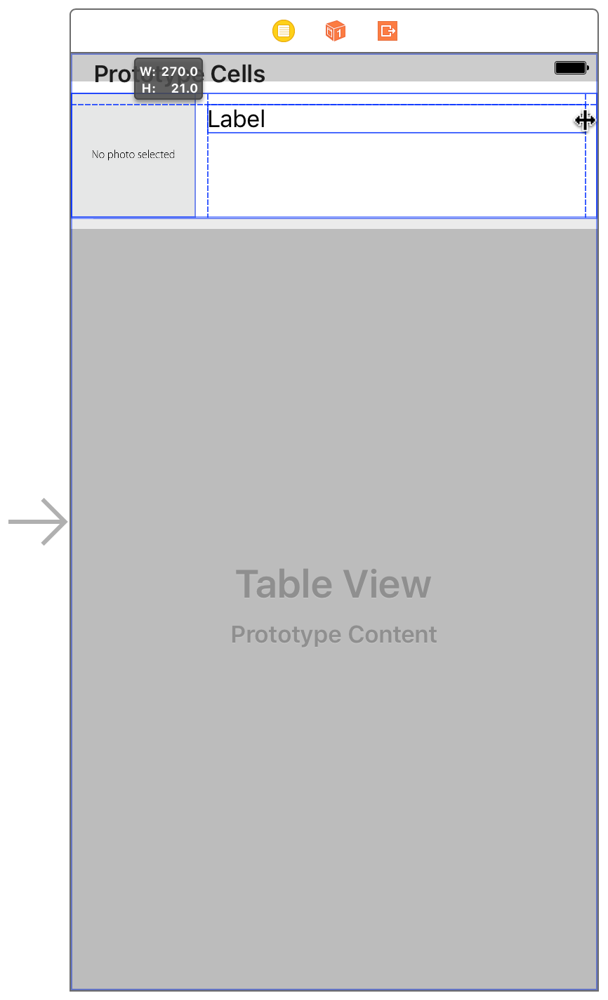

# 使用 Swift 开发 iOS 应用：创建表视图

在本课程中，你将创建第二个基于表视图的场景，其中列出了用户的膳食。此餐饮列表成为你应用的初始场景。你还可以设计自定义表格单元格以显示每餐。


## 学习目标

在课程结束时，你将能够：

* 创建第二个故事板场景
* 理解表视图的关键组件
* 创建和设计自定义表格视图单元格
* 了解表视图委托和数据源的角色
* 使用数组来存储和处理数据
* 在表视图中显示动态数据

## 创建膳食清单

到目前为止，FoodTracker 应用程序只有一个场景，即单个内容屏幕。在故事板中，每个场景包含由视图控制器管理的视图，以及添加到控制器或其视图的任何项(例如，自动布局约束)。视图是一个矩形区域，可以绘制自己的内容并响应用户事件。视图是 `UIView` 类或其子类之一的实例。在这种情况下，场景包含视图控制器的内容视图，以及你在 Interface Builder 中添加的所有子视图(堆栈视图、标签、文本字段、图像视图和评级控件)。

现在是时候创建另一个场景，显示整个餐点列表。幸运的是，iOS 附带了一个内置类，`UITableView` 专门用于显示滚动的项目列表。表视图由表视图控制器(`UITableViewController`)管理。`UITableViewController` 是一个子类的 `UIViewController`，其被设计为处理表视图相关的逻辑。你将使用表视图控制器创建新场景。控制器显示和管理表视图。实际上，表视图是控制器的内容视图，并填充场景可用的整个空间。

### 将包含表格视图的场景添加到故事板

**1. 打开你的故事板，`Main.storyboard`。**

**2. 在实用程序区域中 打开对象库。(或者，选择“视图”>“实用程序”>“显示对象库”。)**

**3. 在 Object 库中，找到 Table View Controller 对象。**

**4. 从列表中拖动 Table View Controller 对象，并将其放在现有场景左侧的画布上。**

* 如果你尝试将表视图拖动到画布并且没有任何反应，则可能是拖动表视图对象而不是表视图控制器对象。表视图对象只是表示表本身的视图。与其它视图对象一样，它必须作为子视图添加到现有场景中。另一方面，表视图控制器是一个完整的场景。它包括表视图和管理表视图的控制器。

你现在有两个场景，一个用于显示餐点列表，另一个用于显示单餐的详细信息。


将用餐列表作为用户在启动应用时看到的第一件事是有意义的，因此通过将用餐列表设置为第一个场景告诉 Xcode 你的意图。

### 将膳食列表设置为初始场景

**1. 如果需要更多空间，可以通过单击Xco​​de工具栏中的“导航器和实用程序”按钮来折叠项目导航器和实用程序区域。**


你也可以折叠大纲视图。

**2. 将故事板入口点从膳食细节场景拖动到膳食列表场景。**


* 表视图控制器被设置为故事板中的初始视图控制器，使得膳食列表成为应用程序启动时加载的第一个场景。


*检查点*：运行你的应用程序。现在，你应该看到一个空的表格视图 - 一个带有多个水平分隔线的屏幕，将其分隔成行，但每行中没有内容，而不是具有文本字段，图像视图和评级控制的用餐详细信息场景。


你需要在此表视图上更改一些设置，以便在应用中使用它。


### 配置表视图

**1. 在故事板中，打开大纲视图并展开实用程序区域。**

**2. 在大纲视图中，选择“表视图”。**

* 表视图嵌套在表视图控制器场景>表视图控制器下。你可能必须单击这些对象旁边的显示三角形才能看到嵌套的表视图。


**3. 选择表视图后， 在实用程序区域中打开“大小”检查器。**

**4. 在“大小”检查器中，找到标记为“行高”的字段并键入90。按 Return 键。**

在为表视图显示的界面设计界面后，你将在一段时间后回到表视图本身：它的表视图单元格。


## 设计定制表格单元格

表视图中的各个行由表视图单元格(`UITableViewCell`)管理，这些单元格负责绘制其内容。表视图单元格具有各种预定义行为和默认单元格样式; 但是，由于每个单元格中显示的内容多于默认样式允许的内容，因此你需要定义自定义单元格样式。

### 创建 `UITableViewCell` 的子类

**1. 展开“导航器”区域并打开“项目”导航器。**

**2. 选择“文件”>“新建”>“文件”(或按 Command-N)。**

**3. 在出现的对话框顶部，选择 iOS。**

**4. 选择 Cocoa Touch Class，然后单击 Next。**

**5. 在“类”字段中，键入 `Meal`。**

**6. 在“子类”字段中，选择 `UITableViewCell`。**

* 课程名称更改为MealTableViewCell。Xcode从命名中清楚地表明你正在创建自定义表视图单元格，因此请保留新名称。

**7. 确保语言选项设置为 Swift。**

**8. 点击下一步。**

* 保存位置默认为项目目录。

* Group 选项默认为你的应用名称FoodTracker。

**9. 在“目标”部分中，确保选中你的应用并取消选择应用的测试。**

**10. 单击“创建”**

* Xcode 创建一个定义 `MealTableViewCell` 类的文件：`MealTableViewCell.swift`。

11. 在项目导航器中，`MealTableViewCell.swift` 根据需要在其它 Swift 文件下重新定位文件。

现在，再次打开你的故事板。

如果你查看故事板中的膳食列表场景，你会注意到它显示了一个表格视图单元格。


该单元格是表格的原型单元格。你可以定义此单元格的设计和行为。然后，该表可以创建此单元的实例。但首先，你需要将场景中的表格视图单元格连接到刚刚创建的自定义单元格子类。


### 为表视图配置自定义单元格

**1. 在大纲视图中，选择“表视图单元格”。**

* 单元格嵌套在表视图控制器场景>表视图控制器>表视图下。你可能必须披露这些对象以查看表格视图单元格。


**2. 选择表视图单元格后，在实用程序区域中打开属性检查器 。**

**3. 在“属性”检查器中，找到标记为“标识符”的字段并键入 `MealTableViewCell`。按 Return 键。**

你将使用此标识符来创建此原型单元的实例。

**4. 打开 Size 检查器 。**

**5. 在 Size 检查器中，找到标记为“行高”的字段并键入90。确保选中此字段旁边的“自定义”复选框。**


按 Return 键在故事板中显示新的单元格高度。

**6. 打开标识检查器 。**

回想一下，Identity 检查器允许你编辑故事板中与该对象的标识相关的对象的属性，例如对象所属的类。

**7. 在 Identity 检查器中，找到 Class 字段并选择 `MealTableViewCell`。**


配置单元后，你可以直接在故事板中设计其自定义用户界面。你需要标签，图像视图和评级控件。你可以重复使用在上一课中创建的评级控制类。然后，你的自定义界面将包含膳食名称，照片和评级。


### 设计自定义表格单元格的界面

**1. 使用 Object 库查找 Image View 对象并将其拖到表格单元格上。**

**2. 拖动并调整图像视图的大小，使其呈正方形，与单元格的左侧，顶部和底部齐平。**


**3. 选择图像视图后， 在“实用程序”区域中打开属性检查器。**

**4. 在属性检查器中，找到“图像”字段并选择defaultPhoto。如果你没有在上一课中为项目添加默认照片，请立即添加。**


**5. 使用 Object 库查找 Label 对象并将其拖到表格单元格上。你将使用标签显示餐点的名称。**

**6. 拖动标签，使其与图像视图右侧的指南和表格视图单元格的上边距对齐。**


**7. 调整标签大小，使其右边缘延伸到单元格的右边距。**



**8. 使用Object库查找Horizo​​ntal Stack View对象并将其拖到表格单元格上。**

**9. 选择堆栈视图后， 在实用程序区域中打开“大小”检查器。**

**10. 在 Size 检查器中，键入44“高度”字段和252“宽度”字段。按 Return 键。**

**11. 拖动堆栈视图，使其位于标签下方，并与标签的左边距对齐。**


**12. 选择视图后，打开“标识”检查器 。**

**13. 在 Identity 检查器中，找到标记为 Class 的字段并选择`RatingControl`。**


* 如果 `RatingControl` 在弹出菜单中没有看到选项，请确保在画布上选择了堆栈视图。

**14.  选择视图后，打开“属性”检查器 。**

**15. 在属性检查器中，将“间距”设置为8.接下来，找到标记为“交互”的字段，然后取消选中“启用用户交互”复选框。**


* 你将自定义评级控件类设计为交互式，但你不希望用户能够从单元格视图更改评级。相反，点击单元格中的任何位置都应该选择单元格。因此，在此上下文中禁用该交互非常重要。

*检查点*：运行你的应用程序。表视图单元格现在看起来更高。但即使你将所有必要的用户界面元素添加到表格视图单元格中，它们也会像以前一样显示为空白。为什么？


在故事板中，你可以配置表视图以显示静态数据(在故事板中提供)或动态数据(由表视图控制器以编程方式提供)。默认情况下，表视图控制器使用动态数据。这意味着你在故事板中创建的界面只是你的单元格的原型。你仍然需要在代码中创建此单元格的实例，并用应用程序的数据填充它们。

现在，你可以使用助理编辑器预览单元格。


### 预览界面

**1. 单击 Xco​​de 工具栏中的“助手”按钮以打开助理编辑器。**


**2. 如果需要更多空间，可以通过单击 Xco​​de 工具栏中的“导航器和实用程序”按钮来折叠项目导航器和实用程序区域。**


你也可以折叠大纲视图。

**3. 在助理编辑器顶部显示的编辑器选择栏中，将助理编辑器从“自动”切换到“预览”>“Main.storyboard”(预览)。**


* 预览显示图像视图和标签。评级控件不会在预览中呈现，但是否则表视图单元格会按预期显示。


> **注意**
> 
> 如果在预览中看到错误的场景，请确保通过单击其场景停靠来选择表格视图场景。


## 将图像添加到项目中

接下来，你需要向项目添加一些示例图像。将初始膳食数据加载到应用程序时，你将使用这些图像。

你可以在本课程结束时在可下载文件的 `Images/` 文件夹中找到示例图像，或使用你自己的图像。(只需确保你使用的图像名称稍后与代码中的图像名称匹配。)

### 将图像添加到项目中

1. 如果助理编辑器已打开，请单击“标准”按钮返回标准编辑器。

* 单击Xco​​de工具栏中的“导航器和实用程序”按钮，打开项目导航器和实用程序区域。


**2. 在项目导航器中，选择 Assets.xcassets 查看 asset 目录。**

* 回想一下，资产目录是存储和组织应用程序的图像资源的地方。

**3. 在左下角，单击加号(+)按钮，然后从弹出菜单中选择“新建文件夹”。**

**4. 双击文件夹名称并重命名 Sample Images。**

**5. 选择文件夹后，在左下角单击加号(+)按钮，然后从弹出菜单中选择“新建图像集”。**

**6. 双击图像集名称并将其重命名为你在代码中编写时将记住的名称。**

**7. 在计算机上，选择要添加的图像。**

**8. 将图像拖放到 2x 图像集的插槽中。**

对于任意数量的图像，请重复步骤5-8。在本课中，假设你有三种不同的图像命名 `meal1`、`meal2` 和 `meal3`。


## 将表格单元 UI 连接到代码

在表视图单元格中显示动态数据之前，需要在故事板中的原型与表示表格视图单元格的代码之间创建出口连接MealTableViewCell.swift。

### 将视图连接到 MealTableViewCell.swift 代码

**1. 在故事板中，选择表格视图单元格中的标签。**

**2. 单击 Xco​​de 工具栏中的 Assistant 按钮以打开助理编辑器。**


**3. 如果需要更多空间，可以通过单击 Xco​​de 工具栏中的“导航器和实用程序”按钮来折叠项目导航器和实用程序区域。**


**4. 在助理编辑器顶部显示的编辑器选择器栏中，将助理编辑器从“预览”切换为“自动”> `MealTableViewCell.swift`。**


* `MealTableViewCell.swift` 显示在右侧的编辑器中。

**5. 在 `MealTableViewCell.swift`，找到该 `class` 行，它应该是这样的：**

```swift 
class MealTableViewCell: UITableViewCell {
```

**6. 在该 `class` 行下方添加以下内容：**

```swift 
//MARK: Properties
```

**7. 按住 Ctrl 键从画布上的标签拖动到右侧编辑器中的代码显示，停止在刚刚添加的注释下方的行拖动 `MealTableViewCell.swift`。**


**8. 在出现的对话框中，键入名称 `nameLabel`。保留其余选项。**


**9. 单击连接。**

**10. 在故事板中，选择表格视图单元格中的图像视图。**

**11. 从画布上的图像视图控制拖动到右侧编辑器中的代码显示，停止在nameLabel属性下方的行拖动 `MealTableViewCell.swift`。**


**12. 在出现的对话框中，键入名称 `photoImageView`。**

* 保留其余选项，然后单击“连接”。


**13. 在故事板中，在表格视图单元格中选择评级控件。**

**14. 控制 - 从画布上的评级控件拖动到右侧编辑器中的代码显示，停止在 `photoImageView` 属性下方的行处的拖动 `MealTableViewCell.swift`。**


**15. 在出现的对话框中，键入名称 `ratingControl`。**

* 保留其余选项，然后单击“连接”。


你的网点 `MealTableViewCell.swift` 应该是这样的：

```swift
@IBOutlet weak var nameLabel: UILabel!
@IBOutlet weak var photoImageView: UIImageView!
@IBOutlet weak var ratingControl: RatingControl!
```


## 加载初始数据

要在表格单元格中显示任何实际数据，你需要编写代码来加载该数据。此时，你有一个用餐的数据模型：Meal课程。你还需要保留这些餐点的清单。跟踪它的自然位置是自定义视图控制器子类，它连接到膳食列表场景。此视图控制器将管理显示膳食列表的视图，并参考用户界面中显示的数据模型。

首先，创建一个自定义表视图控制器子类来管理膳食列表场景。

### 创建 UITableViewController 的子类

**1. 选择“文件”>“新建”>“文件”(或按 Command-N)。**

**2. 在出现的对话框的顶部，选择 iOS，然后选择 Cocoa Touch Class。**

**3. 点击下一步。**

**4. 在“类”字段中，键入 `Meal`。**

**5. 在“子类”字段中，选择 `UITableViewController`。**

* 课程名称更改为 `MealTableViewController`。保持原样。

**6. 确保未选中“还创建 XIB 文件”选项。**

* XIB 文件是设计视图控制器管理的视图的较旧方式。它们早于故事板，基本上代表故事板中的单个场景。你不需要此视图控制器的XIB文件，因为你已在应用程序的故事板中定义了其内容。

**17. 确保语言选项设置为 Swift。**

**8. 点击下一步。**

* 保存位置默认为项目目录。

* Group 选项默认为你的应用名称 FoodTracker。

* 在“目标”部分中，你的应用程序已被选中，并且你的应用程序的测试未被选中。

**9. 保留这些默认值，然后单击“创建”。**

* Xcode 创建 `MealTableViewController.swift` 了一个源代码文件，用于定义自定义表视图控制器子类。

**10. 如有必要，在项目导航器中，拖动 `MealTableViewController.swift` 文件，使其与其它Swift文件一起定位。**

在此自定义子类中，你现在可以定义一个属性来存储 `Meal` 对象列表。在雨燕标准库包括一个结构称为 `Array` 是用于跟踪项目列表效果很好。


### 加载初始数据

**1. 如果助理编辑器已打开，请单击 Standard 按钮返回标准编辑器。**

* 单击 Xco​​de 工具栏中的“导航器和实用程序”按钮，展开项目导航器和实用程序区域。


**2. 打开 `MealTableViewController.swift`。**

**3. 在该 `class` 行下方 `MealTableViewController.swift`，添加以下代码：**

```swift
//MARK: Properties
 
var meals = [Meal]()
```

此代码声明上的属性 `MealTableViewController`，并用一个默认值(空初始化数组的 `Meal` 对象)。通过 `meals` 使用变量(`var`)而不是常量，可以使数组变为可变，这意味着你可以在初始化之后向其中添加项。

**4. 表视图控制器模板包括许多方法存根和注释掉的方法。这些是占位符实现，你可以取消注释和扩展以定义表的外观和行为。在设置模型数据后，你将查看这些方法。现在，滚动浏览所有模板方法，并在最后的右括号(`}`)之前添加以下代码：**

```
//MARK: Private Methods
 
private func loadSampleMeals() {
    
}
```

* 这是一个将示例数据加载到应用程序中的辅助方法。

**5. 在该 `loadSampleMeals()` 方法中，首先加载三餐图像：**

```swift
let photo1 = UIImage(named: "meal1")
let photo2 = UIImage(named: "meal2")
let photo3 = UIImage(named: "meal3")
```

* 确保项目中图像的名称与你在此代码中编写的名称相匹配。

**6. 加载图像后，创建三个餐食对象。**

```swift
guard let meal1 = Meal(name: "Caprese Salad", photo: photo1, rating: 4) else {
    fatalError("Unable to instantiate meal1")
}
 
guard let meal2 = Meal(name: "Chicken and Potatoes", photo: photo2, rating: 5) else {
    fatalError("Unable to instantiate meal2")
}
 
guard let meal3 = Meal(name: "Pasta with Meatballs", photo: photo3, rating: 3) else {
    fatalError("Unable to instantiate meal2")
}
```

* 因为 `Meal` 类的 `init!(name:, photo:, rating:)` 初始化程序是可用的，所以需要检查初始化程序返回的结果。在这种情况下，你传递的是有效参数，因此初始化程序永远不会失败。如果初始化程序失败，则代码中存在错误。为了帮助你识别和修复任何错误，如果初始化程序失败，该 `fatalError()` 函数会将错误消息输出到控制台并终止应用程序。

**7. 创建 `Meal` 对象后，`meals` 使用以下代码将它们添加到数组中：**

```swift
meals += [meal1, meal2, meal3]
```

**8. 找到 `viewDidLoad()` 方法。模板实现如下所示：**

```swift
override func viewDidLoad() {
    super.viewDidLoad()
    
    // Uncomment the following line to preserve selection between presentations
    // self.clearsSelectionOnViewWillAppear = false
    
    // Uncomment the following line to display an Edit button in the navigation bar for this view controller.
    // self.navigationItem.rightBarButtonItem = self.editButtonItem()
}
```

* 此方法的模板实现包括 Xcode 在创建时插入的注释 `MealTableViewController.swift`。像这样的代码注释在源代码文件中提供了有用的提示和上下文信息，但是本课程不需要它们。

**9. 在该 `viewDidLoad()` 方法中，删除注释并在调用后添加此代码 `super.viewDidLoad()` 以加载样本膳食数据：**

```swift
// Load the sample data.
loadSampleMeals()
```

* 当视图加载时，此代码调用你刚编写的辅助方法来加载示例数据。你将此分隔为自己的方法，以使你的代码更具模块化和可读性。

你的 `viewDidLoad()` 方法应如下所示：

```swift
override func viewDidLoad() {
    super.viewDidLoad()
    
    // Load the sample data.
    loadSampleMeals()
}
```

你的 `loadSampleMeals()` 方法应该是这样的：

```swift
private func loadSampleMeals() {
    
    let photo1 = UIImage(named: "meal1")
    let photo2 = UIImage(named: "meal2")
    let photo3 = UIImage(named: "meal3")
    
    guard let meal1 = Meal(name: "Caprese Salad", photo: photo1, rating: 4) else {
        fatalError("Unable to instantiate meal1")
    }
    
    guard let meal2 = Meal(name: "Chicken and Potatoes", photo: photo2, rating: 5) else {
        fatalError("Unable to instantiate meal2")
    }
    
    guard let meal3 = Meal(name: "Pasta with Meatballs", photo: photo3, rating: 3) else {
        fatalError("Unable to instantiate meal2")
    }
    
    meals += [meal1, meal2, meal3]
}
```

*检查点*：选择“产品”>“构建”来构建项目。它应该没有错误地构建。注意：此时，你可能会看到与无法访问应用程序中的View Controller场景这一事实相关的Xcode警告。你将在下一课中解决这个问题。对于本课程的其余部分，请忽略它。

> **重要**
>
> 如果你遇到构建问题，请确保项目中图像的名称与你在代码中使用的名称完全匹配。


## 显示数据

此时，你的自定义表视图控制器子类 `MealTableViewController` 具有一个可变数组，该数组预先填充了一些样品。现在，你需要在用户界面中显示此数据。

要显示动态数据，表视图需要两个重要的帮助程序：数据源和委托。表名视图数据源(如其名称所暗示)为表视图提供其需要显示的数据。表视图委托帮助表视图管理单元格选择，行高度以及与显示数据相关的其它方面。默认情况下， `UITableViewController` 它的子类采用必要的协议使表视图控制器成为其关联表视图的数据源(`UITableViewDataSource` 协议)和委托(`UITableViewDelegate` 协议)。你的工作是在表视图控制器子类中实现适当的协议方法，以便你的表视图具有正确的行为。

功能正常的表视图需要三个表视图数据源方法。

```swift
func numberOfSections(in tableView: UITableView) -> Int
func tableView(_ tableView: UITableView, numberOfRowsInSection section: Int) -> Int
func tableView(_ tableView: UITableView, cellForRowAt indexPath: IndexPath) -> UITableViewCell
```

第一个是 `numberOfSections(In:)`，它告诉表格查看要显示的部分。截面是表视图中单元格的可视分组，在具有大量数据的表视图中尤其有用。对于像FoodTracker应用程序那样的简单表视图，你只需要表视图来显示单个部分，因此 `numberOfSections(In:)` 数据源方法的实现很简单。

### 在表格视图中显示一个部分

**1. 在 `MealTableViewController.swift`，找到 `numberOfSections(In:)` 数据源方法。模板实现如下所示：**

```swift
override func numberOfSections(in tableView: UITableView) -> Int {
    // #warning Incomplete implementation, return the number of sections
    return 0
}
``` 

**2. 将返回值更改 `0` 为 `1`，并删除警告注释。**

```swift
override func numberOfSections(in tableView: UITableView) -> Int {
    return 1
}
```

* 此代码使表视图显示1部分而不是0.你删除了 `#warning Incomplete implementation` 因为你已完成实现而显示的注释。

下一个数据源方法 `tableView(_:numberOfRowsInSection:)` 告诉表视图在给定节中显示多少行。你的表视图只有一个部分，每个 `Meal` 对象应该有自己的行。这意味着行数应该是数组中Meal对象的数量meals。


### 返回表视图中的行数

**1. 在 `MealTableViewController.swift`，找到 `tableView(_:numberOfRowsInSection:)` 数据源方法。模板实现如下所示：**

```swift
override func tableView(_ tableView: UITableView, numberOfRowsInSection section: Int) -> Int {
    // #warning Incomplete implementation, return the number of rows
    return 0
}
```

你想要退还你的用餐次数。`Array` 有一个名为的属性 `count` 返回数组中的项数，因此行数是 `meals.count`。

**2. 更改 `tableView(_:numberOfRowsInSection:)` 数据源方法以返回适当的行数，并删除警告注释。**

```swift
override func tableView(_ tableView: UITableView, numberOfRowsInSection section: Int) -> Int {
    return meals.count
}
```

最后一个数据源方法，`tableView(_:cellForRowAt:)` 配置并提供要为给定行显示的单元格。表视图中的每一行都有一个单元格，该单元格确定该行中显示的内容以及该内容的布局方式。

对于行数较少的表视图，所有行可能同时在屏幕上，因此会为表中的每一行调用此方法。但是，具有大量行的表视图在给定时间仅显示其总项目的一小部分。表视图最有效的是只询问正在显示的行的单元格，这就是 `tableView(_:cellForRowAt:)` 允许表视图执行的操作。

对于表中的视图中的任何给定的行，则通过取得对应配置的单元 `Meal` 中 `meals` 数组，然后将所述小区设置的属性，以从相应的值 `Meal` 的类。


### 在表视图中配置和显示单元格

**1. 在 `MealTableViewController.swift`，查找和取消注释 `tableView(_:cellForRowAt:)` 数据源方法。(要取消注释方法，请删除它周围的 `/*` 和 `*/` 字符。)**

* 执行此操作后，模板实现如下所示：

```swift
override func tableView(_ tableView: UITableView, cellForRowAt indexPath: IndexPath) -> UITableViewCell {
    let cell = tableView.dequeueReusableCell(withIdentifier: "reuseIdentifier", for: indexPath)
    
    // Configure the cell...
    
    return cell
}
```

* 该 `dequeueReusableCell(withIdentifier:for:)` 方法从表视图请求单元。当用户滚动时，表不会创建新单元格并删除旧单元格，而是尽可能重用单元格。如果没有可用的单元格，则 `dequeueReusableCell(withIdentifier:for:)` 实例化一个新单元格; 然而，当细胞滚动离开场景时，它们会被重复使用。标识符告知 `dequeueReusableCell(withIdentifier:for:)` 它应该创建或重用哪种类型的单元。

* 要使此代码适用于你的应用程序，你需要将标识符更改为你在 storyboard(`MealTableViewCell`)中设置的原型单元格标识符，然后添加代码以配置单元格。

**2. 在模板实现的其余部分之前，在方法开头添加代码：**

```swift
// Table view cells are reused and should be dequeued using a cell identifier.
let cellIdentifier = "MealTableViewCell"
```

* 这将使用你在故事板中设置的标识符创建常量。

**3. 将模板的标识符更新为cellIdentifier变量。该方法中的第二行代码现在应如下所示：**

```swift
let cell = tableView.dequeueReusableCell(withIdentifier: cellIdentifier, for: indexPath)
```

**4. 因为你创建了要使用的自定义单元类，所以将单元格的类型向下转换为自定义单元子类，`MealTableViewCell`。**

```swift
guard let cell = tableView.dequeueReusableCell(withIdentifier: cellIdentifier, for: indexPath) as? MealTableViewCell  else {
    fatalError("The dequeued cell is not an instance of MealTableViewCell.")
}
```

* 这段代码中有很多内容：

  * 该 `as? MealTableViewCell` 表达式尝试将返回的对象从 `UITableViewCell` 类转发到你的 `MealTableViewCell` 类。这将返回一个可选项。
  * 该 `guard let` 表达式安全地展开了可选项。
  * 如果你的故事板设置正确，并且 `cellIdentifier` 与故事板中的标识符匹配，那么向下转换应该永远不会失败。如果向下转换失败，该 `fatalError()` 函数会向控制台输出错误消息并终止应用程序。

**5. 在 `guard` 语句之后，添加以下代码：**

```swift
// Fetches the appropriate meal for the data source layout.
let meal = meals[indexPath.row]
```

此代码从 `meals` 阵列中获取适当的膳食。

**6. 现在，使用 `meal` 对象配置你的单元格。用 `// Configure the cell` 以下代码替换注释：**

```swift
cell.nameLabel.text = meal.name
cell.photoImageView.image = meal.photo
cell.ratingControl.rating = meal.rating
```

* 此代码设置表视图单元格中的每个视图以显示来自 `meal` 对象的相应数据。

你的 `tableView(_:cellForRowAt:)` 方法应如下所示：

```swift
override func tableView(_ tableView: UITableView, cellForRowAt indexPath: IndexPath) -> UITableViewCell {
    
    // Table view cells are reused and should be dequeued using a cell identifier.
    let cellIdentifier = "MealTableViewCell"
    
    guard let cell = tableView.dequeueReusableCell(withIdentifier: cellIdentifier, for: indexPath) as? MealTableViewCell  else {
        fatalError("The dequeued cell is not an instance of MealTableViewCell.")
    }
    
    // Fetches the appropriate meal for the data source layout.
    let meal = meals[indexPath.row]
    
    cell.nameLabel.text = meal.name
    cell.photoImageView.image = meal.photo
    cell.ratingControl.rating = meal.rating
    
    return cell
}
```

在用户界面中显示数据的最后一步是将定义的代码连接 `MealTableViewController.swift` 到膳食列表场景。

### 将 Table View Controller 指向 MealTableViewController.swift

**1. 打开你的故事板。**

**2. 通过单击其场景停靠点选择表视图控制器，直到整个场景周围有蓝色轮廓。**


**3. 打开标识检查器 。**

**4. 在 Identity 检查器中，找到标记为 Class 的字段，然后选择 `MealTableViewController`。**


*检查点*：运行你的应用程序。你在viewDidLoad()方法中添加的项目列表应在表格视图中显示为单元格。你会注意到表格视图单元格和状态栏之间存在一些重叠 - 你将在下一课程中解决这个问题。


## 准备用于导航的膳食细节场景

当你准备在 FoodTracker 应用程序中实现导航时，你需要删除并替换一些你不再需要的代码和用户界面部分。

### 清理项目中未使用的部分

**1. 打开故事板并查看用餐细节场景。**


**2. 在用餐明细场景中，选择 Meal Name 标签，然后按 Delete 键将其删除。**

* 堆栈视图中的其余元素会相应地重新定位。


**3. 打开 `ViewController.swift`。**

**4. 在 `ViewController.swift`，找到 `textFieldDidEndEditing(_:)` 方法。**

```swift
func textFieldDidEndEditing(_ textField: UITextField) {
    mealNameLabel.text = textField.text
}
```

**5. 删除设置标签文本属性的行。**

```swift
mealNameLabel.text = textField.text
```

你很快就会用新的实现替换它。

**6. 在 `ViewController.swift`，找到 `mealNameLabel` 插座并删除它。**

```swift
@IBOutlet weak var mealNameLabel: UILabel!
```

因为现在项目中有两个视图控制器，所以给出 `ViewController.swift` 一个更有意义的名称是有意义的。


### 重命名ViewController.swift文件

**1. 在项目导航器中，单击 `ViewController.swift` 文件一次，然后按 Return 键。**

Xcode 允许你为文件键入新名称。

**2. 重命名文件 `MealViewController.swift`。按 Return 键。**

**3. 在 `MealViewController.swift`，找到类声明行：**

```swift
class ViewController: UIViewController, UITextFieldDelegate, UIImagePickerControllerDelegate, UINavigationControllerDelegate {
```

**4. 将班级名称更改为 `MealViewController`。**

```swift
class MealViewController: UIViewController, UITextFieldDelegate, UIImagePickerControllerDelegate, UINavigationControllerDelegate {
```

**5. 在文件顶部的注释中，也将名称从更改 `ViewController.swift` 为 `MealViewController.swift`。**

**6. 打开你的故事板。**

**7. 通过单击其场景停靠栏选择视图控制器。**


**8. 选择视图控制器后，打开Identity检查器。**

**9. 在“标识”检查器中，将“类”字段更改 `ViewController` 为`MealViewController`。**


检查点：构建或运行你的应用程序。一切都应该像以前一样工作。

## 总结

在本课程中，你构建了一个自定义表格视图单元格。你将模型对象附加到表视图控制器。你将示例数据添加到模型中，并实现了使用模型数据动态填充表所需的表视图控制器代码。

下一课，你将添加在表格和用餐视图之间导航的功能。