# 使用 Swift 开发 iOS 应用：实现导航

实施导航
在本课程中，您将使用导航控制器和segues来创建FoodTracker应用程序的导航流程。在本课程结束时，您将拥有应用程序的完整导航方案和交互流程。

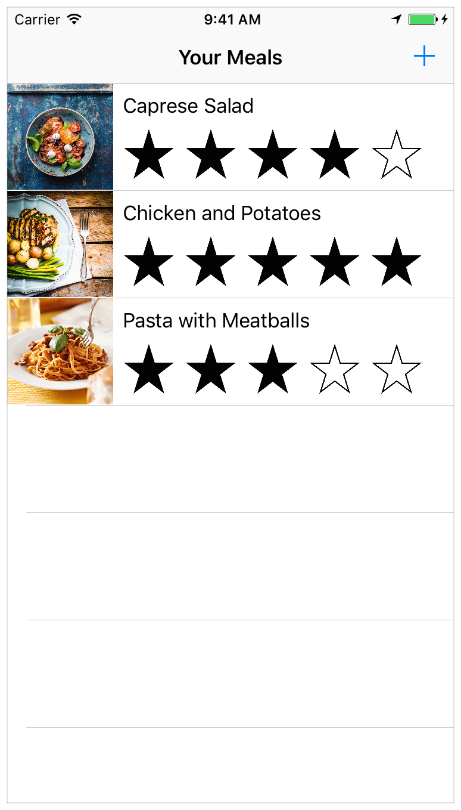
学习目标
在课程结束时，您将能够：

将现有视图控制器嵌入故事板中的导航控制器中

在视图控制器之间创建segue

使用“属性”检查器编辑故事板中segue的属性

使用该prepare(for:sender:) 方法 在视图控制器之间传递数据 

执行展开segue

使用堆栈视图创建强大，灵活的布局

添加Segue以向前导航
随着数据按预期显示，是时候提供从初始膳食列表场景到膳食细节场景的导航方式。场景之间的过渡称为segues。

在创建segue之前，您需要配置场景。首先，您将把表视图控制器放在导航控制器中。甲导航控制器的向后和向前管理转变通过一系列视图控制器。由特定导航控制器管理的一组视图控制器称为其导航堆栈。添加到堆栈的第一个项目将成为根视图控制器，并且永远不会从导航堆栈中弹出（从中移除）。

将导航控制器添加到餐饮列表场景中

打开你的故事板，Main.storyboard。

通过单击其场景停靠栏选择膳食列表场景。

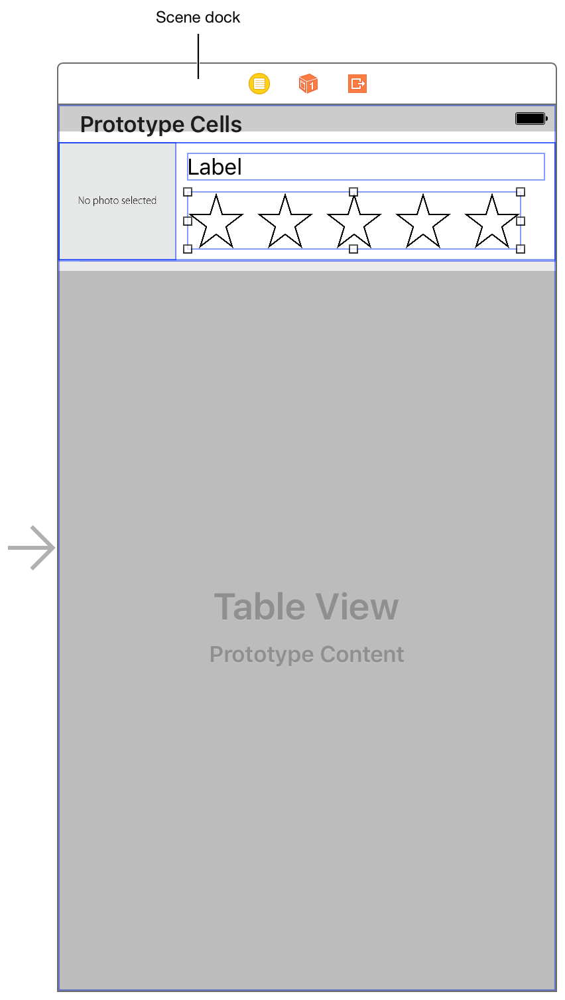
选择编辑器>嵌入>导航控制器。

Xcode为您的故事板添加了一个新的导航控制器，设置了故事板入口点，并将膳食列表场景指定为其根视图控制器。

在画布上，连接控制器的图标是根视图控制器关系。表视图控制器是导航控制器的根视图控制器。的故事板的入口点，因为导航控制器现在是表视图控制器的容器被设置为导航控制器。

您可能会注意到，您的表视图现在顶部有一个栏。这是一个导航栏。导航堆栈上的每个控制器都有一个导航栏，其中可以包含向后和向前导航的控件。接下来，您将向此导航栏添加一个按钮，以转换到用餐细节场景。

检查点：运行您的应用程序。在桌面视图上方，您现在应该看到额外的空间。这是导航控制器提供的导航栏。导航栏将其背景扩展到状态栏的顶部，因此状态栏不再与您的内容重叠。

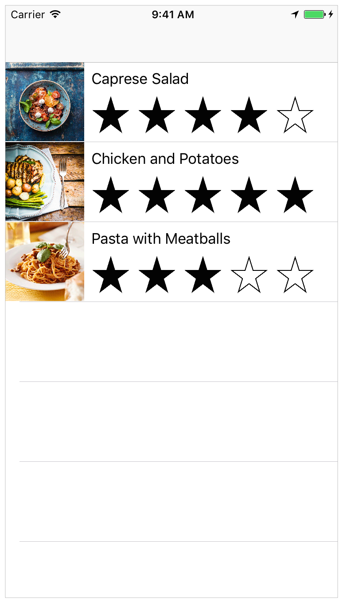
配置场景的导航栏
现在，您将添加膳食列表标题和一个按钮（以添加额外的膳食）到导航栏。导航栏从导航堆栈顶部的视图控制器获取其标题 - 它们本身没有标题。每个视图控制器都有一个navigationItem属性。此属性定义该视图控制器的导航栏外观。

在Interface Builder中，您可以通过编辑视图控制器场景中的导航栏来配置视图控制器的导航项。

在膳食列表中配置导航栏

双击膳食列表场景中的导航栏。

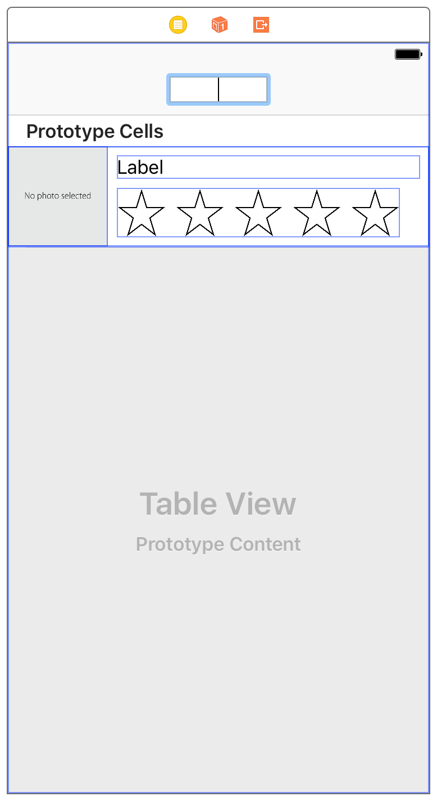
光标出现在文本字段中，您可以输入文本。

键入Your Meals并按Return键。这将设置表视图控制器的导航项的标题。

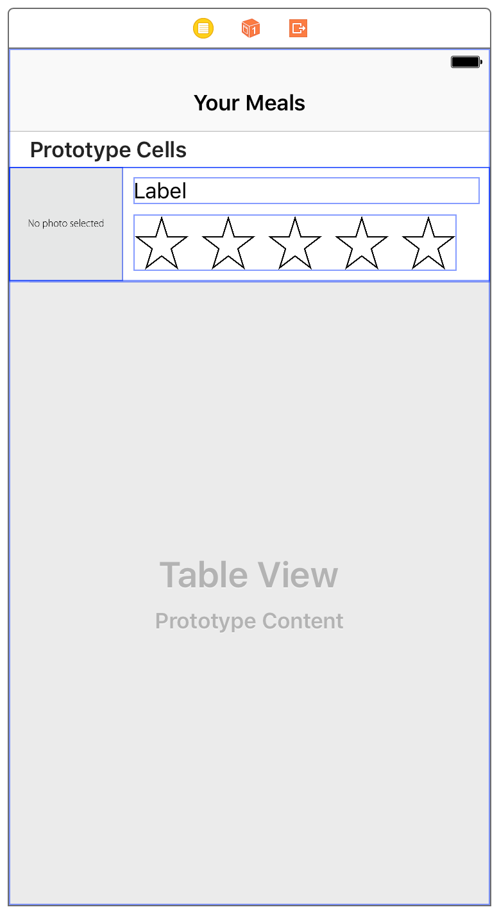
打开Object库。（选择“视图”>“实用程序”>“显示对象库”。）

在对象库中，找到Bar Button Item对象。

将Bar Button Item对象从列表拖动到膳食列表场景中导航栏的最右侧。

将出现一个名为Item的按钮，您可以在其中拖动条形按钮项。

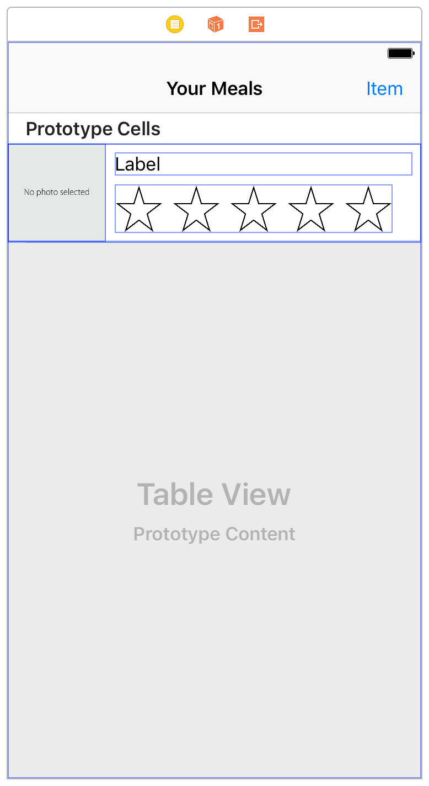
选择条形按钮项并打开“ 属性”检查器 图片：../ Art /inspector_attributes_2x.png)。

在“属性”检查器中，从“系统项”选项旁边的弹出菜单中选择“添加”。

按钮变为添加按钮（+）。

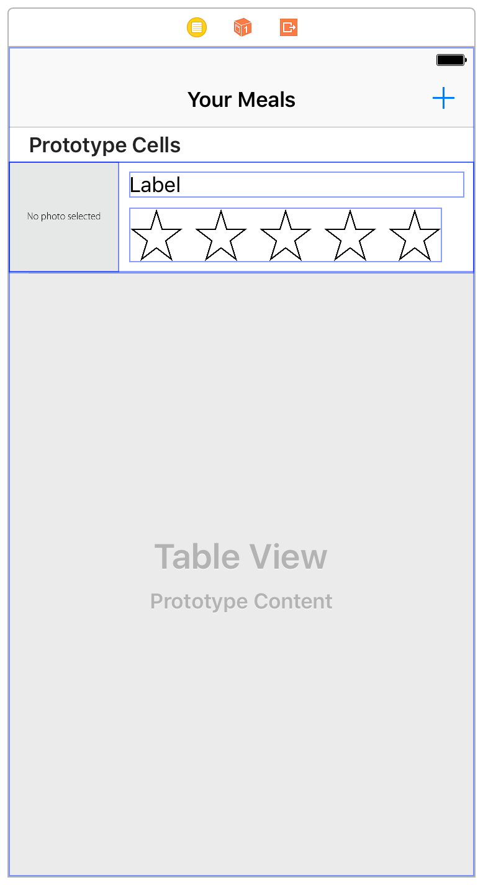
检查点：运行您的应用程序。导航栏现在应该有一个标题并显示一个添加按钮（+）。该按钮尚未执行任何操作。你接下来会解决这个问题。

您希望“添加”按钮（+）显示用餐细节场景，因此您可以通过让按钮触发到该场景的segue（或过渡）来完成此操作。

在膳食细节场景中配置“添加”按钮

在画布上，选择“添加”按钮（+）。

控制 - 从按钮拖动到用餐细节场景。

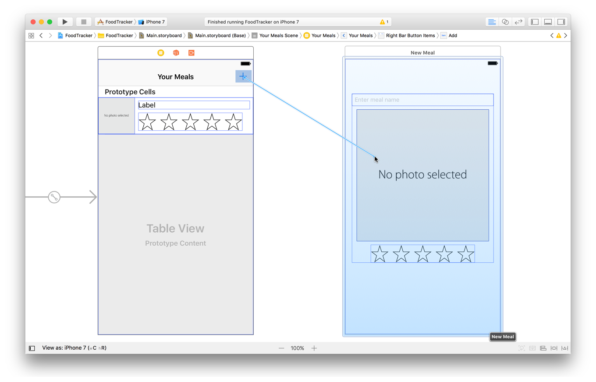
标题为Action Segue的快捷菜单出现在拖动结束的位置。

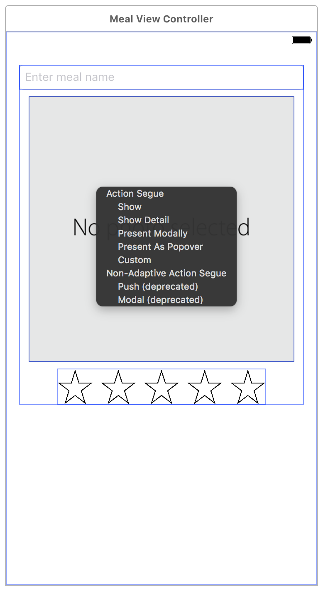
Action Segue菜单允许您选择当用户点击Add按钮时用于从膳食列表场景转换到用餐细节场景的segue类型。

从Action Segue菜单中选择Show。

甲显示SEGUE推压选定的场景到导航堆栈的顶部，并且所述导航控制器呈现该场景。当您选择show segue时，Interface Builder会设置show segue并在画布中更改用餐细节场景的外观 - 它在Interface Builder中显示一个导航栏。

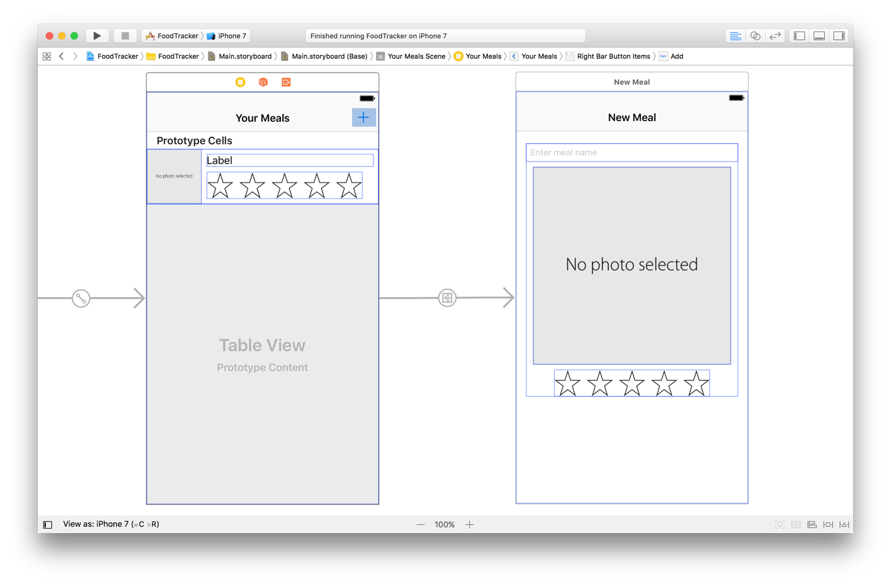
检查点：运行您的应用程序。您可以单击“添加”按钮并从膳食列表场景导航到膳食详细信息场景。因为您正在使用带有show segue的导航控制器，所以会为您处理向后导航，并且在用餐详细信息场景中会自动显示后退按钮。这意味着您可以单击用餐详细信息场景中的后退按钮返回到用餐列表。

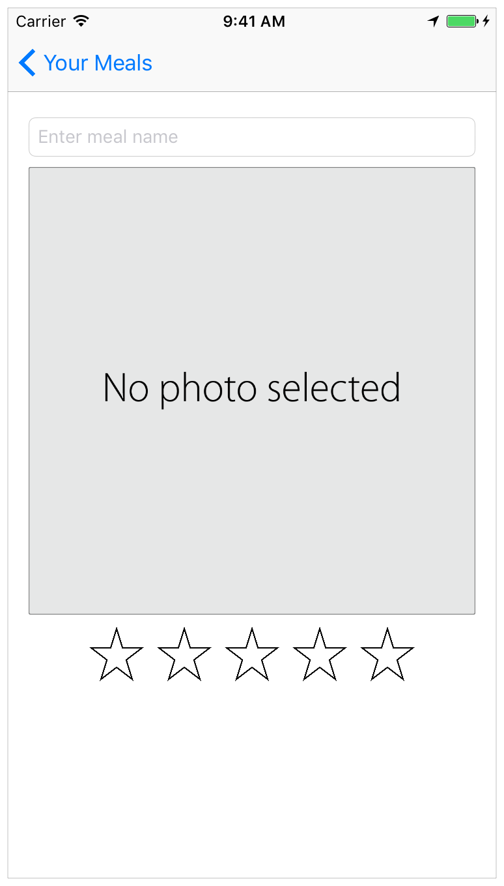
使用show segue获得的推送式导航正如它应该的那样工作 - 但是在添加项目时它并不是你想要的。推送导航设计用于向下钻取界面，您可以在其中提供有关用户所选内容的更多信息。另一方面，添加项目是模态操作 - 用户执行完整且自包含的操作，然后从该场景返回到主导航。对于这种类型的场景，适当的呈现方法是模态segue。

只需在“属性”检查器中更改segue的样式，而不是删除现有的segue并创建新的segue。与故事板中大多数可选元素的情况一样，您可以使用“属性”检查器编辑segue的属性。

改变segue风格

从膳食列表场景到膳食细节场景中选择segue。

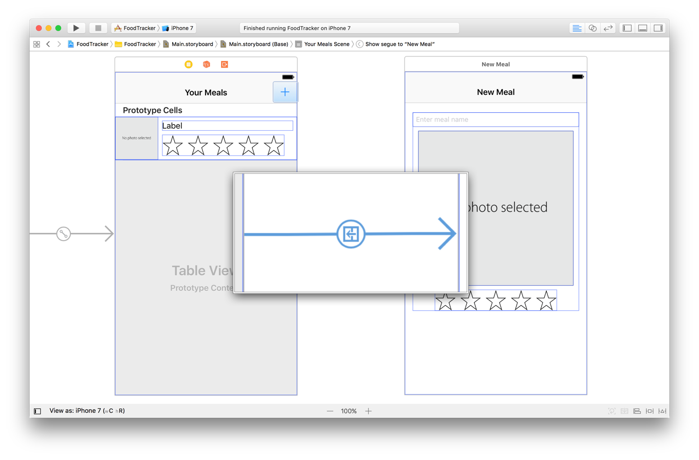
在“属性”检查器中，从“种类”字段的弹出菜单中选择“当前模态”。

在“属性”检查器中，键入AddItem“标识符”字段。按Return键。

稍后，您将使用此标识符来标识segue。

模态视图控制器不会添加到导航堆栈中，因此它不会在Interface Builder中获得导航栏。但是，您希望保留导航栏以向用户提供视觉连续性。当以模态方式呈现导航条时，将导航条嵌入其自己的导航控制器中。

将导航控制器添加到膳食细节场景中

通过单击其场景停靠栏选择用餐详细信息场景。

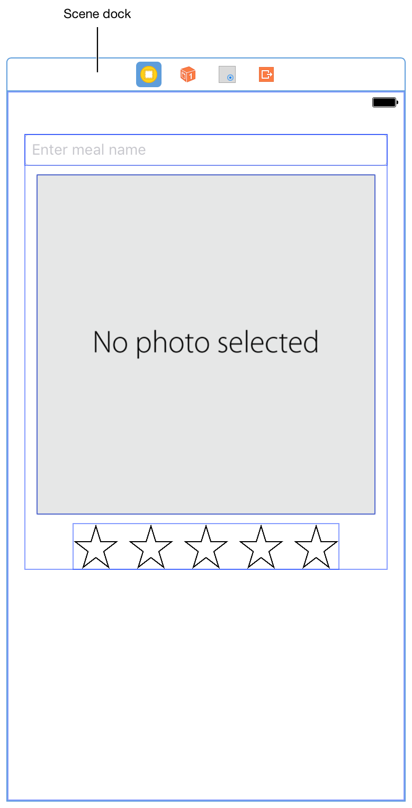
选择视图控制器后，选择“编辑器”>“嵌入”>“导航控制器”。

和以前一样，Xcode添加了一个导航控制器，并在膳食细节场景的顶部显示导航栏。

如果它们不自动更新，您可能需要更新用餐详细信息场景中的帧。如果您收到有关错误放置视图的警告，请选择视图控制器并按画布右下角的“更新帧”按钮。这将根据当前约束校正场景中每个视图的位置。

image：../ Art / INnavavtroller_mealscene_2x.png)
接下来，配置导航栏以向此场景添加标题以及两个按钮，取消和保存。稍后，您将这些按钮链接到操作。

在膳食细节场景中配置导航栏

双击膳食详细信息场景中的导航栏。

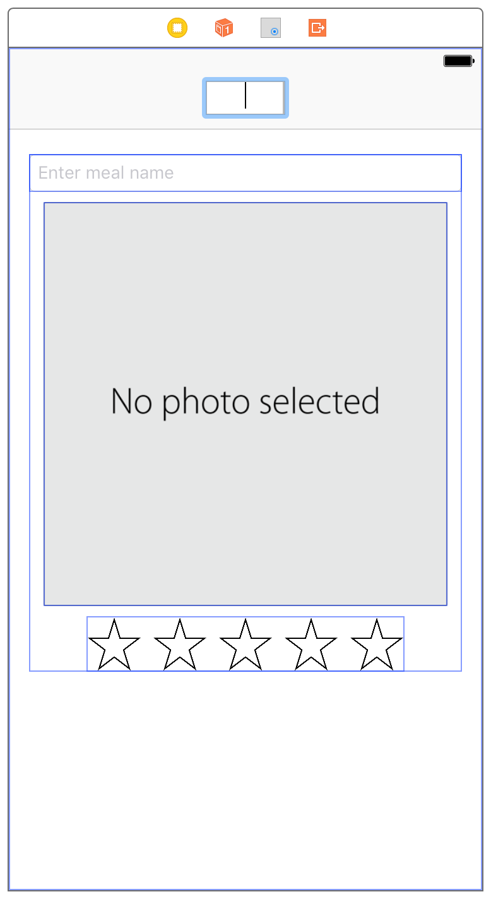
出现光标，允许您输入文本。

键入New Meal并按Return键保存。

将Bar Button Item对象从Object库拖动到膳食细节场景中导航栏的最左侧。

在“属性”检查器中，对于“系统项”，选择“取消”。

按钮文本更改为“取消”。

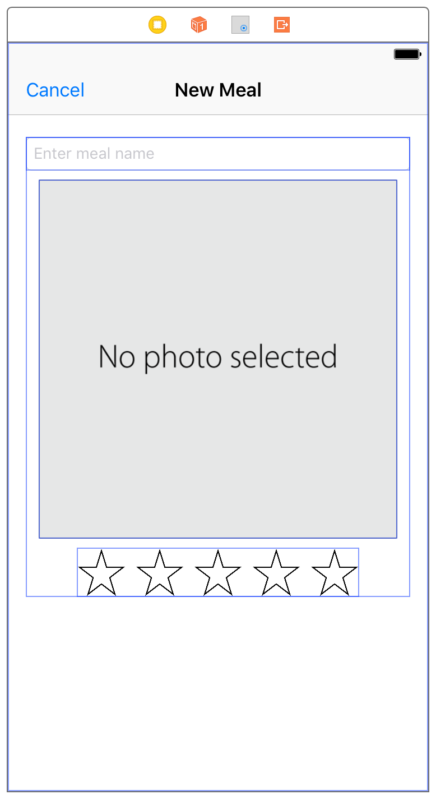
将另一个Bar Button Item对象从Object库拖动到膳食细节场景中导航栏的最右侧。

在“属性”检查器中，对于“系统项”，选择“保存”。

按钮文本更改为“保存”。

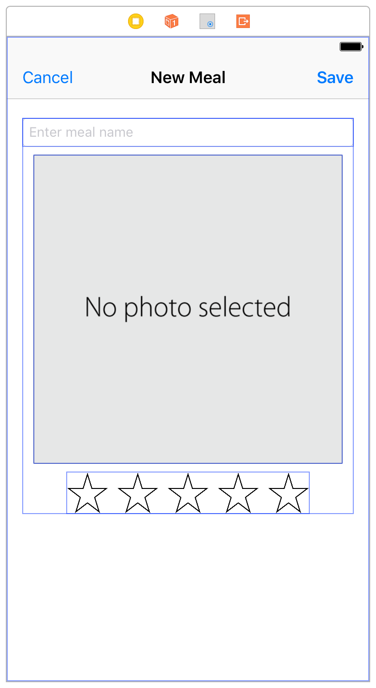
检查点：运行您的应用程序。单击“添加”按钮。您仍然可以看到用餐详细信息场景，但不再有按钮可以导航回用餐列表 - 相反，您会看到添加的两个按钮，取消和保存。这些按钮尚未与任何操作相关联，因此您可以单击它们，但它们不会执行任何操作。您将配置按钮以保存或取消添加新餐，并尽快将用户带回餐饮清单。

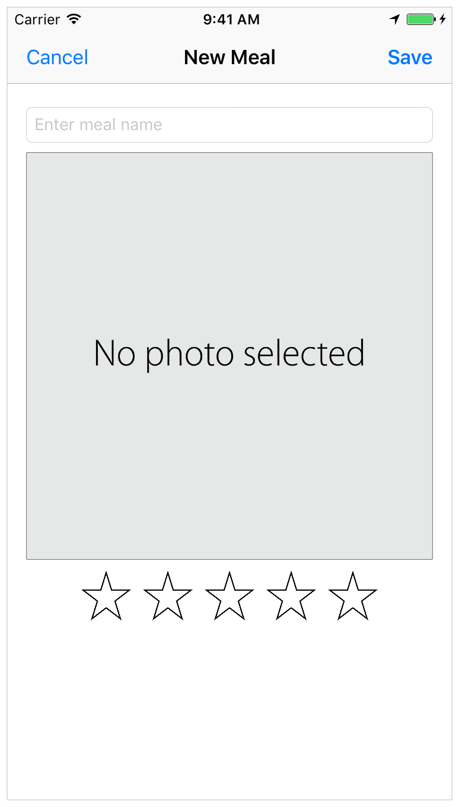
将新餐添加到膳食列表中
创建FoodTracker应用程序功能的下一步是实现用户添加新餐的功能。具体地说，当用户在用餐细节场景中输入用餐名称，评级和照片并点击“保存”按钮时，您希望MealViewController配置Meal具有适当信息的对象并将其传回MealTableViewController以显示在用餐列表中。

首先添加一个Meal属性MealViewController。

向MealViewController添加Meal属性

打开MealViewController.swift。

下面的ratingControl 出口中MealViewController.swift，添加以下属性：

/*
 This value is either passed by `MealTableViewController` in `prepare(for:sender:)`
 or constructed as part of adding a new meal.
 */
var meal: Meal?
这声明了MealViewController一个可选 的属性Meal，这意味着在任何时候它都可以nil。

Meal如果点击“保存”按钮， 您只关心配置和传递。为了能够确定何时发生这种情况，请将“保存”按钮添加为插座MealViewController.swift。

将“保存”按钮连接到MealViewController代码

打开你的故事板。

单击Xco​​de工具栏中的“助手”按钮以打开助理编辑器。

图片：../ Art /assistant_editor_toggle_2x.png)
如果需要更多空间，可以通过单击Xco​​de工具栏中的“导航器和实用程序”按钮来折叠项目导航器和实用程序区域。

在故事板中，选择“保存”按钮。

按住Ctrl键并从画布上的“保存”按钮拖动到右侧编辑器中的代码显示，停止在ratingControl属性下方的行拖动MealViewController.swift。

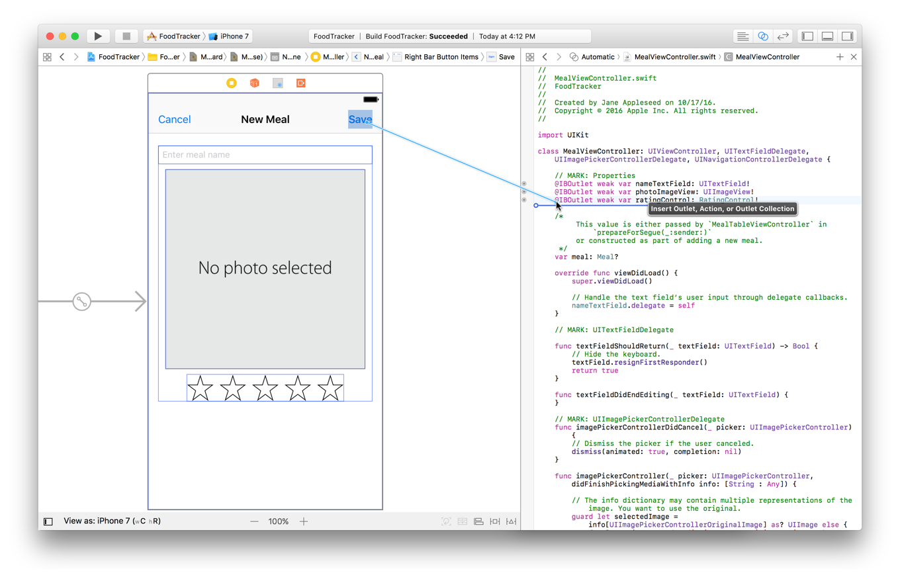
在出现的对话框中，键入名称saveButton。保留其余选项。

image：../ Art / IN_savebutton_addoutlet_2x.png)
单击连接。

您现在可以识别“保存”按钮。

创造一个放松的争论
现在的任务是将Meal对象传递MealTableViewController给用户点击“保存”按钮并在用户点击“取消”按钮时将其丢弃，从显示用餐细节场景切换到在任何一种情况下显示用餐列表。

为此，您将使用展开segue。一个退绕SEGUE向后通过一个或多个塞格斯移动到用户返回到由现有视图控制器管理的场景。当常规segue创建目标视图控制器的新实例时，展开segues可让您返回查看已存在的控制器。使用展开segue实现导航回现有视图控制器。

每当segue被触发时，它都为您提供了一个添加自己执行代码的地方。调用此方法prepare(for:sender:)，它使您有机会在源视图控制器（segue来自的视图控制器）上存储数据并执行任何必要的清理。你将实现这个方法MealViewController来做到这一点。

在MealViewController上实现prepare（for：sender :)方法

单击“标准”按钮返回标准编辑器。

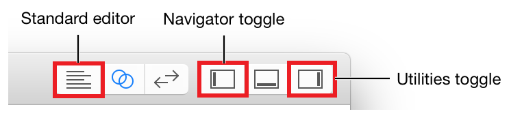
打开MealViewController.swift。

在文件的顶部，在import UIKit下面添加以下内容：

import os.log
这将导入统一日志记录系统。与该print()功能一样，统一日志记录系统允许您将消息发送到控制台。但是，统一日志记录系统可让您更好地控制邮件何时显示以及如何保存邮件。

进一步探索

有关统一日志记录系统的更多信息，请参阅日志记录参考。

在MealViewController.swift该//MARK: Actions部分上方，添加以下内容：

//MARK: Navigation
这是一条评论，可以帮助您（以及其他读取您代码的人）知道此方法与您应用的导航流程相关。

在评论下方，添加此方法框架：

// This method lets you configure a view controller before it's presented.
override func prepare(for segue: UIStoryboardSegue, sender: Any?) {
}
在该prepare(for:sender:)方法中，添加对超类的实现的调用：

super.prepare(for: segue, sender: sender)
在UIViewController类的实现并不做任何事情，但它是一个很好的习惯，总是打电话super.prepare(for:sender:)时，你覆盖prepare(for:sender:)。这样，当你继承另一个类时，你不会忘记它。

在调用下方super.prepare(for:sender:)，添加以下guard语句：

// Configure the destination view controller only when the save button is pressed.
guard let button = sender as? UIBarButtonItem, button === saveButton else {
    os_log("The save button was not pressed, cancelling", log: OSLog.default, type: .debug)
    return
}
此代码验证发件人是否为按钮，然后使用identity运算符（===）检查sender该saveButton出口和出口引用的对象是否相同。

如果不是，else则执行该语句。该应用程序使用系统的标准日志记录机制记录调试消息。调试消息包含在调试期间或解决特定问题时可能有用的信息。它们用于调试环境，不会出现在运送应用程序中。

记录调试消息后，该方法返回。

在else语句下方，添加以下代码：

let name = nameTextField.text ?? ""
let photo = photoImageView.image
let rating = ratingControl.rating
此代码根据当前文本字段文本，选定图像和场景中的评级创建常量。

注意行中的nil合并运算符（??）name。在零合并运算符用于返回一个可选的值，如果选配有值，否则返回默认值。这里，运算符解包String返回的可选项nameTextField.text（这是可选的，因为文本字段中可能有或可能没有文本），如果它是有效的字符串，则返回该值。但如果是nil，则运算符返回空字符串（""）。

添加以下代码：

// Set the meal to be passed to MealTableViewController after the unwind segue.
meal = Meal(name: name, photo: photo, rating: rating)
此代码meal在segue执行之前使用适当的值配置属性。

记得

在Meal类的init?(name:, photo:, rating:)初始化是failable初始化。如果name参数为空字符串，或者rating参数小于0或大5,于此代码，则分配nil给meal变量。否则，它会为变量分配一个新Meal对象meal。

您的prepare(for:sender:)方法应如下所示：

// This method lets you configure a view controller before it's presented.
 
override func prepare(for segue: UIStoryboardSegue, sender: Any?) {
    
    super.prepare(for: segue, sender: sender)
    
    // Configure the destination view controller only when the save button is pressed.
    guard let button = sender as? UIBarButtonItem, button === saveButton else {
        os_log("The save button was not pressed, cancelling", log: OSLog.default, type: .debug)
        return
    }
    
    let name = nameTextField.text ?? ""
    let photo = photoImageView.image
    let rating = ratingControl.rating
    
    // Set the meal to be passed to MealTableViewController after the unwind segue.
    meal = Meal(name: name, photo: photo, rating: rating)
}
创建展开segue的下一步是向目标视图控制器（segue将要访问的视图控制器）添加一个动作方法。必须使用IBAction属性标记此方法，并将segue（UIStoryboardSegue）作为参数。因为您想要展开回到膳食列表场景，您需要添加具有此格式的动作方法MealTableViewController.swift。

在此方法中，您将编写逻辑以将新餐（从MealViewController源视图控制器传递）添加到膳食列表数据，并将新行添加到膳食列表场景中的表视图中。

向MealTableViewController添加动作方法

打开MealTableViewController.swift。

在该//MARK: Private Methods部分之前，添加以下行：

//MARK: Actions
在//MARK: Actions评论下方添加以下内容：

@IBAction func unwindToMealList(sender: UIStoryboardSegue) {
    
}
在unwindToMealList(_:)action方法中，添加以下if语句：

if let sourceViewController = sender.sourceViewController as? MealViewController, meal = sourceViewController.meal {
}
这个if陈述的条件发生了很多。

此代码使用可选的类型转换运算符（as?）来尝试将segue的源视图控制器向下转换为 MealViewController实例。你需要向下转换因为sender.sourceViewController类型UIViewController，但你需要使用MealViewController。

运算符返回一个可选值，nil如果无法进行向下转换，则返回该值。如果垂头丧气成功，代码分配MealViewController实例的本地不变sourceViewController，并检查是否在吃饭财产sourceViewController是nil。如果meal属性为非nil，则代码将该属性的值分配给本地常量meal并执行该if语句。

如果任何一个垂头丧气失败或meal财产sourceViewController是nil，condition的false和if声明没有得到执行。

在if语句中，添加以下代码：

// Add a new meal.
let newIndexPath = IndexPath(row: meals.count, section: 0)
此代码计算表视图中将插入表示新餐的新表视图单元格的位置，并将其存储在名为的本地常量中newIndexPath。

在if语句中，在上一行代码下面添加以下代码：

meals.append(meal)
这将新膳食添加到数据模型中的现有膳食列表中。

在if语句中，在上一行代码下面添加以下代码：

tableView.insertRows(at: [newIndexPath], with: .automatic)
这会为包含有关新餐的信息的单元格的表视图添加新行。该.automatic动画选项使用基于表的当前状态最好的动画，将插入点的位置。

您将在一段时间内完成此方法的更高级实现，但是现在，unwindToMealList(_:)action方法应该如下所示：

@IBAction func unwindToMealList(sender: UIStoryboardSegue) {
    if let sourceViewController = sender.source as? MealViewController, let meal = sourceViewController.meal {
        
        // Add a new meal.
        let newIndexPath = IndexPath(row: meals.count, section: 0)
        
        meals.append(meal)
        tableView.insertRows(at: [newIndexPath], with: .automatic)
    }
}
现在，您需要创建实际的展开segue以触发此操作方法。

将“保存”按钮链接到unwindToMealList操作方法

打开你的故事板。

在画布上，按住Control键并从“保存”按钮拖动到用餐详细信息场景顶部的“退出”项。

image：../ Art /IN_savebutton_dragunwind_2x.png)
拖动结束的位置会出现一个菜单。它显示了所有可用的展开操作方法。

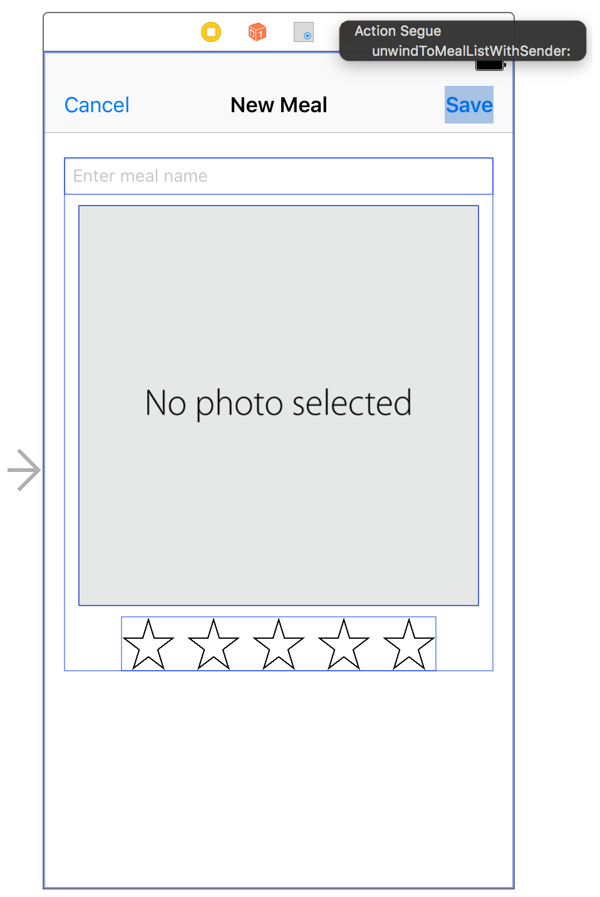
选择unwindToMealListWithSender:从快捷菜单中。

现在，当用户点击“保存”按钮时，他们会导航回到用餐列表场景，在此过程中unwindToMealList(sender:)会调用操作方法。

进一步探索

展开segues提供了一种将信息传递回早期视图控制器的简单方法。但是，有时您需要在视图控制器之间进行更复杂的通信。在这些情况下，请考虑使用委托模式。

欲了解更多信息，请参见代表团在雨燕编程语言（斯威夫特3.0.1） 。

检查点：运行您的应用程序。现在，当您单击“添加”按钮（+），创建新餐，然后单击“保存”时，您应该在用餐列表中看到新餐。

重要

如果unwindToMealListWithSender:在快捷菜单中没有看到该方法，请确保该方法具有正确的签名。

@IBAction func unwindToMealList(sender: UIStoryboardSegue)

当用户未输入项目名称时禁用保存
如果用户试图保存没有名字的餐，会发生什么？因为meal属性on MealViewController是可选的，并且如果没有名称，则将初始化程序设置为失败，Meal则不会创建对象并将其添加到膳食列表中 - 这是您期望发生的。但是，您可以更进一步，让用户在输入餐饮名称时禁用“保存”按钮，并在让他们关闭键盘之前检查他们是否指定了有效名称，以防止用户意外添加没有名字的餐点。

在没有项目名称时禁用“保存”按钮

在MealViewController.swift，找到该//MARK: UITextFieldDelegate部分。

您可以使用功能菜单快速跳转到该功能菜单，如果单击编辑器区域顶部的文件名称，则会显示该功能菜单。

在本节中，添加另一种UITextFieldDelegate方法：

func textFieldDidBeginEditing(_ textField: UITextField) {
    // Disable the Save button while editing.
    saveButton.isEnabled = false
}
textFieldDidBeginEditing在编辑会话开始时或键盘显示时调用 该方法。此代码在用户编辑文本字段时禁用“保存”按钮。

滚动到课程的底部。在最后一个结束花括号（}）之前，添加以下行：

//MARK: Private Methods
在//MARK: Private Methods评论下方，添加以下方法：

private func updateSaveButtonState() {
    // Disable the Save button if the text field is empty.
    let text = nameTextField.text ?? ""
    saveButton.isEnabled = !text.isEmpty
}
如果文本字段为空，这是一个禁用“保存”按钮的辅助方法。

回到该//MARK: UITextFieldDelegate部分并找到textFieldDidEndEditing(_:)方法：

func textFieldDidEndEditing(_ textField: UITextField) {
}
此时实现应该是空的。

添加以下代码行：

updateSaveButtonState()
navigationItem.title = textField.text
第一行调用updateSaveButtonState()以检查文本字段中是否包含文本，如果有，则启用“保存”按钮。第二行将场景的标题设置为该文本。

找到viewDidLoad()方法。

override func viewDidLoad() {
    super.viewDidLoad()
    
    // Handle the text field’s user input through delegate callbacks.
    nameTextField.delegate = self
}
updateSaveButtonState()在实现中 添加一个调用，以确保在用户输入有效名称之前禁用“保存”按钮：

// Enable the Save button only if the text field has a valid Meal name.
updateSaveButtonState()
您的viewDidLoad()方法应如下所示：

override func viewDidLoad() {
    super.viewDidLoad()
    
    // Handle the text field’s user input through delegate callbacks.
    nameTextField.delegate = self
    
    // Enable the Save button only if the text field has a valid Meal name.
    updateSaveButtonState()
}
你的textFieldDidEndEditing(_:)方法应该是这样的：

func textFieldDidEndEditing(_ textField: UITextField) {
    updateSaveButtonState()
    navigationItem.title = textField.text
}
检查点：运行您的应用程序。现在，当您单击“添加”按钮（+）时，“保存”按钮将被禁用，直到您输入有效（非空）餐饮名称并关闭键盘。

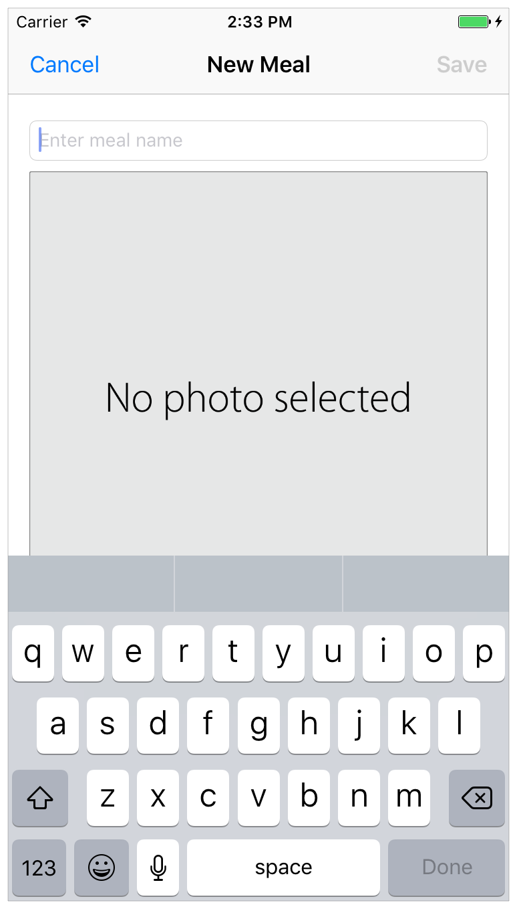
取消新的膳食添加
用户可能决定取消添加新餐，并返回餐饮列表而不保存任何内容。为此，您将实现“取消”按钮的行为。

创建和实现取消操作方法

打开你的故事板。

单击Xco​​de工具栏中的“助手”按钮以打开助理编辑器。

图片：../ Art /assistant_editor_toggle_2x.png)
在故事板中，选择“取消”按钮。

按住Control键并从画布上的“取消”按钮拖动到右侧编辑器中的代码显示，停止在//MARK: Navigation注释正下方的行拖动MealViewController.swift。

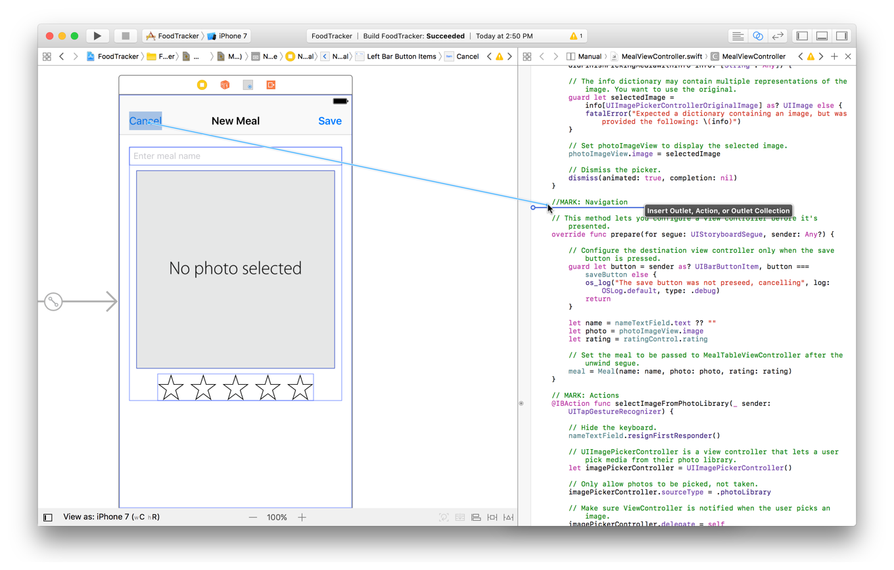
在出现的对话框中，对于Connection，选择Action。

对于名称，请键入cancel。

对于类型，请选择UIBarButtonItem。保留其余选项。

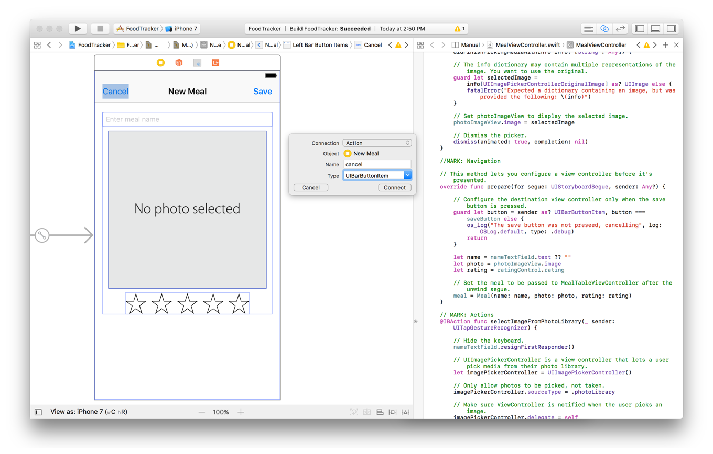
单击连接。

Xcode添加了必要的代码MealViewController.swift来设置操作。

@IBAction func cancel(_ sender: UIBarButtonItem) {
}
在cancel(_:)action方法中，添加以下代码行：

dismiss(animated: true, completion: nil)
该dismiss(animated:completion:)方法解除模态场景并将过渡动画回到前一场景（在这种情况下，是用餐列表）。当用餐细节场景被解除时，应用程序不存储任何数据，并且既不prepare(for:sender:)调用方法也不调用展开动作方法。

您的cancel(_:)操作方法应如下所示：

@IBAction func cancel(_ sender: UIBarButtonItem) {
    dismiss(animated: true, completion: nil)
}
检查点：运行您的应用程序。现在，当您单击“添加”按钮（+）并单击“取消”而不是“保存”时，您应该导航回餐饮列表而不添加新餐。

包起来
在本课程中，您学习了如何将场景推送到导航堆栈，以及如何以模态方式呈现视图。您学习了如何使用segue展开导航回到前一个场景，如何跨segue传递数据，以及如何解除模态视图。

此时，应用程序会显示样品餐的初始列表，并允许您在列表中添加新餐。在下一课中，您将添加编辑和删除膳食的功能。