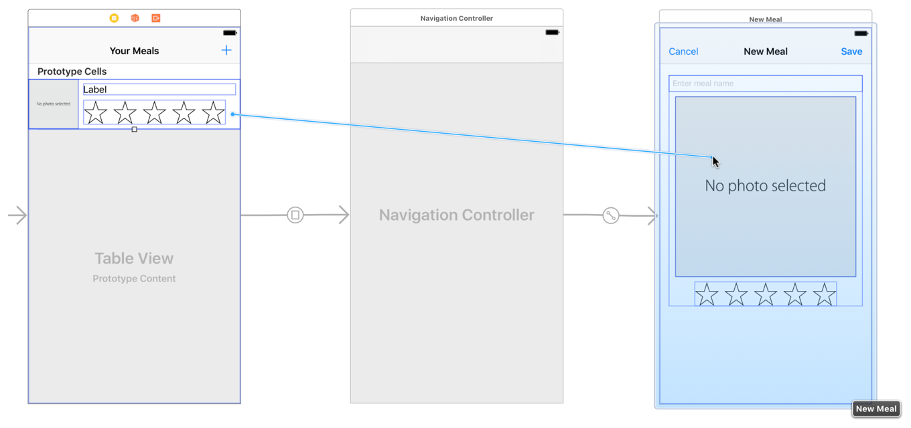
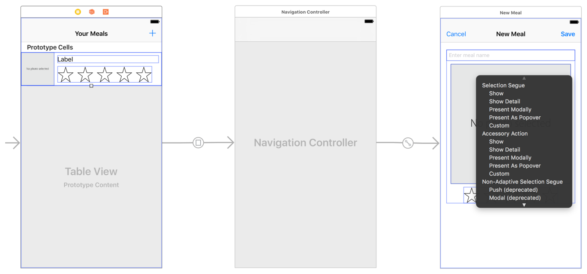
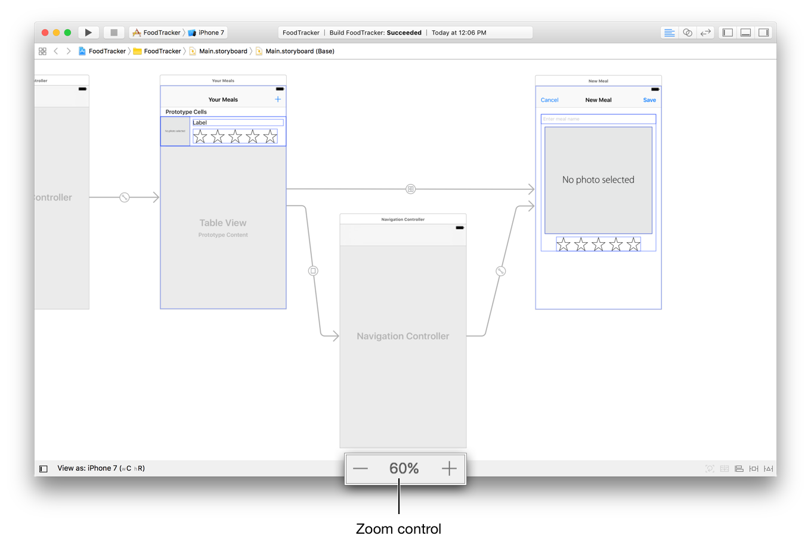
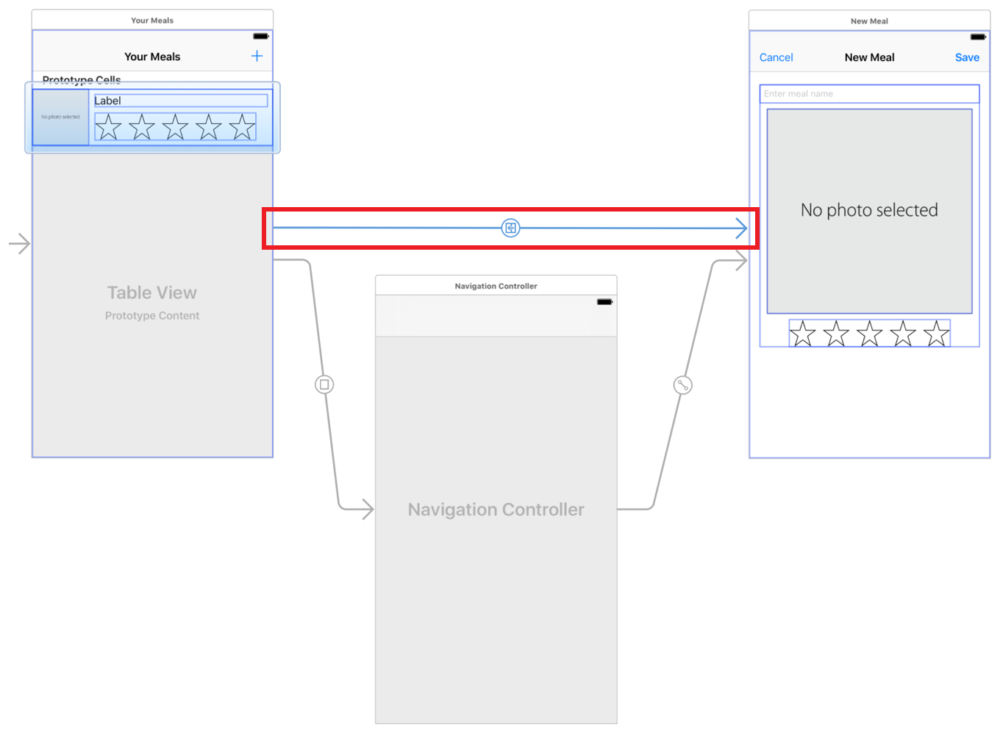
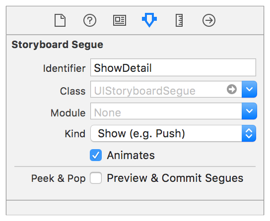
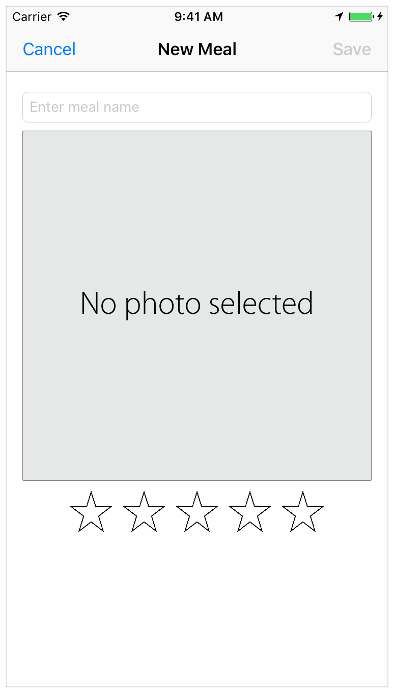
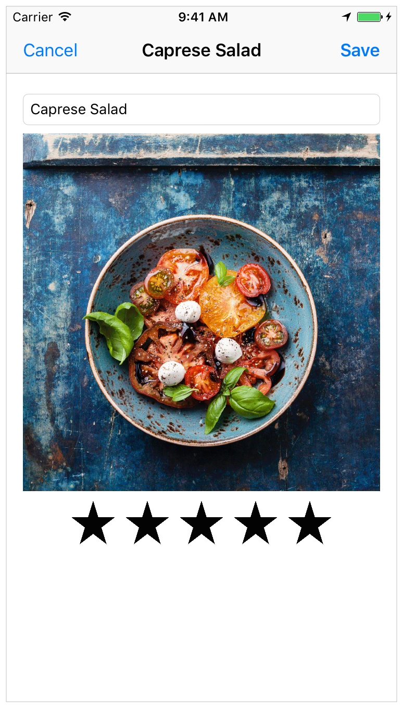
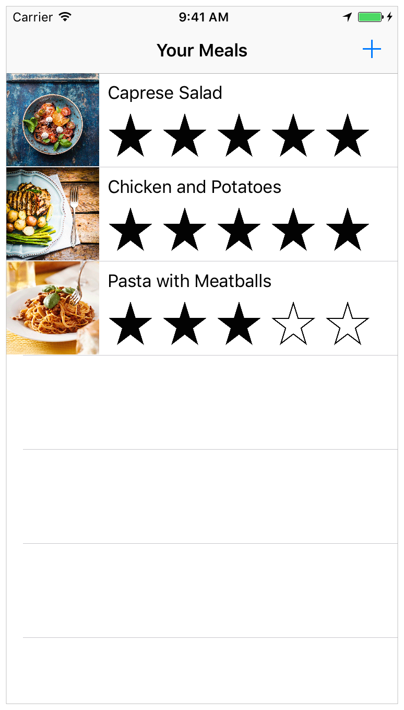
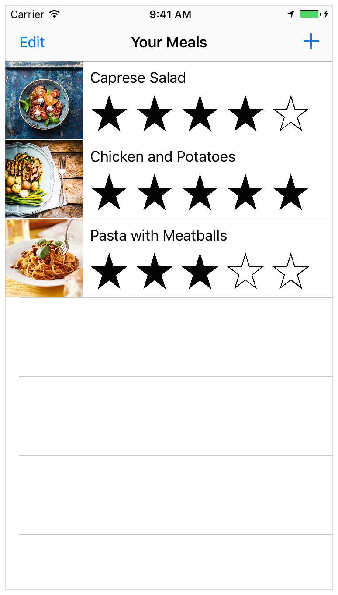
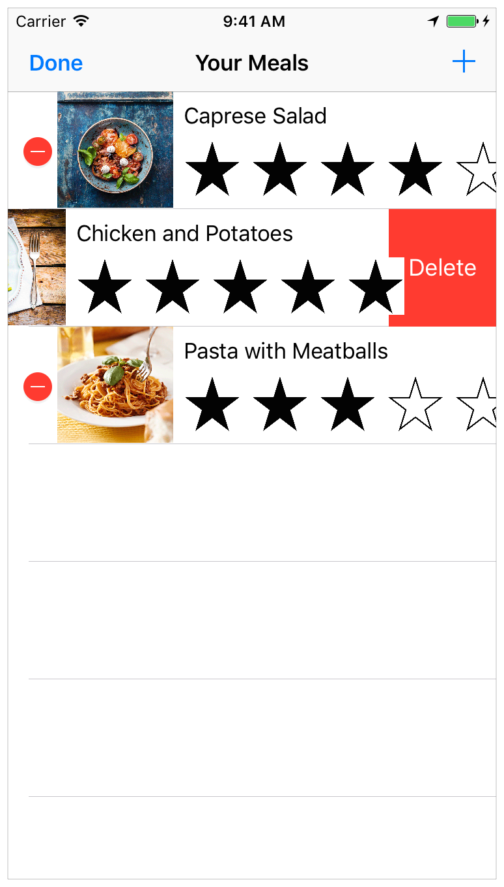

# 使用 Swift 开发 iOS 应用：实现编辑和删除行为

实施编辑和删除行为
在本课程中，您将专注于添加允许用户在FoodTracker应用程序中编辑和删除膳食的行为。

学习目标
在课程结束时，您将能够：

区分推送和模态导航

根据视图控制器的显示样式关闭视图控制器

使用segue标识符来确定发生了哪个segue

启用表视图控制器的编辑模式。

启用现有餐饮编辑
目前，FoodTracker应用程序使用户能够将新餐添加到膳食列表中。在本课程中，您将启用现有膳食的编辑。

当用户点击列表场景中的用餐时，您将在详细信息场景中显示该用餐。然后，用户可以对膳食进行更改。如果他们点击“保存”按钮，您将更新模型中的膳食数据及其在膳食列表中的外观。请注意，这不会保存模型数据。每次应用程序启动时，它都会从初始样本数据开始。仍然，用户可以在应用程序运行时修改数据。

首先在膳食列表项目和膳食细节场景之间设置分段。

配置表视图单元格

如果助理编辑器已打开，请单击“标准”按钮返回标准编辑器。

打开你的故事板，Main.storyboard。

在画布上，选择膳食列表（您的膳食）场景中的表格视图单元格。

控制 - 从表格视图单元格拖动到用餐细节场景。

标题为Selection Segue的快捷菜单显示在拖动结束的位置。

从Selection Segue菜单中选择Show。这导致导航控制器将进餐细节场景推到导航控制器的堆栈上。

在膳食列表场景和用餐细节场景之间 向下拖动导航控制器，以便您可以看到新的segue。

如果需要，可以使用画布底部的缩放命令进行缩小。

在画布上，选择新添加的segue（直接从膳食列表（您的用餐）场景到膳食细节（新餐）场景的segue）。

在“ 属性”检查器中，键入ShowDetail“标识符”字段。按Return键。

在代码中引用segue时使用标识符。

当用户在膳食列表中点击一行时，触发该segue。segue将用于膳食细节场景的视图控制器推送到包含膳食列表场景的导航堆栈上。该应用程序然后动画从膳食列表场景到膳食细节场景的过渡。

检查点：运行您的应用程序。点击餐点列表中的餐点。该应用程序导航到用餐细节场景。注意：与上一课中将场景推送到导航堆栈不同，系统不会自动提供后退按钮。这是因为您在导航栏的左侧添加了自己的栏按钮。

创造新的膳食和编辑现有的膳食是非常相似的操作。因此，您将使用相同的界面来执行这两个任务。当然，您需要对场景的外观和行为进行一些修改。您需要一种方法来识别用户何时添加新餐以及何时编辑现有餐。

回想一下prepare(for:sender:)之前在任何segue执行之前调用该方法。您可以使用此方法来识别正在发生的segue，并在膳食详细信息场景中显示相应的信息。您可以根据分配给它们的标识来区分segue：AddItem添加新餐和ShowDetail编辑现有餐时。

识别哪个segue正在发生

打开MealTableViewController.swift。

在文件的顶部，在导入UIKit之后立即导入统一日志记录系统。

import os.log
在MealTableViewController.swift，查找并取消注释该prepareForSegue(_:sender:)方法。（要取消注释方法，请删除它周围的/*和*/字符。）

执行此操作后，模板实现如下所示：

//MARK: - Navigation
 
// In a storyboard-based application, you will often want to do a little preparation before navigation
override func prepareForSegue(segue: UIStoryboardSegue, sender: AnyObject?) {
    
    // Get the new view controller using segue.destinationViewController.
    // Pass the selected object to the new view controller.
}
因为MealTableViewController是它的子类UITableViewController，所以模板实现带有一个骨架prepare(for:sender:)。

删除两行注释，并通过调用超类的实现来替换它们。

super.prepare(for: segue, sender: sender)
调用之后super.prepare(for:sender:)，添加以下switch语句：

switch(segue.identifier ?? "") {
    
}
一个switch声明认为值，并确定它的几种可能匹配模式。然后，它根据成功匹配的第一个模式执行适当的代码块。在多个选项之间进行选择时使用switch语句而不是if语句。

上面的代码检查了segue的标识符。如果标识符是nil，则nil-coalescing operator（??）用空字符串（""）替换它。这简化了switch语句的逻辑，因为您不需要处理case中的选项。

将AddItem案例添加到交换机。

case "AddItem":
os_log("Adding a new meal.", log: OSLog.default, type: .debug)
如果用户正在将某个项目添加到膳食列表中，则无需更改膳食详细信息场景的外观。只需将简单的调试消息记录到控制台即可。如果您必须调试代码，这将帮助您跟踪应用程序的流程。

将ShowDetail案例添加到交换机。

case "ShowDetail":
guard let mealDetailViewController = segue.destination as? MealViewController else {
    fatalError("Unexpected destination: \(segue.destination)")
}
 
guard let selectedMealCell = sender as? MealTableViewCell else {
    fatalError("Unexpected sender: \(sender)")
}
 
guard let indexPath = tableView.indexPath(for: selectedMealCell) else {
    fatalError("The selected cell is not being displayed by the table")
}
 
let selectedMeal = meals[indexPath.row]
mealDetailViewController.meal = selectedMeal
如果您正在编辑现有膳食，则需要在膳食详细信息场景中显示膳食数据。此代码首先获取目标视图控制器，所选的膳食单元以及所选单元的索引路径。guard语句检查所有向下转换是否按预期工作，并且所有可选项都包含非nil值。在这里，守卫声明只是作为一种健全性检查。如果您的故事板设置正确，则这些guard语句都不会失败。

只要有索引路径，就可以查找该路径的膳食对象并将其传递给目标视图控制器。

添加默认案例。

default:
fatalError("Unexpected Segue Identifier; \(segue.identifier)")
同样，如果您的故事板设置正确，则默认情况永远不会执行。但是，如果您稍后在“您的餐食”场景中添加了另一个segue并忘记更新prepare(for:sender:)方法，则新的segue标识符将与AddItem该ShowDetail案例不匹配。在这种情况下，switch语句将错误消息输出到控制台并终止应用程序。

你的prepare(for:sender:)方法应该是这样的：

override func prepare(for segue: UIStoryboardSegue, sender: Any?) {
    
    super.prepare(for: segue, sender: sender)
    
    switch(segue.identifier ?? "") {
        
    case "AddItem":
        os_log("Adding a new meal.", log: OSLog.default, type: .debug)
        
    case "ShowDetail":
        guard let mealDetailViewController = segue.destination as? MealViewController else {
            fatalError("Unexpected destination: \(segue.destination)")
        }
        
        guard let selectedMealCell = sender as? MealTableViewCell else {
            fatalError("Unexpected sender: \(sender)")
        }
        
        guard let indexPath = tableView.indexPath(for: selectedMealCell) else {
            fatalError("The selected cell is not being displayed by the table")
        }
        
        let selectedMeal = meals[indexPath.row]
        mealDetailViewController.meal = selectedMeal
        
    default:
        fatalError("Unexpected Segue Identifier; \(segue.identifier)")
    }
}
现在您已实现逻辑，打开MealViewController.swift并确保用户界面（UI）正确更新。具体而言，当实例的MealViewController（餐细节场景）被创建，其观点应当使用来自其的数据填充meal属性，如果存在该数据。你在这种viewDidLoad()方法中做这种类型的设置工作。

更新viewDidLoad的实现

打开MealViewController.swift。

在MealViewController.swift，找到viewDidLoad()方法。

override func viewDidLoad() {
    super.viewDidLoad()
    
    // Handle the text field’s user input through delegate callbacks.
    nameTextField.delegate = self
    
    // Enable the Save button only if the text field has a valid Meal name.
    updateSaveButtonState()
}
在该nameTextField.delegate行下方，添加以下代码。如果meal属性为非nil，则此代码将每个视图设置MealViewController为显示meal属性中的数据。meal仅nil在编辑现有膳食时，酒店才会退房。

// Set up views if editing an existing Meal.
if let meal = meal {
    navigationItem.title = meal.name
    nameTextField.text   = meal.name
    photoImageView.image = meal.photo
    ratingControl.rating = meal.rating
}
你的viewDidLoad()方法应该是这样的：

override func viewDidLoad() {
    super.viewDidLoad()
    
    // Handle the text field’s user input through delegate callbacks.
    nameTextField.delegate = self
    
    // Set up views if editing an existing Meal.
    if let meal = meal {
        navigationItem.title = meal.name
        nameTextField.text = meal.name
        photoImageView.image = meal.photo
        ratingControl.rating = meal.rating
    }
    
    // Enable the Save button only if the text field has a valid Meal name.
    updateSaveButtonState()
}
检查点：运行您的应用程序。点击餐饮列表中的一餐以导航到用餐细节场景。细节场景应预先填充有关膳食的数据。不幸的是，“保存”按钮还不起作用。如果单击“保存”，则应用程序不会更新该餐。相反，它增加了一顿新餐。你接下来会解决这个问题。

要更新现有餐食，您需要修改unwindToMealList(sender:)操作方法以处理两种不同的情况：添加新餐并编辑现有餐。回想一下，只有当用户点击“保存”按钮时才会调用此方法，因此您无需在此方法中考虑“取消”按钮。

更新unwindToMealList（sender :)的实现以添加和编辑饭菜

打开MealTableViewController.swift。

在MealTableViewController.swift，找到unwindToMealList(sender:)方法。

@IBAction func unwindToMealList(sender: UIStoryboardSegue) {
    if let sourceViewController = sender.source as? MealViewController, let meal = sourceViewController.meal {
        
        // Add a new meal.
        let newIndexPath = IndexPath(row: meals.count, section: 0)
        
        meals.append(meal)
        tableView.insertRows(at: [newIndexPath], with: .automatic)
    }
}
在第一个if语句的开头，添加以下if语句：

if let selectedIndexPath = tableView.indexPathForSelectedRow {
}
此代码检查是否选择了表视图中的行。如果是，则表示用户点击其中一个表格视图单元格来编辑膳食。换句话说，if当您编辑现有餐时，将执行此语句。

在此if语句中，添加以下代码：

// Update an existing meal.
meals[selectedIndexPath.row] = meal
tableView.reloadRows(at: [selectedIndexPath], with: .none)
第一行更新meals数组。它用meal新的编辑meal对象替换旧对象。第二行重新加载表视图中的相应行。这将使用包含更新meal数据的新单元替换当前单元格。结果，当表格视图重新出现时，用户现在选择的行显示已编辑的膳食。

在if语句之后，添加一个else子句并将其包装在方法的最后四行。else通过选择所有行并按Control-I，确保子句中的行正确缩进。

else {
    // Add a new meal.
    let newIndexPath = IndexPath(row: meals.count, section: 0)
    
    meals.append(meal)
    tableView.insertRows(at: [newIndexPath], with: .automatic)
}
else当表视图中没有选定行时， 该子句执行，这意味着用户点击了添加按钮以进入用餐细节场景。换句话说，else当用户添加新餐时执行该语句。

您的unwindToMealList(sender:)操作方法应如下所示：

@IBAction func unwindToMealList(sender: UIStoryboardSegue) {
    if let sourceViewController = sender.source as? MealViewController, let meal = sourceViewController.meal {
        
        if let selectedIndexPath = tableView.indexPathForSelectedRow {
            // Update an existing meal.
            meals[selectedIndexPath.row] = meal
            tableView.reloadRows(at: [selectedIndexPath], with: .none)
        }
        else {
            // Add a new meal.
            let newIndexPath = IndexPath(row: meals.count, section: 0)
            
            meals.append(meal)
            tableView.insertRows(at: [newIndexPath], with: .automatic)
        }
    }
}
检查点：运行您的应用程序。您应该能够单击表格视图单元格以导航到用餐详细信息场景，并查看其预先填充的有关用餐的数据。如果单击“保存”，则您所做的更改应显示在膳食列表中。

取消编辑现有膳食
用户可能决定不对餐进行编辑，并且想要返回餐饮列表而不保存任何更改。为此，您将更新“取消”按钮的行为以适当地关闭场景。

解雇的类型取决于场景的呈现方式。您将实现一个检查，以确定当用户点击“取消”按钮时当前场景的呈现方式。如果它是以模态方式呈现的（用户点击了“添加”按钮），它将被解除使用dismissViewControllerAnimated(_:completion:)。如果它呈现推送导航（用户点击表格视图单元格），它将被呈现它的导航控制器解除。

进一步探索

不同的演示风格有不同的用途。当它们表示用户必须在继续之前完成或取消的任务（例如，添加新餐）时，以模态方式呈现场景。当用户浏览分层数据时（例如，从膳食列表中选择膳食），使用导航控制器呈现场景。

有关更多信息，请参阅iOS人机界面指南中的交互>模态和交互>导航。

要更改取消操作的实现

打开MealViewController.swift。

在MealViewController.swift，找到cancel(_:)动作方法。

@IBAction func cancel(_ sender: UIBarButtonItem) {
    dismiss(animated: true, completion: nil)
}
此实现仅使用该dismiss(animated:completion:)方法来关闭用餐详细信息场景，因为到目前为止您只需要考虑“添加”按钮。

在cancel(_:)action方法中，在现有代码行之前，添加以下代码：

// Depending on style of presentation (modal or push presentation), this view controller needs to be dismissed in two different ways.
let isPresentingInAddMealMode = presentingViewController is UINavigationController
此代码创建一个布尔值，指示呈现此场景的视图控制器是否为类型UINavigationController。如常数名称isPresentingInAddMealMode所示，这意味着用户点击添加按钮会显示用餐细节场景。这是因为当以这种方式呈现时，用餐细节场景嵌入在其自己的导航控制器中，这意味着导航控制器呈现它。

在刚添加的行之后，添加以下if语句，并移动调用其中的行dismissViewControllerAnimated：

if isPresentingInAddMealMode {
    dismiss(animated: true, completion: nil)
}
在dismiss(animated:completion:)用户点击取消按钮之前总是调用该方法之前; 但是，dismiss(animated:completion:)仅在用户添加新餐时才有效。因此，代码现在检查以确保用户在呼叫之前添加新餐dismiss(animated:completion:)。

请注意，当用户编辑餐时，这仍然不会消除场景。接下来你将添加该代码。

在if语句之后，添加此else子句：

else if let owningNavigationController = navigationController{
    owningNavigationController.popViewController(animated: true)
}
else如果用户正在编辑现有膳食，则调用 该块。这还意味着当用户从膳食列表中选择膳食时，用餐细节场景被推到导航堆栈上。该else语句使用if let语句来安全地解包视图控制器的navigationController属性。如果视图控制器已被推送到导航堆栈，则此属性包含对堆栈导航控制器的引用。

else子句中 的代码执行一个名为的方法popViewController(animated:)，该方法将当前视图控制器（膳食细节场景）弹出导航堆栈并为过渡设置动画。这解除了用餐细节场景，并将用户返回到用餐列表。

在第一个下方添加第二个else语句：

else {
    fatalError("The MealViewController is not inside a navigation controller.")
}
这种else情况下，执行仅当一个模式导航控制器内部没有呈现的膳食细节场景（例如，添加新的餐时），并且如果该餐细节场景不是推到导航堆栈（例如，编辑一餐时） 。如果您的应用程序的导航流程设置正确，则else不应执行此情况。如果是，则表示您的应用中存在错误。else案例将错误消息输出到控制台并终止应用程序。

您的cancel(_:)操作方法应如下所示：

@IBAction func cancel(_ sender: UIBarButtonItem) {
    // Depending on style of presentation (modal or push presentation), this view controller needs to be dismissed in two different ways.
    let isPresentingInAddMealMode = presentingViewController is UINavigationController
    
    if isPresentingInAddMealMode {
        dismiss(animated: true, completion: nil)
    }
    else if let owningNavigationController = navigationController{
        owningNavigationController.popViewController(animated: true)
    }
    else {
        fatalError("The MealViewController is not inside a navigation controller.")
    }
}
检查点：运行您的应用程序。当您选择用餐时，您可以单击取消返回到用餐列表而不保存对用餐的任何更改。此外，当您单击“添加”按钮（+）并单击“取消”而不是“保存”时，导航应该会将您带回餐饮列表而不添加新餐。

支持删除餐
接下来，您将为用户提供从膳食列表中删除膳食的功能。您需要一种方法让用户将表视图置于编辑模式，从中可以删除单元格。您可以通过向表视图的导航栏添加“编辑”按钮来完成此操作。

将“编辑”按钮添加到表视图

打开MealTableViewController.swift。

在MealTableViewController.swift，找到viewDidLoad()方法。

override func viewDidLoad() {
    super.viewDidLoad()
    
    // Load the sample data.
    loadSampleMeals()
}
在该super.viewDidLoad()行下方，添加以下代码行：

// Use the edit button item provided by the table view controller.
navigationItem.leftBarButtonItem = editButtonItem
此代码创建一种特殊类型的条形按钮项，其中内置了编辑行为。然后将此按钮添加到膳食列表场景中导航栏的左侧。

你的viewDidLoad()方法应该是这样的：

override func viewDidLoad() {
    super.viewDidLoad()
    
    // Use the edit button item provided by the table view controller.
    navigationItem.leftBarButtonItem = editButtonItem
    
    // Load the sample data.
    loadSampleMeals()
}
检查点：运行您的应用程序。请注意，表视图导航栏左侧有一个“编辑”按钮。如果单击“编辑”按钮，表格视图将进入编辑模式 - 但您还无法删除单元格，因为您尚未实现。

要对表视图执行任何类型的编辑，您需要实现其委托方法之一，tableView(_:commit:forRowAt:)。此委托方法管理表格行处于编辑模式时的更改。

此外，取消注释tableView(_:canEditRowAt:)支持编辑的实现。

删除一顿饭

在MealTableViewController.swift，查找并取消注释该tableView(_:commit:forRowAt:)方法。（要取消注释方法，请删除它周围的/*和*/字符。）

执行此操作后，模板实现如下所示：

// Override to support editing the table view.
override func tableView(_ tableView: UITableView, commit editingStyle: UITableViewCellEditingStyle, forRowAt indexPath: IndexPath) {
    if editingStyle == .delete {
        // Delete the row from the data source
        tableView.deleteRows(at: [indexPath], with: .fade)
    } else if editingStyle == .insert {
        // Create a new instance of the appropriate class, insert it into the array, and add a new row to the table view
    }
}
在评论下方// Delete the row from the data source，添加：

meals.remove(at: indexPath.row)
此代码删除Meal要删除的对象meals。它之后的行（它是模板实现的一部分）从表视图中删除相应的行。

在MealTableViewController.swift，查找并取消注释该tableView(_:canEditRowAt:)方法。

执行此操作后，模板实现如下所示：

// Override to support conditional editing of the table view.
override func tableView(_ tableView: UITableView, canEditRowAt indexPath: IndexPath) -> Bool {
    // Return false if you do not want the specified item to be editable.
    return true
}
您的tableView(_:commitEditingStyle:forRowAtIndexPath:)方法应如下所示：

// Override to support editing the table view.
override func tableView(_ tableView: UITableView, commit editingStyle: UITableViewCellEditingStyle, forRowAt indexPath: IndexPath) {
    if editingStyle == .delete {
        // Delete the row from the data source
        meals.remove(at: indexPath.row)
        tableView.deleteRows(at: [indexPath], with: .fade)
    } else if editingStyle == .insert {
        // Create a new instance of the appropriate class, insert it into the array, and add a new row to the table view
    }
}
检查点：运行您的应用程序。如果单击“编辑”按钮，表格视图将进入编辑模式。您可以通过单击左侧的指示器选择要删除的单元格，然后按该单元格中的“删除”按钮确认要删除它。或者，在单元格上向左滑动以快速显示“删除”按钮; 此行为内置于表视图中。单击单元格的“删除”按钮时，将从列表中删除该单元格。

进一步探索

在编辑模式下，评级控件扩展到删除按钮。这是因为单元格的布局不是使用自动布局设计的。控件适合正常分配的空间，但是当空间减小时控件不适应。

要解决此问题，您需要使用嵌套堆栈视图和自动布局约束来布置单元格; 然而，这是留给读者的练习。

有关更多信息，请参阅自动布局指南。

包起来
在本课程中，您添加了对膳食列表中编辑和删除膳食的支持。因为编辑一顿饭和创建一顿新餐非常相似，所以该应用程序使用餐饮细节场景。因此，您需要区分何时以模态方式呈现视图控制器（添加餐）和将视图控制器推入导航堆栈（编辑餐）。您根据其呈现方式修改了膳食细节场景的外观和行为。

您现在可以添加，编辑和删除膳食。但是，数据未保存。每次启动应用程序时，都会重新开始使用初始样本数据。在下一课中，您将添加用于保存和加载膳食列表的代码。