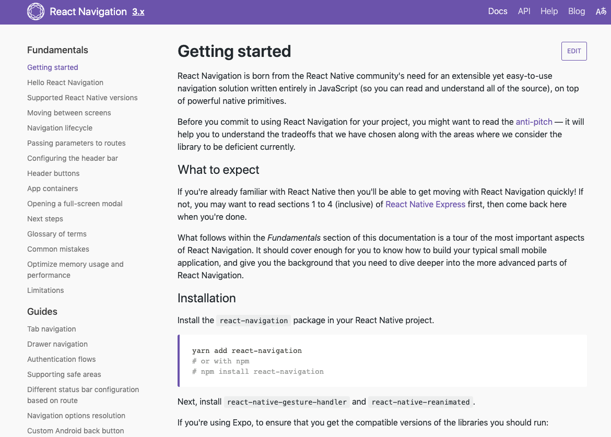
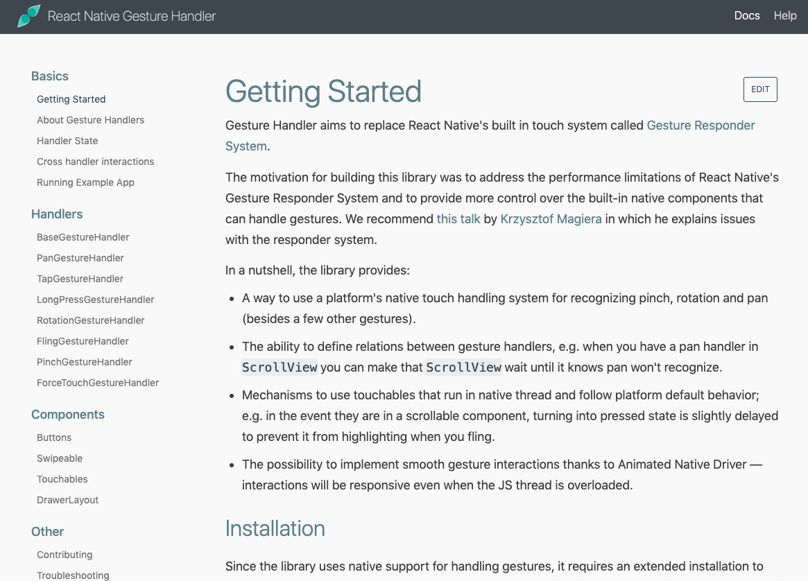
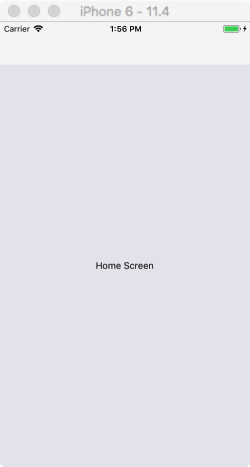
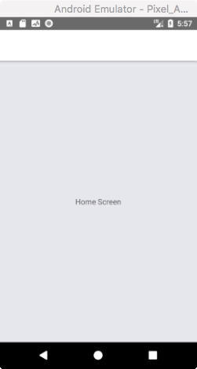
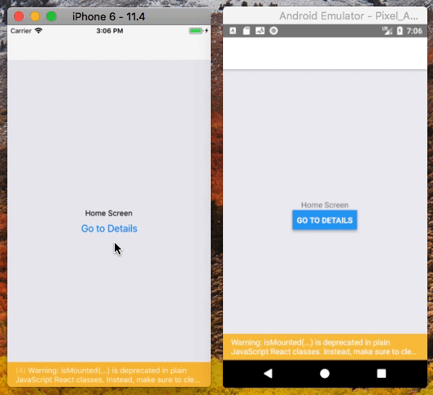

# React Navigation - 开始

## 概述 

React Navigation 是一个基于原生、完全用 JavaScript 编写、易于使用的 React Native 导航解决方案库。目前其最新版本是 `3.11.1`，发布于 2019 年 07 月 13 日。可以很负责任的说，在一段很长的时间内，该解决方案都会是最优解。

注意事项：
* 从 `react-navigation@3.x` 起该库依赖了在 `react@16.3.x` 中新加的 `React.createContext` API，所以至少要在 `react-native@^0.54.x` 上才能使用。如果你当前的 React Native 版本低于 0.54，请使用 `react-navigation@2.x`了。
* 因为 `react-navigation@3.x` 需要 
[react-native-gesture-handler](https://github.com/kmagiera/react-native-gesture-handler#react-native-support) 库才能正常工作，所以在 `npm install` 时你还需要安装对应的 `react-native-gesture-handler` 库。

> react-native-gesture-handler： 
> * 提供了 Native 驱动的手势管理 API，用于在 React Native 中构建基于触摸的最佳体验。
> * 使用此库时，手势将不再由 JS 响应器控制，而是在 UI 线程中识别和跟踪。
> * 使得触摸交互和手势跟踪更加平滑、可靠和确定。
> 
> | version | react-native version
> | -- | --
> | 1.1.0+ | 0.57.2+
> | <1.1.0 | 0.50.0+
> 
> 注：看起来很强大，但也难免有些坑洼的，摔倒时填平就好。 

其实上述两个库的官方文档内容都比较多，上两张图感受一下：

[](https://reactnavigation.org/docs/en/getting-started.html)

[](https://kmagiera.github.io/react-native-gesture-handler/docs/getting-started.html)

*注：点击图片可直接跳转到对应文档页面。*


## 安装并链接依赖项

在你的 Ract Native 项目中先安装 `react-navigation` :

```shell
$ yarn add react-navigation

# or with npm
# npm install --save react-navigation
```

接着，安装 `react-native-gesture-handler` 和 [`react-native-reanimated`](https://github.com/kmagiera/react-native-reanimated)：

```shell
$ yarn add react-native-gesture-handler react-native-reanimated

# or with npm
# npm install react-native-gesture-handler react-native-reanimated
```

最后，如果你使用的是 React Native 0.59 或以下版本，则需要通过命令或以手动方式来链接依赖项。

通过命令进行链接：

```shell
$ react-native link react-native-reanimated
$ react-native link react-native-gesture-handler
```

以手动方式进行链接：

```java
// Android 平台，找到 createRootView 方法并将其返回对象改为 RNGestureHandlerEnabledRootView
package com.reactnavigation.example;

import com.facebook.react.ReactActivity;
+ import com.facebook.react.ReactActivityDelegate;
+ import com.facebook.react.ReactRootView;
+ import com.swmansion.gesturehandler.react.RNGestureHandlerEnabledRootView;

public class MainActivity extends ReactActivity {

  @Override
  protected String getMainComponentName() {
    return "Example";
  }

+  @Override
+  protected ReactActivityDelegate createReactActivityDelegate() {
+    return new ReactActivityDelegate(this, getMainComponentName()) {
+      @Override
+      protected ReactRootView createRootView() {
+       return new RNGestureHandlerEnabledRootView(MainActivity.this);
+      }
+    };
+  }
}
```

```js
// 在 iOS 中大致姿势是这样的，详情参考对应的官方文档
pod 'React', :path => '../node_modules/react-native', :subspecs => [
  . . . // other subspecs
  'RCTLinkingIOS',
  . . .
]
```

都准备好后，正式开启 React Navigation 探索之旅。


## Hello React Navigation

官方文档篇幅有点长，我们来浓缩下：
* React Navigation 的导航堆栈器 (stack navigation) 提供了在路由堆栈中导航时所期待的手势和动画。
* 相关的所有行为都是跨平台的，在不同平台上显示或行为可能不太一样，但无需针对平台来做特别兼容。

### 创建一个堆栈导航器

一般来说，一个应用中可同时存在多个堆栈导航器，其创建方式也多种多样：
* `createStackNavigator`
* `createSwitchNavigator`
* `createAnimatedSwitchNavigator`
* `createDrawerNavigator`
* `createTabNavigator`
* `createBottomTabNavigator`
* ... 

在这里，我们先通过 `createStackNavigator` 来实践下。

`createStackNavigator()` 方法接受一个 "路由配置对象" 参数，然后返回是一个 React 组件。因为 `createStackNavigator()` 方法返回值类型是 React 组件，所以我们可以将其导出，并作为应用程序的根组件，示例代码如下：

```js
// In App.js in a new project

import React from 'react';
import { View, Text } from 'react-native';
import { createStackNavigator } from 'react-navigation';

class HomeScreen extends React.Component {
  render() {
    return (
      <View style={{ flex: 1, alignItems: 'center', justifyContent: 'center' }}>
        <Text>Home Screen</Text>
      </View>
    );
  }
}

export default createStackNavigator({
  Home: {
    screen: HomeScreen
  },
});

export default createAppContainer(AppNavigator);
```

运行后，显示效果如下：

| iOS | Android
| -- | --
|  | 

可以看到，当前显示的页面中包含一个空的导航栏和一个包含你的 `HomeScreen` 组件的灰色内容区域，这些是默认配置呈现出来的样式效果。在后面的文章中，我们会学习如何配置这些具体样式。

相比直接导出 `createStackNavigator()` 的返回值而言，更好的做法是导出一个只呈现 (render) 我们的堆栈导航器的组件 `RootStack`，与，这样我们对应用根组件有着更多的控制力，示例代码如下：

```js
const RootStack = createStackNavigator({
  Home: {
    screen: HomeScreen
  },
});

export default class App extends React.Component {
  render() {
    return <RootStack />;
  }
}
```

注：`<RootStack />` 组件不接受任何属性 (props)，其所有配置都是在 `createStackNavigator()` 方法的 `options` 参数中指定的，如果我们将 options 留空，则会使用默认配置。


### 路由配置简写

如果我们唯一的路由配置是 "页面组件"，则可以不通过 `{screen：HomeScreen}` 这种格式来进行声明，直接使用 "页面组件" 即可。比如：

```js
const RootStack = createStackNavigator({
  Home: HomeScreen    // 省略了 screen 声明
});
```


### 增加第二个路由

在下面的代码片段中，我们为 "堆栈导航器" 增加了第二个页面：

```js
// Other code for HomeScreen here...

class DetailsScreen extends React.Component {
  render() {
    return (
      <View style={{ flex: 1, alignItems: 'center', justifyContent: 'center' }}>
        <Text>Details Screen</Text>
      </View>
    );
  }
}

const RootStack = createStackNavigator(
  {
    Home: HomeScreen,
    Details: DetailsScreen,
  },
  {
    initialRouteName: 'Home',
  }
);

// Other code for App component here...
```

所以，到目前为止我们的堆栈器中共有两个路由：
* `Home` 路由：对应于 `HomeScreen` 组件。
* `Details` 路由：对应于 `DetailsS​​creen` 组件。

**什么是路由？**

贴一段 react-navigation.d.ts 文件中的类型定义代码，然后自行意会，哈哈哈：

```ts
export interface NavigationRouter<State = NavigationState, Options = {}> {
  getStateForAction: (action: NavigationAction, lastState?: State) => State | null;
  getActionForPathAndParams: (path: string, params?: NavigationParams) => NavigationAction | null;
  getPathAndParamsForState: (state: State) => {path: string; params?: NavigationParams;};
  getComponentForRouteName: (routeName: string) => NavigationComponent;
  getComponentForState: (state: State) => NavigationComponent;
  getScreenOptions: NavigationScreenOptionsGetter<Options>;
}

export interface SwitchRouter extends NavigationRouter {}

export function TabRouter(
  routeConfigs: NavigationRouteConfigMap,
  config: NavigationTabRouterConfig
): NavigationRouter<any, any>;

export function StackRouter(
  routeConfigs: NavigationRouteConfigMap,
  config: NavigationTabRouterConfig
): NavigationRouter<any, any>;
```


### 页面跳转

**导航到新的页面**

在上面的示例中，我们都把 `Home` 路由设置为了堆栈的初始路由，那我怎样做才能从 `Home` 路由跳转到 `Details` 路由？示例代码如下：

```js
import React from 'react';
import { Button, View, Text } from 'react-native';
import { createStackNavigator } from 'react-navigation';

class HomeScreen extends React.Component {
  render() {
    return (
      <View style={{ flex: 1, alignItems: 'center', justifyContent: 'center' }}>
        <Text>Home Screen</Text>
        <Button
          title="Go to Details"
          onPress={() => this.props.navigation.navigate('Details')}
        />
      </View>
    );
  }
}

// ... other code from the previous section
```

运行效果动态图如下：



上述示例代码中用到了两个新的知识点：
* `this.props.navigation`：在堆栈导航器中，`navigation` 属性会传递到每一个页面组件中。
* `navigate('Details')`：`navigation` 属性的 `navigate()` 方法所携带的参数 (路由名称) 指向的就是我们想要跳转到的新页面。


**多次导航到同一个路由**

那如果我多次导航到同一个路由会怎样？呃.. 我也不清楚，要不我们试一下咯：

```js
// 修改 DetailsScreen 后代码如下
class DetailsScreen extends React.Component {
  render() {
    return (
      <View style={{ flex: 1, alignItems: 'center', justifyContent: 'center' }}>
        <Text>Details Screen</Text>
        <Button
          title="Go to Details... again"
          onPress={() => this.props.navigation.navigate('Details')}
        />
      </View>
    );
  }
}
```

运行后你会发现，不管你在 DetailsScreen 页面点击多少次 ”Go to Details... again” 按钮，页面都没有进行跳转。为什么呢？你可以这样理解，`navigate` 的意思是导航到某个页面，但现在你都已经处于这个页面了，还导个锤子..

呃.. 老板说我们的预期是再打开一个新的 Detail 页面呢，咋办？使用 `push` 方法即可：

```js
<Button
  title="Go to Details... again"
  onPress={() => this.props.navigation.push('Details')}
/>
```

小结：
* 每次调用 `push()` 方法时，React Navigation 都会给导航堆栈器添加一个新的路由。
* 而在使用 `navigation()` 方法时，React Navigation 会先尝试查找堆栈器中是否已经有了该名称对应的路由，还没有的话才创建。

**返回到上一个页面**

现在我知道怎样跳转到新的页面了，可是有时我需要返回到上一个页面呢，在解答下？好，有问就有答：

```js
class DetailsScreen extends React.Component {
  render() {
    return (
      <View style={{ flex: 1, alignItems: 'center', justifyContent: 'center' }}>
        <Text>Details Screen</Text>
        <Button
          title="Go to Details... again"
          onPress={() => this.props.navigation.push('Details')}
        />
        <Button
          title="Go to Home"
          onPress={() => this.props.navigation.navigate('Home')}
        />
        <Button
          title="Go back"
          onPress={() => this.props.navigation.goBack()}
        />
      </View>
    );
  }
}
```

新知识点：
* 调用 `navigation` 属性的 `back()` 方法可以返回到上一个页面。

补充说明：
* React Navigation 提供的标题栏包含一个返回按钮，当导航堆栈器中只有一个页面时会自动隐藏。
* 在 Android 平台上，React Navigation 会与实体的返回按钮相关联，并在用户点击该按钮时触发 `goBack()` 方法。
* `navigation` 属性除了有上述提到的 `navigate()`、`push()` 和 `back()` 方法外，还有其它方法，比如：
  * 通过其 `addListener()` 方法来监听当前页面失去焦点时的事件；
  * 通过其 `popToTop()` 方法返回到处于堆栈最底部的页面；
  * 通过其 `dispatch()` 方法来向路由发送动作；
  * ... (可参考 React Navigation API 文档的 Navigation Prop 部分)


## 附录

附下完整代码：

```js
import React from 'react';
import { Button, View, Text } from 'react-native';
import { StackNavigator } from 'react-navigation'; // Version can be specified in package.json

class HomeScreen extends React.Component {
  render() {
    return (
      <View style={{ flex: 1, alignItems: 'center', justifyContent: 'center' }}>
        <Text>Home Screen</Text>
        <Button
          title="Go to Details"
          onPress={() => this.props.navigation.navigate('Details')}
        />
      </View>
    );
  }
}

class DetailsScreen extends React.Component {
  render() {
    return (
      <View style={{ flex: 1, alignItems: 'center', justifyContent: 'center' }}>
        <Text>Details Screen</Text>
        <Button
          title="Go to Details... again"
          onPress={() => this.props.navigation.push('Details')}
        />
        <Button
          title="Go to Home"
          onPress={() => this.props.navigation.navigate('Home')}
        />
        <Button
          title="Go back"
          onPress={() => this.props.navigation.goBack()}
        />
      </View>
    );
  }
}

const RootStack = StackNavigator(
  {
    Home: {
      screen: HomeScreen,
    },
    Details: {
      screen: DetailsScreen,
    },
  },
  {
    initialRouteName: 'Home',
  }
);

export default class App extends React.Component {
  render() {
    return <RootStack />;
  }
}
```


## 总结

现在，我们已经了解了 React Navigation 的基本使用，更多内容和细节可参考官方文档。


