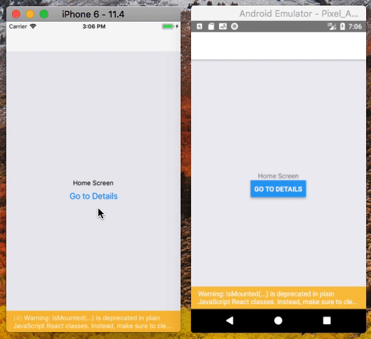

# 在页面间跳转

接着上一节内容引申出的问题：我如何从 `Home` 路由跳转到 `Details` 路由？

对于 Web 浏览器，我们可以这样写：
```html
<a href="details.html">Go to Details</a>
```

或者这样写：
```html
<a onClick={() => { document.location.href = "details.html"; }}>Go to Details</a>
```

在 React Native 中我们将做类似于上述后者的工作，但不是使用全局 `document`，而是使用在使用页面组件中传递的导航属性 (prop)。

## 导航到一个新的页面

```js
import React from 'react';
import { Button, View, Text } from 'react-native';
import { createStackNavigator } from 'react-navigation';

class HomeScreen extends React.Component {
  render() {
    return (
      <View style={{ flex: 1, alignItems: 'center', justifyContent: 'center' }}>
        <Text>Home Screen</Text>
        <Button
          title="Go to Details"
          onPress={() => this.props.navigation.navigate('Details')}
        />
      </View>
    );
  }
}

// ... other code from the previous section
```

运行效果如下：  


先来看两个知识点：
* `this.props.navigation`: 在「堆栈导航器」中，`navigation` 属性会传递到每一个 [页面组件](https://reactnavigation.org/docs/en/glossary-of-terms.html#screen-component) 中，更多信息可参考 [The navigation prop in depth](https://reactnavigation.org/docs/en/navigation-prop.html) 。
* `navigate('Details')`: 在这里我们调用了 `navigation` 属性的 `navigate()` 方法，携带的参数「路由名称」指向的是我们想要跳转到的新页面。

> 如果我们调用 `this.props.navigation.navigate()` 方法时携带的「路由名称」参数在「堆栈导航器」中未定义，则不会发生任何事情。也就是，我们只能导航到我们在「堆栈导航器」中定义好的路由，并不是任意的。

## 多次导航到同一个路由

修改上面 `DetailsScreen` 的代码，如下：
```js
class DetailsScreen extends React.Component {
  render() {
    return (
      <View style={{ flex: 1, alignItems: 'center', justifyContent: 'center' }}>
        <Text>Details Screen</Text>
        <Button
          title="Go to Details... again"
          onPress={() => this.props.navigation.navigate('Details')}
        />
      </View>
    );
  }
}
```

运行这段代码后你会发现，在 `DetailsScreen` 页面点击 ”Go to Details... again” 按钮时并没有响应页面的跳转。`navigate` 方法可以简单的理解为 “导航到这个页面”，如果你当前已经在该页面了则意味着该方法不会做任何事情。

假设我们实际上想要添加另一个 `Details` 页面。

一个很常见情景，你希望将一些独特的数据传递给每个路由。要做到这一点，我们可以将导航改为推送 (push)。这允许我们表达添加另一个路由的意图，而不管现有的导航历史。

```html
<Button
  title="Go to Details... again"
  onPress={() => this.props.navigation.push('Details')}
/>
}
```

每次调用 `push()` 方法时，React Navigation 都会给「导航堆栈器」添加一个新路由。当你调用导航时，它首先尝试查找具有该名称的现有路由，并且只在堆栈中还没有路由时才推送该路由。

## 返回

当当前活跃页面是可以返回到上一个页面时，「堆栈导航器」提供的标题栏会自动包含一个返回按钮 (如果导航堆栈中只有一个屏幕，则无法返回，因此不存在返回按钮)。

有时候你会希望能够以编程方式触发这种行为，为此你可以使用 `this.props.navigation.goBack()`。

```js
class DetailsScreen extends React.Component {
  render() {
    return (
      <View style={{ flex: 1, alignItems: 'center', justifyContent: 'center' }}>
        <Text>Details Screen</Text>
        <Button
          title="Go to Details... again"
          onPress={() => this.props.navigation.push('Details')}
        />
        <Button
          title="Go to Home"
          onPress={() => this.props.navigation.navigate('Home')}
        />
        <Button
          title="Go back"
          onPress={() => this.props.navigation.goBack()}
        />
      </View>
    );
  }
}
```

> 在 Android 平台上，React Navigation 会与硬件后退按钮相关联，并在用户按下时触发 `goBack()` 方法，因此它的行为与用户期望的相同。

另一个常见的需求是能够往前导航多个页面 - 例如，如果你在堆栈中有多个页面，想要将它们全部关闭然后返回到第一个页面。在这种情况下，我们知道我们想回到 `Home` 页面，所以我们可以使用 `navigate('Home')`（不是 `push`！试试看有什么不同）。另一种选择是 `navigation.popToTop()`，它可以返回到堆栈中的第一个页面。

## 总结

* `this.props.navigation.navigate('RouteName')` 将新路由推送到「堆栈导航器」，如果它尚未在堆栈中，则跳至该页面。
* 我们可以多次调用 `this.props.navigation.push('RouteName')`，并且会继续推送路由。
* 标题栏将自动显示返回按钮，但你也可以通过调用 `this.props.navigation.goBack()` 以编程方式返回。在 Android 上，硬件返回按钮会按预期执行。
* 你可以使用 `this.props.navigation.navigate('RouteName')` 返回堆栈中的现有页面，并且可以使用 `this.props.navigation.popToTop()` 返回堆栈中的第一个页面。
* 导航 prop 可用于所有页面组件 (在路由配置中定义为页面的组件以及作为路由的 React Navigation 呈现的组件)。

至此，我们完整的代码如下：
```js
import React from 'react';
import { Button, View, Text } from 'react-native';
import { StackNavigator } from 'react-navigation'; // Version can be specified in package.json

class HomeScreen extends React.Component {
  render() {
    return (
      <View style={{ flex: 1, alignItems: 'center', justifyContent: 'center' }}>
        <Text>Home Screen</Text>
        <Button
          title="Go to Details"
          onPress={() => this.props.navigation.navigate('Details')}
        />
      </View>
    );
  }
}

class DetailsScreen extends React.Component {
  render() {
    return (
      <View style={{ flex: 1, alignItems: 'center', justifyContent: 'center' }}>
        <Text>Details Screen</Text>
        <Button
          title="Go to Details... again"
          onPress={() => this.props.navigation.push('Details')}
        />
        <Button
          title="Go to Home"
          onPress={() => this.props.navigation.navigate('Home')}
        />
        <Button
          title="Go back"
          onPress={() => this.props.navigation.goBack()}
        />
      </View>
    );
  }
}

const RootStack = StackNavigator(
  {
    Home: {
      screen: HomeScreen,
    },
    Details: {
      screen: DetailsScreen,
    },
  },
  {
    initialRouteName: 'Home',
  }
);

export default class App extends React.Component {
  render() {
    return <RootStack />;
  }
}
```
