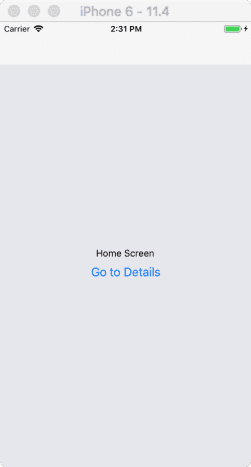

#  React Navigation - 如何向页面传递参数

"如何向页面传递参数" 这个问题可分解成两种情况来分析：
* 如何从一个页面组件传递参数给另一个页面组件？
* 如何从原生向页面组件传递参数？


## 如何从一个页面组件传递参数给另一个页面组件

这种情况下，其传递过程可分为 "发送" 和 "接收" 两个部分：
* 发送：将要传递给另一个页面的参数放到一个对象中，然后将该对象作为 `navigation.navigate` 函数的第二个参数。
  * 比如：`this.props.navigation.navigate('RouteName', { /* params go here */ })`。
* 接收：在需要接收参数的页面组件中，通过 `navigation.getParam(paramName, defaultValue)` 函数来获取对应参数名称的参数值。
  * 比如：`this.props.navigation.getParam('userName', 'zhuanghongji')`。

> 注：官方建议传递的参数是可 JSON 序列化的，这样就可以通过持久化来保证你的页面组件在 Deep Link 中能正常获取到对应值。

示例代码：

```js
class HomeScreen extends React.Component {
  render() {
    return (
      <View style={{ flex: 1, alignItems: 'center', justifyContent: 'center' }}>
        <Text>Home Screen</Text>
        <Button
          title="Go to Details"
          onPress={() => {
            /* 1. Navigate to the Details route with params */
            this.props.navigation.navigate('Details', {
              itemId: 86,
              otherParam: 'anything you want here',
            });
          }}
        />
      </View>
    );
  }
}

class DetailsScreen extends React.Component {
  render() {
    /* 2. Get the param, provide a fallback value if not available */
    const { navigation } = this.props;
    const itemId = navigation.getParam('itemId', 'NO-ID');
    const otherParam = navigation.getParam('otherParam', 'some default value');

    return (
      <View style={{ flex: 1, alignItems: 'center', justifyContent: 'center' }}>
        <Text>Details Screen</Text>
        <Text>itemId: {JSON.stringify(itemId)}</Text>
        <Text>otherParam: {JSON.stringify(otherParam)}</Text>
        <Button
          title="Go to Details... again"
          onPress={() =>
            this.props.navigation.push('Details', {
              itemId: Math.floor(Math.random() * 100),
            })}
        />
        <Button
          title="Go to Home"
          onPress={() => this.props.navigation.navigate('Home')}
        />
        <Button
          title="Go back"
          onPress={() => this.props.navigation.goBack()}
        />
      </View>
    );
  }
}
```

iOS 示例效果图如下 (Android 类似)：  

| HomeScreen | DetailsScreen
| -- | --
|  | 

> 另外，你也可以直接使用 `this.props.navigation.state.params` 来获取 `params` 对象。但是使用前面提到的 `getParam(paramName, defaultValue)` 会显得更容易一些，因为不必对 "当没有提供参数时 `param` 为空" 的问题进行特别处理。


### 如何从原生向页面组件传递参数

这部分内容又可以分为三个子部分来写：
* Android 原生如何发送参数？
* iOS 原生如何发送参数？
* React Native 页面组件如何接收参数？

**Android 原生如何发送参数**

先来看一小段 React Native 框架 Android 部分的源代码：

```java
public class ReactActivityDelegate {
  ...

  protected @Nullable Bundle getLaunchOptions() {
    return null;
  }

  protected void loadApp(String appKey) {
    if (mReactRootView != null) {
      throw new IllegalStateException("Cannot loadApp while app is already running.");
    }
    mReactRootView = createRootView();
    mReactRootView.startReactApplication(
      getReactNativeHost().getReactInstanceManager(),
      appKey,
      getLaunchOptions());
    getPlainActivity().setContentView(mReactRootView);
  }
}
```

可以看到，在 `ReactActivityDelegate` 的 `loadApp()` 方法中会传递一个 `Bundle` 类型的参数作为 LaunchOptions，该 LaunchOptions 就是我们要传递给页面组件的参数。我们需要做的事情是：覆写 `getLaunchOptions()` 方法，并返回自己构造 Bundle 对象。

比如：

```java
class MyReactActivityDelegate extends ReactActivityDelegate {
  ...

  @Nullable
  private Bundle mMyLaunchOptions;

  @Override
  protected @Nullable Bundle getLaunchOptions() {
    return mMyLaunchOptions;
  }

  public void setMyLaunchOptions(@Nullable Bundle bundle) {
    mMyLaunchOptions = bundle;
  }
}


public class MainActivity extends ReactActivity {
  ...

  private MyReactActivityDelegate mMyReactActivityDelegate;

  @Override
  protected void onCreate(@Nullable Bundle savedInstanceState) {
    String userName = getIntent().getStringExtra("userName");
    Bundle bundle = new Bundle();
    bundle.putString("userName", userName);
    mMyReactActivityDelegate.setMyLaunchOptions(bundle);

    String moduleName = getIntent().getStringExtra("moduleName");
    loadApp(moduleName);
  }

  @Override
    protected ReactActivityDelegate createReactActivityDelegate() {
      if (mMyReactActivityDelegate == null) {
        mMyReactActivityDelegate = new MyReactActivityDelegate(this, getMainComponentName());
      }
      return mMyReactActivityDelegate;
    }
}
```

如果你是 Integration with Existing Apps，应该参考下面这段代码：

```java
public class MyReactActivity extends Activity implements DefaultHardwareBackBtnHandler {
  ...

  private ReactRootView mReactRootView;
  private ReactInstanceManager mReactInstanceManager;

  @Override
  protected void onCreate(Bundle savedInstanceState) {
    super.onCreate(savedInstanceState);

    mReactRootView = new ReactRootView(this);
    mReactInstanceManager = ReactInstanceManager.builder()
        .setApplication(getApplication())
        .setCurrentActivity(this)
        .setBundleAssetName("index.android.bundle")
        .setJSMainModulePath("index")
        .addPackage(new MainReactPackage())
        .setUseDeveloperSupport(BuildConfig.DEBUG)
        .setInitialLifecycleState(LifecycleState.RESUMED)
        .build();
    
    //// the same code start
    String userName = getIntent().getStringExtra("userName");
    Bundle bundle = new Bundle();
    bundle.putString("userName", userName);
    mMyReactActivityDelegate.setMyLaunchOptions(bundle);

    String moduleName = getIntent().getStringExtra("moduleName");
    //// the same code end
    
    mReactRootView.startReactApplication(mReactInstanceManager, moduleName, bundle);

    setContentView(mReactRootView);
  }

  @Override
  public void invokeDefaultOnBackPressed() {
      super.onBackPressed();
  }
}
```


**iOS 原生如何发送参数**

这里，我们直接贴出官方文档 Integration with Existing Apps 部分的两段示例代码：

`iOS (Objective-C)`:

```objc
- (IBAction)highScoreButtonPressed:(id)sender {
  NSLog(@"High Score Button Pressed");
  NSURL *jsCodeLocation = [NSURL URLWithString:@"http://localhost:8081/index.bundle?platform=ios"];

  RCTRootView *rootView =
    [[RCTRootView alloc] initWithBundleURL: jsCodeLocation
                                moduleName: @"RNHighScores"
                          initialProperties:
                            @{
                              @"scores" : @[
                                @{
                                  @"name" : @"Alex",
                                  @"value": @"42"
                                },
                                @{
                                  @"name" : @"Joel",
                                  @"value": @"10"
                                }
                              ]
                            }
                              launchOptions: nil];
  UIViewController *vc = [[UIViewController alloc] init];
  vc.view = rootView;
  [self presentViewController:vc animated:YES completion:nil];
}
```

`iOS (Swift)`:

```swift
@IBAction func highScoreButtonTapped(sender : UIButton) {
  NSLog("Hello")
  let jsCodeLocation = URL(string: "http://localhost:8081/index.bundle?platform=ios")
  let mockData:NSDictionary = ["scores":
      [
          ["name":"Alex", "value":"42"],
          ["name":"Joel", "value":"10"]
      ]
  ]

  let rootView = RCTRootView(
      bundleURL: jsCodeLocation,
      moduleName: "RNHighScores",
      initialProperties: mockData as [NSObject : AnyObject],
      launchOptions: nil
  )
  let vc = UIViewController()
  vc.view = rootView
  self.present(vc, animated: true, completion: nil)
}
```

可以看到，不管是 OC 的还是 Swift 的代码片段，里面都有一个类型为 `NSDictionary` 的 `initialProperties` 参数，类似 Android 中的 Bundle，该 NSDictionary 参数就是传递给页面组件的参数。

> 注：`NSDictionary`：类似 Java 或 ES6 中的 `Map`。

**React Native 页面组件如何接收参数**

直接上示例代码：

```js
...

const RootStack = StackNavigator(
  {
    Home: HomeScreen,
  },
  {
    initialRouteName: 'Home',
  }
);

export default class App extends React.Component {
  render() {
    // 注意这里有个 screenProps 哈（可以理解为中转站）
    return <RootStack screenProps={this.props}/>;
  }
}


class HomeScreen extends React.Component {
  componentDidMount() {
    // 获取 screenProps
    const screenProps = this.props.navigation.getScreenProps()
    if (screenProps) {
      const userName = screenProps['userName']
      console.log(`userName = ${userName}`)
    } else {
      console.log(`there is no params from native.`)
    }
  }
}
```

运行上述代码后，控制台中会打印出 `userName` 的值，比如打印出 `userName = zhuanghongji`。 :sunglasses:


## 总结

在这篇文章中我们先是介绍了如何在 RN 页面组件间传递参数，然后介绍了如何从原生传递参数给 RN 页面组件。后者相对到 Native 的逻辑，所以相对会难理解一点。
