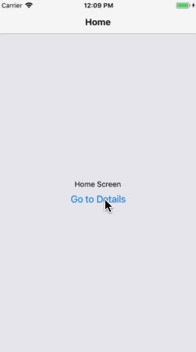
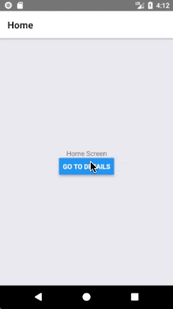
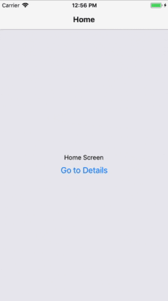
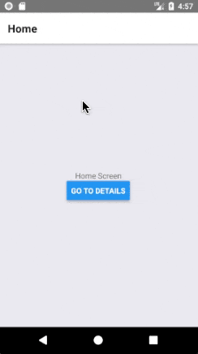
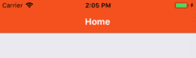
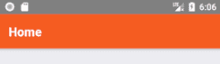
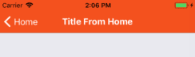
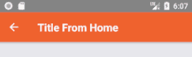

# 配置标题栏

到目前为止，你可能已经厌倦了在你的屏幕上看到一个空白的灰色条。在前面我们了解了一些基础知识，现在就开始学习如何配置标题栏。


## 设置标题

一个屏幕组件可以有一个名为 `navigationOptions` 的静态属性，它要么是一个对象，要么是一个会返回「包含各种配置选项的对象」的函数。下面的示例，演示了如何使用标题栏中的 `title` 配置选项：

```js
class HomeScreen extends React.Component {
  static navigationOptions = {
    title: 'Home',
  };

  /* render function, etc */
}

class DetailsScreen extends React.Component {
  static navigationOptions = {
    title: 'Details',
  };

  /* render function, etc */
}
```


运行效果如下：

| iOS | android
| -- | --
|  | 

完整代码如下：

```js
import React, {Component} from 'react';
import { StackNavigator } from 'react-navigation'
import {
  View,
  Text,
  Button,
} from 'react-native'

class HomeScreen extends Component {
  static navigationOptions = {
    title: 'Home'
  }

  render() {
    return (
      <View style={{ flex: 1, alignItems: 'center', justifyContent: 'center' }}>
        <Text>Home Screen</Text>
        <Button
          title="Go to Details"
          onPress={() => this.props.navigation.navigate('Details')}
        />
      </View>
    )
  }
}

class DetailsScreen extends Component {
  static navigationOptions = {
    title: 'Details'
  }

  render() {
    return (
      <View style={{ flex: 1, alignItems: 'center', justifyContent: 'center' }}>
        <Text>Details Screen</Text>
      </View>
    )
  }
}

const RootStatck = StackNavigator(
  {
    Home: {
      screen: HomeScreen,
    },
    Details: {
      screen: DetailsScreen,
    }
  },
  {
    initialRouteName: 'Home'
  }
)

export default class App extends Component {
  render() {
    return <RootStatck />
  }
}
```

> `createStackNavigator` 默认使用平台的约定设计，所以在 iOS 中标题居中，而在 Android 中标题居中。

## 在标题中使用参数

为了在标题栏中使用配置参数，我们需要使得 `navigationOptions` 作为一个方法以返回一个配置对象。

在 `navigationOptions` 里面使用 `this.props` 可能看起来很诱人，但因为 `navigationOptions` 是组件的静态属性，而且 `this` 并不指向组件的实例，所以是没有可用的属性的。

反而，如果我们将 `navigationOptions` 作为一个方法然后 React Navigation 会调用它并传入一个 `{ navigation, navigationOptions, screenProps }` 参数对象。在这种情况下，我们只需要关心 `navigation`，它等同于传入页面参数的 `this.props.navigation`。当你重新调用时我们可以通过 `navigation.getParam` 或 `navigation.state.params` 获得来自 `navigation` 的参数。

下面我们将提取一个参数并将其用作标题：

```js
class DetailsScreen extends React.Component {
  static navigationOptions = ({ navigation }) => {
    return {
      title: navigation.getParam('otherParam', 'A Nested Details Screen'),
    };
  };

  /* render function, etc */
}
```

```js
// 修改 HomeScreen 跳转按钮点击事件方法
<Button
  title="Go to Details"
  onPress={() => this.props.navigation.navigate('Details', {
    otherParam: 'Title From Home'
  })}
/>
```

修改后运行代码：

运行效果如下：

| iOS | android
| -- | --
|  | 

要提以下的是，如果 `HomeScreen` 在导航到 `DetailsScreen` 时：

* 有传入 `otherParam` 参数，那么 `DetailsScreen` 的标题为传入的参数值。
* 没有传入 `otherParam` 参数，那么 `DetailsScreen` 的标题为默认值 `A Nested Details Screen`。

另外，传入 `navigationOptions` 的参数对象有着以下属性：

* `navigation`: 页面的 [navigation prop](https://reactnavigation.org/docs/en/navigation-prop.html)，带有 `navigation.state` 下的页面路由。
* `screenProps`: 导航器组件传过来的属性。
* `navigationOptions`: 如果没有新值提供的话，会被使用的默认选项。

在上面的示例中，我们只使用了 `navigation` 属性，但可能在某些场景下你需要用到 `screenProps` 或 `navigationOptions`。


## 通过 `setParams` 更新 `navigationOptions`

在日常开发中，我们经常需要在当前已加载的页面更新对应的 `navigationOptions` 配置，我们可以通过 `this.props.navigation.setParams` 来实现。

```js
/* Inside of render() */
<Button
  title="Update the title"
  onPress={() => this.props.navigation.setParams({otherParam: 'Updated!'})}
/>
```

假设是在 `DetailsScreen` 页面中增加上述代码，当你点击 “Update the title” 按钮时，那么标题栏中的标题会改为 `Updated!`。


## 调整标题栏样式

当我们需要自定义标题栏的样式时，我们可以使用以下三个关键属性：

* `headerStyle`: 一个应用于包含标题栏的 `View` 的样式对象。如果你对其设置 `backgroundColor`，那相当于设置你标题栏的背景色。
* `headerTintColor`：返回按钮和标题文字的颜色。在下面的示例中，我们将 tint Color 设置成了白色，所以返回按钮和标题显示出来的是白色的。
* `headerTitleStyle`：如果我们想自定义 `fontFamily`, `fontWeight` 和其它的 `Text` 样式属性，我们可以通过这个关键属性做到。

```js
class HomeScreen extends React.Component {
  static navigationOptions = {
    title: 'Home',
    headerStyle: {
      backgroundColor: '#f4511e',
    },
    headerTintColor: '#fff',
    headerTitleStyle: {
      fontWeight: 'bold',
    },
  };

  /* render function, etc */
}

class DetailsScreen extends Component {
  static navigationOptions = ({ navigation }) => {
    return {
      title: navigation.getParam('otherParam', 'A Nested Details Screen'),
      headerStyle: {
        backgroundColor: '#f4511e'
      },
      headerTintColor: '#fff',
      headerTitleStyle: {
        fontWeight: 'bold',
      }
    }
  }；

  /* render function, etc */
}
```

运行效果如下：

| iOS | Android
| -- | --
|  | 
|  | 

有两个需要注意的点：

1. 在 iOS 中，标题栏的文字和图标是黑色的，在深色背景下看起来不太好。在这里我们不讨论这个，但你的配置应该确保标题栏和页面颜色看起来的协调的，具体可参考 [the status bar guide](https://reactnavigation.org/docs/en/status-bar.html)。
2. 如果你只配置了 Home 页面的标题栏样式，那么 Detals 页面的标题栏样式还是跟之前一样是黑色的，你可以再针对 Details 页面设置一次样式，也可以参考后面的内容学习如何跨页面共享通用的 `navigationOptions`。


## 跨页面共享通用的 `navigationOptions`

通常情况下，我们想配置多个页面的样式是一样的。比如说，你公司的主打色是红色，说你希望将标题栏背景色设置为红色已经 tint color 设置为白色。这时我们必须要在每个页面复制样式代码？当然不是，我们可以将样式设置转移到堆栈导航器中 (stack navigator)。

```js
class HomeScreen extends React.Component {
  static navigationOptions = {
    title: 'Home',
    /* No more header config here! */
  };

  /* render function, etc */
}

/* other code... */

const RootStack = createStackNavigator(
  {
    Home: HomeScreen,
    Details: DetailsScreen,
  },
  {
    initialRouteName: 'Home',
    /* The header config from HomeScreen is now here */
    navigationOptions: {
      headerStyle: {
        backgroundColor: 'red',
      },
      headerTintColor: '#fff',
      headerTitleStyle: {
        fontWeight: 'bold',
      },
    },
  }
);
```

再次运行代码，你就会发现 Home 和 Details 页面的标题栏背景色变成红色，返回按钮和标题都是白色了。当前，前提是你得把之前页面内的标题栏样式配置的代码移除掉，因为呀，有一个概念叫做「覆写」。


## 覆写共享的 `navigationOptions`

页面组件的 `navigationOptions` 属性 (优先级更高) 会和堆栈导航器中的 `navigationOptions` 属性进行合并，然后再应用于标题栏上。接下来，我们可以通过这个知识点来改变 Details 页面的标题栏样式：

```js
class DetailsScreen extends React.Component {
  static navigationOptions = ({ navigation, navigationOptions }) => {
    const { params } = navigation.state;

    return {
      title: params ? params.otherParam : 'A Nested Details Screen',
      /* These values are used instead of the shared configuration! */
      headerStyle: {
        backgroundColor: navigationOptions.headerTintColor,
      },
      headerTintColor: navigationOptions.headerStyle.backgroundColor,
    };
  };

  /* render function, etc */
}
```


## 用自定义组件替换标题

有时你需要更多的控制而不仅仅是修改标题内容或样式。比如说，你想在标题位置绘制一张图片，或将标题变成按钮。在这些场景下，你需要提供你自己的样式以完全覆写组件提供给标题的样式。

```js
class LogoTitle extends React.Component {
  render() {
    return (
      <Image
        source={require('./spiro.png')}
        style={{ width: 30, height: 30 }}
      />
    );
  }
}

class HomeScreen extends React.Component {
  static navigationOptions = {
    // headerTitle instead of title
    headerTitle: <LogoTitle />,
  };

  /* render function, etc */
}
```

> 你可能想知道，为什么 `headerTitle` 会作为提供组件 (上面示例中是 `LogoTitle`) 属性而不是 `title` ？因为呀，`headerTitle` 是特定于堆栈导航器的属性，而这个属性的默认值是显示 `title` 的组件 `Text`。


## 其它配置

你可以在 [createStackNavigator reference](https://reactnavigation.org/docs/en/stack-navigator.html#navigationoptions-used-by-stacknavigator) 部分了解所有在堆栈导航器中可用的 `navigationoptions`。


## 总结

* 你可以在页面组件中通过内置的 `navigationOptions` 自定义标题栏，完整选项参数见 [the API reference](https://reactnavigation.org/docs/en/stack-navigator.html#navigationoptions-used-by-stacknavigator)。
* 静态属性 `navigationOptions` 可以作为一个对象或函数。当作为函数时，可提供一个带有 `navigation`、`screenProps` 和 `navigationOptions` 属性的的对象。
* 你也可以在初始化堆栈导航器时，定义共享的 `navigationOptions` 配置。页面内部的优先级更高。
* 上面的示例代码是我自己写的，你也可以阅读官方示例的 [完整代码](https://snack.expo.io/@react-navigation/custom-header-title-component-v2)。
