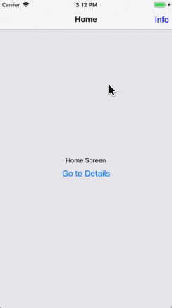
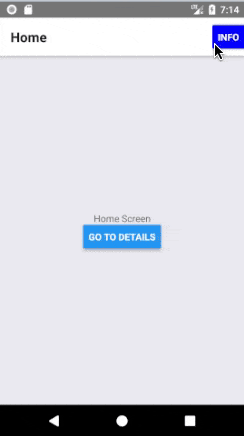
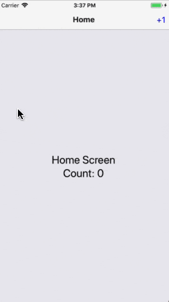
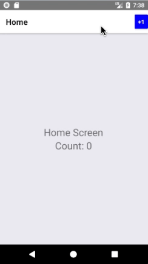

# 标题栏按钮

现在我们已经知道了如何定义标题栏的外观，那我们是如何让标题栏能够以非常明确地方式响应我们的触摸呢？


## 添加一个按钮到标题栏中

一个与标题栏进行交互的常见方式是点击标题栏左边或右边的按钮，下面演示一下如何在标题栏右边添加一个按钮：

```js
class HomeScreen extends Component {
  static navigationOptions = {
    title: 'Home',
    headerRight: (
      <Button
        title="Info"
        color="#00f"
        onPress={() => alert('This is a button!')}
      />
    )
  }

  // render code
}
```

运行效果如下：

| iOS | Android
| -- | --
|  | 

在 `navigationOptions` 中的 `this` 绑定的并不是 `HomeScreen` 实例，所以你不可以调用 `setState` 或任意的实例方法。这一点是非常重要的，因为希望标题栏中的按钮与标题栏所属的页面进行交互是非常常见的。所以，接下来我们看下怎样才能做到。

> 请注意，可以使用社区开发的库来呈现标题栏中具有正确表现的按钮：[react-navigation-header-buttons](https://github.com/vonovak/react-navigation-header-buttons)。


## 标题栏与页面组件间的交互

给标题栏按钮提供访问页面组件实例的函数，最常用的模式是使用 `params`。下面通过一个「计数器」的实例来演示下：

```js
class HomeScreen extends Component {
  static navigationOptions = ({ navigation }) => {
    return {
      title: 'Home',
      headerRight: (
        <Button
          title="+1"
          color="#00f"
          onPress={navigation.getParam('increaseCount')}
        />
      )
    }
  }

  state = {
    count: 0,
  }

  componentDidMount() {
    this.props.navigation.setParams({
      increaseCount: this._increaseCount
    })
  }

  _increaseCount = () => {
    this.setState({ count: this.state.count + 1 })
  }

  render() {
    return (
      <View style={{ flex: 1, alignItems: 'center', justifyContent: 'center' }}>
        <Text style={{ fontSize: 24 }}>Home Screen</Text>
        <Text style={{ fontSize: 24 }}>Count: {this.state.count}</Text>
      </View>
    )
  }
}
```

运行效果如下：

| iOS | Android
| -- | --
|  | 

> React Navigation 并不能保证的页面组件会在标题栏之前挂载。因为 `increaseCount` 是在 `componentDidMount` 中设置的，所以在 `navigationOptions` 中我们可能无法使用它。通常情况下这不是问题，因为如果回调为空，`Button` 和 `Touchable` 组件的 `onPress` 不会做任何事情。
>
> 如果你在这里有自己的自定义组件，你应该确保为 null 时 press 处理逻辑与预期一样。

> `setParams` 是可选的，你也可以使用类似 Redux 或 MobX 的 state 管理库，标题栏和页面之间的通信，就像处理两个不同的组件一样。


## 自定义返回按钮

`createStatckNavigation` 提供了一个特定于平台的默认返回按钮。在 iOS 中是一个带有文本的按钮，文本在有限的空间内显示了上个页面的标题，否则显示类似 "Back" 的字样。

你可以通过 `headerBackTitle` 和 `headerTruncatedTitle` 修改文本的行为，[点击查看更多内容](https://reactnavigation.org/docs/en/stack-navigator.html#headerbacktitle)。

如果想自定义返回按钮的图标，可使用 [headerBackImage](https://reactnavigation.org/docs/en/stack-navigator.html#headerbackimage)。


## 覆写返回按钮

当用户可以从当前页面返回时，返回按钮将在标题栏中自动显示。换句话说，返回按钮将在堆栈中有多个屏幕时呈现。

一般来说，这是符合你预期的。但是在某些情况下，你可能比通过上面提到的选项更想自定义返回按钮。在这种情况下，你可以将 `headerLeft` 选项设置为将显示的 React Element，就像我们对 `headerRight` 所做的那样。或者，`headerLeft` 选项也接受一个 React 组件。例如，它可以用来覆盖 back 按钮的 onPress 行为。更多内容可参考 [api reference](https://reactnavigation.org/docs/en/stack-navigator.html#headerleft)。


## 总结

* 你可以通过 `navigationOptions` 中的 `headerLeft` 和 `headerRight` 属性来设置标题栏中的按钮。
* 左上角的返回按钮是可完全自定义的，但如果你仅仅是想修改文本内容或图标，可以使用 `navigationOptions` 另外提供的 `headerBackTitle`、`headerTruncatedTitle` 或 `headerBackImage` 属性。
* [官方示例的完整代码](https://snack.expo.io/@react-navigation/header-interacting-with-component-instance)。
