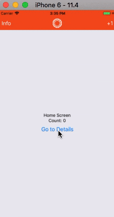
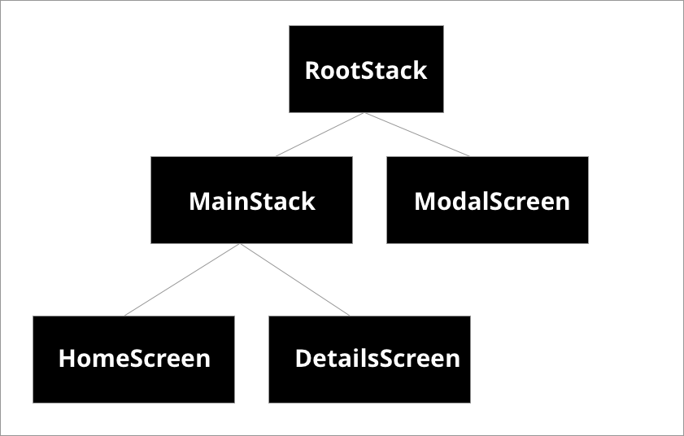

# 打开一个全屏模态

模态 (modal)，什么是模态？

> A modal displays content that temporarily blocks interactions with the main view.
>
> 模态显示的内容暂时阻止了与主视图的交互。

一个模态就像是一个弹出窗口，它并不是主要导航流程的一部分。它通常有着不一样的过渡，并且旨在专注于一个特定的内容或交互。

将此作为 React Navigation 基础的一部分进行讲解，目的不仅是因为这是一个常见的场景，而且是因为实现需要「嵌套导航器」的知识。

「嵌套导航器」是 React Navigation 的重要部分。

## 创建模态堆栈

```js
class HomeScreen extends React.Component {
  static navigationOptions = ({ navigation }) => {
    const params = navigation.state.params || {};

    return {
      headerLeft: (
        <Button
          onPress={() => navigation.navigate('MyModal')}
          title="Info"
          color="#fff"
        />
      ),
      /* the rest of this config is unchanged */
    };
  };

  /* render function, etc */
}

class ModalScreen extends React.Component {
  render() {
    return (
      <View style={{ flex: 1, alignItems: 'center', justifyContent: 'center' }}>
        <Text style={{ fontSize: 30 }}>This is a modal!</Text>
        <Button
          onPress={() => this.props.navigation.goBack()}
          title="Dismiss"
        />
      </View>
    );
  }
}

const MainStack = createStackNavigator(
  {
    Home: {
      screen: HomeScreen,
    },
    Details: {
      screen: DetailsScreen,
    },
  },
  {
    /* Same configuration as before */
  }
);

const RootStack = createStackNavigator(
  {
    Main: {
      screen: MainStack,
    },
    MyModal: {
      screen: ModalScreen,
    },
  },
  {
    mode: 'modal',
    headerMode: 'none',
  }
);
```

完整示例代码 [点击查看](https://snack.expo.io/@react-navigation/full-screen-modal)，运行效果如下：



有几点内容需要注意下：

* **`createStackNavigator` 函数返回一个 React 组件，这个组件可以用作页面组件。**
  * 即一个 Stack Navigator 嵌套在另一个 Stack Navigator 中。
  * 通过这个特性我们可以让 Tab Navigator 的每个 Tab 都拥有自己的 Stack Navigator。


* **Stack Navigator 的 `mode` 配置可以是 `card` (默认值) 或 `modal`。**
  * 在 iOS 上，`modal` 表现为从页面底部划入，并允许用户从页面顶部向下划出以关闭它。
  * 而在 Android 上，`modal` 配置对 Android 没有影响。


* **调用 `navigate` 方法时，我们不需要指定除目标路由之外的任何东西。**
  * React Navigation 会尝试在最近的导航器上查找路由并进行导航，所以没有必要限定该路由属于哪个堆栈。


看个示意图然后思考一个问题：



当前页面是 `HomeScreen`，我们是通过 `navigate('MyModal')` 导航到 `ModalScreen` 这个过程是怎样的？

答：首先，React Navigation 会找到 `HomeScreen` 所在的堆栈 ( `MainStack`)，然后看看它能不能处理 `MyModal`，不能处理的的话，再找到上一层堆栈 (`RootStack`)。根据上面的示意图明显看出 `RootStack` 是能够处理 `MyModal` 的，然后就将页面跳转到了 `ModalScreen` 了。


## 摘要

* 通过 `mode` 配置项我们可以修改 stack navigator 上页面的过渡 (transition) 类型。
  * 当设置为 `modal` 时，所有页面的加载方式为从下到上滑入，而不是从右到左。
  * 这适用于整个 stack navigator，因此如果要在其它页面上使用从右到左的过渡时，我们需要添加另一个导航堆栈并且使用默认配置。


* `this.props.navigation.navigate` 会遍历导航树以查找到可以处理 `navigate` 操作的导航树。

本文代码:

```js
import React from 'react';
import { Button, Image, View, Text } from 'react-native';
import { StackNavigator } from 'react-navigation'; // Version can be specified in package.json

class LogoTitle extends React.Component {
  render() {
    return (
      <Image
        source={require('./spiro.png')}
        style={{ width: 30, height: 30 }}
      />
    );
  }
}

class HomeScreen extends React.Component {
  static navigationOptions = ({ navigation }) => {
    const params = navigation.state.params || {};

    return {
      headerTitle: <LogoTitle />,
      headerLeft: (
        <Button
          onPress={() => navigation.navigate('MyModal')}
          title="Info"
          color="#fff"
        />
      ),
      headerRight: (
        <Button onPress={params.increaseCount} title="+1" color="#fff" />
      ),
    };
  };

  componentWillMount() {
    this.props.navigation.setParams({ increaseCount: this._increaseCount });
  }

  state = {
    count: 0,
  };

  _increaseCount = () => {
    this.setState({ count: this.state.count + 1 });
  };

  render() {
    return (
      <View style={{ flex: 1, alignItems: 'center', justifyContent: 'center' }}>
        <Text>Home Screen</Text>
        <Text>Count: {this.state.count}</Text>
        <Button
          title="Go to Details"
          onPress={() => {
            /* 1. Navigate to the Details route with params */
            this.props.navigation.navigate('Details', {
              itemId: 86,
              otherParam: 'First Details',
            });
          }}
        />
      </View>
    );
  }
}

class DetailsScreen extends React.Component {
  static navigationOptions = ({ navigation, navigationOptions }) => {
    const { params } = navigation.state;

    return {
      title: params ? params.otherParam : 'A Nested Details Screen',
      /* These values are used instead of the shared configuration! */
      headerStyle: {
        backgroundColor: navigationOptions.headerTintColor,
      },
      headerTintColor: navigationOptions.headerStyle.backgroundColor,
    };
  };

  render() {
    /* 2. Read the params from the navigation state */
    const { params } = this.props.navigation.state;
    const itemId = params ? params.itemId : null;
    const otherParam = params ? params.otherParam : null;

    return (
      <View style={{ flex: 1, alignItems: 'center', justifyContent: 'center' }}>
        <Text>Details Screen</Text>
        <Text>itemId: {JSON.stringify(itemId)}</Text>
        <Text>otherParam: {JSON.stringify(otherParam)}</Text>
        <Button
          title="Update the title"
          onPress={() =>
            this.props.navigation.setParams({ otherParam: 'Updated!' })}
        />
        <Button
          title="Go to Details... again"
          onPress={() => this.props.navigation.navigate('Details')}
        />
        <Button
          title="Go back"
          onPress={() => this.props.navigation.goBack()}
        />
      </View>
    );
  }
}

class ModalScreen extends React.Component {
  render() {
    return (
      <View style={{ flex: 1, alignItems: 'center', justifyContent: 'center' }}>
        <Text style={{ fontSize: 30 }}>This is a modal!</Text>
        <Button
          onPress={() => this.props.navigation.goBack()}
          title="Dismiss"
        />
      </View>
    );
  }
}

const MainStack = StackNavigator(
  {
    Home: {
      screen: HomeScreen,
    },
    Details: {
      screen: DetailsScreen,
    },
  },
  {
    initialRouteName: 'Home',
    navigationOptions: {
      headerStyle: {
        backgroundColor: '#f4511e',
      },
      headerTintColor: '#fff',
      headerTitleStyle: {
        fontWeight: 'bold',
      },
    },
  }
);

const RootStack = StackNavigator(
  {
    Main: {
      screen: MainStack,
    },
    MyModal: {
      screen: ModalScreen,
    },
  },
  {
    mode: 'modal',
    headerMode: 'none',
  }
);

export default class App extends React.Component {
  render() {
    return <RootStack />;
  }
}
```


#
