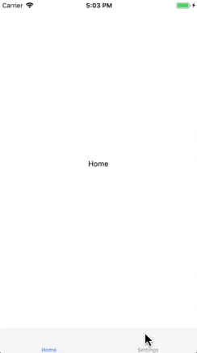
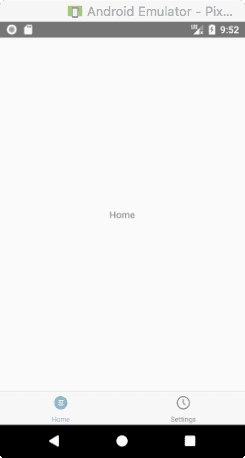

# Tab 导航

基于 Tab 的导航可能是移动应用中最常见的导航方式，用于导航的标签栏 (tabs) 可以放在页面底部，也可以放在标题栏下面 (或者是直接替代标题栏)。

这篇内容包含了 [createBottomTabNavigator](https://reactnavigation.org/docs/en/bottom-tab-navigator.html)。你可能也会使用 [createMaterialBottomTabNavigator](https://reactnavigation.org/docs/en/material-bottom-tab-navigator.html) 和 [createMaterialTopTabNavigator](https://reactnavigation.org/docs/en/material-top-tab-navigator.html) 来为你应用程序添加标签栏。


## 基于 Tab 导航的最简单例子

```js
import React, { Component } from 'react';
import { TabNavigator } from 'react-navigation'
import {
  View,
  Text,
} from 'react-native'

class HomeScreen extends Component {
  render() {
    return (
      <View style={{ flex: 1, alignItems: 'center', justifyContent: 'center' }}>
        <Text>Home</Text>
      </View>
    )
  }
}

class SettingsScreen extends Component {
  render() {
    return (
      <View style={{ flex: 1, alignItems: 'center', justifyContent: 'center' }}>
        <Text>Setting!</Text>
      </View>
    )
  }
}

const TabStack = TabNavigator({
  Home: { screen: HomeScreen },
  Settings: { screen: SettingsScreen },
})

export default class App extends Component {
  render() {
    return <TabStack />
  }
}
```

运行效果如下：

| iOS | Android
| -- | --
|  | 


## 自定义外观

这有点类似自定义堆栈导航器：

* 在初始化 Tab 导航器的时候设置了一些属性。
* 而在 `navigationOptions` 中可以对每个屏幕进行自定义。

先准备好四张图片并放在新建的 assets 目录下：

| home_selected.png | home_normal.png | settings_selected.png | settings_normal.png
| -- | -- | -- | -- |
|  |  |  | 

```js
// import code
import { TabNavigator, TabBarBottom,  } from 'react-navigation'

class HomeScreen extends Component {
  // render code
}

class SettingsScreen extends Component {
  // render code
}

const TabStack = TabNavigator(
  {
    Home: { screen: HomeScreen },
    Settings: { screen: SettingsScreen },
  },
  {
    navigationOptions: ({ navigation }) => ({
      tabBarIcon: ({ focused, tintColor }) => {
        const { routeName } = navigation.state;
        let icon;
        if (routeName === 'Home') {
          icon = focused ? require('./assets/home_selected.png') : require('./assets/home_normal.png');
        } else if (routeName === 'Settings') {
          icon = focused ? require('./assets/settings_selected.png') : require('./assets/settings_normal.png');
        } else {
          icon = focused ? require('./assets/settings_selected.png') : require('./assets/settings_normal.png');
        }
        return <Image style={{ width: 26, height: 26 }} source={icon} />
      },
    }),
    tabBarComponent: TabBarBottom,
    tabBarPosition: 'bottom',
    tabBarOptions: {
      activeTintColor: 'tomato',
      inactiveTintColor: 'gray',
    },
    animationEnabled: false,
    swipeEnabled: false,
  }
)

export default class App extends Component {
  render() {
    return <TabStack />
  }
}
```

运行效果如下：

| iOS | Android
| -- | --
|  | 

我们来仔细研究一下这个：

* `tabBarIcon` 是 `navigationOptions` 的一个属性，所以我们知道可以用在页面组件上，但在上述示例中我们选择将其放在 `TabNavigator` 配置中，以便集中图标配置。
* `tabBarIcon` 是一个带有 `focused` 和 `tintColor` 的函数。如果你深入查看了配置信息，你会看到 `tabBarOptions`、`activeTintColor` 和 `inactiveTintColor`。


## 在 tabs 之间跳转

从一个 tab 切换到另一个 tab 有一个熟悉的 API：

```js
this.props.navigation.navigate
```

```js
import { Button, Text, View } from 'react-native';

class HomeScreen extends React.Component {
  render() {
    return (
      <View style={{ flex: 1, justifyContent: 'center', alignItems: 'center' }}>
        <Text>Home!</Text>
        <Button
          title="Go to Settings"
          onPress={() => this.props.navigation.navigate('Settings')}
        />
      </View>
    );
  }
}

class SettingsScreen extends React.Component {
  render() {
    return (
      <View style={{ flex: 1, justifyContent: 'center', alignItems: 'center' }}>
        <Text>Settings!</Text>
        <Button
          title="Go to Home"
          onPress={() => this.props.navigation.navigate('Home')}
        />
      </View>
    );
  }
}
```

运行效果如下：

| iOS | Android
| -- | --
|  | 


## 为什么我们需要一个 TabNavigator 而不是 TabBarIOS 或其他组件?

通常情况下，我们尝试使用独立的标签栏组件，而不将其集成到应用程序使用的导航库中。但是，应该提醒你，这样做可能会遇到一些令人沮丧的意外问题。

例如，React Navigation 的 `TabNavigator` 负责为你处理 Android 的 back 按钮，而独立组件通常不负责。此外，如果你需要为它调用两个不同的 api，你 (作为开发人员) 要执行诸如 “跳转到这个选项卡，然后转到这个页面” 之类的操作就更困难了。最后，移动用户界面要求某些组件的布局有很多小型的设计细节或存在其它组件。例如，如果你有一个半透明的标签栏，内容应该在下面滚动，滚动视图应该有插图等于底部标签栏的高度，这样你就可以看到所有的内容。双击选项卡条将使活动导航堆栈弹出到堆栈顶部，再次操作将使该堆栈中的活动滚动视图滚动到顶部。虽然并不是所有这些行为都是通过 React 导航来实现的，但如果使用独立的选项卡视图组件，这些行为就不会实现。
