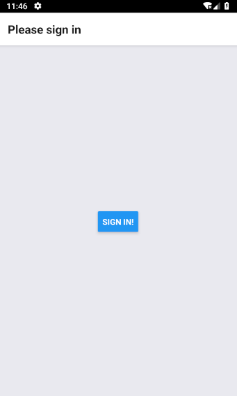
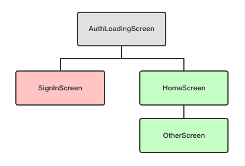

# 身份验证流程

大多数应用程序都要求用户通过某种方式进行身份验证才能访问与用户或其它私人内容相关的数据。

通常情况下，流程是酱紫的：

1. 用户打开应用。
2. 应用从持久存储中加载某个身份验证状态 (如是否已登录)。
3. 当状态加载时，根据加载的验证状态是否有效，来向用户呈现认证页面或主页面。
4. 当用户注销时，我们清楚认证状态并跳转到认证页面。

下面我们会实现一个这样的应用程序，先来看下页面截图：

| AuthLoadingScreen | SignInScreen | HomeScreen | OtherScreen
| -- | -- | -- | --
|  |  |  | 

堆栈树如下：



下面我们再一步步分析这个应用程序是如何实现的。

## 设置导航

```js
import { StackNavigator, SwitchNavigator } from 'react-navigation';

// Implementation of HomeScreen, OtherScreen, SignInScreen, AuthLoadingScreen
// goes here.

const AppStack = StackNavigator({ Home: HomeScreen, Other: OtherScreen });
const AuthStack = StackNavigator({ SignIn: SignInScreen });

export default SwitchNavigator(
  {
    AuthLoading: AuthLoadingScreen,
    App: AppStack,
    Auth: AuthStack,
  },
  {
    initialRouteName: 'AuthLoading',
  }
);
```

上面用 `SwitchNavigator` 构建了页面导航器，


###
