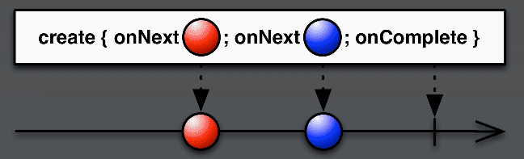

# RxJava 基础知识：开始 

## 概述

**RxJava 是什么？**

> Reactive Extensions for the JVM   
>
> a library for composing asynchronous and event-based programs using observable sequences for the Java VM.

RxJava 是 Reactive Extensions 的 Java 实现，是一个在 JVM 上使用可观测的序列来组成异步的、基于事件的程序的库。

**它有什么优点？**

* 简洁，随着程序逻辑变得复杂后依旧简洁**。
* RxJava 中的操作符可以让你使用声明的方式来组合程序中的「数据」和「事件」序列，而无需关注底层的实现（如线程、同步、并发等）。

> 操作符有：filter (过滤)、select (选择)、transform (变换)、combine (结合)、compose (组合)...


**可用来做什么？**

服务器不太熟悉，Android 相关的列举下：

* 替换 Android 中的 [AsyncTask](https://developer.android.com/reference/android/os/AsyncTask)，轻松执行异步任务.
* 通过 RxJava 相关库 [RxAndroid](https://github.com/ReactiveX/RxAndroid) 及其扩展   [RxBinding](https://github.com/JakeWharton/RxBinding) - [RxLifecycle](https://github.com/trello/RxLifecycle) - [RxPermissions](https://github.com/tbruyelle/RxPermissions) 来简化代码。

前面对 RxJava 进行了简单的介绍，下面我们来写一个 Hello World 示例并介绍如何使用。

## Hello World 示例

在你的项目中添加 RxJava2 相关依赖：

```groovy
implementation "io.reactivex.rxjava2:rxjava:2.x.y"
```

(请使用最新版本相关数字替换 `x` and `y` : [](https://maven-badges.herokuapp.com/maven-central/io.reactivex.rxjava2/rxjava)
)

### 示例代码

```java
package com.zhuanghongji.rxjava;

import io.reactivex.Observable;
import io.reactivex.ObservableEmitter;
import io.reactivex.ObservableOnSubscribe;
import io.reactivex.functions.Consumer;

public class Test {

    public static void main(String[] args) {
        Observable.create(new ObservableOnSubscribe<String>() {
            @Override
            public void subscribe(ObservableEmitter<String> emitter) throws Exception {
                emitter.onNext("Hello World");
            }
        }).subscribe(new Consumer<String>() {
            @Override
            public void accept(String s) throws Exception {
                System.out.println(s);
            }
        });
    }
}

// 打印结果：Hello World
```

通过 Java 8 的 `Lambda` 和 `方法引用` 简化代码：  

```Java
Observable.create(emitter -> emitter.onNext("Hello World"))
                .subscribe(System.out::println);
```

还能继续简化点？能，使用 `just` 操作符替代 `create`：

```Java
Observable.just("Hello World").subscribe(System.out::println);
```


### 示例分析

通过上面的 Hello World 实例代码可以看出 RxJava 的基本使用主要分为三个步骤：

**1. 创建 Observable (被观察者)**

`Observable` 决定发射数据的类型，以及什么时候发射数据，发射多少数据等。

```java
Observable observable = Observable.create(new ObservableOnSubscribe<String>() {
    @Override
    public void subscribe(ObservableEmitter<String> emitter) throws Exception {
        System.out.println("observable subscribe()");
        emitter.onNext("Hello");
        emitter.onNext("My");
        emitter.onNext("Friend");
        emitter.onComplete();
        //emitter.onError(new RuntimeException("There is something wrong."));
    }
});
```

在上述代码中，我们通过 `create` 操作符创建了一个`Observable` 实例。  
在该实例被订阅之后会陆续发射出 `Hello` `My` `Friend` 字符串数据，然后发射一个 `ononComplete` 通知所有数据发射完毕。


**2. 创建 Observer (观察者)**

`Observer` 用于接收 `Observable` 发射的数据和相关通知 (如发射出错、发射完毕)，也可通过 `onSubscribe()` 方法的 `Disposable` 参数实例来取消数据的发射。

```Java
Observer observer = new Observer<String>() {
    @Override
    public void onSubscribe(Disposable d) {
        System.out.println("observer onSubscribe()");
    }

    @Override
    public void onNext(String s) {
        System.out.println("observer onNext(), " + s);
    }

    @Override
    public void onError(Throwable e) {
        System.out.println("observer onError()");
    }

    @Override
    public void onComplete() {
        System.out.println("observer onComplete()");
    }
};
```

在上述代码中，我们在各个回调方法中打印出相关信息。


**3. 通过 `subscribe()` 方法建立 Observable 和 Observer 的订阅关系**

创建了 `Observable` 和 `Observer` 之后，我们需要通过 `subscribe()` 方法为这两者建立订阅关系。然后 `Observable` 开始发射数据或通知到 `Observer`，`Observer` 接受到数据或通知之后会回调对应的方法：

```Java
observable.subscribe(observer);
```

建立订阅关系后，打印日志如下：

```java
observer onSubscribe()
observable subscribe()
observer onNext(), Hello
observer onNext(), My
observer onNext(), Friend
observer onComplete()
```

看到这里有点懵？我们再来理解下上述 3 个代码片段：  

* `Observable` 多次调用 `ObservableEmitter` 发射器的 `onNext()` 方法发射数据，然后调用 `onComplete()` 方法通知 `Observer` 数据发射完毕。
* `Observer` 通过 `onNext()` 方法接收 `Observable` 发射过来的数据，通过 `onComplete()` 方法接收 `Observable` 数据发射完毕的通知。
* `subscribe()` 方法为「发射方」和「接收方」建立了联系，指定了 `observable` 的发射目标是 `observer`，并开始发送数据。

下面这张图来自官网，描述了 `Observable` 和 `Observer` 之间的联系：




## 源码分析

### Observable.create() 相关源码

```Java
public static <T> Observable<T> create(ObservableOnSubscribe<T> source) {
    ObjectHelper.requireNonNull(source, "source is null");
    return RxJavaPlugins.onAssembly(new ObservableCreate<T>(source));
}
```

```Java
public interface ObservableOnSubscribe<T> {
    void subscribe(@NonNull ObservableEmitter<T> emitter) throws Exception;
}
```

```Java
public interface ObservableEmitter<T> extends Emitter<T> {
    void setDisposable(@Nullable Disposable d);
    void setCancellable(@Nullable Cancellable c);
    boolean isDisposed();
    ObservableEmitter<T> serialize();
    boolean tryOnError(@NonNull Throwable t);
}

public interface Emitter<T> {
    void onNext(@NonNull T value);
    void onError(@NonNull Throwable error);
    void onComplete();
}
```

* `create()` 方法接收一个 `ObservableOnSubscribe<T>` 参数，然后返回一个 `Observable<T>` 实例。
* `ObservableOnSubscribe<T>` 是一个带有 `subscribe(@NonNull ObservableEmitter<T> emitter)` 方法的函数式接口，该方法的 `emitter` 参数是一个用来发射事件的 `ObservableEmitter<T>` 实例。在 Hello World 示例中，我们就是通过 `ObservableEmitter<T>` 实例来发射事件到 `Observer` 的。
* `Disposable` 类，从字面上理解的意思是「可任意处理的，用完即可丢弃的」。它代表着一个可支配的资源，可用来中断事件的发射。
* `Emitter<T>` 中有三个方法：
  * `void onNext(@NonNull T value)`：用于发射一个正常数据，该数据值不能为 `null`。
  * `void onError(@NonNull Throwable error)`: 用于发射一个异常，该异常也不能为 `null`。
  * `void onComplete()`: 用于发射一个 “数据发射完毕” 的通知。


RxJava 中规定：

* `onNext()` 用于发送数据，当不再有新的数据发射时需要调用 `onComplete()` 方法通知数据队列发射完毕，当出现异常时需要调用 `onError()` 方法通知数据队列发送异常。
* 在一个正确运行的数据序列中，`onNext()` 方法的触发次数不受限制。`onComplete()` 和 `onError()` 方法的触发次数有且只有一次，并且是序列中的最后一个。
* `onComplete()` 和 `onError()` 这两个方法是互斥的。也就是说，在序列中调用了两个方法之中的任意一个之后，都不应该再调用另外一个。


### Observer<T> 相关源码

```java
public interface Observer<T> {
    void onSubscribe(@NonNull Disposable d);
    void onNext(@NonNull T t);
    void onError(@NonNull Throwable e);
    void onComplete();
}
```

`Observer<T>` 提供了一种机制来接收「基于发送」的通知，它的四个方法与 `Observable` 相关的四个方法一一对应：

* **`onSubscribe()`**: 对应于 `Observable` 的 `subscribe()` 方法，触发时机介于 `Observable.subscribe()` 和 `ObservableOnSubscribe.subscribe()` 之间，为 `Observer` 提供了取消与 `Observable` 之间的联系机制。
* **`onNext()`**: 对应 `Emitter` 的 `onNext` 方法，调用时机在其后，为观察者提供一个要观察的新项目。
* **`onError()`**: 对应 `Emitter` 的 `onError` 方法，调用时机在其后，用于通知观察者 `Observable` 遇到了错误情况。
* **`onComplete()`**: 对应 `Emitter` 的 `onComplete` 方法，调用时机在其后，用于通知观察者 `Observable` 已完成发送的通知。


### Observable.subscribe() 相关源码

```java
public final void subscribe(Observer<? super T> observer) {
    ObjectHelper.requireNonNull(observer, "observer is null");
    try {
        observer = RxJavaPlugins.onSubscribe(this, observer);
        ObjectHelper.requireNonNull(observer, "Plugin returned null Observer");
        subscribeActual(observer);
    } catch (NullPointerException e) { // NOPMD
        throw e;
    } catch (Throwable e) {
        ...
        throw npe;
    }
}
```

`subscribe()` 方法接收一个不为 `null` 的 `Observer<T>` 参数，用于建立 `Observable` 和 `Observer` 两者之间的联系。

到这里，我们已经了解了 RxJava 的基本使用。

掌握 RxJava 的基本使用只能说我们已经掌握了这本武功秘籍的招式，理论上我们还应掌握内功部分的运用，及理解背后的编程思想。


## 编程思想

* 一开始学 C 的时候，我们写的代码主要是面向过程。
* 后来我们开始学 Java 时，知道了编程是可以面向对象的。
* 再后来我们学习 Spring 的时候，原来还有一个概念叫做面向切面编程。
* 最后我们才发现，终极的编程思想其实是面向工资... 哈哈哈 ^_^

### 函数式编程

函数式编程的主要思想：把运算过程尽量写成一系列嵌套的函数调用。

**主要特性：**
 
* 闭包：能够读取其它函数内部变量的函数。
* 高阶函数：满足 “接受一个或多个函数作为输入” 或 “输出一个函数” 两个条件之一的函数。
* 惰性计算：表达式不是在绑定到变量时立即计算，而是在求职程序需要产生表达式的值时再进行计算。
* 递归：用递归作为控制流程的机制。

**主要特点：**

* 函数是一等公民：函数与其它数据类型一样，可以赋值给其它变量，也可以作为参数传入另一个函数，或者作为其它函数的返回值。
* 只用表达式，不用语句：表达式 (expression) 是一个单纯的运算过程且总有返回值，语句 (statement) 执行某种操作且没有返回值。
* 没有副作用：函数要保持独立，所有功能就是返回一个新的值。没有其它行为，尤其是不得修改外部变量的值。
* 不修改状态：只是返回新的值，不修改系统变量（变量往往用来保存 “状态”）。
* 引用透明性：同样的输入，总是返回通用的结果，不依赖可以改变值得全局状态。

**主要优点：**

* 代码简洁
* 接近自然语言，易于理解
* 更方便代码管理
* 易于并发编程
* 代码的热升级


### 响应式编程

* 传统的编程方式是顺序执行的，总是需要等待上一个任务完成后才执行下一个任务。
* 如果需要响应迅速，就得把同步执行的方式换成异步执行，方法执行变成消息发送。
* 响应式编程是一种面向数据流和变化传播的编程范式，可以很方便地表达静态或动态的数据流。

**主要特点：**

* 异步编程：能够挖掘多核 CPU 的能力，提高运行效率，降低延迟和阻塞等。
* 数据流：支持静态和动态的数据流，允许复用和同时接入多个订阅者。
* 变化传播：以一个数据流为输入，经过一连串操作转化为另一个数据流，然后分发给各个订阅者。

> 函数响应式编程：结合了「函数式」和「响应式」的优点，通过函数的组合来解决问题，以避免回调地狱问题。


好了，这篇文章差不多就到这里了。

在接下来的文章中，我们继续深入理解下 `Observable` 和 `Flowable`，然后再将各种操作符逐一击破。

Give Me Five!
