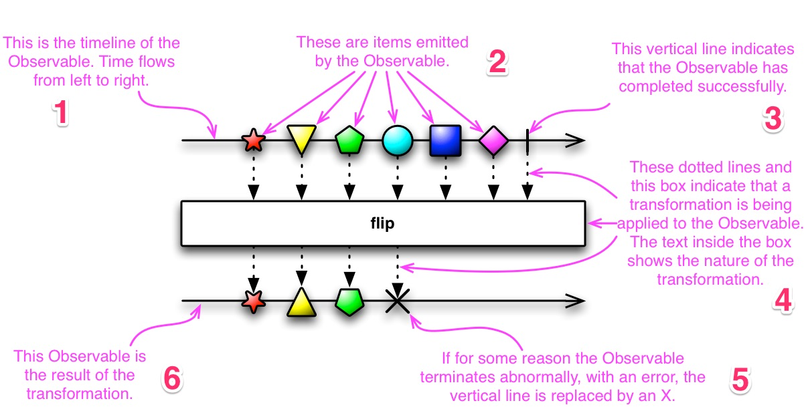

# RxJava 基础知识：Observable

`Observable`，即「被观察者」，注释中是这样描述的：

> The Observable class is the non-backpressured, optionally multi-valued base reactive class that offers factory methods, intermediate operators and the ability to consume synchronous and/or asynchronous reactive dataflows.  

> Observable 类是非背压的、可选的多值响应基类，提供了「工厂方法」、「中间操作符」以及「处理同步异步的响应数据流的能力」。


在 ReactiveX 中，一个 `Observer (观察者)` 可以 `Subscribe (订阅)` 一个 `Observable (被观察者)`。然后，`Observer` 会对 `Observable` 发出的任何事件序列作出响应。这种模式十分有利于并发操作，因为它在等待 `Observable` 发送事件时不需要阻塞，而是以哨兵的形式创建一个 `Observer`，随时准备在将来 `Observable` 发送事件序列的任何时间作出适当的响应。


下面的示意图，描述了「可观测物」和「观测物的变换」过程：



1. `Observable` 的时间轴，时间从左流向右。
2. 被 `Observable` 发射的序列。
3. 该 `竖线` 表示事件序列成功完成发射。
4. 这些 `虚线` 和这个 `方框` 表示序列在发射到 `Observer` 之前的变换，其中的文本描述了这个变换过程的类型。
5. 如果出入某些原因 `Observable` 异常终止序列发射，`竖线` 就会被替换成 `交叉`。
6. `Observable` 发射的序列通过变换得到的最终结果。

> 学会看这个示意图，对后面分析各种操作符的变换过程十分有帮助。

## Subscribe

`subscribe()` 方法用来操作 `Observable` 通知和通知的发射。

该方法相当于胶水，将 `Observer` 向 `Observable` 粘连以建立订阅关系。
> 为了 `Observer` 能够观察到 `Observable` 发射出来的序列或通知 ( `compeleted` / `error` )，`Observer` 必须通过该方法订阅 `Observable` 。

`subscribe()` 方法共有六个重载，可接收 0 到 4 个方法参数（用于组成 `观察者`），也可以接收一个 `Observer` 对象（直接作为 `观察者`），重载方法源码如下：

```java
public final Disposable subscribe() {
    return subscribe(Functions.emptyConsumer(), Functions.ON_ERROR_MISSING, Functions.EMPTY_ACTION, Functions.emptyConsumer());
}

public final Disposable subscribe(Consumer<? super T> onNext) {
    return subscribe(onNext, Functions.ON_ERROR_MISSING, Functions.EMPTY_ACTION, Functions.emptyConsumer());
}

public final Disposable subscribe(Consumer<? super T> onNext,
        Consumer<? super Throwable> onError) {
    return subscribe(onNext, onError, Functions.EMPTY_ACTION, Functions.emptyConsumer());
}

public final Disposable subscribe(Consumer<? super T> onNext,
        Consumer<? super Throwable> onError,
        Action onComplete) {
    return subscribe(onNext, onError, onComplete, Functions.emptyConsumer());
}

/**
  * Subscribes to an ObservableSource and provides callbacks to handle the items it emits and any error or
  * completion notification it issues.
  *
  * @param onNext
  *             the {@code Consumer<T>} you have designed to accept emissions from the ObservableSource
  * @param onError
  *             the {@code Consumer<Throwable>} you have designed to accept any error notification from the
  *             ObservableSource
  * @param onComplete
  *             the {@code Action} you have designed to accept a completion notification from the
  *             ObservableSource
  * @param onSubscribe
  *             the {@code Consumer} that receives the upstream's Disposable
  */
public final Disposable subscribe(Consumer<? super T> onNext,     
        Consumer<? super Throwable> onError,
        Action onComplete, Consumer<? super Disposable> onSubscribe) {
    ...      
}

public final void subscribe(Observer<? super T> observer) {
    ...
}
```

我们在来看下 `Consumer` 和 `Observer` 的源码:

```java
/**
 * A functional interface (callback) that accepts a single value.
 * @param <T> the value type
 */
public interface Consumer<T> {
    /**
     * Consume the given value.
     * @param t the value
     * @throws Exception on error
     */
    void accept(T t) throws Exception;
}

/**
 * Provides a mechanism for receiving push-based notifications.
*/
public interface Observer<T> {

    /**
     * Provides the Observer with the means of cancelling (disposing) the
     * connection (channel) with the Observable in both
     * synchronous (from within {@link #onNext(Object)}) and asynchronous manner.
     * @param d the Disposable instance whose {@link Disposable#dispose()} can
     * be called anytime to cancel the connection
     * @since 2.0
     */
    void onSubscribe(@NonNull Disposable d);

    /**
     * Provides the Observer with a new item to observe.
     * <p>
     * The {@link Observable} may call this method 0 or more times.
     * <p>
     * The {@code Observable} will not call this method again after it calls either {@link #onComplete} or
     * {@link #onError}.
     *
     * @param t
     *          the item emitted by the Observable
     */
    void onNext(@NonNull T t);

    /**
     * Notifies the Observer that the {@link Observable} has experienced an error condition.
     * <p>
     * If the {@link Observable} calls this method, it will not thereafter call {@link #onNext} or
     * {@link #onComplete}.
     *
     * @param e
     *          the exception encountered by the Observable
     */
    void onError(@NonNull Throwable e);

    /**
     * Notifies the Observer that the {@link Observable} has finished sending push-based notifications.
     * <p>
     * The {@link Observable} will not call this method if it calls {@link #onError}.
     */
    void onComplete();

}
```

结合上面的重载方法源码可以看出，`Observer` 可以看做一个包含了上述 4 个方法参数的接口，以简化 `观察者` 的实现。


## Observable 的分类

在 RxJava 中，`Observable` 有 Hot 和 Cold 之分。

* Hot Observable
  * 无论有没有观察者进行订阅，事件都会发生。
  * 当有多个订阅者时，是一对多的关系，可以与多个订阅者共享信息。
* Cold Observable
  * 只有观察者订阅了，才开始执行发射事件的代码。
  * 当有多个订阅者时，是一对一的关系，每个订阅者都能接收到完整的事件，即订阅者之间的事件是独立的、互不影响的。

形象点的话可以这样描述两者的不同：
* Hot Observable 像是一个广播电台，此刻所有听众都会听到同一首歌。
* Cold Observable 像是一张音乐唱片，人们可以独立购买并能听到里面所有的歌。

下面直接分析 Cold Observable，然后再分析 Hot 和 Cold 这两者如何相互转换。

### Cold Observable

`Observable` 的 `just` `create` `range` `fromXxx` 等操作符都能生成 Cold Observable。先来看个栗子？

```java
Consumer<Long> subscriber1 = aLong -> {
    System.out.println("subscriber1, aLong = " + aLong);
};

Consumer<Long> subscriber2 = aLong -> {
    System.out.println("...subscriber2, aLong = " + aLong);
};

Observable<Long> observable = Observable.create(
        (ObservableOnSubscribe<Long>) emitter -> {
            Observable.interval(18, TimeUnit.MILLISECONDS,
                    Schedulers.computation())
                    .take(Integer.MAX_VALUE)
                    .subscribe(emitter::onNext);
        }).observeOn(Schedulers.newThread());

observable.subscribe(subscriber1);
observable.subscribe(subscriber2);

try {
    Thread.sleep(100L);
} catch (InterruptedException e) {
    e.printStackTrace();
}
```

打印日志：
```java
subscriber1, aLong = 0
...subscriber2, aLong = 0
subscriber1, aLong = 1
...subscriber2, aLong = 1
subscriber1, aLong = 2
...subscriber2, aLong = 2
...subscriber2, aLong = 3
subscriber1, aLong = 3
subscriber1, aLong = 4
...subscriber2, aLong = 4
```

可以看出，虽然 `subscriber1` 和 `subscriber2` 的打印顺序虽然不是固定的，但最终两个 `subscriber` 的接收到的序列都已完整的。

Cold Observable 和 Hot Observable 各有各的应用场景。

对于某些事件不确定何时发生或不确定 `Observable` 发射的序列数量的情况下（比如 `UI 交互的事件`、`网络环境的变化`、`地理位置的变化` 或 `服务器推送消息的到达`等 ），还需使用 Hot Observable。


### Cold Observable 如何转换成 Hot Observable

#### 使用 `publish` 生成 `ConnectableObservable`

通过使用 `publish` 操作符，可以让 Cold Observable 转换为 Hot Observable (将原先的 `Observable` 转换为 `ConnectableObservable`)。

示例代码：

```java
Consumer<Long> subscriber1 = aLong -> {
    System.out.println("subscriber1, aLong = " + aLong);
};

Consumer<Long> subscriber2 = aLong -> {
    System.out.println("...subscriber2, aLong = " + aLong);
};

Consumer<Long> subscriber3 = aLong -> {
    System.out.println("......subscriber3, aLong = " + aLong);
};

ConnectableObservable<Long> observable = Observable.create(
        (ObservableOnSubscribe<Long>) emitter -> {
            Observable.interval(18, TimeUnit.MILLISECONDS,
                    Schedulers.computation())
                    .take(Integer.MAX_VALUE)
                    .subscribe(emitter::onNext);
        }).observeOn(Schedulers.newThread())
        .publish();   // 这里增加使用了 publish 操作符

observable.connect(); // 需要调用 connect() 才能真正执行

observable.subscribe(subscriber1);
observable.subscribe(subscriber2);

// subscriber3 一段时间后再订阅
try {
    Thread.sleep(48L);
} catch (InterruptedException e) {
    e.printStackTrace();
}
observable.subscribe(subscriber3);

try {
    Thread.sleep(100L);
} catch (InterruptedException e) {
    e.printStackTrace();
}
```

打印日志：

```java
subscriber1, aLong = 0
...subscriber2, aLong = 0
subscriber1, aLong = 1
...subscriber2, aLong = 1
subscriber1, aLong = 2
...subscriber2, aLong = 2
......subscriber3, aLong = 2
subscriber1, aLong = 3
...subscriber2, aLong = 3
......subscriber3, aLong = 3
subscriber1, aLong = 4
...subscriber2, aLong = 4
......subscriber3, aLong = 4
subscriber1, aLong = 5
...subscriber2, aLong = 5
......subscriber3, aLong = 5
subscriber1, aLong = 6
...subscriber2, aLong = 6
......subscriber3, aLong = 6
subscriber1, aLong = 7
...subscriber2, aLong = 7
......subscriber3, aLong = 7
```

可以看到，多个订阅的 `subscriber (订阅者)` 共享同一事件。在这里，`ConnectableObservable` 是线程安全的。


#### 使用 `Subject` / `Processor`

这两者的作用相似，不同点在于：
* `Processor` 是 RxJava 2.x 新增的类，继承自 `Flowable`，支持背压控制。
* `Subject` 则不支持背压控制 (Back Pressure)。

`Subject` 示例代码：

```java
// 沿用上面 subscriber 1 2  及 Thread.sleep 的代码

Observable<Long> observable = Observable.create(
        (ObservableOnSubscribe<Long>) emitter -> {
            Observable.interval(18, TimeUnit.MILLISECONDS,
                    Schedulers.computation())
                    .take(Integer.MAX_VALUE)
                    .subscribe(emitter::onNext);
        }).observeOn(Schedulers.newThread());


// 先使用 Subject 订阅 Observable
PublishSubject<Long> subject = PublishSubject.create();
observable.subscribe(subject);
// 再使用 subscriber 定于 Subject
subject.subscribe(subscriber1);
subject.subscribe(subscriber2);

// Thread.sleep(48L);

subject.subscribe(subscriber3);

// Thread.sleep(100L);
```

打印结果和使用 `publish` 方式的相同。

`Subject` 既是 `Observable` 又是 `Observer / Subscriber`，这一点从 `Subject` 源码的继承关系可以看出来：

```java
public final class PublishSubject<T> extends Subject<T> { ... }

public abstract class Subject<T> extends Observable<T>
    implements Observer<T> { ... }
```

`Subject` 作为

### Hot Observable 如何转换成 Cold Observable


// TODO ...