# RxJava 基础知识：创建操作符

RxJava 的创建操作符主要包括以下几类：

* [create](#create) : 使用一个函数从头创建一个 `Observable`。
* [defer](#defer) : 只有当订阅者订阅才创建 `Observable`，为每个订阅创建一个新的 `Observable`。
* [empty](#empty) : 创建一个什么都不做直接通知完成的 `Observable`。
* [error](#error) : 创建一个什么都不做直接通知错误的 `Observable`。
* [from](#from) : 将其它种类的对象和数据类型转换为对应的 `Observable`。
* [just](#just) : 将 「一个或多个对象」转换成发射「这个或多个对象」的一个 `Observable`。
* [merge](#merge) : 将多个 `Observable` 的输出合并成一个 `Observable` 的输出。
* [never](#never) : 创建一个不发射任何数据的 `Observable`。
* [range](#range) : 创建一个发射指定范围的整数序列的 `Observable`。


## create

使用一个函数从头创建一个 `Observable`。

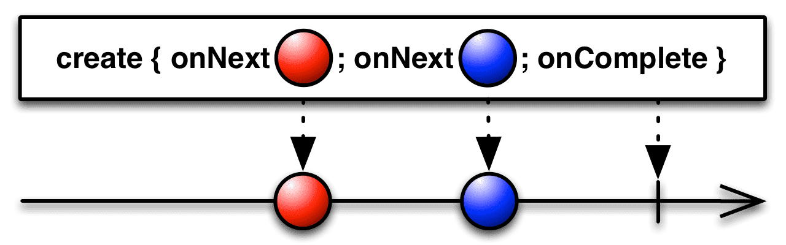

方法声明：

```java
public static <T> Observable<T> create(ObservableOnSubscribe<T> source) { ... }
```

示例：

```java
Observable observable = Observable.create(new ObservableOnSubscribe<String>() {
    @Override
    public void subscribe(ObservableEmitter<String> emitter) throws Exception {
        try {
            for (int i = 0; i < 6; i++) {
                emitter.onNext("this is " + i);
            }
            emitter.onComplete();
        } catch (Exception e) {
            emitter.onError(e);
        }
    }
});
```

发射数据：

```
this is 0
this is 1
this is 2
this is 3
this is 4
this is 5
```

上述示例中，恰当地调用 `Emmier` 的 `onNext()`、`onComplete()` 和 `onError()` 方法来指定 `Observable` 的行为。一个 **形式正确的** 且 **有限序列的**  `Observable` 必须调用相关的 `onComplete()` 或 `onError()` 方法一次，且此后不再调用相关的其它方法。

RxJava 建议我们在使用 `create()` 创建操作符时，先检查一下 `emitter` 的 `isDisposed()` 状态，以便在没有 `Observer` 时让 `Observable` 停止发射数据，避免没有必要的运算。示例代码如下：

```java  
Observable observable = Observable.create(new ObservableOnSubscribe<String>() {
    @Override
    public void subscribe(ObservableEmitter<String> emitter) throws Exception {
        try {
            if (!emitter.isDisposed()) {
                for (int i = 0; i < 10; i++) {
                    emitter.onNext("It's " + i);
                }
            }
            emitter.onComplete();
        } catch (Exception e) {
            emitter.onError(e);
        }
    }
});
```

## defer

只有当订阅者订阅才创建 `Observable`，为每个订阅创建一个新的 `Observable`。

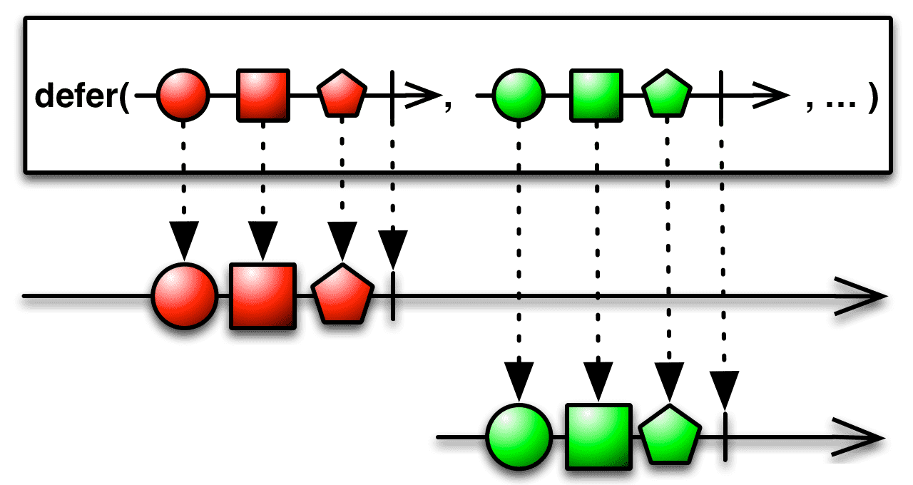

`defer` 操作符会使得 `Observable` 一直等待直到有 `Observer` 订阅它，然后才通过 `Observable` 的工厂方法生成一个 `Observable`。

方法声明：

```java
public static <T> Observable<T> defer(Callable<? extends ObservableSource<? extends T>> supplier) { ... }
```

示例：

```java
Observable observable = Observable.defer(new Callable<ObservableSource<?>>() {
    @Override
    public ObservableSource<?> call() throws Exception {
        return Observable.just("A", "B", "C");
    }
});
```

发射数据：

```
A
B
C
```

## empty

创建一个什么都不做直接通知完成的 `Observable`。


方法声明：

```java
public static <T> Observable<T> empty() { ... }
```

示例：

```java
Observable observable = Observable.empty();
```


## error

创建一个什么都不做直接通知错误的 `Observable`。

方法声明：


```java
public static <T> Observable<T> error(Callable<? extends Throwable> errorSupplier) { ... }

public static <T> Observable<T> error(final Throwable exception) { ... }
```

示例：

```java
Observable observable = Observable.error(new Callable<Throwable>() {
    @Override
    public Throwable call() throws Exception {
        return new Exception("exception from Observable.error()");
    }
});

Observable observable = Observable.error(
                new Exception("there is something wrong."));
```

## from

将其它种类的对象和数据类型转换为对应的 `Observable`，比如将一个 `Array`、`Callable`、`Future`、`Iterable` 或 `Publisher` 转换成一个 `Observable`。

`fromArray`：

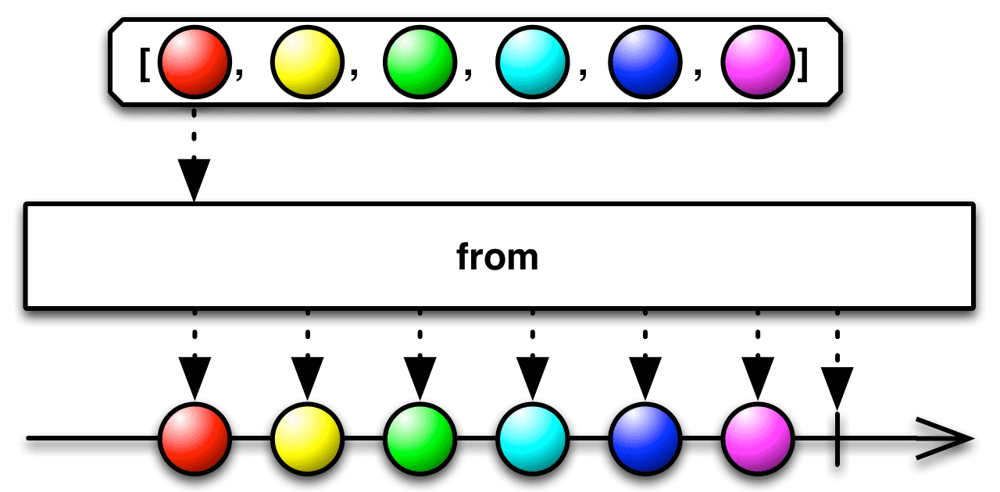

`fromCallable`:

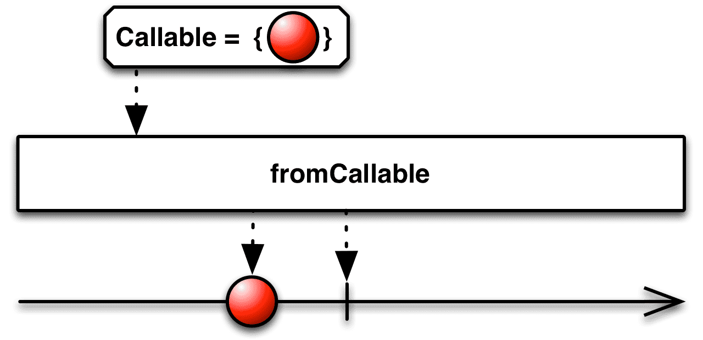

`fromFuture` (有多个重载方法，下面示意图是对应上面 *noarg* 的):

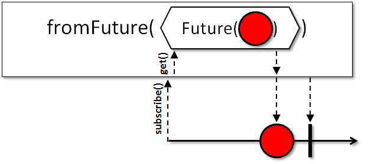

`fromIterable`:

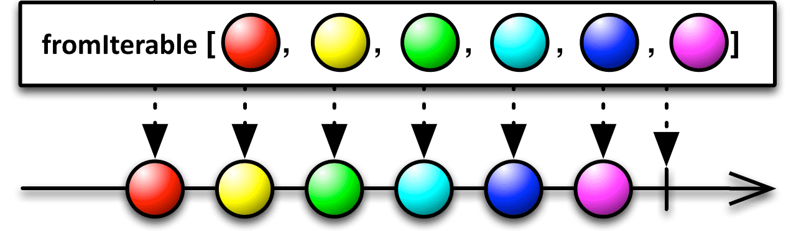

`fromPublisher`:

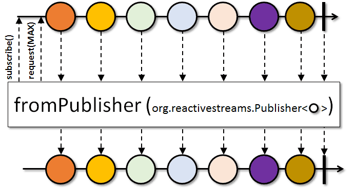

相关方法声明：

```java
public static <T> Observable<T> fromArray(T... items) { ... }

public static <T> Observable<T> fromCallable(Callable<? extends T> supplier) { ... }

public static <T> Observable<T> fromFuture(Future<? extends T> future) { ... }

public static <T> Observable<T> fromIterable(Iterable<? extends T> source) { ... }

public static <T> Observable<T> fromPublisher(Publisher<? extends T> publisher) { ... }
```


示例：
```java
String[] array = {"H", "e", "l", "l", "o"};
        Observable observable = Observable.fromArray(array);

Observable observable = Observable.fromCallable(new Callable<String>() {
    @Override
    public String call() throws Exception {
        return "Hello fromCallable";
    }
});

ExecutorService service = Executors.newCachedThreadPool();
Future<String> future = service.submit(new Callable<String>() {
    @Override
    public String call() throws Exception {
        System.out.println("模拟一些耗时的任务");
        Thread.sleep(5000);
        return "OK";
    }
});
Observable observable = Observable.fromFuture(future);


List<Integer> items = new ArrayList<>();
for (int i = 0; i < 10; i++) {
    items.add(i);
}
Observable observable = Observable.fromIterable(items);

// todo publisher
```

特别地，`fromFuture` 重载方法中有一个可接收两个可选参数的方法，分别指定「超时时长」和「时长单位」：

```java
/**
 * Converts a {@link Future} into an ObservableSource, with a timeout on the Future.
 * @param future the source {@link Future}
 * @param timeout the maximum time to wait before calling {@code get}
 * @param unit the {@link TimeUnit} of the {@code timeout} argument
 * @param <T> the type of object that the {@link Future} returns, and also the type of item to be emitted by
 *            the resulting ObservableSource
 * @return an Observable that emits the item from the source {@link Future}
 */
@CheckReturnValue
@SchedulerSupport(SchedulerSupport.NONE)
public static <T> Observable<T> fromFuture(Future<? extends T> future, long timeout, TimeUnit unit) { ... }
```

如果过了指定的时长而 `Future` 还没有返回一个值的话，那么这个 `Observable` 就会发射错误通知并终止。  

比如下面的代码把超时时长设置为 3 秒：

```java
ExecutorService service = Executors.newCachedThreadPool();
Future<String> future = service.submit(new Callable<String>() {
    @Override
    public String call() throws Exception {
        System.out.println("模拟一些耗时的任务");
        Thread.sleep(5000);
        return "OK";
    }
});
Observable observable = Observable.fromFuture(future, 3, TimeUnit.SECONDS);

observable.subscribe(new Observer<String>() {
    @Override
    public void onSubscribe(Disposable d) {
        System.out.println("onSubscribe");
    }

    @Override
    public void onNext(String s) {
        System.out.println("onNext, s = " + s);
    }

    @Override
    public void onError(Throwable e) {
        System.out.println("onError e = " + e);
    }

    @Override
    public void onComplete() {
        System.out.println("onComplete");
    }
});
```

打印日志如下：

```
模拟一些耗时的任务
onSubscribe
onError e = java.util.concurrent.TimeoutException
```

如果超时时长改为 6 秒的话，打印日志如下：

```
模拟一些耗时的任务
onSubscribe
onNext, s = OK
onComplete
```

## just

将 「一个或多个对象」转换成发射「这个或多个对象」的一个 `Observable`。

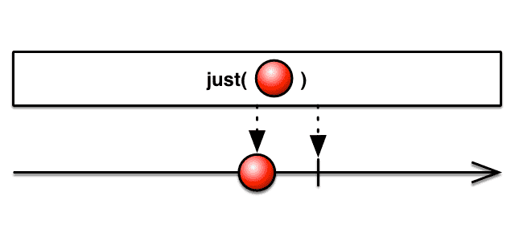


just 有点类似 from
* 但 just 只是简单原样发射参数里的数据，比如原样发射 `String`、`Array` 或 `Iterable` (视为单个数据)
* 而 from 是将参数 `Array` 或 `Iterable` 中的数据取出来然后逐一发射。

声明如下：

```java
public static <T> Observable<T> just(T item) { ... }

public static <T> Observable<T> just(T item1, T item2) { ... }

public static <T> Observable<T> just(T item1, T item2, T item3) { ... }

// ... 最多可支持 10 个 item 参数
```


示例：

```java
Observable observable = Observable.just("Hello");

Observable observable = Observable.just("Hello", "just");

Observable observable = Observable.just("Hello", "just", "operators");
```

发射数据：

```
Hello
Hello just
Hello just operators
```

## merge

将多个 `Observable` 的输出合并成一个 `Observable` 的输出。

`merge(Iterable)`:

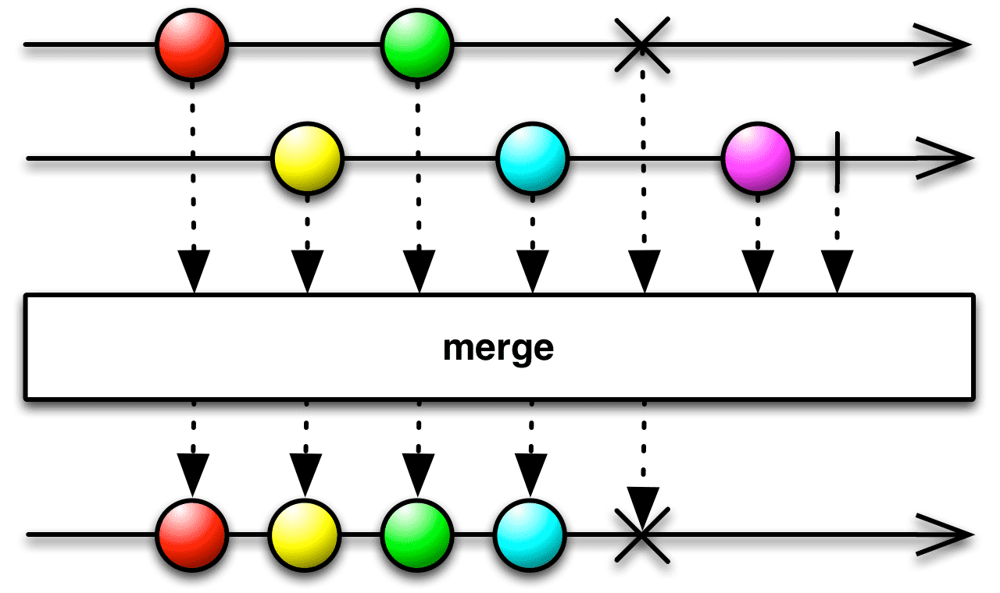

`merge(ObservableSource)`

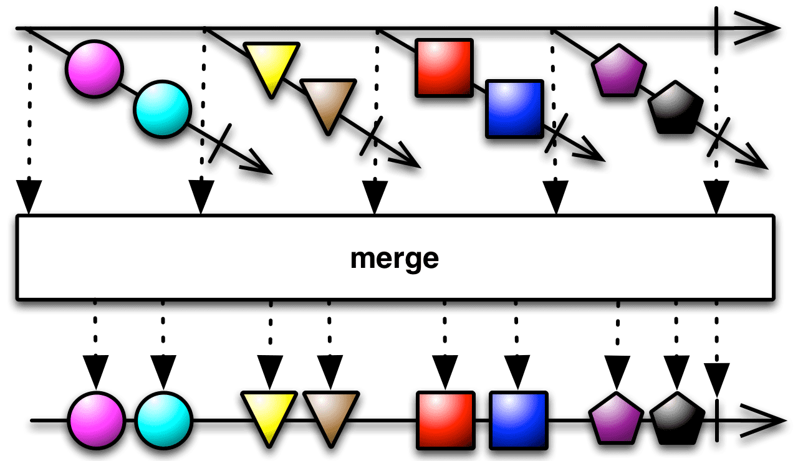

相关方法声明：

```java  
public static <T> Observable<T> merge(Iterable<? extends ObservableSource<? extends T>> sources) { ... }

public static <T> Observable<T> merge(ObservableSource<? extends ObservableSource<? extends T>> sources) { ... }

// ... 还有一些相关的重载方法
```

示例：

```java
Observable<String> observable1 = Observable.just("1", "2", "3");
Observable<String> observable2 = Observable.just("A", "B", "C");
List<ObservableSource<String>> observableSources = new ArrayList<>();
observableSources.add(observable1);
observableSources.add(observable2);
Observable observable = Observable.merge(observableSources);

Observable observable1 = Observable.just("1", "2", "3");
Observable observable2 = Observable.just("A", "B", "C");
Observable observable = Observable.merge(observable1, observable2);
```

上述两个示例的发射数据都是：
···
1
2
3
A
B
C
···

## never

创建一个不发射任何数据的 `Observable`。


方法声明：

```java
public static <T> Observable<T> never() { ... }
```


示例：

```java
Observable observable = Observable.never();
```


## range

创建一个发射指定范围的整数序列的 `Observable`。

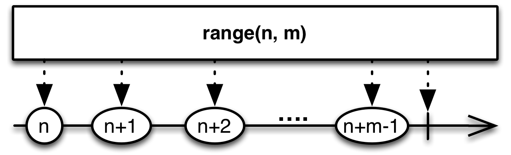

方法声明：

```java  
public static Observable<Integer> range(final int start, final int count) { ... }
```

示例：

```java
Observable observable = Observable.range(1, 6);
```

发射数据：

```
1
2
3
4
5
6
```