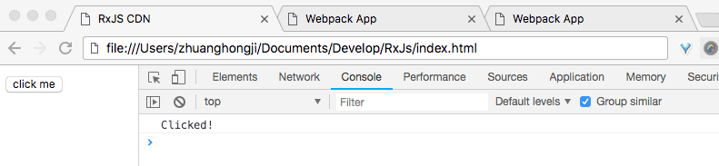
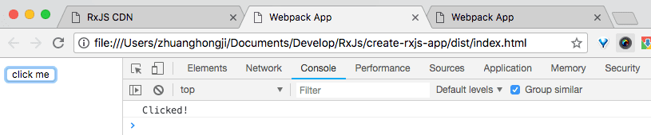
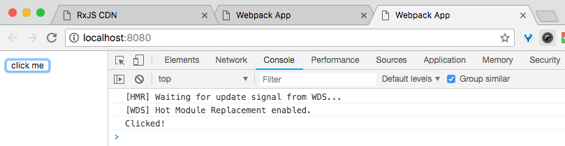

# RxJs 基础知识：开始

> RxJS: Reactive Extensions Library for JavaScript

[RxJS](http://reactivex.io/rxjs) 是一个使用 Observables 进行响应式编程的库，使得我们可以更容易地组合异步或基于回调的代码。该项目是 [Reactive-Extensions/RxJS](https://github.com/Reactive-Extensions/RxJS) 的重写，具有更好的性能、更好的模块化和更好的可调试调用堆栈。进行一些突破性改变（reduce the API surface）的同时，尽可能地保持向后兼容
。

## 概述

### 介绍

RxJS 是一个通过使用可观察序列来组合「异步」和「基于事件」程序的库。它提供了一些核心类型，[Observable](https://rxjs-dev.firebaseapp.com/overview.html#observable)、卫星类型 (satellite types) 和受 [Array#extras](https://developer.mozilla.org/en-US/docs/Web/JavaScript/New_in_JavaScript/1.6) (map, filter, reduce, every, etc)启发的运算符，允许将异步事件作为集合处理。

> 可以将 RxJS 视为处理事件的 [Lodash](https://lodash.com/)。

ReactiveX 将「观察者模式」、「迭代器模式」和「函数编程 (with collections)」相结合，以满足以一种理想的方式来管理事件序列的需要。

在 RxJS 中解决异步事件管理的基本概念如下：

* **Observable (可观察对象)**：，表示可调用的未来的「值」或「事件」的集合。
* **Observer (观察者)**：一个回调函数的集合，它知道如何去监听由 Observable 提供的值。
* **Subscription (订阅)**：表示 Observable 的执行，主要用于取消执行。
* **Operators (操作符)**：采用函数式编程风格的纯函数 (pure function)，使用像 `map`、`filter`、`concat`、`reduce` 等这样的操作符来处理集合。
* **Subject (主体)**：相当于 EventEmitter，并且是将值或事件多路传播 (multicasting) 到多个 Observers 的唯一方式。
* **Schedulers (调度器)**：用于控制并发性的集中调度器，允许我们在发生类似 `setTimeout` 或 `requestAnimationFrame` 的计算时进行协调。

### 第一个示例

注册事件监听器的常规写法：

```js
const button = document.querySelector('button')
button.addEventListener('click', () => console.log('Clicked!'))

// Clicked!
```

使用 RxJS 的话，创建一个 observable 来代替：

```js
import { fromEvent } from 'rxjs';

const button = document.querySelector('button');
Rx.Observable.fromEvent(button, 'click')
  .subscribe(() => console.log('Clicked!'));

// Clicked!
```

#### 纯净性 (Purity)

使用纯函数产生值的能力使得 RxJS 十分强大，这意味着你的代码更难出错。

通常你会创建一个非纯函数，在这个函数之外创建的共享变量会使得应用的状态变得糟糕：

```js
let count = 0
const button = document.querySelector('button')
button.addEventListener('click', () => console.log(`Clicked ${++count} times`))

// Clicked 1 times
// Clicked 2 times
// Clicked 3 times
```

使用 RxJS 将应用的状态隔离出来：

```js
import { fromEvent } from 'rxjs';
import { scan } from 'rxjs/operators'

const button = document.querySelector('button')
fromEvent(button, 'click').pipe(
  scan(count => count + 1, 0)
).subscribe(
  count => console.log(`Clicked ${count} times`)
)

// Clicked 1 times
// Clicked 2 times
// Clicked 3 times
```

#### 流动性 (Flow)

RxJS 提供了一整套操作符来帮助你控制流经 Observables 的事件。

下面的普通 JavaScript 代码示例演示了如何控制一秒钟内最多点击一次：

```js
let count = 0
let rate = 1000
let lastClick = Date.now() - rate

const button = document.querySelector('button')
button.addEventListener('click', () => {
  if (Date.now() - lastClick >= rate) {
    console.log(`Clicked ${++count} times`)
    lastClick = Date.now()
  }
})
```

使用 RxJS 的话：

```js
import { fromEvent } from 'rxjs'
import { scan, throttleTime } from 'rxjs/operators'

const button = document.querySelector('button')
fromEvent(button, 'click').pipe(
  throttleTime(1000),
  scan(count => count + 1, 0)
).subscribe(
  count => console.log(`Clicked ${count} times`)
)
```

其它流程控制操作符还有 [filter](https://rxjs-dev.firebaseapp.com/class/es6/Observable.js~Observable.html#instance-method-filter), [delay](https://rxjs-dev.firebaseapp.com/class/es6/Observable.js~Observable.html#instance-method-delay), [debounceTime](https://rxjs-dev.firebaseapp.com/class/es6/Observable.js~Observable.html#instance-method-debounceTime), [take](https://rxjs-dev.firebaseapp.com/class/es6/Observable.js~Observable.html#instance-method-take), [takeUntil](https://rxjs-dev.firebaseapp.com/class/es6/Observable.js~Observable.html#instance-method-takeUntil), [distinct](https://rxjs-dev.firebaseapp.com/class/es6/Observable.js~Observable.html#instance-method-distinct), [distinctUntilChanged](https://rxjs-dev.firebaseapp.com/class/es6/Observable.js~Observable.html#instance-method-distinctUntilChanged) 等。


#### 值 (Values)

你可以转换流经 Observables 的事件。

下面的普通代码示例演示了如何累加每次点击的鼠标位置横坐标值：

```js
let count = 0
let rate = 1000
let lastClick = Date.now() - rate

const button = document.querySelector('button')
button.addEventListener('click', (event) => {
  if (Date.now() - lastClick >= rate) {
    count += event.clientX
    console.log(count)
    lastClick = Date.now()
  }
})
```

使用 RxJS 的话：

```js

import { fromEvent } from 'rxjs'
import { scan, throttleTime, map } from 'rxjs/operators'

const button = document.querySelector('button')
fromEvent(button, 'click').pipe(
  throttleTime(1000),
  map(event => event.clientX),
  scan((count, clientX) => count + clientX, 0)
).subscribe(
  count => console.log(count)
)
```

其它产生值得操作符还有 [pluck](https://rxjs-dev.firebaseapp.com/class/es6/Observable.js~Observable.html#instance-method-pluck), [pairwise](https://rxjs-dev.firebaseapp.com/class/es6/Observable.js~Observable.html#instance-method-pairwise), [sample](https://rxjs-dev.firebaseapp.com/class/es6/Observable.js~Observable.html#instance-method-sample) 等。

## 起步

### CDN

新建一个 `index.html` 文件，代码如下：

```html
<!DOCTYPE html>
<html>
  <head>
    <meta charset="UTF-8">
    <title>RxJS CDN</title>
    <script src="https://unpkg.com/rxjs/bundles/rxjs.umd.min.js"></script>
  </head>
  <body>
    <button>click me</button>

    <script>
      // const button = document.querySelector('button')
      // button.addEventListener('click', () => console.log('Clicked!'))

      const { fromEvent } = rxjs
      const button = document.querySelector('button')
      fromEvent(button, 'click').subscribe(() => console.log('Clicked!'))
    </script>
  </body>
</html>
```

右键在浏览器中打开，当你在浏览器中点击 `click me` 按钮时，你可以在控制台中看到 `Clicked!` 日志的输出。



### ES6

在 `create-rxjs-app` 目录下新建一个项目，代码文件如下 (功能同上述的 CDN 起步)：

src/index.html :

```html
<!DOCTYPE html>
<html>
  <head>
    <meta charset="UTF-8">
    <title>Webpack App</title>
  </head>
  <body>
    <button>click me</button>

    <script>
      // const button = document.querySelector('button')
      // button.addEventListener('click', () => console.log('Clicked!'))
    </script>
  </body>
</html>
```

src/index.js :

```js
// 使得修改 index.html 时，浏览器也能自动刷新
if (process.env.NODE_ENV !== 'production') {
  require('./index.html')
}

import { fromEvent } from 'rxjs';

const button = document.querySelector('button');
fromEvent(button, 'click')
  .subscribe(() => console.log('Clicked!'));
```

.gitignore :

```txt
# npm 模块的安装目录
/node_modules

# 生成代码的目录
/dist
```

package.json :

```json
{
  "name": "create-rxjs-app",
  "version": "1.0.0",
  "description": "",
  "private": true,
  "scripts": {
    "test": "echo \"Error: no test specified\" && exit 1",
    "build": "npx webpack --config webpack.config.js",
    "start": "webpack-dev-server --open"
  },
  "keywords": [],
  "author": "",
  "license": "ISC",
  "devDependencies": {
    "html-loader": "^0.5.5",
    "html-webpack-plugin": "^3.2.0",
    "webpack": "^4.17.2",
    "webpack-cli": "^3.1.0",
    "webpack-dev-server": "^3.1.7"
  },
  "dependencies": {
    "clean-webpack-plugin": "^0.1.19"
  }
}
```

webpack.config.js :

```js
const path = require('path');
const HtmlWebpackPlugin = require('html-webpack-plugin')
const CleanWebpackPlugin = require('clean-webpack-plugin');
const webpack = require('webpack');

module.exports = {
  mode: 'development',
  entry: './src/index.js',
  output: {
    filename: 'index.js',
    path: path.resolve(__dirname, 'dist')
  },
  devtool: 'inline-source-map',
  devServer: {
    contentBase: './dist',
    hot: true,
  },
  plugins: [
    new CleanWebpackPlugin(['dist']),
    new HtmlWebpackPlugin({
      template: 'src/index.html',
      filename: 'index.html',
    }),
    new webpack.NamedModulesPlugin(),
    new webpack.HotModuleReplacementPlugin(),
  ],
  module: {
    rules: [
      {
        test: /\.(html)$/,
        use: {
          loader: 'html-loader',
          options: {
            attrs: [':data-src']
          }
        }
      }
    ]
  }
};
```

#### 安装

执行以下命令，安装相关依赖：

```shell
$ cd create-rx-app
$ npm install
```

#### 运行方式1

然后执行以下命令，自动生成 `/dist/index.html` 和 `/dist/index.js` 文件：

```shell
$ npm run build
```

```shell
# 终端输出示例如下：

> create-rxjs-app@1.0.0 build /Users/zhuanghongji/Documents/Develop/RxJs/create-rxjs-app
> npx webpack --config webpack.config.js

clean-webpack-plugin: /Users/zhuanghongji/Documents/Develop/RxJs/create-rxjs-app/dist has been removed.
Hash: 46992093dcc6abef66d3
Version: webpack 4.17.2
Time: 809ms
Built at: 2018-09-09 09:46:34
     Asset       Size  Chunks             Chunk Names
  index.js    604 KiB    main  [emitted]  main
index.html  369 bytes          [emitted]
Entrypoint main = index.js
[./src/index.html] 350 bytes {main} [built]
[./src/index.js] 260 bytes {main} [built]
    + 99 hidden modules
Child html-webpack-plugin for "index.html":
     1 asset
    Entrypoint undefined = index.html
    [./node_modules/html-webpack-plugin/lib/loader.js!./src/index.html] 350 bytes {0} [built]
```

```html
<!-- /dist/index.html -->

<!DOCTYPE html>
<html>
  <head>
    <meta charset="UTF-8">
    <title>Webpack App</title>
  </head>
  <body>
    <button>click me</button>

    <script>
      // const button = document.querySelector('button')
      // button.addEventListener('click', () => console.log('Clicked!'))
    </script>
  <script type="text/javascript" src="index.js"></script></body>
</html>
```

```js
// /dist/index.html

/******/ (function(modules) { // webpackBootstrap
/******/ 	// ... 略
/******/ }),

/***/ "./src/index.html":
/*!************************!*\
  !*** ./src/index.html ***!
  \************************/
/*! no static exports found */
/***/ (function(module, exports) {

module.exports = "<!DOCTYPE html>\n<html>\n  <head>\n    <meta charset=\"UTF-8\">\n    <title>Webpack App</title>\n  </head>\n  <body>\n    <button>click me</button>\n\n    <script>\n      // const button = document.querySelector('button')\n      // button.addEventListener('click', () => console.log('Clicked!'))\n    </script>\n  </body>\n</html>";

/***/ }),

/***/ "./src/index.js":
/*!**********************!*\
  !*** ./src/index.js ***!
  \**********************/
/*! no exports provided */
/***/ (function(module, __webpack_exports__, __webpack_require__) {

"use strict";
__webpack_require__.r(__webpack_exports__);
/* harmony import */ var rxjs__WEBPACK_IMPORTED_MODULE_0__ = __webpack_require__(/*! rxjs */ "./node_modules/rxjs/_esm5/index.js");
// 使得修改 index.html 时，浏览器也能自动刷新
if (true) {
  __webpack_require__(/*! ./index.html */ "./src/index.html")
}

const button = document.querySelector('button');
Object(rxjs__WEBPACK_IMPORTED_MODULE_0__["fromEvent"])(button, 'click')
  .subscribe(() => console.log('Clicked!'));

/***/ })

/******/ });

// ...略
```

右键在浏览器中打开 `/dist/index.html`：




#### 运行方式2

执行以下命令，通过 webpack 进行打包并自动运行：

```shell
$ npm run start
````

```shell
# 终端输出示例如下：

> create-rxjs-app@1.0.0 start /Users/zhuanghongji/Documents/Develop/RxJs/create-rxjs-app
> webpack-dev-server --open

clean-webpack-plugin: /Users/zhuanghongji/Documents/Develop/RxJs/create-rxjs-app/dist has been removed.
ℹ ｢wds｣: Project is running at http://localhost:8080/
ℹ ｢wds｣: webpack output is served from /
ℹ ｢wds｣: Content not from webpack is served from ./dist
ℹ ｢wdm｣: wait until bundle finished: /
ℹ ｢wdm｣: Hash: 0d484b6ff4703821626e
Version: webpack 4.17.2
Time: 1544ms
Built at: 2018-09-09 09:38:42
     Asset       Size  Chunks             Chunk Names
  index.js    1.4 MiB    main  [emitted]  main
index.html  369 bytes          [emitted]
Entrypoint main = index.js
[./node_modules/loglevel/lib/loglevel.js] 7.68 KiB {main} [built]
[./node_modules/rxjs/_esm5/index.js] 3.2 KiB {main} [built]
[./node_modules/url/url.js] 22.8 KiB {main} [built]
[./node_modules/webpack/hot sync ^\.\/log$] (webpack)/hot sync nonrecursive ^\.\/log$ 170 bytes {main} [built]
[0] multi (webpack)-dev-server/client?http://localhost:8080 (webpack)/hot/dev-server.js ./src/index.js 52 bytes {main} [built]
[./node_modules/webpack-dev-server/client/index.js?http://localhost:8080] (webpack)-dev-server/client?http://localhost:8080 7.78 KiB {main} [built]
[./node_modules/webpack-dev-server/client/overlay.js] (webpack)-dev-server/client/overlay.js 3.58 KiB {main} [built]
[./node_modules/webpack-dev-server/client/socket.js] (webpack)-dev-server/client/socket.js 1.05 KiB {main} [built]
[./node_modules/webpack-dev-server/node_modules/strip-ansi/index.js] (webpack)-dev-server/node_modules/strip-ansi/index.js 161 bytes {main} [built]
[./node_modules/webpack/hot/dev-server.js] (webpack)/hot/dev-server.js 1.61 KiB {main} [built]
[./node_modules/webpack/hot/emitter.js] (webpack)/hot/emitter.js 77 bytes {main} [built]
[./node_modules/webpack/hot/log-apply-result.js] (webpack)/hot/log-apply-result.js 1.27 KiB {main} [built]
[./node_modules/webpack/hot/log.js] (webpack)/hot/log.js 1.11 KiB {main} [built]
[./src/index.html] 350 bytes {main} [built]
[./src/index.js] 260 bytes {main} [built]
    + 113 hidden modules
Child html-webpack-plugin for "index.html":
     1 asset
    Entrypoint undefined = index.html
    [./node_modules/html-webpack-plugin/lib/loader.js!./src/index.html] 350 bytes {0} [built]
ℹ ｢wdm｣: Compiled successfully.
```

命令行执行完毕后，会自动在浏览器中打开：



### 总结

本篇内容讲述了 CDN 和 ES6 两种起步方式，以便我们可以快速学习 RxJS 的语法或写一些功能示例。
