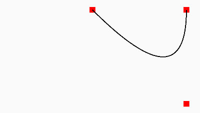
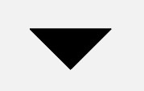

# HenCoder 笔记 - 自定义 View：绘制基础

## 一、概述

  

### 1. 绘制方法

例如画圆、画方、画图像和文字等

### 2. Paint

除了可以设置颜色、实心空心、线条粗细、有无阴影，还可以设置 **拐角形状**、 **双线性过滤**、 **图片特效** 等。


### 3. 范围裁剪


### 4. 几何变换  

  

### 5. 控制遮盖顺序  

使用不同的绘制方法来控制绘制顺序

>  **控制绘制顺序，解决的并不是“做不到”的问题，而是性能问题。**    
同样一种效果，不控制绘制顺序往往也能做到。比如，用多个View甚至多层View进行拼凑，但代价是牺牲了UI的性能。反而，如果使用绘制顺序的话，一个View就能全部搞定。


## 二、onDraw()

### 1. 自定义绘制最基本的实现

* 提前创建好 `Paint` 对象
* 重写 `onDraw()` 方法，并将绘制代码卸载里面

```java
// 大概就是这样
//（设置了三个构造方法，这样无论你是在xml中使用还是直接new一个，都能正确进行绘制）
public class CustomDrawView extends View {

    private Paint mPaint;

    public CustomDrawView(Context context) {
        this(context, null);
    }
    public CustomDrawView(Context context, @Nullable AttributeSet attrs) {
        this(context, attrs, 0);
    }
    public CustomDrawView(Context context, @Nullable AttributeSet attrs, int defStyleAttr) {
        super(context, attrs, defStyleAttr);
        mPaint = new Paint();
        // 设置 paint 属性
    }

    @Override
    protected void onDraw(Canvas canvas) {
        super.onDraw(canvas);
        // 你的绘制代码，比如画一个圆圈
        canvas.drawCircle(300, 300, 200, mPaint);
    }
}
```

### 2. 源码中的 `onDraw()` 方法

*  `View` 类：是一个空方法，源码如下

```java
/**
 * Implement this to do your drawing.
 *
 * @param canvas the canvas on which the background will be drawn
 */
protected void onDraw(Canvas canvas) {
}
```

* `ViewGroup` 继承自 `View`，但未重写 `onDraw()` 方法  

* `LinearLayout` 类：根据方向（竖向/横向）分两种情况去绘制

```java
@Override
protected void onDraw(Canvas canvas) {
    if (mDivider == null) {
        return;
    }

    if (mOrientation == VERTICAL) {
        drawDividersVertical(canvas);
    } else {
        drawDividersHorizontal(canvas);
    }
}
```

* `RelativeLayout` 类：也没有重写 `onDraw()` 方法  
（布局的具体逻辑应该是在 `onMeasure()` 和 `onLayout()` 方法里面进行的）

## 三、 Paint 类及其常用方法

```java
/**
 * The Paint class holds the style and color information about how to draw
 * geometries, text and bitmaps.
 */
public class Paint {
  // ...
}
```

Paint 几个常用的方法：

|方法|描述
|--|--
|Paint.setStyle(Style style)|设置绘制模式
|Paint.setColor(int color)|设置颜色
|Paint.setStrokeWidth(float width)|设置线条宽度
|Paint.setTextSize(float textSize)|设置文字大小
|Paint.setAntiAlias(boolean aa)|设置抗锯齿开关

## 四、Canvas 类和 Canvas.drawXXX()

```java
/**
 * The Canvas class holds the "draw" calls. To draw something, you need
 * 4 basic components: A Bitmap to hold the pixels, a Canvas to host
 * the draw calls (writing into the bitmap), a drawing primitive (e.g. Rect,
 * Path, text, Bitmap), and a paint (to describe the colors and styles for the
 * drawing).
 */
public class Canvas extends BaseCanvas {
  // ...
}

/**
 * This class is a base class for Canvas's drawing operations. Any modifications here
 * should be accompanied by a similar modification to {@link RecordingCanvas}.
 *
 * The purpose of this class is to minimize the cost of deciding between regular JNI
 * and @FastNative JNI to just the virtual call that Canvas already has.
 *
 * @hide
 */
public abstract class BaseCanvas {
  // ...
}
```

### 1. drawColor(@ColorInt int color) 颜色填充

在整个绘制区域统一涂上指定的颜色  

**一般用于在绘制之前设置底色，或在绘制之后为界面设置半透明蒙版**
 * `drawColor(Color.BLACK)`：把整个区域染成纯黑色，覆盖掉原有内容  
 
 * `drawColor(Color.parse("#88880000")`：会在原有的绘制效果上加一层半透明的红色遮罩  
 
 * 类似方法：`drawRGB(int r, int g, int b)` 和 `drawARGB(int a, int r, int g, int b)`  
 这两者和 `drawColor(color)` 相比只是用法不同，结果是一样的。源码如下
```java
public void drawRGB(int r, int g, int b) {
      drawColor(Color.rgb(r, g, b));
}
 ```

### 2. drawCircle(float centerX, float centerY, float radius, Paint paint) 画圆

```java
/**
 * Draw the specified circle using the specified paint. If radius is <= 0, then nothing will be
 * drawn. The circle will be filled or framed based on the Style in the paint.
 *
 * @param cx The x-coordinate of the center of the cirle to be drawn
 * @param cy The y-coordinate of the center of the cirle to be drawn
 * @param radius The radius of the cirle to be drawn
 * @param paint The paint used to draw the circle
 */
public void drawCircle(float cx, float cy, float radius, @NonNull Paint paint) {
    super.drawCircle(cx, cy, radius, paint);
}
```

* `cx` 和 `cy` 是圆心的坐标，`radius` 是圆的半径，单位都是像素（这三要素可以构建出一个确定的圆）
* `paint`：提供绘制的颜色、线条粗细和是否阴影等信息
* 例如 `canvas.drawCircle(300, 300, 200, paint);`   


>在Android中，每个View都有View都有自己坐标系（如下图），彼此之间互不影响。
>这个坐标系原点是View左上角的顶点
>水平方向是x轴，左负右正
>垂直方向是y轴，上负下正

  

圆心坐标和半径是圆的基本信息，可作为方法的参数。  
其他公共参数如颜色、实心空心这些，统一放在 `Paint` 中进行处理。

**插播一： Paint.setColor(int color)**  

  

**插播二： Paint.setStyle(Paint.Style style)**  

  

```java
/**
 * The Style specifies if the primitive being drawn is filled, stroked, or
 * both (in the same color). The default is FILL.
 */
public enum Style {
    /**
     * Geometry and text drawn with this style will be filled, ignoring all
     * stroke-related settings in the paint.
     */
    FILL            (0),  // 填充模式（默认）
    /**
     * Geometry and text drawn with this style will be stroked, respecting
     * the stroke-related fields on the paint.
     */
    STROKE          (1),  // 画线模式
    /**
     * Geometry and text drawn with this style will be both filled and
     * stroked at the same time, respecting the stroke-related fields on
     * the paint. This mode can give unexpected results if the geometry
     * is oriented counter-clockwise. This restriction does not apply to
     * either FILL or STROKE.
     */
    FILL_AND_STROKE (2);  // 既填充又画线

    Style(int nativeInt) {
        this.nativeInt = nativeInt;
    }
    final int nativeInt;
}
```

**插播三： Paint.setStrokeWidth(float width)**  

  

### 3. drawRect(float left, float top, float right, float bottom, Paint paint) 画矩形

  

left, top, right, bottom 可以理解为左上顶点和右下顶点的坐标。  
该方法有两个重载的方法，如下：

```java
public void drawRect(@NonNull Rect r, @NonNull Paint paint) {
    throwIfHasHwBitmapInSwMode(paint);
    drawRect(r.left, r.top, r.right, r.bottom, paint);
}

public void drawRect(@NonNull RectF rect, @NonNull Paint paint) {
    throwIfHasHwBitmapInSwMode(paint);
    nDrawRect(mNativeCanvasWrapper,
            rect.left, rect.top, rect.right, rect.bottom, paint.getNativeInstance());
}
```

### 4. drawPoint(float x, float y, Paint paint) 画点

`x` 和 `y` 是点的坐标

* `paint.setStrokeWidth(float width)`：设置点的大小
* `paint.setStrokeCap(Cap cap)`：设置点的形状
  
```java
/**
 * The Cap specifies the treatment for the beginning and ending of
 * stroked lines and paths. The default is BUTT.
 */
public enum Cap {
    /**
     * The stroke ends with the path, and does not project beyond it.
     */
    BUTT    (0),  // 方形的点
    /**
     * The stroke projects out as a semicircle, with the center at the
     * end of the path.
     */
    ROUND   (1),  // 圆形的点
    /**
     * The stroke projects out as a square, with the center at the end
     * of the path.
     */
    SQUARE  (2);  // 方形的点

    private Cap(int nativeInt) {
        this.nativeInt = nativeInt;
    }
    final int nativeInt;
}
```

测试代码和对应显示效果如下：

```java
mPaint.setStrokeWidth(50);
mPaint.setStrokeCap(Paint.Cap.BUTT);
canvas.drawPoint(100, 100, mPaint);
mPaint.setStrokeCap(Paint.Cap.ROUND);
canvas.drawPoint(200, 100, mPaint);
mPaint.setStrokeCap(Paint.Cap.SQUARE);
canvas.drawPoint(300, 100, mPaint);
```


### 5. drawPoints(float[] pts, int offset, int count, Paint paint) 画点（批量）

```java
/**
 * Draw a series of points. Each point is centered at the coordinate specified by pts[], and its
 * diameter is specified by the paint's stroke width (as transformed by the canvas' CTM), with
 * special treatment for a stroke width of 0, which always draws exactly 1 pixel (or at most 4
 * if antialiasing is enabled). The shape of the point is controlled by the paint's Cap type.
 * The shape is a square, unless the cap type is Round, in which case the shape is a circle.
 *
 * @param pts Array of points to draw [x0 y0 x1 y1 x2 y2 ...]
 * @param offset Number of values to skip before starting to draw.
 * @param count The number of values to process, after skipping offset of them. Since one point
 *            uses two values, the number of "points" that are drawn is really (count >> 1).
 * @param paint The paint used to draw the points
 */
public void drawPoints(@Size(multiple = 2) float[] pts, int offset, int count,
        @NonNull Paint paint) {
    super.drawPoints(pts, offset, count, paint);
}

// 间接调用了上面的方法
public void drawPoints(@Size(multiple = 2) @NonNull float[] pts, @NonNull Paint paint) {
    throwIfHasHwBitmapInSwMode(paint);
    drawPoints(pts, 0, pts.length, paint);
}
```

`pts` 数组是点的坐标，每两个成一对  
`offset` 表示跳过数组的 offset 个数后再开始使用坐标数据  
`count` 表示使用的坐标数据个数  

 直接上测试代码和对应显示效果：

 ```java
 mPaint.setStrokeWidth(50);
         mPaint.setStrokeCap(Paint.Cap.ROUND);
         float[] points = {50, 50, 100, 100, 200, 100, 300, 100, 400, 400, 500, 500};
         canvas.drawPoints(points,
                 2,  // 跳过2个坐标数据，即前面两个50
                 6,  // 只使用6个数据，即只绘制3个点（100,100）（200,100）（300,100）
                 mPaint);
 ```


### 6. drawOval(float left, float top, float right, float bottom, Paint paint) 画椭圆

该方法只能绘制横着的或者竖着的椭圆（斜的需要配合几何变换）  
`left` `top` `right` `bottom` 分别是左上右下四个切线对应的坐标。

测试代码和对应显示效果：

```java
mPaint.setStrokeWidth(50);
mPaint.setStyle(Paint.Style.FILL);
canvas.drawOval(50, 50, 350, 200, mPaint);

mPaint.setStyle(Paint.Style.STROKE);
canvas.drawOval(400, 50, 700, 200, mPaint);
```


### 7. drawRoundRect(float left, float top, float right, float bottom, float rx, float ry, Paint paint) 画圆角矩形

`left` `top` `right` `bottom` 是四条边的坐标  
`rx` 和 `ry` 是圆角的横向半径和纵向半径

测试代码和对应显示效果：

```java
mPaint.setStrokeWidth(10);
mPaint.setStyle(Paint.Style.FILL);
canvas.drawRoundRect(100, 100, 300, 200, 30, 30, mPaint);

mPaint.setStyle(Paint.Style.STROKE);
canvas.drawRoundRect(400, 100, 600, 200, 30, 30, mPaint);
```


### 8. drawArc(float left, float top, float right, float bottom, float startAngle, float sweepAngle, boolean useCenter, Paint paint) 绘制弧形或扇形

* `left` `top` `right` `bottom` 描述的是这个弧形所在的椭圆  
（`drawArc()` 是使用一个椭圆来描述弧形的）
* `startAngle` 是弧形的起始角度  
（**x 轴的正向，即正右的方向，是 0 度的位置；顺时针为正角度，逆时针为负角度**）
* `sweepAngle` 是弧形划过的角度
* `useCenter` 表示是否连接到圆心  
（如果不连接到圆心，就是弧形，如果连接到圆心，就是扇形。）

测试代码和对应显示效果：

```java
float left = 200;
float top = 100;
float right = 800;
float bottom = 500;
// 填充模式
mPaint.setStyle(Paint.Style.FILL);
canvas.drawArc(left, top, right, bottom,
        -110, 100, true, mPaint);   // 绘制扇形
canvas.drawArc(left, top, right, bottom,
        20, 140, false, mPaint);    // 绘制填充的弧形
// 画线模式
mPaint.setStyle(Paint.Style.STROKE);
canvas.drawArc(left, top, right, bottom,
        180, 60, false, mPaint);    // 绘制不填充的弧形
```


## 五、Path 类：直接描述路径

`canvas.drawPath(Path path, Paint paint)` 方法可以根据自定义的路径进行绘制。  
下面是 `Path` 描述路径的一些常用方法。

有一点需要特别注意的是，不要再 `onDraw()` 方法中创建对象。因为 `onDraw()` 方法会被频繁的调用，不断的创建对象回收对象会导致内存抖动，影响UI性能。  

  

>Avoid object allocations during draw/layout operations (preallocate and reuse instead) less... (Ctrl+F1)
You should avoid allocating objects during a drawing or layout operation. These are called frequently, so a smooth UI can be interrupted by garbage collection pauses caused by the object allocations.  The way this is generally handled is to allocate the needed objects up front and to reuse them for each drawing operation.  Some methods allocate memory on your behalf (such as Bitmap.create), and these should be handled in the same way.

如果想重置路径的话，可以调用 `reset()` 方法。

### 1. lineTo(float x, float y) 画直线

从当前位置向目标位置画一条直线， `x` 和 `y` 是目标位置的坐标。  
`rLineTo(float x, float y)` 方法也是用来画直线的。  
两者的区别：

* lineTo(x, y) 的参数是绝对坐标
* rLineTo(x, y) 的参数是相对 **当前位置** 的相对坐标    
（前缀 r 指的就是 relatively，即相对的。后面提到的一些方法类似)

> 当前位置：即最后一次调用画 Path 的方法的终点位置，初始值为原点 (0, 0)。

### 2. quadTo(float x1, float y1, float x2, float y2) 画二次贝塞尔曲线

* 当前位置：**起点**
* `x1` `y1`：**控制点**
* `x2` `y2`：**重点**

同理，`rQuadTo(dx1, dy1, dx2, dy2)` 的参数是相对坐标。
演示如下：

```java
// ...
mPaint = new Paint();
mPath = new Path();
mPaint.setStyle(Paint.Style.STROKE);
mCurrentPoint = new int[]{500, 500};
mControlPoint = new int[]{1000, 1000};
mEndPoint = new int[]{1000, 500};

@Override
protected void onDraw(Canvas canvas) {
    super.onDraw(canvas);
    mPaint.setColor(Color.RED);
    mPaint.setStrokeWidth(30);
    canvas.drawPoint(mCurrentPoint[0], mCurrentPoint[1], mPaint);
    canvas.drawPoint(mControlPoint[0], mControlPoint[1], mPaint);
    canvas.drawPoint(mEndPoint[0], mEndPoint[1], mPaint);

    mPaint.setColor(Color.BLACK);
    mPaint.setStrokeWidth(5);
    mPath.reset();
    mPath.moveTo(mCurrentPoint[0], mCurrentPoint[1]);
    mPath.quadTo(mControlPoint[0], mControlPoint[1], mEndPoint[0], mEndPoint[1]);
    canvas.drawPath(mPath, mPaint);
}
```



### 3. cubicTo(float x1, float y1, float x2, float y2, float x3, float y3)  画三次贝塞尔曲线

与二次贝塞尔曲线类似，该方法源码如下

```java
/**
 * Add a cubic bezier from the last point, approaching control points
 * (x1,y1) and (x2,y2), and ending at (x3,y3). If no moveTo() call has been
 * made for this contour, the first point is automatically set to (0,0).
 *
 * @param x1 The x-coordinate of the 1st control point on a cubic curve
 * @param y1 The y-coordinate of the 1st control point on a cubic curve
 * @param x2 The x-coordinate of the 2nd control point on a cubic curve
 * @param y2 The y-coordinate of the 2nd control point on a cubic curve
 * @param x3 The x-coordinate of the end point on a cubic curve
 * @param y3 The y-coordinate of the end point on a cubic curve
 */
public void cubicTo(float x1, float y1, float x2, float y2,
                    float x3, float y3) {
    isSimplePath = false;
    nCubicTo(mNativePath, x1, y1, x2, y2, x3, y3);
}
```

演示代码与二次贝塞尔曲线的类似：

```java
// ...
mControlPoint1 = new int[]{500, 1000};
mControlPoint2 = new int[]{1000, 1000};

// ...
mPath.cubicTo(mControlPoint1[0], mControlPoint1[1],
        mControlPoint2[0], mControlPoint2[1],
        mEndPoint[0], mEndPoint[1]);
```


### 4.  arcTo(float left, float top, float right, float bottom, float startAngle, float sweepAngle, boolean forceMoveTo)  画弧形

该方法与 `Canvas.drawArc()` 相比：

* 少了参数 `useCenter`：因为 `arcTo()` 只用来画弧形而不画扇形
* 多了参数 `forceMoveTo`：绘制是要「抬一下笔移动过去」，还是「直接拖着笔过去」，区别在于是否留下移动的痕迹

类似方法还有：

* `arcTo(RectF oval, float startAngle, float sweepAngle, boolean forceMoveTo)`
* `arcTo(RectF oval, float startAngle, float sweepAngle`
* `addArc(RectF oval, float startAngle, float sweepAngle)`
* `addArc(float left, float top, float right, float bottom, float startAngle, float sweepAngle)`

`addArc()` 只是一个直接使用了 `forceMoveTo = true` 的简化版 `arcTo()`

演示如下：

```java
// 下图左
paint.setStyle(Style.STROKE);  
path.lineTo(100, 100);  
path.arcTo(100, 100, 300, 300, -90, 90, true); // 强制移动到弧形起点（无痕迹）  

// 下图右
paint.setStyle(Style.STROKE);  
path.lineTo(100, 100);  
path.arcTo(100, 100, 300, 300, -90, 90, false); // 直接连线连到弧形起点（有痕迹）

// 同是下图右
paint.setStyle(Style.STROKE);  
path.lineTo(100, 100);  
path.addArc(100, 100, 300, 300, -90, 90);   
```


### 5. close() 封闭当前子图形

`close()` 和 `lineTo(起点坐标)` 是完全等价的。

> 子图形：官方文档 contour，直译“轮廓”  
> 所谓「子图形」，指的就是一次不间断的连线（一个 `Path` 可以包含多个子图形）
> 1. 当使用 `addCircle()` `addRect()` 等方法的时候，每一次方法调用都是新增了一个独立的子图形
> 2. 当使用 `lineTo()` `arcTo()` 等方法的时候，则是每一次断线（即每一次「抬笔」），都标志着一个子图形的结束，以及一个新的子图形的开始
>
> **不是所有的子图形都需要使用 close() 来封闭**  
> 当需要填充图形时（即 `Paint.Style` 为 `FILL` 或 `FILL_AND_STROKE`），`Path` 会自动封闭子图形。
>
> java  
  paint.setStyle(Style.FILL);  
  path.moveTo(100, 100);  
  path.lineTo(200, 100);  
  path.lineTo(150, 150);  
  // 这里只绘制了两条边，但由于 Style 是 FILL ，所以绘制时会自动封口  
  

## 六、Path 类：辅助设置或计算

`addCircle(float x, float y, float radius, Direction dir)` 是一个添加子图形（圆）的方法。前三个参数是圆的基本信息，最后一个参数 `dir` 是画圆的路径的方向。

```java
/**
 * Specifies how closed shapes (e.g. rects, ovals) are oriented when they
 * are added to a path.
 */
public enum Direction {
    /** clockwise */
    CW  (0),    // must match enum in SkPath.h
    /** counter-clockwise */
    CCW (1);    // must match enum in SkPath.h

    Direction(int ni) {
        nativeInt = ni;
    }
    final int nativeInt;
}
```

在非填充图形时，`dir` 参数的值是 `CW` 还是 `CCW` 都没关系。  
但是在填充图形并且图形出现自相交时，该参数是 **用于判断填充范围**。 

  

### 1. Path.setFillType(Path.FillType ft) 设置填充方式

```java
/**
 * Enum for the ways a path may be filled.
 */
public enum FillType {
    // these must match the values in SkPath.h
    /**
     * Specifies that "inside" is computed by a non-zero sum of signed
     * edge crossings.
     */
    WINDING         (0),  // 全填充（默认值）
    /**
     * Specifies that "inside" is computed by an odd number of edge
     * crossings.
     */
    EVEN_ODD        (1),  // 交叉填充
    /**
     * Same as {@link #WINDING}, but draws outside of the path, rather than inside.
     */
    INVERSE_WINDING (2),  // WINDING 的反色版本
    /**
     * Same as {@link #EVEN_ODD}, but draws outside of the path, rather than inside.
     */
    INVERSE_EVEN_ODD(3);  // EVEN_ODD 的反色版本

    FillType(int ni) {
        nativeInt = ni;
    }

    final int nativeInt;
}
```

### 2. EVEN_ODD 和 WINDING 的原理

**EVEN_ODD** 奇偶原则  

对于平面中的任意一点，向任意方向射出一条射线。这条射线和图形相交的次数（相交才算，相切不算0），如果是奇数则认为该点在图形内部（要被涂色），如果是偶数则认为该点在图形外部（不需涂色）。  


**WINDING** 非零环绕数原则  

首先，它需要你图形中的所有线条都是有绘制方向的。

从平面中的点向任意方向射出一条射线，以0位初始值计算：
* 射线遇到每个顺时针的交点，加1
* 射线遇到每个逆时针的交点，减1
* 最终把所有的交点都算上
* 最终结果非0则认为该点再图形内部（要被）
* 最终结果为0则认为该点在图形外部（不需涂色）

  

效果总结图：  


## 七、绘制 Bitmap

### 1. drawBitmap(Bitmap bitmap, float left, float top, Paint paint) 画 Bitmap

绘制 Bitmap 对象，也就是把这个 Bitmap 中的像素内容贴过来。
`left` 和 `top` 是开始绘制 Bitmap 的位置坐标，演示如下：
```java
mBitmap = BitmapFactory.decodeResource(getResources(), R.drawable.bm_test);
canvas.drawBitmap(mBitmap, 100, 200, null);
```
  

```java
/**
 * Draw the specified bitmap, with its top/left corner at (x,y), using the specified paint,
 * transformed by the current matrix.
 * <p>
 * Note: if the paint contains a maskfilter that generates a mask which extends beyond the
 * bitmap's original width/height (e.g. BlurMaskFilter), then the bitmap will be drawn as if it
 * were in a Shader with CLAMP mode. Thus the color outside of the original width/height will be
 * the edge color replicated.
 * <p>
 * If the bitmap and canvas have different densities, this function will take care of
 * automatically scaling the bitmap to draw at the same density as the canvas.
 *
 * @param bitmap The bitmap to be drawn
 * @param left The position of the left side of the bitmap being drawn
 * @param top The position of the top side of the bitmap being drawn
 * @param paint The paint used to draw the bitmap (may be null)
 */
public void drawBitmap(@NonNull Bitmap bitmap, float left, float top, @Nullable Paint paint) {
    super.drawBitmap(bitmap, left, top, paint);
}

// 文档里面提到 paint 参数是 Nullable 的
// 测试了下，发现无论 paint 是否为 null，绘制效果都是一样的
mPaint = new Paint();
mPaint.setColor(Color.GREEN);
mPaint.setStyle(Paint.Style.FILL);
mPaint.setStrokeCap(Paint.Cap.BUTT);
mPaint.setStrokeWidth(8);
canvas.drawBitmap(mBitmap, 100, 200, mPaint);
```

`drawBitmap` 有一个兄弟方法 `drawBitmapMesh()`，可以绘制具有网格拉伸效果的 Bitmap。大致效果如下：   


此章节笔记完毕。
