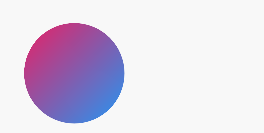
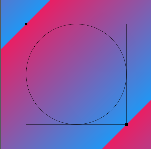
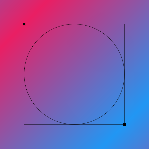
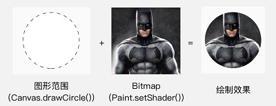
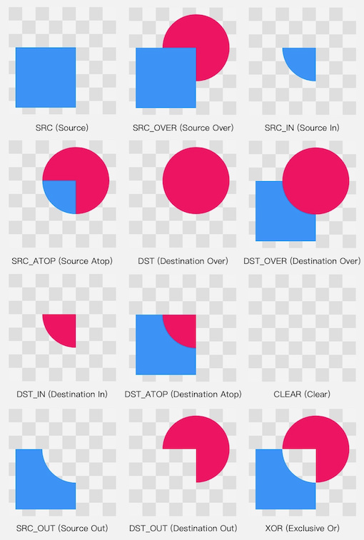
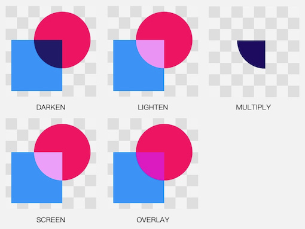

# HenCoder 笔记 - 自定义 View：Paint 详解

## 一、Shader

`Paint` 除了可以通过 `setColor()` / `setARGB()` 直接设置颜色外，还可以通过 `Shader` 来设置。  
当设置了 `Shader` 之后，`Paint` 在绘制图形和文字时就不使用通过 `setColor()` / `setARGB()` 设置的颜色了，而是使用方案 `Shader` 中的颜色。

在 Android 的绘制中，并不直接用 `shader` 这个类，而是用它的几个子类：

* `LinearGradient` 线性渐变
* `RadialGradient` 辐射渐变
* `SweepGradient` 扫描渐变
* `BitmapShader` 位图着色器
* `ComposeShader` 混合着色器

`Shader` 类本身代码很短，连同注释共百来行：

```java
/**
 * Shader is the based class for objects that return horizontal spans of colors
 * during drawing. A subclass of Shader is installed in a Paint calling
 * paint.setShader(shader). After that any object (other than a bitmap) that is
 * drawn with that paint will get its color(s) from the shader.
 */
public class Shader {
  // ...
  public enum TileMode {
    /**
     * replicate the edge color if the shader draws outside of its
     * original bounds
     */
    CLAMP   (0),
    /**
     * repeat the shader's image horizontally and vertically
     */
    REPEAT  (1),
    /**
     * repeat the shader's image horizontally and vertically, alternating
     * mirror images so that adjacent images always seam
     */
    MIRROR  (2);

    TileMode(int nativeInt) {
        this.nativeInt = nativeInt;
    }
    final int nativeInt;
  }
  // ...
}
```

### 1. LinearGradient 线性渐变

HenCoder上给出了一个范例，绘制代码是这样的

```java
Shader shader = new LinearGradient(100, 100, 500, 500,
                Color.parseColor("#E91E63"),
                Color.parseColor("#2196F3"),
                Shader.TileMode.CLAMP);
paint.setShader(shader);
// ...
canvas.drawCircle(300, 300, 200, paint);
```

绘制效果是这样的  

  

效果是感觉到了，但是具体是怎么绘制出来的感觉还是有点抽象。  
首先，上面使用的 `LinearGradient` 构造方法源码如下：

```java
/** Create a shader that draws a linear gradient along a line.
    @param x0       The x-coordinate for the start of the gradient line
    @param y0       The y-coordinate for the start of the gradient line
    @param x1       The x-coordinate for the end of the gradient line
    @param y1       The y-coordinate for the end of the gradient line
    @param  color0  The color at the start of the gradient line.
    @param  color1  The color at the end of the gradient line.
    @param  tile    The Shader tiling mode
*/
public LinearGradient(float x0, float y0, float x1, float y1, int color0, int color1, TileMode tile) {
    mType = TYPE_COLOR_START_AND_COLOR_END;
    mX0 = x0;
    mY0 = y0;
    mX1 = x1;
    mY1 = y1;
    mColor0 = color0;
    mColor1 = color1;
    mTileMode = tile;
    init(nativeCreate2(x0, y0, x1, y1, color0, color1, tile.nativeInt));
}
```

我们来添加一些绘制代码，最终如下

```java
Shader shader = new LinearGradient(100, 100, 500, 500,
        Color.parseColor("#E91E63"),
        Color.parseColor("#2196F3"),
        Shader.TileMode.CLAMP);           // 代码同上（标识 1）
paint.setShader(shader);                  // 代码同上
// ...
canvas.drawRect(0,0,600,600,paint);       // （标识 2）
canvas.drawCircle(300, 300, 200, paint);  // 代码同上（标识 3）
paint.setShader(null);
paint.setStyle(Paint.Style.STROKE);
canvas.drawRect(100,100,500,500,paint);
canvas.drawCircle(300, 300, 200, paint);
paint.setStrokeWidth(10);
canvas.drawPoint(100, 100, paint);
canvas.drawPoint(500, 500, paint);
```

注意上面的绘制坐标和顺序，最终效果图如下  

   

* 左上顶点的坐标就是构造方法中的 `x0` `y0`，该点后面的颜色就刚好是 `color0`；  
* 右下顶点的坐标就是构造方法中的 `x1` `y1`，该点后面的颜色就刚好是 `color1`；  
* 左上顶点再向左上方向，颜色值是完全一样的；  
* 右下顶点再向右下方向，颜色值是完全一样的；  
* 左上顶点到右下顶点的这段距离，就是颜色渐变的过程。
* 另外，标识3代码绘制的颜色，其实和盖住的那块颜色（由标识2代码绘制）是完全一样的。

再分析下标识1代码中的 `TileMode tile` 参数：  
（矩形和圆的绘制都是正常的，缩小后截图才看起来断断的）
* 如果改成 `Shader.TileMode.REPEAT`，效果是这样的  

* 如果改成 `Shader.TileMode.MIRROR`，效果是这样的   


**补充说明**  

其实`LinearGradient` 还有一个构造方法，源码如下：

```java
/** Create a shader that draws a linear gradient along a line.
    @param x0           The x-coordinate for the start of the gradient line
    @param y0           The y-coordinate for the start of the gradient line
    @param x1           The x-coordinate for the end of the gradient line
    @param y1           The y-coordinate for the end of the gradient line
    @param  colors      The colors to be distributed along the gradient line
    @param  positions   May be null. The relative positions [0..1] of
                        each corresponding color in the colors array. If this is null,
                        the the colors are distributed evenly along the gradient line.
    @param  tile        The Shader tiling mode
*/
public LinearGradient(float x0, float y0, float x1, float y1, int colors[], float positions[], TileMode tile) {
    if (colors.length < 2) {
        throw new IllegalArgumentException("needs >= 2 number of colors");
    }
    if (positions != null && colors.length != positions.length) {
        throw new IllegalArgumentException("color and position arrays must be of equal length");
    }
    mType = TYPE_COLORS_AND_POSITIONS;
    mX0 = x0;
    mY0 = y0;
    mX1 = x1;
    mY1 = y1;
    mColors = colors;
    mPositions = positions;
    mTileMode = tile;
    init(nativeCreate1(x0, y0, x1, y1, colors, positions, tile.nativeInt));
}
```

直接上代码

```java
int[] colors = new int[]{Color.RED, Color.GREEN, Color.BLUE};
float[] positions = null;                             // 对应下图左
float[] positions = new float[]{0.1f, 0.1f, 0.5f};    // 对应下图中
float[] positions = new float[]{0.5f, 0.1f, 0.1f};    // 对应下图右
Shader shader = new LinearGradient(100, 100, 500, 500,
        colors, positions, Shader.TileMode.CLAMP);
paint.setShader(shader);
// ... onDraw() 中的代码同上
```

  

*说实话，我也不知道 `positions` 参数具体是怎样用的。  
不过有一点确定的是，当 `positions` 值为 null 的时候，这些颜色沿梯度线均匀分布（由构造参数的注释可知）*

`RadialGradient`、`SweepGradient` 和 `LinearGradient` 的原理类似，不再赘述。

### 2. BitmapShader 位图着色器

使用Bitmap的像素来着色，而不是渐变。大概像这样：

```java
Bitmap bitmap = BitmapFactory.decodeResource(getResources(), R.drawable.batman);
        Shader shader = new BitmapShader(bitmap, Shader.TileMode.CLAMP, Shader.TileMode.CLAMP);
        paint.setShader(shader);
// ...
canvas.drawCircle(300, 300, 200, paint);      
```

  

上面绘制的是圆形，如果你想绘制成其他图案，原理也是一样的。

`BitmapShader` 只有一个构造参数：

```java
/**
 * Call this to create a new shader that will draw with a bitmap.
 * @param bitmap 用来做模板的 Bitmap 对象
 * @param tileX 横向的 TileMode
 * @param tileY 纵向的 TileMode.
 */
public BitmapShader(@NonNull Bitmap bitmap, TileMode tileX, TileMode tileY) {
    mBitmap = bitmap;
    mTileX = tileX;
    mTileY = tileY;
    init(nativeCreate(bitmap, tileX.nativeInt, tileY.nativeInt));
}
```

### 3.混合着色器

所谓混合着色器，就是把两个 `Shader` 一起使用。比如：


```java
// ComposeShader() 在硬件加速下是不支持两个相同类型的 shader 的
// 比如两个 BitmapShader
// 下面这行代码是用来关闭硬件加速的
setLayerType(LAYER_TYPE_SOFTWARE, null);

// 第一个 Shader ：蝙蝠侠头像
Bitmap bitmap1 = BitmapFactory.decodeResource(getResources(), R.drawable.batman);
Shader shader1 = new BitmapShader(bitmap1, Shader.TileMode.CLAMP, Shader.TileMode.CLAMP);
// 第二个 Shader ：蝙蝠侠Logo
Bitmap bitmap2 = BitmapFactory.decodeResource(getResources(), R.drawable.batman_logo);
Shader shader2 = new BitmapShader(bitmap2, Shader.TileMode.CLAMP, Shader.TileMode.CLAMP);
// 将 Shader 设置给 Paint
paint.setShader(new ComposeShader(shader1, shader2, PorterDuff.Mode.SRC_OVER));

//...
canvas.drawCircle(200, 200, 200, paint);
```

**构造参数**

```java
/** Create a new compose shader, given shaders A, B, and a combining PorterDuff mode.
    When the mode is applied, it will be given the result from shader A as its
    "dst", and the result from shader B as its "src".
    @param shaderA  The colors from this shader are seen as the "dst" by the mode 目标图像
    @param shaderB  The colors from this shader are seen as the "src" by the mode 源图像
    @param mode 指定shaderA和shaderB共同绘制时的颜色策略
*/
public ComposeShader(Shader shaderA, Shader shaderB, PorterDuff.Mode mode) {
    mType = TYPE_PORTERDUFFMODE;
    mShaderA = shaderA;
    mShaderB = shaderB;
    mPorterDuffMode = mode;
    init(nativeCreate2(shaderA.getNativeInstance(), shaderB.getNativeInstance(),
            mode.nativeInt));
}
```
`PorterDuff.Mode` 是一个 `enum`，不同的枚举值表示不同的颜色策略。  
对于 `ComposeShader(shaderA, shaderB, mode)` 来说，就是指应该怎样把 `shaderB` 绘制在 `shaderA` 上从而得到一个两者结合后的 `shader`。  

下面列举几种：  

* `SRC_OVER`：把源图像直接铺在目标图像上（如上图）  


* `DST_OUT`：只绘制目标图像，区域是它和源图像 **非重合部分**（挖空效果）  


* `DST_IN`：只绘制目标图像，区域是它和源图像 **重合部分**（蒙版抠图）  


一共有18个枚举值，可以分为两类：

* Alpha Composition 透明度合成
* Blending 混合

> Alpha 合成，操作的是 **Alpha通道** 。  
> 其实就是 「PorterDuff」 这个词所指代的算法。   

>>「PorterDuff」 并不是一个具有实际意义的词组，而是两个人的名字（准确讲是姓）。这两个人当年共同发表了一篇论文，描述了 12 种将两个图像共同绘制的操作（即算法）。而这篇论文所论述的操作，都是关于 Alpha 通道（也就是我们通俗理解的「透明度」）的计算的，后来人们就把这类计算称为Alpha 合成 ( Alpha Compositing )  

> 混合，操作的是 **颜色本身** 。  
> 这个和「PorterDuff」没什么关系，  
> 被 Google 加进 `PorterDuff.Mode` 是为了使用的方便。

下面是 Google 官方文档解析：

* 源图像和目标图像  


* Alpha 合成   


* 混合  


对于上述这些 `Mode`，正确做法是：  
* Alpha 合成类操作，掌握并灵活运用。
* 记住就好

## setColorFilter(ColorFilter colorFilter)

`ColorFilter` 类：为绘制设置颜色过滤。所谓颜色过滤，就是为绘制的内容设置一个统一的过滤策略，然后在 `canvas.drawXxx()` 方法中对每个像素都进行过滤后再绘制出来。该类源码如下：  

```java
/**
 * A color filter can be used with a {@link Paint} to modify the color of
 * each pixel drawn with that paint. This is an abstract class that should
 * never be used directly.
 */
public class ColorFilter {
    /**
     * Holds the pointer to the native SkColorFilter instance.
     *
     * @hide
     */
    public long native_instance;

    @Override
    protected void finalize() throws Throwable {
        try {
            super.finalize();
        } finally {
            destroyFilter(native_instance);
            native_instance = 0;
        }
    }

    static native void destroyFilter(long native_instance);
}
```

正如注释中所说，`ColorFilter` 类并不直接使用，而是使用它的子类。

* `LightingColorFilter`
* `PorterDuffColorFilter`
* `ColorMatrixColorFilter`

### 1. LightingColorFilter

该类可用来模拟简单的光照效果，构造方法如下：

```java
/**
 * Create a colorfilter that multiplies the RGB channels by one color,
 * and then adds a second color. The alpha components of the mul and add
 * arguments are ignored.
 * @params mul 用来和目标像素相乘
  * @params add 用来和目标像素相加
 */
public LightingColorFilter(int mul, int add) {
    mMul = mul;
    mAdd = add;
    update();
}
```
**`mul` 和 `add` 都是和颜色值格式相同的 int 值。**  
  


---------
