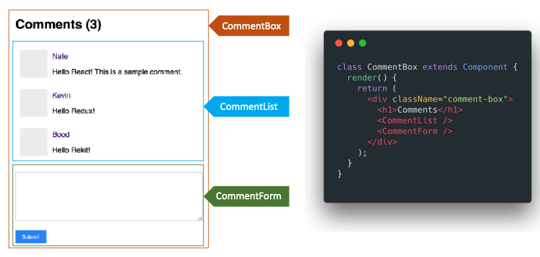

# React 实战进阶：02 以组件方式考虑 UI 的构建

## 以组件方式思考 UI 的构建



### 理解 React 组件

```
props + state => view
```

1. React 组件一般不提供方法，而是某种状态机
2. React 组件可以理解为一个纯函数
3. 单向数据绑定


### 创建一个简单的组件：TabSelect


1. 创建静态 UI
2. 考虑组件的状态组成
3. 考虑组件的交互方式

### 受控组件 vs 非受控组件

#### 受控组件

表单元素状态由使用者维护。

```html
<input
  type="text"
  value={this.state.value}
  onChange={evt => {
    this.setState({ value: evt.target.value })
  }}
/>
```

#### 非受控组件

表单元素状态 DOM 自身维护

```html
<input
  type="text"
  ref={node => this.input = node}
/>
```


## 何时创建组件：单一职责原则

1. 每个组件只做一件事
2. 如果组件变得复杂，那么应该拆分成小组件


## 数据状态管理：DRY 原则

1. 能计算得到的状态就不要单独存储
2. 组件尽量无状态，所需数据通过 props 获取
