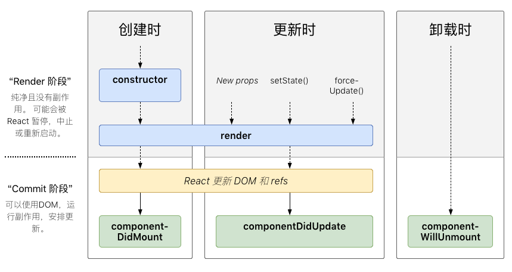
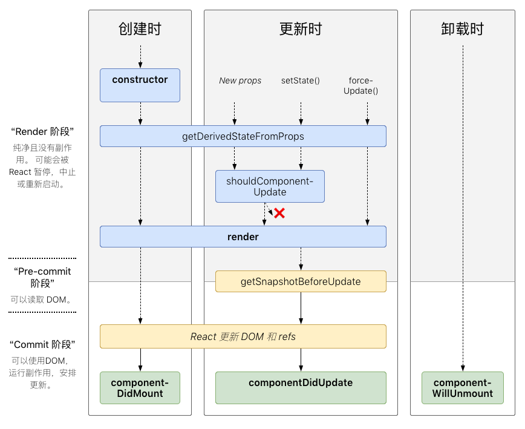

# React 实战进阶 - React 组件的生命周期及其使用场景

React V16.4 生命周期图 (无不常用的)：

React V16.4 生命周期图 (含不常用的)：

图片来源：[http://projects.wojtekmaj.pl/react-lifecycle-methods-diagram/](http://projects.wojtekmaj.pl/react-lifecycle-methods-diagram/)

## 理解 React 组件的生命周期方法

### constructor

1. 用于初始化内部状态，很少使用
2. 唯一可以直接修改 state 的地方

### getDerivedStateFromProps

1. 当 state 需要从 props 初始化时使用
2. 尽量不要使用：维护两者状态一致性会增加复杂度
3. 每次 render 都会调用
4. 典型场景：表单控件获取默认值

### componentDidMount

1. UI 渲染完成后调用
2. 只执行一次
3. 典型场景：获取外部资源

### componentWillUnmount

1.组件移除时被调用
2.典型场景：资源释放

### getSnapshotBeforeUpdate

1. 在页面 render 之前调用，state 已更新
2. 典型场景：获取 render 之前的 DOM 状态

### componentDidUpdate

1. 每次 UI 更新时被调用
2. 典型场景：页面需要根据 props 变化重新获取数据

### shouldComponentUpdate

1. 决定 Virtual DOM 是否要重绘
2. 一般可以由 PureComponent 自动实现
3. 典型场景：性能优化

## 理解生命周期的使用场景

## Demo
