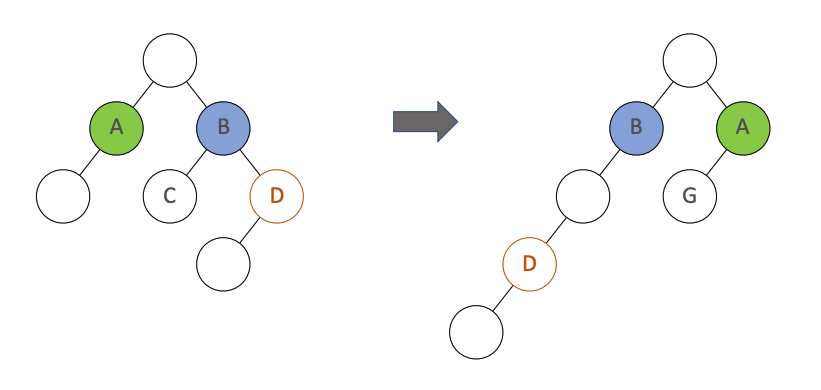
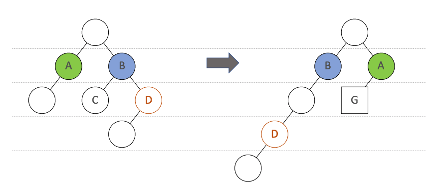
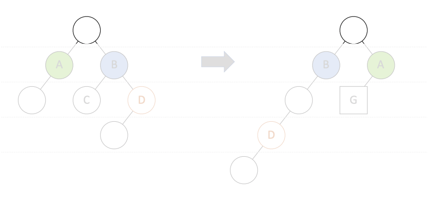
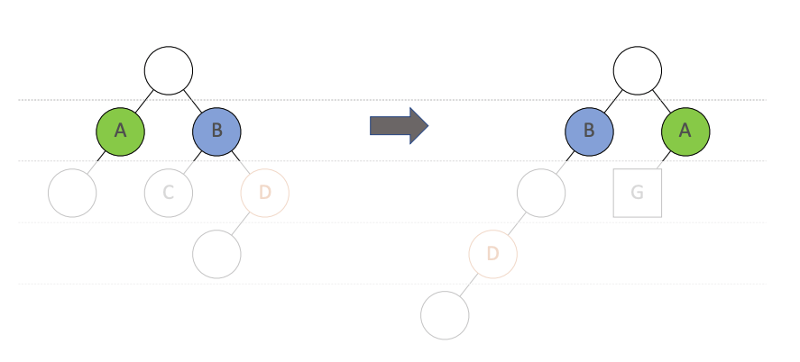
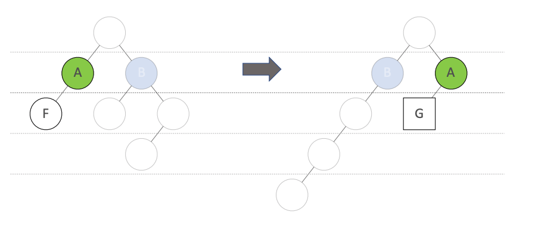
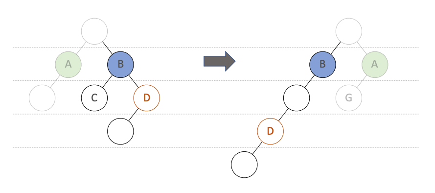

# React 实战进阶：05 理解 Virtual DOM 的工作原理，理解 key 属性的作用

## JSX 的运行基础：Virtual DOM

### 虚拟 DOM 是如何工作的

### 广度优先分层比较

### 根节点开始比较

### 属性变化及顺序

### 节点类型发生变化

### 节点跨层移动

## 虚拟 DOM 的两个假设

1. 组件的 DOM 结构是相对稳定的
2. 类型相同的兄弟节点可以被唯一标识

## Demo

## 小结

算法复杂度 O(n)

虚拟 DOM 如何计算 diff

key 属性的作用
