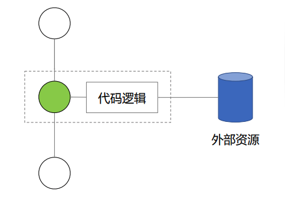
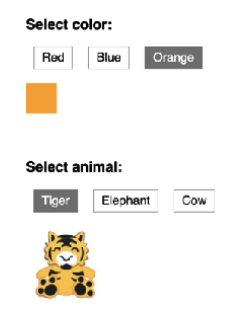

# React 实战进阶 - 组件复用的其它形式：高阶组件和函数作为子组件

## 高阶组件



```jsx
const EnhancedComponent =
  hignerOrderComponent(WrappedComponent)
```

高阶组件接受组件作为参数，返回新的组件。

Demo:


## 函数作为子组件

```jsx
class MyComponent extends React.Component {
  render() {
    return (
      <div>
        { this.props.children('Nate Wang') }
      </div>
    )
  }
}

<MyComponent>
  { name => <div>{name}</div> }
</MyComponent>
```




Demo:


## 小结

1. 高阶组件和函数子组件都是设计模式
2. 可以实现更多场景的组件复用
