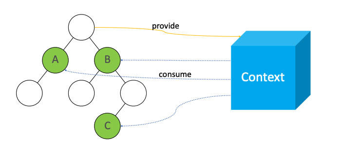

# React 实战进阶：07 理解新的 Context API 及其使用场景

## React 16.3 新特性：Context API



```js
const ThemeContext = React.createContext('light')

class App extends React.Component {
  render() {
    return (
      <ThemeContext.Provider value='dark'>
        <ThemeButton />
      </ThemeContext.Provider>
    )
  }
}

function ThemeButton(props) {
  return (
    <ThemeContext.Consumer>
      { theme => <Button {...props} theme={theme} /> }
    </ThemeContext.Consumer>
  )
}
```

Demo:


## 小结

1. Context API 的使用方法
2. 使用场景
