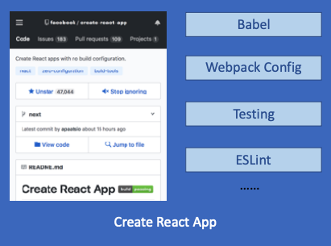
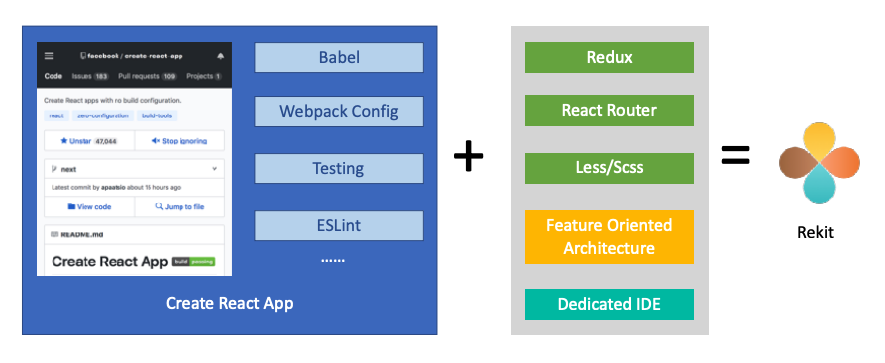
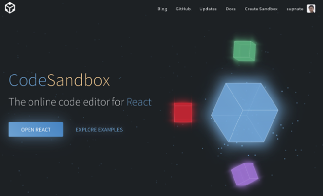

# React 实战进阶 - 使用脚手架工具创建 React 项目：Create React App，Rekit，Codesandbox

## 为什么需要脚手架工具

* React
* Redux
* React-Router
* Babel
* Webpack
* ESLint

## 脚手架工具及其使用场景

### create-react-app

### Rekit

### Online: Codesandbox.io

Demo:
