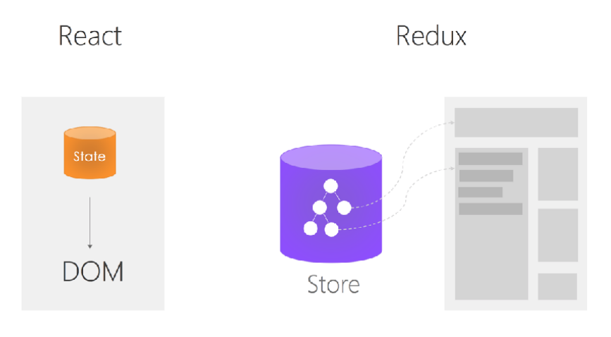
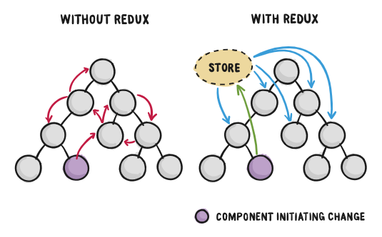
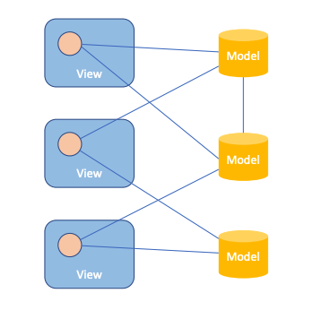
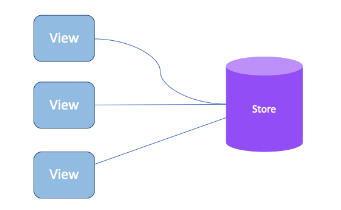

# React 实战进阶 - Redux(1) 前端为何需要状态管理库



## 为什么需要 Redux

### Redux 让组件通信更加容易



图片来源：[https://css-tricks.com/learning-react-redux/](https://css-tricks.com/learning-react-redux/)


## Redux 的三个特性

### Single Source of Truth






### 可预测性


### 可预测性

```js
function todos(state = [], action) {
  switch (action.type) {
    case ADD_TODO:
      return [
        ...state,
        {
          text: action.text,
          completed: false
        }
      ]
    case TOGGLE_TODO:
      return state.map((todo, index) => {
        if (index === action.index) {
          return Object.assign({}, todo, {
            completed: !todo.completed
          })
        }
        return todo
      })
    default:
      return state
  }
}
```
