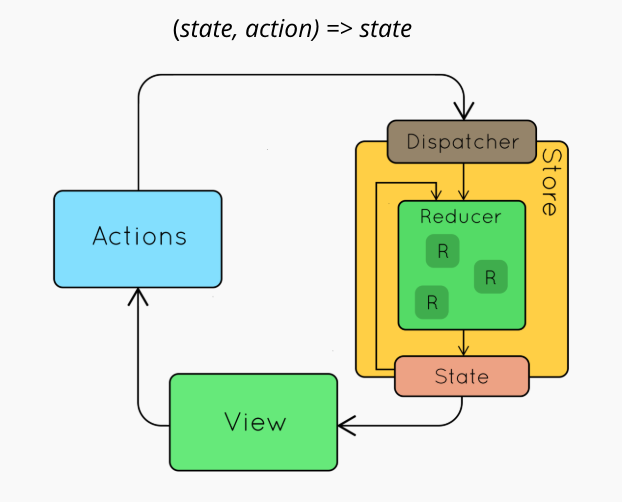
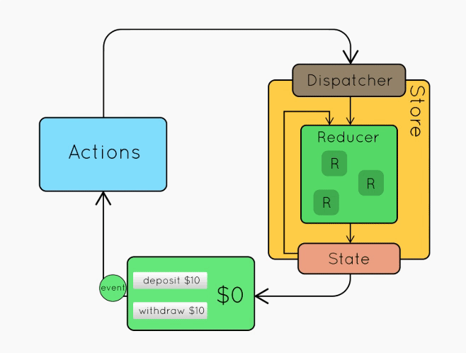
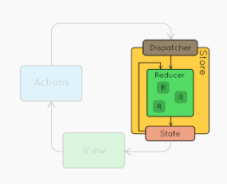
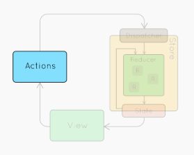
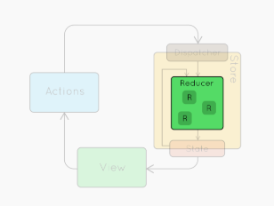
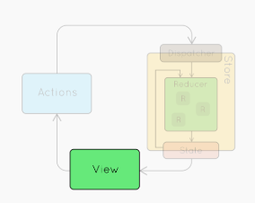

# React 实战进阶：11 Redux(2) 深入理解 Store，action，reducer


## Redux 的基本概念





图片来源：[https://slides.com/jenyaterpil/redux-from-twitter-hype-to-production](https://slides.com/jenyaterpil/redux-from-twitter-hype-to-production)

(state, action) => new state

* Store
* Actions
* Reducer
* View

### 理解 Store



```js
const store = createStore(reducer)
```

1. getState()
2. dispatch(action)
3. subscribe(listener)


### 理解 action



```js
{
  type: ADD_TODO,
  text: 'Build my first Redux app',
}
```


### 理解 reducer



```js
function todoApp(state = initialState, action) {
  switch (action.type) {
    case ADD_TODO:
      return Object.assign({}, state, {
        todos: [
          ...state.todos,
          {
            text: action.text,
            completed: false,
          }
        ]
      })
    default:
      return state
  }
}
```


### 理解 View



```jsx
const App = () => (
  <div>
    <AddTodo />
    <VisibleTodoList />
    <Footer />
  </div>
)
```


### 理解 combineReducers

```js
export default function todos(state = [], action) {
  switch (action.type) {
    case 'ADD_TODO':
      return state.concat([action.text])
    default:
      return state
  }
}
```


```js
export default function counter(state = 0, action) {
  switch (action.type) {
    case 'INCREMENT':
      return state + 1
    case 'DECREMENT':
      return state - 1
    default:
      return state
  }
}
```


```js
import { combineReducers } from 'redux'
import todos from './todos'
import counter from './counter'

export default combineReducers({
  todos,
  counter,
})
```


### 理解 bindActionCreators

```js
function addTodoWithDispatch(text) {
  const action = {
    type: ADD_TODO,
    text,
  }
  dispatch(action)
}
```


```js
dispatch(addTodo(text))
dispatch(completeTodo(index))
```

```js
const boundAddTodo = text => dispatch(addTodo(text))
const boundCompleteTodo = index => dispatch(completeTodo(index))
```

```js
function bindActionCreator(actionCreator, dispatch) {
  return function() {
    return dispatch(actionCreator.apply(this, arguments))
  }
}

function bindActionCreators(actionCreators, dispatch) {
  const keys = Object.keys(actionCreators)
  const boundActionCreators = {}
  for (let i = 0; i < keys.length; i++) {
    const key = keys[i]
    const actionCreator = actionCreators[key]
    if (typeof actionCreator === 'function') {
      boundActionCreators[key] = bindActionCreator(actionCreator, dispatch)
    }
  }
  return boundActionCreators
}
```


Demo
