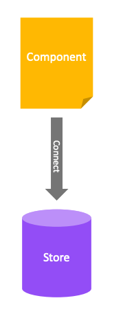
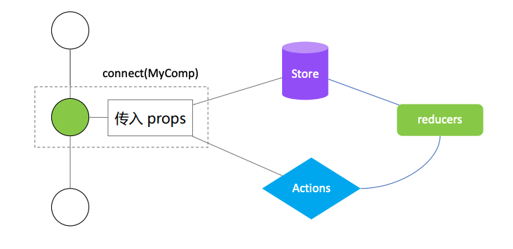

# React 实战进阶 - Redux(3) 在 React 中使用 Redux




```js
import { Provider, connect } from "react-redux";

// Action creator
function plusOne() {
  // action
  return { type: "PLUS_ONE" };
}

function minusOne() {
  return { type: "MINUS_ONE" };
}

export class Counter extends React.Component {
  // ...
}

function mapStateToProps(state) {
  return {
    count: state.count
  };
}

function mapDispatchToProps(dispatch) {
  return bindActionCreators({ plusOne, minusOne }, dispatch);
}

const ConnectedCounter = connect(mapStateToProps, mapDispatchToProps)(Counter);
```


## connect 的工作原理：高阶组件



