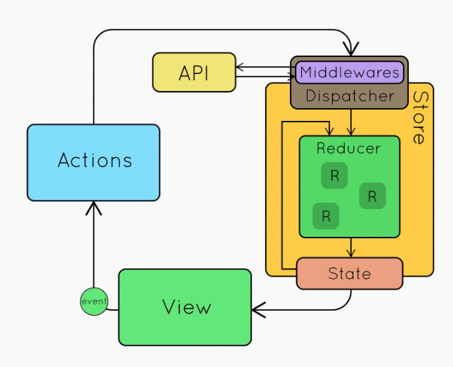

# React 实战进阶 - Redux(4) 理解异步 action，Redux 中间件

## Redux 异步请求

* Middlewares

## Redux 中间件：Middleware

1. 截获 action
2. 发出 action

Demo

## 小结

1. 异步 action 不是特殊 action，而是多个同步 action 的组合使用
2. 中间件在 dispatcher 中截获 action 做特殊处理
