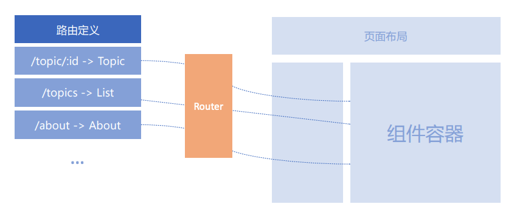

# React 实战进阶：16 React Router(1) 路由不只是页面切换，更是代码组织方式

## 前端路由是什么

### 为什么需要路由

1. 单页应用需要进行页面切换
2. 通过 URL 可以定位到页面
3. 更有语义的组织资源


### 路由实现的基本架构




## React Router 如何实现路由

### React Router 的实现

```jsx
<Router>
  <div>
    <ul id="menu">
      <li><Link to="/home">Home</Link></li>
      <li><Link to="/hello">Hello</Link></li>
      <li><Link to="/about">About</Link></li>
    </ul>

    <div id="page-container">
      <Route path="/home" component={Home} />
      <Route path="/hello" component={Hello} />
      <Route path="/about" component={About} />
    </div>
  </div>
</Router>
```


### React Router 的特性

1. 声明式路由定义
2. 动态路由

```jsx
const App = () => {
  <div>
    <nav><Link to="/dashboard">Dashboard</Link></nav>
    <div><Route path="/dashboard" component={Dashboard} /></div>
  </div>
}
```


### 三种路由实现方式

1. URL 路径
2. hash 路由
3. 内存路由


## 基于路由思考资源的组织

1. 实现业务逻辑的松耦合
2. 易于扩展，重构和维护
3. 路由层面实现 Lazy Load


## React Router 核心 API

* `<Link>`：普通链接，会触发浏览器刷新。
* `<NavLink>`：类似 Link 但是会添加当前选中状态。
* `<Prompt>`：满足条件时提示用户是否离开当前页面。
* `<Redirect>`：重定向当前页面，例如登录判断。
* `<Route>`：路由配置的核心标记，路径匹配时显示对应组件。
* `<Switch>`：只显示第一个匹配的路由。

### `<Link>`

普通链接，会触发浏览器刷新。

```jsx
import { Link } from 'react-router-dom'

<Link to="/about">About</Link>
```


### `<NavLink>`

类似 Link 但是会添加当前选中状态。

```jsx
<Link
  to="/faq"
  activeClassName="selected"
>
  About
</Link>
```


### `<Prompt>`

满足条件时提示用户是否离开当前页面。

```jsx
import { Prompt } from 'react-router'

<Prompt
  when={fromIsHalfFilledOut}
  message="Are you sure to leave ?"
/>
```


### `<Redirect>`

重定向当前页面，例如登录判断。

```jsx
import { Route, Redirect } from 'react-router'

<Route
  exact
  path="/"
  render={() => {
    loggedIn ? (
      <Redirect to="/dashboard"/>
    ) : (
      <PublicHomePage />
    )
  }}
/>
```


### `<Route>`

路由配置的核心标记，路径匹配时显示对应组件。

```jsx
import { BrowserRouter as Router, Route } from 'react-router'

<Router>
  <div>
    <Route exact path="/" component={Home} />
    <Route path="/news" component={NewsFeed} />
  </div>
</Router>
```


### `<Switch>`

只显示第一个匹配的路由。


```jsx
import { Switch, Route } from 'react-router'

<Switch>
  <Route exact path="/" component={Home} />
  <Route path="/about" component={About} />
  <Route path="/:user" component={User} />
  <Route component={NoMatch} />
</Switch>
```
