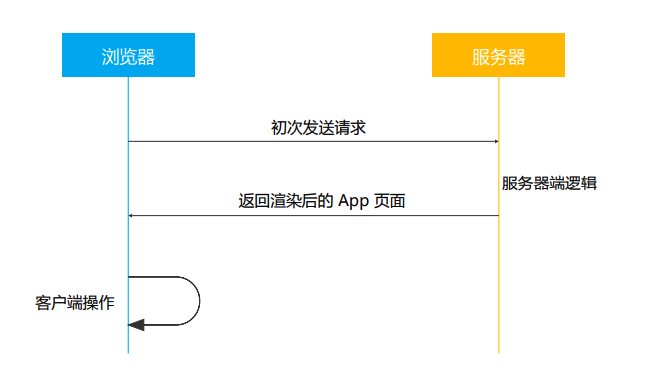
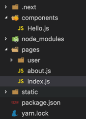

# React 实战进阶 - 
使用 Next.js 创建服务器渲染的 React 应用


## 同构应用的概念

### 什么是同构应用




## Next.js 的基本用法

### 创建页面



1. 页面就是 pages 目录下的一个组件
2. static 目录映射静态文件
3. page 具有特殊静态方法 getInitialProps


### 在页面中使用其它 React 组件

1. 页面也是标准的 node 模块，可使用其它 React 组件。
2. 页面会针对性打包，仅包含其引入的组件。


### 使用 Link 实现同构路由

```jsx
import Link from 'next/link'

export default () => {
  <div>
    Click{' '}
    <Link href="/about"><a>here</a></Link>
    {' '}to read more
  <div>
}
```

1. 使用 `'next/link'` 定义链接。
2. 点击链接时页面不会刷新。
3. 使用 prefetch 预加载目标资源。
4. 使用 replace 属性替换 URL。


### 动态加载页面

```jsx
import dynamic from 'next/dynamic'

const DynamicComponentWithCustomLoading = dynamic(
  import('../components/hello2'),
  {
    loading: () => <p>...</p>,
  }
)

export default () => (
  <div>
    <Header />
    <DynamicComponentWithCustomLoading />
    <p>HOME PAGE is here!</p>
  </div>
)
```

Demo
