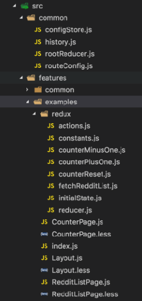
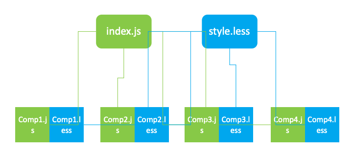
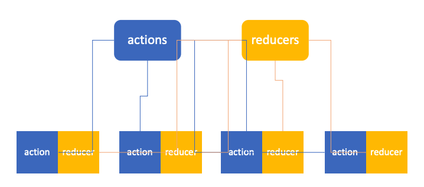

# React 实战进阶 - 拆分复杂度(2) 如何组织 component，action 和 reducer

## 文件夹结构

* 按 feature 组织源文件
* 组件和样式文件同一级
* Redux 单独文件夹
* 单元测试保持同样目录结构放在 tests 文件夹

## 组件和样式

## 组织 Action 和 Reducer

## 小结

1. 按 feature 组织组件，action 和 reducer
2. 使用 root loader 加载 feature 下的各个资源
3. 做到高内聚松耦合
