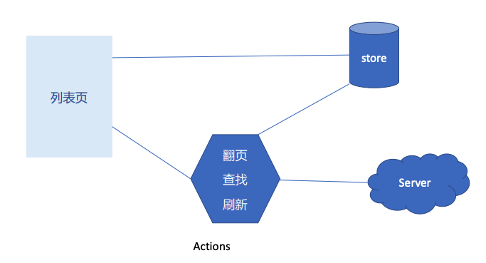
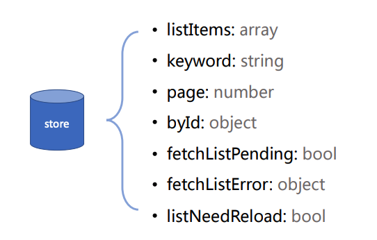
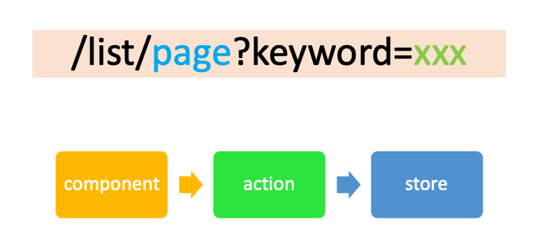

# React 实战进阶 - 列表页(1)：搜索，数据缓存和分页

## 页面数据逻辑

### 开发列表也要考虑的技术要点

1. 如何翻页
2. 如何进行内容搜索
3. 如何缓存数据
4. 何时进行页面刷新

### 列表页的数据模型

## Redux Store 设计

### Store 模型

## URL 设计以及和 Store 同步

## 翻页，搜索等功能的实现

Demo
