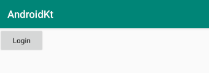
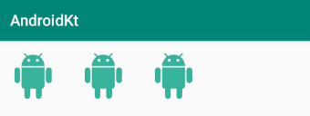
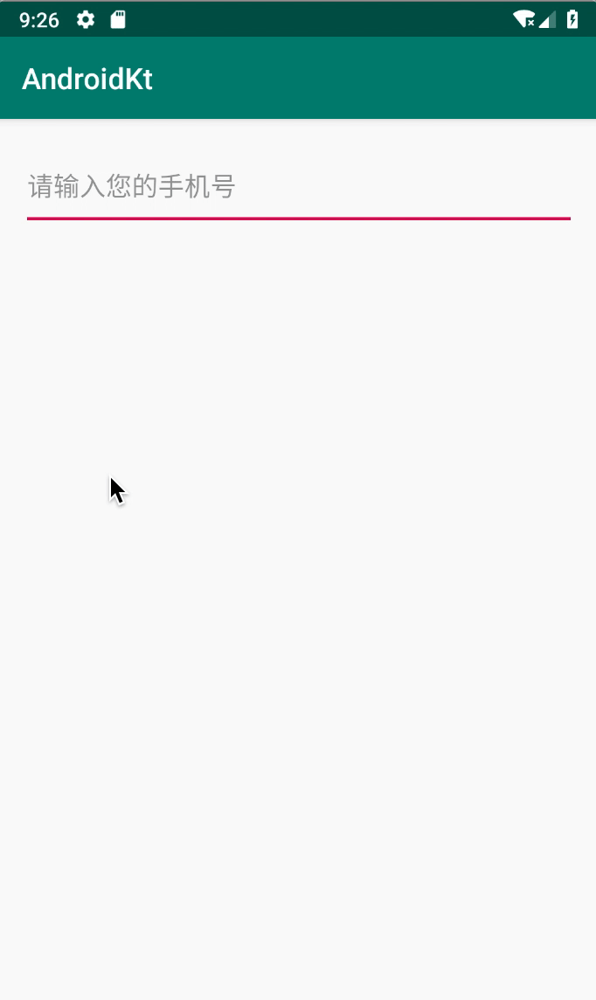
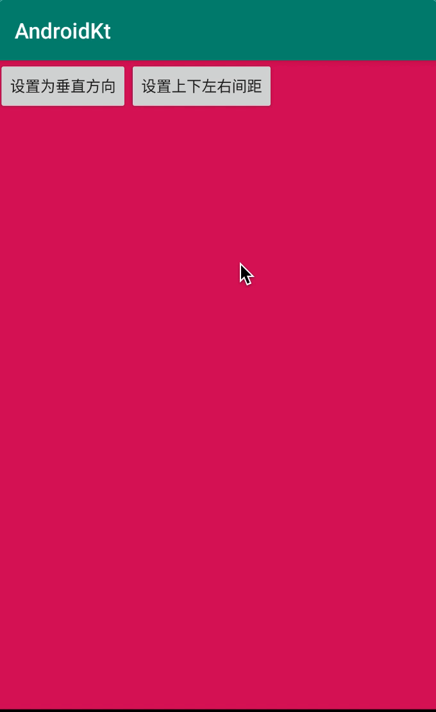

# 一篇文章了解 Kotlin 在 Android 中的基本使用 

## 概述 

文章主要着重于 Kotlin 在 Android 中的应用以及与 Java 在使用过程中的对比，省略了一些 Android 基础知识内容的讲解，所以较适于有 Java 开发 Android 基础的读者进行阅读。

文章主要以示例代码为主，适当穿插 Kotlin 语法讲解为辅，内容顺序大致为：

* 控件的基本使用
* 

## 按钮 Button

`activity_main.xml` 和 `MainActivity.kt` 代码如下：

```xml
<?xml version="1.0" encoding="utf-8"?>
<LinearLayout
    xmlns:android="http://schemas.android.com/apk/res/android"
    xmlns:tools="http://schemas.android.com/tools"
    xmlns:app="http://schemas.android.com/apk/res-auto"
    android:layout_width="match_parent"
    android:layout_height="match_parent"
    tools:context=".MainActivity">

    <Button
        android:id="@+id/button"
        android:layout_width="wrap_content"
        android:layout_height="wrap_content"
        android:textAllCaps="false"
        android:text="Login"/>
</LinearLayout>
```

```kotlin
class MainActivity : AppCompatActivity(), View.OnClickListener {

    private lateinit var mButton: Button

    override fun onCreate(savedInstanceState: Bundle?) {
        super.onCreate(savedInstanceState)
        setContentView(R.layout.activity_main)

        mButton = findViewById(R.id.button)
    }
}
```



按钮事件有三种编码方式：匿名函数、内部类、接口实现。

**1. 匿名函数**

```kotlin
mButton.setOnClickListener { view ->
    Log.i(TAG, "匿名函数：点击了 ${(view as Button).text} 按钮")
}

mButton.setOnLongClickListener { view ->
    Log.i(TAG, "匿名函数：长按了 ${(view as Button).text} 按钮")
    true
}
```

点击事件的函数代码被 `->` 符号分成了两部分：

* 前一部分的 `view` 表示点击事件的视图入参，类型为 `View`。
* 后一部分则为处理点击事件的具体函数体代码。  

因为 `view` 的类型为 `View`，所以想要获取按钮的 `text` 文本属性时，需要通过 `as` 将类型强制转换为 `Button`。在拼接按钮文本字符串时，可以通过字符串模板表达式 `${***}` 语法进行拼接。

你也可以省略 `view` 参数，用默认的 `it` 来代替，示例如下：

```kotlin
mButton.setOnClickListener {  
    Log.i(TAG, "匿名函数：点击了 ${(it as Button).text} 按钮")
}

mButton.setOnLongClickListener { 
    Log.i(TAG, "匿名函数：长按了 ${(it as Button).text} 按钮")
    true
}
```


**2. 内部类**

如果事件处理代码较多或想尽可能的复用时，我们可以使用匿名内部类的方式处理事件。先定义一个内部类，实现相应接口后再编写事件处理代码。示例如下：

```kotlin
private inner class MyClickListener: View.OnClickListener {

    override fun onClick(view: View?) {
        Log.i(TAG, "内部类：点击了 ${(view as Button).text} 按钮")
    }
}

private inner class MyLongClickListener: View.OnLongClickListener {

    override fun onLongClick(view: View?): Boolean {
        Log.i(TAG, "内部类：长按了 ${(view as Button).text} 按钮")
        return true
    }
}

mButton.setOnClickListener(MyClickListener())
mButton.setOnLongClickListener(MyLongClickListener())
```


**3. 接口实现**

内部类方式虽然能使得代码尽可能复用，但如果每个事件都定义新的内部类会显得比较麻烦。处理按钮事件还有另外一种方式，让 `Activity` 类实现事件监听器的接口并重写相应方法来编写事件处理代码。完整代码如下：

```kotlin
class MainActivity : AppCompatActivity(), View.OnClickListener, View.OnLongClickListener {

    private val TAG = "MainActivity"

    private lateinit var mButton: Button

    override fun onCreate(savedInstanceState: Bundle?) {
        super.onCreate(savedInstanceState)
        setContentView(R.layout.activity_main)

        mButton = findViewById(R.id.button)

        mButton.setOnClickListener(this)
        mButton.setOnLongClickListener(this)
    }

    override fun onClick(view: View) {
        if (view.id == R.id.button) {
            Log.i(TAG, "接口实现：点击了 ${(view as Button).text} 按钮")
        }
    }

    override fun onLongClick(view: View): Boolean {
        if (view.id == R.id.button) {
            Log.i(TAG, "接口实现：长按了 ${(view as Button).text} 按钮")
        }
        return true
    }
}
```

接口实现方式适用于要设置的事件比较多的场景，在事件处理逻辑中我们可以根据 `view.id` 判断是哪个按钮或哪个 `View` 接收到的事件再做相应处理。但这样做的话很容易写出面条式的代码，所以建议尽量使用匿名函数的方式处理事件，代码逻辑清晰，对阅读代码的人来说显得更加友好。


## 复选框 CheckBox

在了解如何通过 Kotlin 使用 `CheckBox` 之前，先介绍下复合按钮 `CompoundButton` 的概念。`CompoundButton` 是一个继承自 `Button` 并实现了 `Checkable` 接口的抽象类，其常用派生类主要有 `CheckBox`、`RadioButton` 和 `Switch`。而 `Button` 则继承自 `TextView`，`TextView` 继承自 `View`。 

```java
public class TextView extends View implements ViewTreeObserver.OnPreDrawListener { /*...*/ }
public class Button extends TextView { /*...*/ }
public abstract class CompoundButton extends Button implements Checkable { /*...*/ }

public class CheckBox extends CompoundButton { /*...*/ }
public class RadioButton extends CompoundButton { /*...*/ }
public class Switch extends CompoundButton { /*...*/ }

/**
 * Defines an extension for views that make them checkable.
 *
 */
public interface Checkable {
    
    /**
     * Change the checked state of the view
     * 
     * @param checked The new checked state
     */
    void setChecked(boolean checked);
        
    /**
     * @return The current checked state of the view
     */
    boolean isChecked();
    
    /**
     * Change the checked state of the view to the inverse of its current state
     *
     */
    void toggle();
}
```

从上述源码中可以看出，复合按钮的勾选状态有两个相关的 Java 方法：

* `setCheck`: 设置按钮勾选状态。
* `isChecked`: 判断按钮是否已勾选。

在 Kotlin 中，这两个方法被统一成 `isChecked` 属性，在 Android 中好友很多类似的情况，列举如下：

说明 | Kotlin 状态属性 | Java 状态获取和设置方法
-- |-- | --
是否勾选 | `isChecked` | `isChecked` / `setChecked`
是否允许点击 | `isClickable` | `isClickable` / `setClickable`
是否可用 | `isEnabled` | `isEnabled` / `setEnabled`
是否可获得焦点 | `isFocusable` | `isFocusable` / `setFocusable`
是否按下 | `isPressed` | `isPressed` / `setPressed`
是否允许长按 | `isLongClickable` | `isLongClickable` / `setLongClickable`
是否已选择 | `isSelected` | `isSelected` / `setSelected`

下面实现一个 `CheckBox` 的小示例，点击改变复选框勾选状态时打印出修改后的状态（省略非关键代码）：

```kotlin
mCheckBox = findViewById(R.id.checkbox)
mCheckBox.setOnCheckedChangeListener { compoundButton, isChecked ->
    // compoundButton.isChecked
    Log.i(TAG, "文字为 ${compoundButton.text} 的 CheckBox 勾选状态变为 $isChecked")
}
```

## 单选按钮 RadioButton

单选按钮的意思是：在一组按钮中只能选择其中一项，不能多选。在实际开发中，我们需要布局中需要使用 `RadioGroup` 包含这一组 `RadioButton`。`RadioGroup` 继承自 `LinearLayout`，所以我们可以通过 `orientation` 属性来指定这一组按钮是横向排列还是竖向排列，也可以在 `RadioGroup` 布局中放置其它如 `TextView`、`ImageView` 等组件。

**有没有想过 `RadioGroup` 是如何显示只能选中一个 `RadioButton` 的？**

在 `RadioGroup` 中有一个实现了 `CompoundButton.OnCheckedChangeListener` 的内部类 `CheckedStateTracker`，负责处理其节点下每个 `RadioButton` 的勾选状态变化事件。在 `RadioGroup` 的两个构造方法中，最后都会调用下面的 `init()` 方法：

```java
private void init() {
    // 初始化勾选状态变更监听器
    mChildOnCheckedChangeListener = new CheckedStateTracker();
    // 设置布局层级变化监听器
    mPassThroughListener = new PassThroughHierarchyChangeListener();
    super.setOnHierarchyChangeListener(mPassThroughListener);
}
```

在 `PassThroughHierarchyChangeListener` 中：

* `onChildViewAdded`: 如果是 `child` 是在当前 `ViewGroup` 节点下且是 `RadioButton` 的实例，则将其强转为 `RadioButton` 并设置其 `OnCheckedChangeListener` 属性为 `mChildOnCheckedChangeListener`。 
* `onChildViewRemoved`: 如果是 `child` 是在当前 `ViewGroup` 节点下且是 `RadioButton` 的实例，则将其强转为 `RadioButton` 并设置其 `OnCheckedChangeListener` 属性为 `null`。

注意：因为在 `mChildOnCheckedChangeListener` 中需要根据 `id` 去将其它 `RadioButton` 的勾选状态设置为 `false` 并回调 `OnCheckedChangeListener`，所以在强转前如果 `child` 的 `id` 为 `View.NO_ID` 的话，需要通过 `View.generateViewId()` 去生成一个。

```java
public interface OnCheckedChangeListener {
  public void onCheckedChanged(RadioGroup group, @IdRes int checkedId);
}
```

下面的示例代码演示了如何设置 `RadioGroup` 的 `OnCheckedChangeListener`：

```xml
<RadioGroup
    android:id="@+id/radio_group"
    android:layout_width="match_parent"
    android:layout_height="match_parent"
    android:checkedButton="@id/btn2">
    <RadioButton
        android:id="@+id/btn1"
        android:layout_width="wrap_content"
        android:layout_height="wrap_content"/>
    <RadioButton
        android:id="@+id/btn2"
        android:layout_width="wrap_content"
        android:layout_height="wrap_content"/>
</RadioGroup>
```

```kotlin
mRadioGroup = findViewById(R.id.radio_group)
mRadioGroup.setOnCheckedChangeListener { group, checkedId ->
    val desc = when (checkedId) {
        R.id.btn1 -> "按钮1"
        R.id.btn2 -> "按钮2"
        else -> "--"
    }
    Log.i(TAG, "OnCheckedChangeListener: desc = $desc")
}
```


## 文本视图 TextView

用 Kotlin 实现一个 `TextView` 文字滚动效果：

```kotlin
// 以下两行代码等价
// val textView: TextView = findViewById(R.id.text_view)
// val textView = findViewById<TextView>(R.id.text_view)

val textView: TextView = findViewById(R.id.text_view)
textView.text = "从前有座山，山上有座庙。"
textView.textSize = 18F
textView.gravity = Gravity.LEFT or Gravity.CENTER
textView.ellipsize = TextUtils.TruncateAt.MARQUEE
textView.isFocusable = true
textView.isFocusableInTouchMode = true
textView.marqueeRepeatLimit = -1
textView.setTextColor(Color.BLACK)
textView.setBackgroundColor(Color.YELLOW)
textView.setSingleLine(true)
```


从上面的实例代码可以看出，`TextView` 的部分属性允许直接赋值，部分属性仍需要通过方法进行设置。还有一点值得提一下，在 Java 中设置文本对齐方式的代码是这样的：

```java
textView.setGravity(Gravity.LEFT | Gravity.CENTER)
```

而在 Kotlin 中是这样的：

```kotlin
textView.gravity = Gravity.LEFT or Gravity.CENTER
```

在 Kotlin 中有一个 `infix` 中缀表示法的概念，即标有 `infix` 关键字的函数在调用时可忽略点与圆括号。Java 中所有的位运算操作符 (含 `|`) 在 Kotlin 中都可以使用中缀运算符进行表示。

```kotlin
public infix fun shl(bitCount: Int): Int
public infix fun shr(bitCount: Int): Int
public infix fun ushr(bitCount: Int): Int
public infix fun and(other: Int): Int
public infix fun or(other: Int): Int
public infix fun xor(other: Int): Int
```

> 中缀函数必须满足以下要求：
> 
> * 它们必须是成员函数或扩展函数；
> * 它们必须只有一个参数；
> * 其参数不得接受可变数量的参数且不能有默认值。

## 图像视图 ImageView

用三种方式设置 `ImageView` 图片：

```kotlin
// setImageResource
val imageView1: ImageView = findViewById(R.id.image_view_1)
imageView1.setImageResource(R.drawable.android)

// setImageDrawable
val imageView2: ImageView = findViewById(R.id.image_view_2)
val androidDrawable = resources.getDrawable(R.drawable.android)
imageView2.setImageDrawable(androidDrawable)

// setImageBitmap
val imageView3: ImageView = findViewById(R.id.image_view_3)
val androidBitmap = BitmapFactory.decodeResource(resources, R.drawable.android)
imageView3.setImageBitmap(androidBitmap)
```



仔细看可以发现，在 Kotlin 中我们可以直接拿到 `resources`，而不需要像 Java 中那样通过 `getResources` 方法进行获取。

## 文本编辑框 EditText

示例代码如下：

> 一个输入框，只能输入手机号 (数字)，最大输入 11 位数字。

```xml
<?xml version="1.0" encoding="utf-8"?>
<LinearLayout
    xmlns:android="http://schemas.android.com/apk/res/android"
    xmlns:tools="http://schemas.android.com/tools"
    android:layout_width="match_parent"
    android:layout_height="match_parent"
    android:orientation="vertical"
    tools:context=".MainActivity">

    <EditText
        android:id="@+id/edit_text"
        android:layout_width="match_parent"
        android:layout_height="60dp"
        android:layout_margin="16dp"
        tools:hint="请输入手机号"/>

    <TextView
        android:id="@+id/text_view"
        android:layout_width="match_parent"
        android:layout_height="60dp"
        android:layout_margin="16dp"
        tools:text="您输入的手机号为"/>

</LinearLayout>
```

```kotlin
class MainActivity : AppCompatActivity() {

    private val TAG = "MainActivity"

    override fun onCreate(savedInstanceState: Bundle?) {
        super.onCreate(savedInstanceState)
        setContentView(R.layout.activity_main)

        val editText: EditText = findViewById(R.id.edit_text)
        val textView: TextView = findViewById(R.id.text_view)

        // 不能直接 editText.text = "123456" 这样对 text 进行赋值，否则编译会报错：
        // Type mismatch: inferred type is String but Editable! was expected
        editText.hint = "请输入您的手机号"
        editText.inputType = InputType.TYPE_CLASS_NUMBER
        editText.maxLines = 1
        editText.setText("")

        // 限制最大输入为 11 位
        editText.filters = arrayOf(InputFilter.LengthFilter(11))

        // editText.addTextChangedListener {
        //     Log.i(TAG, "editable = ${it.toString()}")
        // }
        editText.addTextChangedListener(object: TextWatcher {

            override fun afterTextChanged(s: Editable?) {
                Log.i(TAG, "afterTextChanged: editable = ${s.toString()}")
            }

            override fun beforeTextChanged(s: CharSequence?, start: Int, count: Int, after: Int) {
                Log.i(TAG, "beforeTextChanged: editable = ${s.toString()}")
            }

            override fun onTextChanged(s: CharSequence?, start: Int, before: Int, count: Int) {
                Log.i(TAG, "onTextChanged: editable = ${s.toString()}")
                val str = s.toString().replace("\r", "").replace("\n", "")
                if (str.length == 11) {
                    textView.setText("您输入的手机号为：$str")
                } else{
                    textView.setText("")
                }
            }
        })
    }
}
```



在 `addTextChangedListener` 时，我们不想显示声明 `TextWatcher` 新的子类。如果是在 Java 中的话，我们会采用匿名内部类来解决这个问题。而在 Kotlin 中，我们采用的是对象表达式，如同上面代码所示，我们通过 `object: TextWatcher { ... }` 语法创建了一个实现 `TextWatcher` 接口的匿名类的对象来监听输入框的文本变化。

## 页面布局

不管是 `LinearLayout` 还是 `RelativeLayout`，在用法上与 Java 差异不大，下面举个简单小例子演示下：

```xml
<?xml version="1.0" encoding="utf-8"?>
<FrameLayout
    xmlns:android="http://schemas.android.com/apk/res/android"
    xmlns:tools="http://schemas.android.com/tools"
    android:layout_width="match_parent"
    android:layout_height="match_parent"
    tools:context=".MainActivity">

    <LinearLayout
        android:id="@+id/linearLayout"
        android:layout_width="match_parent"
        android:layout_height="match_parent"
        android:orientation="horizontal"
        android:background="@color/colorAccent">

        <Button
            android:id="@+id/btn_orientation"
            android:layout_width="wrap_content"
            android:layout_height="wrap_content"
            android:text="设置为垂直方向"/>

        <Button
            android:id="@+id/btn_set_margin"
            android:layout_width="wrap_content"
            android:layout_height="wrap_content"
            android:text="设置上下左右间距"/>
    </LinearLayout>
</FrameLayout>
```

```kotlin
class MainActivity : AppCompatActivity() {

    private lateinit var mLinearLayout: LinearLayout
    private lateinit var btnOrientation: Button
    private lateinit var btnSetMargin: Button

    override fun onCreate(savedInstanceState: Bundle?) {
        super.onCreate(savedInstanceState)
        setContentView(R.layout.activity_main)

        mLinearLayout = findViewById(R.id.linearLayout)
        btnOrientation = findViewById(R.id.btn_orientation)
        btnSetMargin = findViewById(R.id.btn_set_margin)

        btnOrientation.setOnClickListener {
            mLinearLayout.orientation = LinearLayout.VERTICAL
        }

        btnSetMargin.setOnClickListener {
            val params = mLinearLayout.layoutParams as FrameLayout.LayoutParams
            params.setMargins(60, 60, 60, 60)
            mLinearLayout.layoutParams = params
        }
    }
}
```



* Kotlin 允许直接对属性 `orientation` 赋值，从而取代了 `setOrientation` 方法。类似的还有属性 `gravity` 取代了 `setGravity` 方法。
* Kotlin 允许通过 `.` 语法直接获取 Layout 的 `layoutParams`，然后通过 `as` 语法进行类型转换。 

## Activity 跳转

### 传送字段数据

在 Java 中，我们是这样进行页面跳转和传送数据的：

```java
Intent intent = new Intent(MainActivity.this, SecondActivity.class);
intent.putExtra("abc", "ABC")
intent.putExtra("def", "DEF")
startActivity(intent)
```

而在 Kotlin 中是这样的：

```kotlin
val intent = Intent(this@MainActivity, SecondActivity::class.java)
intent.putExtra("abc", "ABC")
intent.putExtra("def", "DEF")
startActivity(intent)
```

代码基本相同，主要区别在于：

* 类内部指代自身的 `this` 关键字，在 Java 中的完整写法为 `类型.this`，而在 Kotlin 中的完整写法为 `this@类名`，简写的话都可写为 `this`。
* 在获取某个类的 class 对象时，在 Java 中的写法是 `类名.class`，而在 Kotlin 中的写法是 `类名::class.java`。

### 传送序列化数据

在 Activity 间传送序列化数据：

* 使用 Java 编码: 我们需要在数据类中实现 `Pacelable` 或 `Serializable` 接口及对应方法，这个过程是十分复杂的。
* 使用 Kotlin 编码：直接使用 Kotlin 中的数据类，并在类名之前增加一行注解 `@Parcelize` 即可。

```kotlin
import android.os.Parcelable
import kotlinx.android.parcel.Parcelize

@Parcelize
data class Message (
    /** 消息内容 */
    val content: String,
    
    /** 发送时间 */
    val sendTime: String
) : Parcelable
```

```kotlin
class MainActivity : AppCompatActivity() {

    override fun onCreate(savedInstanceState: Bundle?) {
        super.onCreate(savedInstanceState)
        setContentView(R.layout.activity_main)

        val button: Button = findViewById(R.id.button)
        button.setOnClickListener {
            val intent = Intent(this, SecondActivity::class.java)
            val message = Message("hello world", "12345")
            intent.putExtra("message", message)
            startActivity(intent)
        }
    }
}

class SecondActivity : AppCompatActivity() {

    private val TAG = "SecondActivity"

    override fun onCreate(savedInstanceState: Bundle?) {
        super.onCreate(savedInstanceState)
        setContentView(R.layout.activity_second)

        val message = intent.getParcelableExtra<Message>("message")
        Log.i(TAG, "intent = $message")
    }
}
```

跳转到 `SecondActivity` 之后，打印日志如下：

```
I/SecondActivity: intent = Message(content=hello world, sendTime=12345)
```

`@Parcelize` 注解表示自动实现 `Parcelable` 接口的相关方法，当需要在 `build.gradle` 文件下 (如末尾) 新增以下代码表示增加对 Android 插件的编译支持才能正确编译：

```gradle
// @Parcelize 标记需要设置 experimental = true
androidExtensions {
    experimental = true
}
```

> 假设 `SecondActivity` 在回到 `MainAcitiy` 时需要返回 `Message` 序列化数据，则相应的语法跟从 `MainAcitiy` 传送数据到 `SecondActivity` 也是差不多的。