# Flutter 开发入门示例与解析

开发环境是 MacOS + VSCode。

示例基于 Flutter 1.2.1 版本，难度递增。

> * 参考文档：[https://flutter.dev/docs/get-started](https://flutter.dev/docs/get-started)
> * 参考项目：[nisrulz/flutter-examples](https://github.com/nisrulz/flutter-examples)


## 搭建开发环境

先来简单描述下如何在 MacOS 环境下搭建 Flutter 开发环境，以及如何在 VSCode 中运行和调试，以便后面以编写示例的形式来学习 Dart 语法和 Flutter 开发。

1. [下载 Flutter SDK](https://storage.googleapis.com/flutter_infra/releases/stable/macos/flutter_macos_v1.2.1-stable.zip) 并解压到硬盘。
2. 在 `path` 中加入 `flutter` 相关命令。
3. 执行 `flutter doctor` 命令检查 Flutter 相关依赖的安装和设置情况。

```shell
$ cd ~/development
$ unzip ~/Downloads/flutter_macos_v1.2.1-stable.zip
$ export PATH="$PATH:`pwd`/flutter/bin"

$ flutter doctor
```

注意：执行 <code>export PATH="$PATH:\`pwd\`/flutter/bin"</code> 后 flutter 命令只在当前 terminal 会话中生效的。如果你重启了 terminal 程序然后再执行 `flutter doctor`，会得到提示 "找不到 `flutter` 命令"。那如何设置才能使得 `flutter` 命令长久生效呢？参考如下：

```shell
# 修改 bash_profile 文件
$ vi $HOME/.bash_profile 

# 在该文件中增加下面这行内容，PATH_TO.. 是指你之前解压时的目录路径
$ export PATH="$PATH:[PATH_TO_FLUTTER_GIT_DIRECTORY]/flutter/bin"

# 刷新当前窗口配置
$ source $HOME/.bash_profile

# 检查增加的 PATH 是否生效
$ echo $PATH
```

比如，我电脑上 `$HOME/.bash_profile` 配置的部分内容如下图：

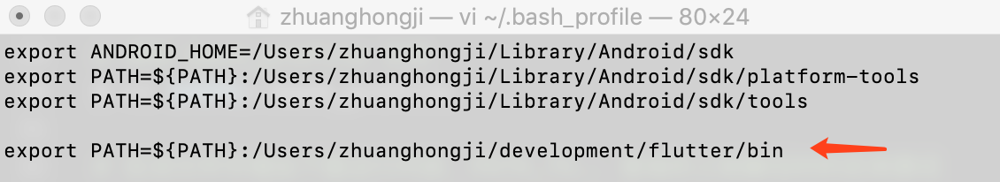

还有，通过执行 `flutter -h` 可以打印出 flutter 具体命令的帮助信息：

```shell
Manage your Flutter app development.

Common commands:

  flutter create <output directory>
    Create a new Flutter project in the specified directory.

  flutter run [options]
    Run your Flutter application on an attached device or in an emulator.

Usage: flutter <command> [arguments]

Global options:
-h, --help                  Print this usage information.
-v, --verbose               Noisy logging, including all shell commands
                            executed.
                            If used with --help, shows hidden options.

-d, --device-id             Target device id or name (prefixes allowed).
    --version               Reports the version of this tool.
    --suppress-analytics    Suppress analytics reporting when this command runs.
    --bug-report            Captures a bug report file to submit to the Flutter
                            team.
                            Contains local paths, device identifiers, and log
                            snippets.

    --packages              Path to your ".packages" file.
                            (required, since the current directory does not
                            contain a ".packages" file)

Available commands:
  analyze                  Analyze the project's Dart code.
  attach                   Attach to a running application.
  bash-completion          Output command line shell completion setup scripts.
  build                    Flutter build commands.
  channel                  List or switch flutter channels.
  clean                    Delete the build/ and .dart_tool/ directories.
  config                   Configure Flutter settings.
  create                   Create a new Flutter project.
  devices                  List all connected devices.
  doctor                   Show information about the installed tooling.
  drive                    Runs Flutter Driver tests for the current project.
  emulators                List, launch and create emulators.
  format                   Format one or more dart files.
  help                     Display help information for flutter.
  install                  Install a Flutter app on an attached device.
  logs                     Show log output for running Flutter apps.
  make-host-app-editable   Moves host apps from generated directories to
                           non-generated directories so that they can be edited
                           by developers.
  packages                 Commands for managing Flutter packages.
  precache                 Populates the Flutter tool's cache of binary
                           artifacts.
  run                      Run your Flutter app on an attached device.
  screenshot               Take a screenshot from a connected device.
  stop                     Stop your Flutter app on an attached device.
  test                     Run Flutter unit tests for the current project.
  trace                    Start and stop tracing for a running Flutter app.
  upgrade                  Upgrade your copy of Flutter.
  version                  List or switch flutter versions.

Run "flutter help <command>" for more information about a command.
Run "flutter help -v" for verbose help output, including less commonly used
options.
```

通过上面的帮助信息可知：

* 通过 `flutter --version` 命令查看当前工具的版本。
* 通过 `flutter create` 命令创建新的 Flutter 项目。
* 通过 `flutter run` 命令来将 Flutter 安装到附加的设备上。

下面我们来一步一步创建一个可运行的 Flutter 项目：

**1. 可先查看下当前 Flutter 工具的版本。**

```shell
zhuanghongji-mbp:~ zhuanghongji$ flutter --version
Flutter 1.2.1 • channel stable • https://github.com/flutter/flutter.git
Framework • revision 8661d8aecd (2 weeks ago) • 2019-02-14 19:19:53 -0800
Engine • revision 3757390fa4
Tools • Dart 2.1.2 (build 2.1.2-dev.0.0 0a7dcf17eb)
```

**2. 通过 `flutter create firstdemo` 创建一个 Flutter 项目。**

我之前已经在电脑上创建了一个，项目结构大概是酱紫：

``` 
├ .idea
├ .vscode
├ android
├ build
├ ios
├ lib
   └ main.dart
├ test
├ .metadata
├ .package
├ firstdemo.iml
├ pubspec.lock
├ pubspec.yaml
└ README.md
```

`lib/main.dart:`

```dart
// 刚初始化好的项目的 main.dart 代码有详细的注释
// 这里因为篇幅作了省略
import 'package:flutter/material.dart';

void main() => runApp(MyApp());

class MyApp extends StatelessWidget {
  @override
  Widget build(BuildContext context) {
    return MaterialApp(
      title: 'Flutter Demo',
      theme: ThemeData(
        primarySwatch: Colors.blue,
      ),
      home: MyHomePage(title: 'Flutter Demo Home Page'),
    );
  }
}

class MyHomePage extends StatefulWidget {
  MyHomePage({Key key, this.title}) : super(key: key);

  final String title;

  @override
  _MyHomePageState createState() => _MyHomePageState();
}

class _MyHomePageState extends State<MyHomePage> {
  int _counter = 0;

  void _incrementCounter() {
    setState(() {
      _counter++;
    });
  }

  @override
  Widget build(BuildContext context) {
    return Scaffold(
      appBar: AppBar(
        title: Text(widget.title),
      ),
      body: Center(
        child: Column(
          mainAxisAlignment: MainAxisAlignment.center,
          children: <Widget>[
            Text(
              'You have pushed the button this many times:',
            ),
            Text(
              '$_counter',
              style: Theme.of(context).textTheme.display1,
            ),
          ],
        ),
      ),
      floatingActionButton: FloatingActionButton(
        onPressed: _incrementCounter,
        tooltip: 'Increment',
        child: Icon(Icons.add),
      ), 
    );
  }
}
```

`pubspec.yaml:`

```yaml
# 同 main.dart，代码注释作省略处理
name: firstdemo
description: A new Flutter project.

version: 1.0.0+1

environment:
  sdk: ">=2.1.0 <3.0.0"

dependencies:
  flutter:
    sdk: flutter

  cupertino_icons: ^0.1.2

dev_dependencies:
  flutter_test:
    sdk: flutter


flutter:

  uses-material-design: true

```

**3. 在初始化好 Flutter 项目的目录下，执行 `flutter run` 命令。**

编译代码并安装到模拟器中。

```shell
zhuanghongji-mbp:firstdemo zhuanghongji$ flutter run
Launching lib/main.dart on iPhone 6 in debug mode...
Running Xcode build...                                                  
 ├─Assembling Flutter resources...                           1.4s
 └─Compiling, linking and signing...                         4.8s
Xcode build done.                                            8.1s
Syncing files to device iPhone 6...                              1,702ms

🔥  To hot reload changes while running, press "r". To hot restart (and rebuild state), press "R".
An Observatory debugger and profiler on iPhone 6 is available at: http://127.0.0.1:58008/
For a more detailed help message, press "h". To detach, press "d"; to quit, press "q".
```

显示效果如下：

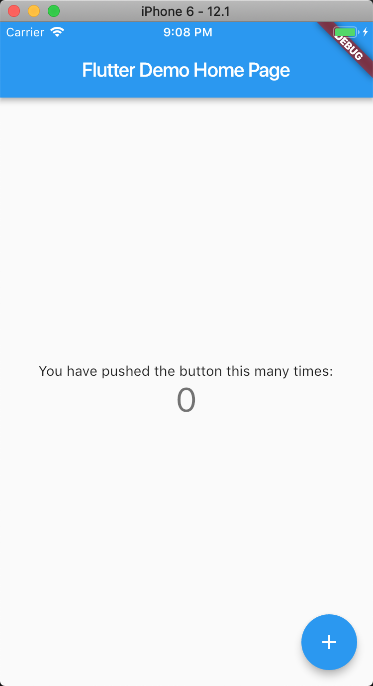

> 注意：在这里我们并没有指定是要运行在 Android 还是 iOS 模拟器上，可以通过 `--target-platform ` 参数进行指定，默认安装的目标平台为 iOS。

> `--target-platform`: 
> * Specify the target platform when building the app for an Android device. 
> * Ignored on iOS. 
> * [default (default), android-arm, android-arm64, android-x86, android-x64]  

从前面执行 `flutter run` 命令后输出的日志可知，当我们修改代码并保存且命令行窗口获的焦点后：
* 点击 `r` 会热重载应用
* 点击 `R` 会热重启应用 (rebuild state)
* ...

细想下好像很麻烦，记得之前开发 React Native 的时候，在点击 `cmd + s` 保存代码的同时是可以热重载应用的。那 Flutter 能不能做到这点呢？可以的，在 VSCode 插件商店中搜索 `Dart` 并安装该插件，该插件介绍信息和部分配置截图如下：


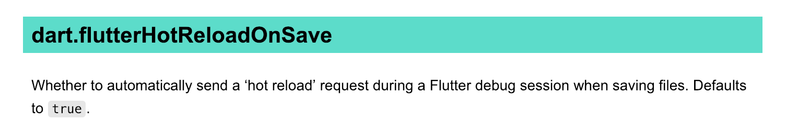

在该插件的介绍信息中，可以看到该插件可以辅助实现 Flutter 的自动热重载功能（当然，我们也是可以通过 `dart.flutterHotReloadFlutter` 配置是否启用该功能，默认启用）。

安装插件就完事了？不不不，从命令行中执行 `flutter run` 编译并安装的应用是不支持通过该插件进行热重载的。那我们换种安装方式，在 VSCode 中点击 `Debug > Run without debug` 编译并安装，这样，修改代码后点击 `cmd + s` 后代码会保存且自动触发热重载。

Perfect! 现在我们已经搭建好了 Flutter 的开发环境，并且也能够方便地通过热重载来提高编码效率了。所以，是时候跟着示例来一步一步学习 Flutter 开发了。

 
## 示例学习

在下面的示例中，我们主要是通过修改上述初始化好的 `firstdemo` 项目中的 `main.dart` 文件进行演示的。

### 简单的 Material 应用

```dart
import 'package:flutter/material.dart';

void main() {
  runApp( MaterialApp(
        title: 'First Demo',
        home: Scaffold(
          appBar: AppBar(
            title: Text("Simple Material App"),
          ),
          body: Container(
            child: Center(
              child: Text("Hello world!"),
            ),
          ),
        )
      )
  );
}
```

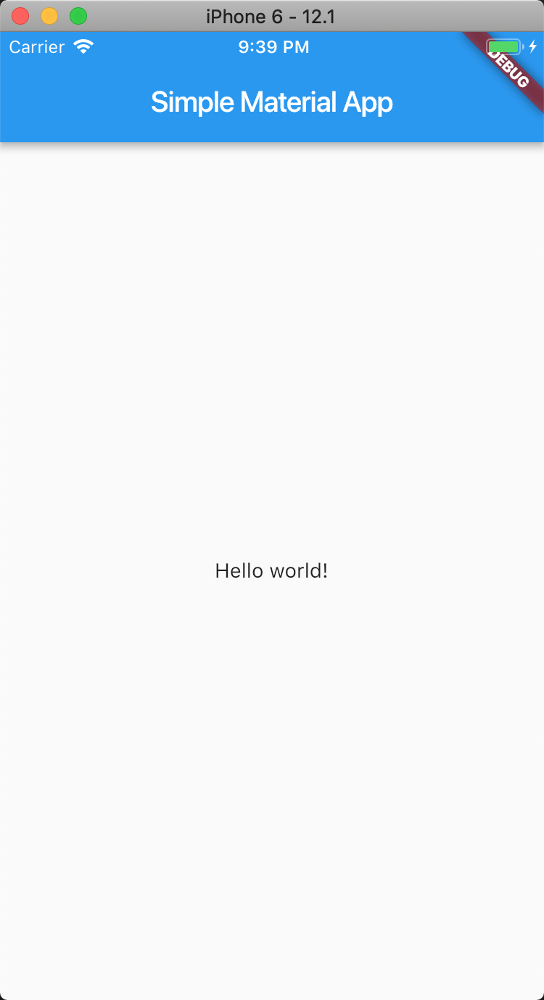


### 使用主题

```dart
import 'package:flutter/material.dart';

void main() => runApp(MyApp());

class MyApp extends StatelessWidget {
  // This widget is the root of your application.
  @override
  Widget build(BuildContext context) {
    return MaterialApp(
      debugShowCheckedModeBanner: false,
      home: Home(),
      theme: ThemeData(
        primarySwatch: Colors.green,
        accentColor: Colors.lightGreenAccent,
        backgroundColor: Colors.black12,
      ),
    );
  }
}

class Home extends StatelessWidget {
  
  @override
  Widget build(BuildContext context) {
    return Scaffold(
      appBar: AppBar( title: Text("Using Name")),
      body: Container(
        decoration: BoxDecoration(color: Colors.black87),
        child: Center(
          child: Container(
            color: Theme.of(context).accentColor,
            child: Text(
              "Hello world",
              style: Theme.of(context).textTheme.title,
            ),
          ),
        ),
      ),

      floatingActionButton: Theme(
        data: Theme.of(context).copyWith(accentColor: Colors.pinkAccent),
        child: FloatingActionButton(
          onPressed: null,
          child: Icon(Icons.add),
        ),
      ),
    );
  }
}
```

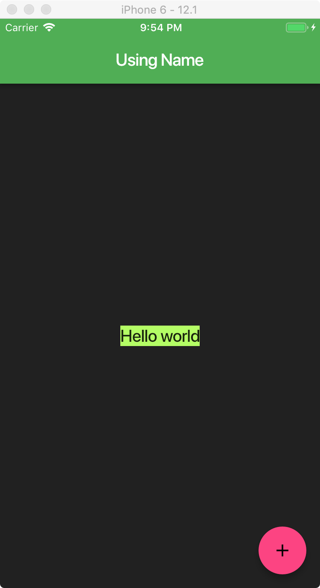


### 无状态部件

```dart
[import 'package:flutter/material.dart';

void main() => runApp(
  MaterialApp(
    home: MyApp(),
    // Define the theme, set the primary swatch (样品)
    theme: ThemeData(primaryColor: Colors.green),
  )
);

class MyApp extends StatelessWidget {
  @override
  Widget build(BuildContext context) {
    // Declare some constants
    final double myTextSize = 30.0;
    final double myIconSize = 40.0;
    final TextStyle myTextStyle = TextStyle(color: Colors.grey, fontSize: myTextSize);

    var column = Column(
      // Make the cards stretch in horizontal axis
      crossAxisAlignment: CrossAxisAlignment.stretch,
      children: <Widget>[
        // Setup the card
        MyCard(
          title: Text("Favorite", style: myTextStyle), 
          icon: Icon(Icons.favorite, size: myIconSize, color: Colors.blue),
        ),
        MyCard(
          title: Text("Alarm", style: myTextStyle), 
          icon: Icon(Icons.alarm, size: myIconSize, color: Colors.blue),
        ),
        MyCard(
          title: Text("Airport Shuttle", style: myTextStyle), 
          icon: Icon(Icons.airport_shuttle, size: myIconSize, color: Colors.blue),
        ),
        MyCard(
          title: Text("Done", style: myTextStyle), 
          icon: Icon(Icons.done, size: myIconSize, color: Colors.blue),
        ),
      ],
    );

    return Scaffold(
      appBar: AppBar(title: Text("Stateless Widget")),
      body: Container(
        padding: const EdgeInsets.only(bottom: 2.0),
        child: Center(
          child: SingleChildScrollView(child: column),
        ),
      ),
    );
  }
}

/// Create a reusable stateless widget
class MyCard extends StatelessWidget {
  final Widget title;
  final Widget icon;

  // Constructor. {} here denote that they are optinal values
  // i.e. you can use as: MyCard()
  MyCard({this.title, this.icon});

  @override
  Widget build(BuildContext context) {
    return Container(
      padding: const EdgeInsets.only(bottom: 1.0),
      child: Card(
        child: Container(
          padding: const EdgeInsets.all(20.0),
          child: Column(
            children: <Widget>[this.title, this.icon],
          ),
        ),
      ),
    );
  }
}](import 'package:flutter/material.dart';

void main() => runApp(
  MaterialApp(
    home: MyApp(),
    // Define the theme, set the primary swatch (样品)
    theme: ThemeData(primaryColor: Colors.green),
  )
);

class MyApp extends StatelessWidget {
  @override
  Widget build(BuildContext context) {
    // Declare some constants
    final double myTextSize = 30.0;
    final double myIconSize = 40.0;
    final TextStyle myTextStyle = TextStyle(color: Colors.grey, fontSize: myTextSize);

    var column = Column(
      // Make the cards stretch in horizontal axis
      crossAxisAlignment: CrossAxisAlignment.stretch,
      children: <Widget>[
        // Setup the card
        MyCard(
          title: Text("Favorite", style: myTextStyle), 
          icon: Icon(Icons.favorite, size: myIconSize, color: Colors.red),
        ),
        MyCard(
          title: Text("Alarm", style: myTextStyle), 
          icon: Icon(Icons.alarm, size: myIconSize, color: Colors.blue),
        ),
        MyCard(
          title: Text("Airport Shuttle", style: myTextStyle), 
          icon: Icon(Icons.airport_shuttle, size: myIconSize, color: Colors.amber),
        ),
        MyCard(
          title: Text("Done", style: myTextStyle), 
          icon: Icon(Icons.done, size: myIconSize, color: Colors.green),
        ),
      ],
    );

    return Scaffold(
      appBar: AppBar(title: Text("Stateless Widget")),
      body: Container(
        padding: const EdgeInsets.only(bottom: 2.0),
        child: Center(
          child: SingleChildScrollView(child: column),
        ),
      ),
    );
  }
}

/// Create a reusable stateless widget
class MyCard extends StatelessWidget {
  final Widget title;
  final Widget icon;

  // Constructor. {} here denote that they are optinal values
  // i.e. you can use as: MyCard()
  MyCard({this.title, this.icon});

  @override
  Widget build(BuildContext context) {
    return Container(
      padding: const EdgeInsets.only(bottom: 1.0),
      child: Card(
        child: Container(
          padding: const EdgeInsets.all(20.0),
          child: Column(
            children: <Widget>[this.title, this.icon],
          ),
        ),
      ),
    );
  }
})
```

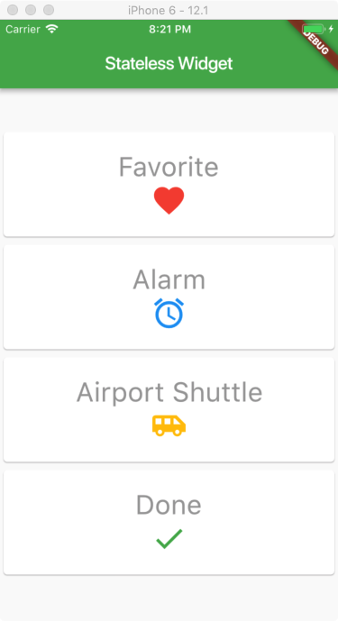


### 状态组件

```dart
import 'package:flutter/material.dart';

void main() => runApp(
  MaterialApp(
    home: MyButton(),
  )
);

class MyButton extends StatefulWidget {
  @override
  _MyButtonState createState() => _MyButtonState();
}

class _MyButtonState extends State<MyButton> {
  int counter = 0;
  List<String> strings = ['Flutter', 'is', 'cool', 'and', 'awesome!'];
  String displayedString = "Hello World!";

  void _onPressOfButton() {
    setState(() {
      displayedString = strings[counter];
      counter = counter < strings.length - 1 ? counter + 1 : 0;
    });
  }

  @override
  Widget build(BuildContext context) {
    return Scaffold(
      appBar: AppBar(
        title: Text("Stateful Widget"), 
        backgroundColor: Colors.green,
      ),
      body: Container(
        child: Center(
          child: Column(
            mainAxisAlignment: MainAxisAlignment.center,
            children: <Widget>[
              Text(displayedString, style: TextStyle(fontSize: 40.0)),
              Padding(padding: EdgeInsets.all(10.0)),
              RaisedButton(
                child: Text("Press me", style: TextStyle(fontSize: 40.0, color: Colors.white)),
                color: Colors.red,
                onPressed: _onPressOfButton,
              )
            ],
          ),
        ),
      ),
    );
  }
}
```

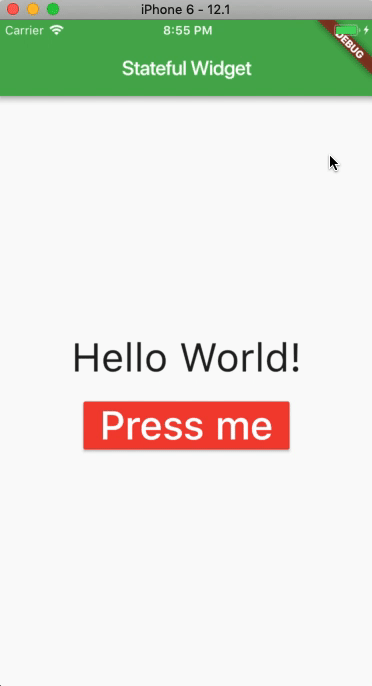


### 使用 EditText 

```dart
import 'package:flutter/material.dart';

void main() => runApp(
  MaterialApp(
    home: MyEditText(),
  )
);

class MyEditText extends StatefulWidget {
  @override
  _MyEditTextState createState() => _MyEditTextState();
}

class _MyEditTextState extends State<MyEditText> {
  String results = "";

  final TextEditingController controller = TextEditingController();

  @override
  Widget build(BuildContext context) {
    return Scaffold(
      appBar: AppBar(
        title: Text("Using EditText"),
        backgroundColor: Colors.red,
      ),
      body: Container(
        padding: const EdgeInsets.all(10.0),
        child: Center(
          child: Column(
            crossAxisAlignment: CrossAxisAlignment.stretch,
            children: <Widget>[
              TextField(
                decoration: InputDecoration(hintText: "Enter text here..."),
                onSubmitted: (String str) {
                  setState(() {
                    results = results + "\n" + str;
                    controller.text = "";
                  });
                },
                controller: controller,
              ),
              Text(results),
            ],
          ),
        ),
      ),
    );
  }
}
```

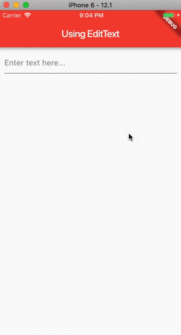


### 加载本地图片


```dart
import 'package:flutter/material.dart';

void main() => runApp(
  MaterialApp(
    home: MyApp(),
  )
);

class MyApp extends StatelessWidget {
  @override
  Widget build(BuildContext context) {
    return Scaffold(
      appBar: AppBar(title: Text("Load local image")),
      body: Container(
        child: Center(
          child: Text("Hello World!", style: TextStyle(color: Colors.white)),
        ),
        decoration: BoxDecoration(
          image: DecorationImage(
            image: AssetImage("data_repo/img/bg1.jpg"),
            fit: BoxFit.cover,
          )
        ),
      ),
    );
  }
}
```

> 图片文件放置在项目根目录下的 `data_repo/img` 目录下，命名为 `bg1.jpg`。然后配置 `pubspec.yaml` 文件，在 `assets` 节点下增加一行 `- data_repo/img/bg1.jpg`，具体如下：

```yaml
# ...
# The following section is specific to Flutter.
flutter:

  # The following line ensures that the Material Icons font is
  # included with your application, so that you can use the icons in
  # the material Icons class.
  uses-material-design: true

  # To add assets to your application, add an assets section, like this:
  assets:
   - data_repo/img/bg1.jpg
```

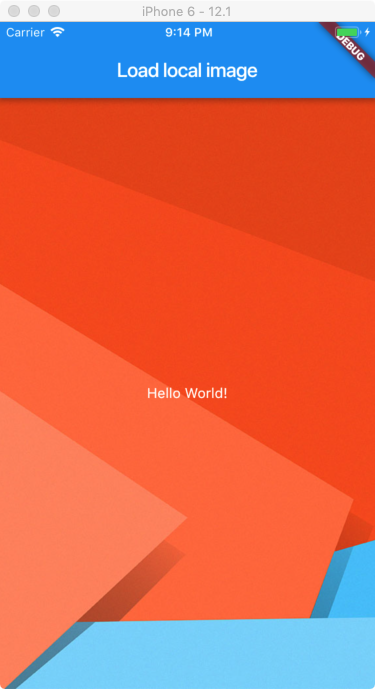


### 加载本地 JSON


```dart
import 'dart:convert';

import 'package:flutter/material.dart';

void main() => runApp(
  MaterialApp(
    home: MyApp(),
  )
);

class MyApp extends StatefulWidget {
  @override
  _MyAppState createState() => _MyAppState();
}

class _MyAppState extends State<MyApp> {
  List data;

  @override
  Widget build(BuildContext context) {
    return Scaffold(
      appBar: AppBar(title: Text("Load local JSON file")),
      body: Container(
        child: Center(
          child: FutureBuilder(
            future: DefaultAssetBundle.of(context).loadString('data_repo/starwars_data.json'),
            builder: (context, snapshot) {
              // Decode the JSON, `json` is from 'dart:convert'
              var newData = json.decode(snapshot.data.toString());
              return ListView.builder(
                itemBuilder: (BuildContext context, int index) {
                  return Card(
                    child: Column(
                      crossAxisAlignment: CrossAxisAlignment.stretch,
                      children: <Widget>[
                        Text("Name: ${newData[index]['name']}"),
                        Text("Height: ${newData[index]['height']}"),
                        Text("Mass: ${newData[index]['mass']}"),
                        Text("Hair Color: ${newData[index]['hair_color']}"),
                        Text("Skin Color: ${newData[index]['skin_color']}"),
                        Text("Eye Color: ${newData[index]['eye_color']}"),
                        Text("Birth Year: ${newData[index]['birth_year']}"),
                        Text("Gender: ${newData[index]['gender']}"),
                      ],
                    ),
                  );
                },
                itemCount: newData == null ? 0 : newData.length,
              );
            },
          ),
        ),
      ),
    );
  }
}
```

```json
[
  {
    "name": "Luke Skywalker",
    "height": "172",
    "mass": "77",
    "hair_color": "blond",
    "skin_color": "fair",
    "eye_color": "blue",
    "birth_year": "19BBY",
    "gender": "male"
  },
  {
    "name": "C-3PO",
    "height": "167",
    "mass": "75",
    "hair_color": "n/a",
    "skin_color": "gold",
    "eye_color": "yellow",
    "birth_year": "112BBY",
    "gender": "n/a"
  },
  {
    "name": "R2-D2",
    "height": "96",
    "mass": "32",
    "hair_color": "n/a",
    "skin_color": "white, blue",
    "eye_color": "red",
    "birth_year": "33BBY",
    "gender": "n/a"
  },
  {
    "name": "Darth Vader",
    "height": "202",
    "mass": "136",
    "hair_color": "none",
    "skin_color": "white",
    "eye_color": "yellow",
    "birth_year": "41.9BBY",
    "gender": "male"
  },
  {
    "name": "Leia Organa",
    "height": "150",
    "mass": "49",
    "hair_color": "brown",
    "skin_color": "light",
    "eye_color": "brown",
    "birth_year": "19BBY",
    "gender": "female"
  },
  {
    "name": "Owen Lars",
    "height": "178",
    "mass": "120",
    "hair_color": "brown, grey",
    "skin_color": "light",
    "eye_color": "blue",
    "birth_year": "52BBY",
    "gender": "male"
  },
  {
    "name": "Beru Whitesun lars",
    "height": "165",
    "mass": "75",
    "hair_color": "brown",
    "skin_color": "light",
    "eye_color": "blue",
    "birth_year": "47BBY",
    "gender": "female"
  },
  {
    "name": "R5-D4",
    "height": "97",
    "mass": "32",
    "hair_color": "n/a",
    "skin_color": "white, red",
    "eye_color": "red",
    "birth_year": "unknown",
    "gender": "n/a"
  },
  {
    "name": "Biggs Darklighter",
    "height": "183",
    "mass": "84",
    "hair_color": "black",
    "skin_color": "light",
    "eye_color": "brown",
    "birth_year": "24BBY",
    "gender": "male"
  },
  {
    "name": "Obi-Wan Kenobi",
    "height": "182",
    "mass": "77",
    "hair_color": "auburn, white",
    "skin_color": "fair",
    "eye_color": "blue-gray",
    "birth_year": "57BBY",
    "gender": "male"
  }
]
```

```yaml
# ...
# The following section is specific to Flutter.
flutter:

  # The following line ensures that the Material Icons font is
  # included with your application, so that you can use the icons in
  # the material Icons class.
  uses-material-design: true

  # To add assets to your application, add an assets section, like this:
  assets:
   - data_repo/starwars_data.json
```

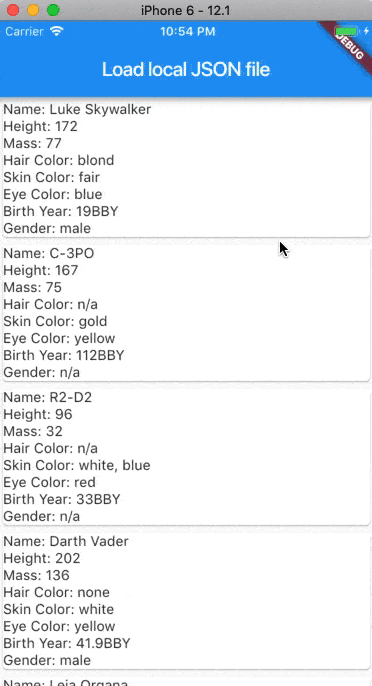


### 使用 HTTP GET 请求

```dart
import 'dart:convert';
import 'dart:async';

import 'package:flutter/material.dart';
import 'package:http/http.dart' as http;

void main() => runApp(
  MaterialApp(
    home: MyGetHttpData(),
  )
);

/// Create a stateful widget
class MyGetHttpData extends StatefulWidget {
  @override
  _MyGetHttpDataState createState() => _MyGetHttpDataState();
}

/// Create the state for our stateful widget
class _MyGetHttpDataState extends State<MyGetHttpData> {
  final String url = "https://swapi.co/api/people";
  List data;

  /// Function to get the JSON data
  Future<String> getJSONData() async {
    var response = await http.get(
      // Encode the url, and only accept JSON response
      Uri.encodeFull(url),
      headers: {"Accept": "application/json"},
    );

    // Logs the response body to the console
    print(response);

    // To modify the state of the app, use this method
    setState(() {
      // Get the JSON data
      var dataConvertedToJSON = json.decode(response.body);
      // Extract the required part and assign it to the global variable named data
      data =dataConvertedToJSON['results'];
    });

    return "Successfull";
  }

  @override
  void initState() {
    super.initState();

    // Call the getJSONData() method when app initailizes
    getJSONData();
  }

  @override
  Widget build(BuildContext context) {
    return Scaffold(
      appBar: AppBar(title: Text("Retrieve JSON Data via HTTP GET")),
      // Create a ListView and load the data when available
      body: ListView.builder(
        itemCount: data == null ? 0 :data.length,
        itemBuilder: (BuildContext context, int index) {
          return Container(
            child: Center(
              child: Column(
                // Stretch the cards in horizontal axis
                crossAxisAlignment: CrossAxisAlignment.stretch,
                children: <Widget>[
                  Card(
                    child: Container(
                      // Read the name field value and set it in the Text widget
                      child:  Text(data[index]['name'], style: TextStyle(fontSize: 20.0, color: Colors.lightBlueAccent)),
                      padding: const EdgeInsets.all(15.0),
                    )
                  )
                ],
              ),
            ),
          );
        },
      ),
    );
  }
}
```

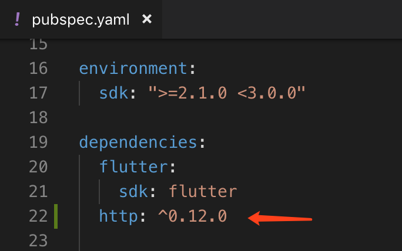

如上图所示，我们需要在 `pubspec.yaml` 中增加 [http](https://pub.dartlang.org/packages/http) 依赖，当前最新版本是 `0.12.0`。

> 更多依赖包可以在 [https://pub.dartlang.org/flutter](https://pub.dartlang.org/flutter) 中搜索并获取相关信息。

运行并加载到网络数据后，显示效果如下：

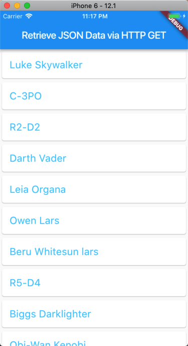


### 使用 Alert Dialog 


```dart
import 'package:flutter/material.dart';

void main() => runApp(
  MaterialApp(
    home: MyHome(),
  )
);

class MyHome extends StatefulWidget {
  @override
  _MyHomeState createState() => _MyHomeState();
}

class _MyHomeState extends State<MyHome> {
  // Generate a dialog
  AlertDialog dialog = AlertDialog(
    content: Text("Hello World!", style: TextStyle(fontSize: 30.0)),
  );

  @override
  Widget build(BuildContext context) {
    return Scaffold(
      appBar: AppBar(
        title: Text("Using Alert Dialog"),
      ),
      body: Container(
        child: Center(
          child: RaisedButton(
            child: Text("Hit Alert Dialog"),
            // On press of the button
            onPressed: () {
              // Show dialog
              showDialog(context: context, builder: (BuildContext context) => dialog);
            },
          ),
        ),
      ),
    );
  }
}
```

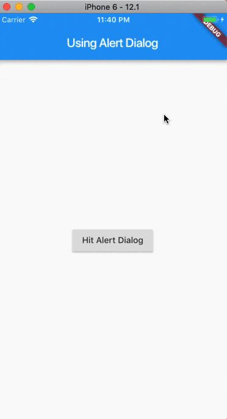


