# Flutter 入门三部曲：Widget 概述

## 概述

本篇文章的内容和截图主要来自 [alibaba/flutter-go](https://github.com/alibaba/flutter-go)，本人在这里仅仅起到一个资源整合的作用，以方便自己和读者进行更加高效的阅读和理解。


## 快捷方式

[Element](#element)
* [Form](#form)
  * [Input](#input)
    * [TextField](#textfield)
  * [CheckBox](#checkbox)
    * [CheckboxListTile](#checkboxlisttile)
    * [Checkbox](#checkbox)
  * [Button](#button)
    * [FlatButton](#flatbutton)
    * [RaisedButton](#raisedbutton)
    * [IconButton](#iconbutton)
    * [PopupMenuButton](#popupmenubutton)
    * [FloatingActionButton](#floatingactionbutton)
    * [RawMaterialButton](#rawmaterialbutton)
    * [DropdownButton](#dropdownbutton)
    * [OutlineButton](#outlinebutton)
  * [Text](#text)
    * [Text](#text)
    * [RichText](#richtext)
  * [Radio](#radio)
    * [Radio](#radio)
    * [RadioListTile](#radiolisttile)
  * [Slider](#slider)
    * [Slider](#slider)
    * [SliderTheme](#slidertheme)
    * [SliderThemeData](#sliderthemedata)
  * [Switch](#switch)
    * [Switch](#switch)
    * [SwitchListTile](#switchlisttile)
    * [AnimatedSwitcher](#animatedswitcher)
* [Frame](#frame)
  * [Align](#align)
    * [Align](#align)
  * [Stack](#stack)
    * [Stack](#stack)
    * [IndexedStack](#indexedstack)
  * [Layout](#layout)
    * [Row](#row)
    * [Column](#column)
    * [Container](#container)
    * [Center](#center)
  * [Box](#box)
    * [ConstrainedBox](#constrainedbox)
    * [OverflowBox](#overflowbox)
    * [DecoratedBox](#decoratedbox)
    * [FittedBox](#fittedbox)
    * [LimitedBox](#limitedbox)
    * [RotatedBox](#rotatedbox)
    * [SizedOverflowBox](#sizedoverflowbox)
    * [UnconstrainedBox](#unconstrainedbox)
  * [Expanded](#expanded)
    * [Expanded](#expanded)
  * [Spacing](#spacing)
    * [Padding](#padding)
    * [SliverPadding](#sliverpadding)
    * [AnimatedPadding](#animatedpadding)
  * [Table](#table)
    * [Table](#table)
* [Media](#media)
  * [Image](#image)
    * [AssetImage](#assetimage)
    * [DecorationImage](#decorationimage)
    * [ExactAssetImage](#exactassetimage)
    * [FadeInImage](#fadeinimage)
    * [FileImage](#fileimage)
    * [NetworkImage](#networkimage)
    * [RawImage](#rawimage)
    * [MemoryImage](#memoryimage)
    * [Image](#image)
  * [Icon](#icon)
    * [Icon](#icon)
    * [ImageIcon](#imageicon)
    * [IconTheme](#icontheme)
    * [IconData](#icondata)
    * [IconThemeData](#iconthemedata)
  * [Canvas](#canvas)
    * [Canvas](#canvas)
    * [PainterSketch](#paintersketch)
    * [PainterPath](#painterpath)
    * [CircleProgressBarPainter](#circleprogressbarpainter)

[Component](#Component)
  * [Navigation](#Navigation)
    * [BottomNavigationBarItem](#bottomnavigationbaritem)
    * [BottomNavigationBar](#bottomnavigationbar)
  * [List](#list)
    * [AnimatedList](#list)
    * [ListView](#listview)
    * [ListBody](#listbody)
  * [Card](#card)
    * [Card](#card)
  * [Bar](#bar)
    * [AppBar](#appbar)
    * [BottomAppBar](#bottomappbar)
    * [SnackBar](#snackbar)
    * [SliverAppBar](#sliverappbar)
    * [FlexibleSpaceBar](#flexiblespacebar)
    * [ButtonBar](#buttonbar)
    * [SnackBarAction](#snackbaraction)
    * [TabBar](#tabbar)
  * [Dialog](#dialog)
    * [AlertDialog](#alertdialog)
    * [Dialog](#dialog)
    * [AboutDialog](#aboutdialog)
    * [SimpleDialog](#simpledialog)
  * [Scaffold](#scaffold)
    * [Scaffold](#scaffold)
    * [ScaffoldState](#scaffoldstate)
  * [Grid](#grid)
    * [GridTile](#gridtile)
    * [GridView](#gridview)
    * [GridPaper](#gridpaper)
    * [SliverGrid](#slivergrid)
    * [GridTileBar](#gridtilebar)
  * [Scroll](#scroll)
    * [ScrollView](#scrollview)
    * [Scrollable](#scrollable)
    * [ScrollbarPainter](#scrollbarpainter)
    * [ScrollMetrics](#scrollmetrics)
    * [ScrollPhysics](#scrollphysics)
    * [BoxScrollView](#boxscrollview)
    * [CustomScrollView](#customscrollview)
    * [NestedScrollView](#nestedscrollview)
  * [Tab](#tab)
    * [Tab](#tab)
  * [Menu](#menu)
    * [CheckedPopupMenuItem](#checkedpopupmenuitem)
    * [DropdownMenuItem](#dropdownmenuitem)
    * [PopupMenuButton](#popupmenubutton)
    * [PopupMenuDivider](#popupmenudivider)
    * [PopupMenuEntry](#popupmenuentry)
    * [PopupMenuItem](#popupmenuitem)
  * [Pick](#pick)
    * [DayPicker](#daypicker)
    * [MonthPicker](#monthpicker)
    * [YearPicker](#yearpicker)
    * [ShowdatePicker](#showdatepicker)
    * [CityPicker](#citypicker)
  * [Chip](#chip)
    * [Chip](#chip)
    * [ChipTheme](#chiptheme)
    * [ChipThemeData](#chipthemedata)
    * [ChoiceChip](#choicechip)
    * [FilterChip](#filterchip)
    * [InputChip](#inputchip)
    * [RawChip](#rawchip)
  * [Panel](#panel)
    * [ExpansionPanel](#expansionpanel)
    * [ExpansionPanelList](#expansionpanellist)
    * [ExpansionPanelRadio](#expansionpanelradio)
  * [Progress](#progress)
    * [LinearProgressIndicator](#linearprogressindicator)
    * [CircularProgressIndicator](#circularprogressindicator)
    * [RefreshProgressIndicator](#refreshprogressindicator)
  
[Theme](#theme)
* [Material](#material)
  * [MaterialApp](#materialapp)
  * [MaterialColor](#materialcolor)
  * [MaterialButton](#materialbutton)
  * [MaterialPageRoute](#materialpageroute)
  * [MaterialAccentColor](#materialaccentcolor)
  * [MergeableMaterialItem](#mergeablematerialitem)
* [Cupertino](#cupertino)
  * [CupertinoApp](#cupertinoapp)
  * [CupertinoButton](#cupertinobutton)
  * [CupertinoColors](#cupertinocolors)
  * [CupertinoIcons](#cupertinoicons)
  * [CupertinoNavigationBar](#cupertinonavigationbar)
  * [CupertinoPageRoute](#cupertinopageroute)
  * [CupertinoPageScaffold](#cupertinopagescaffold)
  * [CupertinoPicker](#cupertinopicker)
  * [CupertinoPopupSurface](#cupertinopopupsurface)
  * [CupertinoScrollbar](#cupertinoscrollbar)
  * [CupertinoSegmentedControl](#cupertinosegmentedcontrol)
  * [CupertinoSlider](#cupertinoslider)
  * [CupertinoSliverNavigationBar](#cupertinoslivernavigationbar)
  * [CupertinoSwitch](#cupertinoswitch)
  * [CupertinoTabBar](#cupertinotabbar)
  * [CupertinoTabScaffold](#cupertinotabscaffold)
  * [CupertinoTabView](#cupertinotabview)
  * [CupertinoTimerPicker](#cupertinotimerpicker)


## Element

### Form

#### Input

##### TextField

**简介**

> TextField 最常用的文本输入widget
- 该 widget 作为文本输入框，可以接收用户以屏幕按键或者键盘输入的文本信息，该信息可以用于消息传递，搜索体验等
- 用户修改文本信息时，Onchange会被调用，获取到最新的文本信息
- 已知用户输入的字段文本输入完毕时（例如，通过按软键盘上的按钮确认输入完毕），该widget会调用onSubmitted回调
  
[官方文档](https://docs.flutter.io/flutter/material/TextField-class.html) - [示例代码](https://github.com/alibaba/flutter-go/blob/master/lib/widgets/elements/Form/Input/TextField/text_field_demo.dart)

**基本用法**

> 参数控制默认的按钮和禁用按钮
- 默认情况下，TextField 下方有一个下划线进行修饰。
- 您可以使用decoration属性来控制该widget样式，例如通过添加标签或图标。如果将decoration属性设置为空，则将完全删除装饰，包括装饰引入的额外填充，以节省标签的空间。
- 如果decoration属性是非null（这是默认的），文本字段需要它的父类是一个Material widget。当文本字段被点击时，会出发被点击的效果。
- 若要将TextField和其他FormFild集成到Form中，请考虑使用TeTFrimeField。

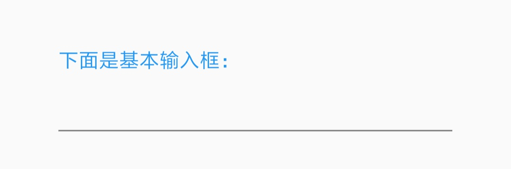

**进阶用法**

> 实现稍微复杂点的效果，TextField 的输入以数字优先，为输入框做一些其他的效果，如提示文字，icon、标签文字等
- 增加一个keyboardType属性，把keyboardType设置为 TextInputType.number ，让TextField获得焦点的时候弹出的键盘就变成了数字优先。
- 新增decoration属性，设置相关属性，可以发现当我们的TextField获得焦点时，图标会自动变色，提示文字会自动上移。
- onChanged是输入框内每次文字变更触发的回调方法，onSubmitted是用户提交而触发的回调方法。
- 每当用户改变输入框内的文字，都会在控制台输出现在的字符串.与onSubmitted用法相同。

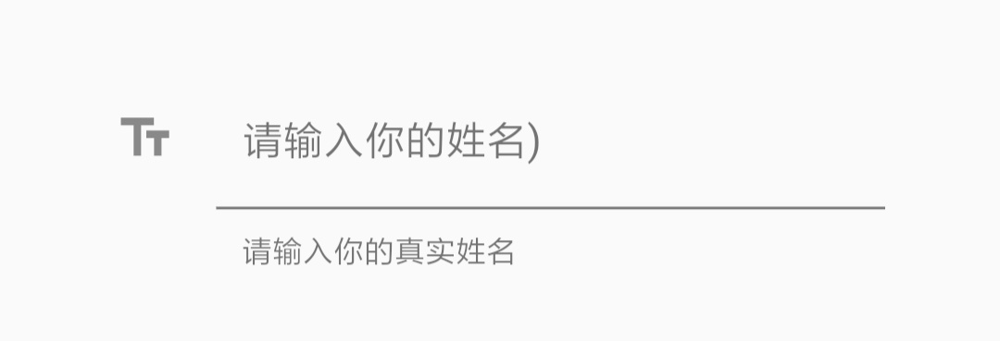


#### CheckBox
##### CheckboxListTile

**简介**

> CheckboxListTile “下拉复选框”
- 带有复选框的 ListTile,带有标签的 ListTile；
- 整个列表图块是交互式的：点击图块中的任意位置可切换复选框；

[官方文档](https://docs.flutter.io/flutter/material/CheckboxListTile-class.html) - [示例代码](https://github.com/alibaba/flutter-go/blob/master/lib/widgets/elements/Form/CheckBox/CheckboxListTile/demo.dart)

**基本用法**

> CheckboxListTile 的属性特征
- 与 Checkbox 类似的命名属性，比如：onChanged 和 activeColor；
- 和 ListTile 类似的命名属性，比如：title, subtitle, isThreeLine，dense；
- selected 属性和 ListTile.selected 属性类似，但使用的颜色是 activeColor 属性，默认为当前 Theme 的颜色；
- onChanged 回调函数为 null,显示禁用；
  
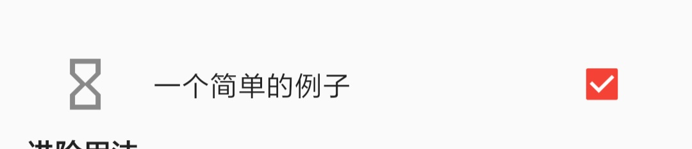

**进阶用法**

> CheckboxListTile 单选和全选的示例 


##### Checkbox

**简介**

> checkbox “复选框”
- 复选框本身不保持任何状态;
- 当复选框的状态发生变化时，窗口小部件会调用onChanged回调;
- 大多数使用复选框的小部件将侦听onChanged回调，并使用新值重建复选框以更新复选框的可视外观;

[官方文档](https://docs.flutter.io/flutter/material/Checkbox-class.html) - [示例代码](https://github.com/alibaba/flutter-go/blob/master/lib/widgets/elements/Form/CheckBox/Checkbox/demo.dart)

**基本用法**

> 下面示例展示多个颜色(随机)样式的 `checkbox`
- 一个多选的 `checkbox`;

**进阶用法**

> 下面示例展示多个颜色(随机)样式的 `checkbox`
- 一个单选 `checkbox` 操作;


#### Button
##### FlatButton

**简介**

> FlatButton 是显示在（零高程）material widget 上的文本标签
- 通过填充颜色对触摸作出反应在工具栏上；
- FlatButtons 故意不具有可见边框，因此必须依赖于它们相对于其他内容的位置以用于上下文；
- 在对话框和卡片中，它们应该组合在一个底角中。避免使用平面按钮，它们会与其他内容混合，例如在列表中间；
  
[官方文档](https://docs.flutter.io/flutter/material/FlatButton-class.html) - [示例代码]()

**基本用法**

> 参数的默认的 button 和禁用 button
- 如果 onPressed 回调为null，则该按钮将被禁用，不会对触摸做出反应，并且将按 disabledColor 属性而不是color属性指定的颜色进行着色；
- 如果您尝试更改按钮的颜色并且没有任何效果，请检查您是否正在传递非null onPressed处理程序；

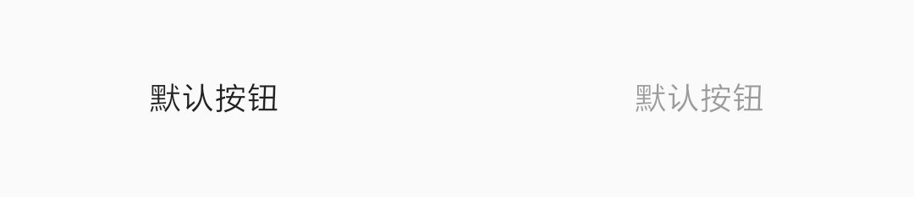

**进阶用法1**

> FlatButton.icon ，button 图标和标签的 widget 创建文本按钮；

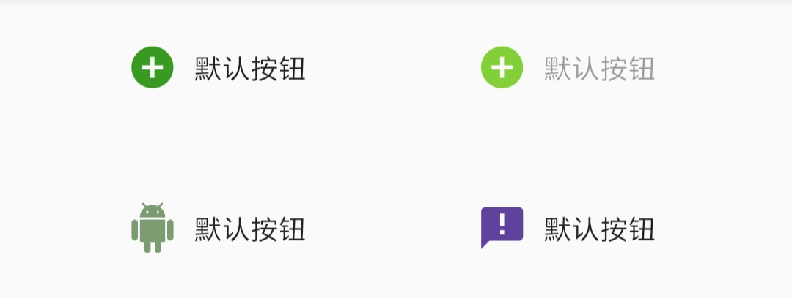

**进阶用法2**

> 更改参数的自定义,比如:边框，点击效果，内容文字颜色等；
- 要使应用程序的一部分具有交互式，使用 ink splashes，请考虑使用InkWell;
- Flat button 的最小尺寸为88.0×36.0，可以用 ButtonTheme 覆盖。该clipBehavior参数不能为空;

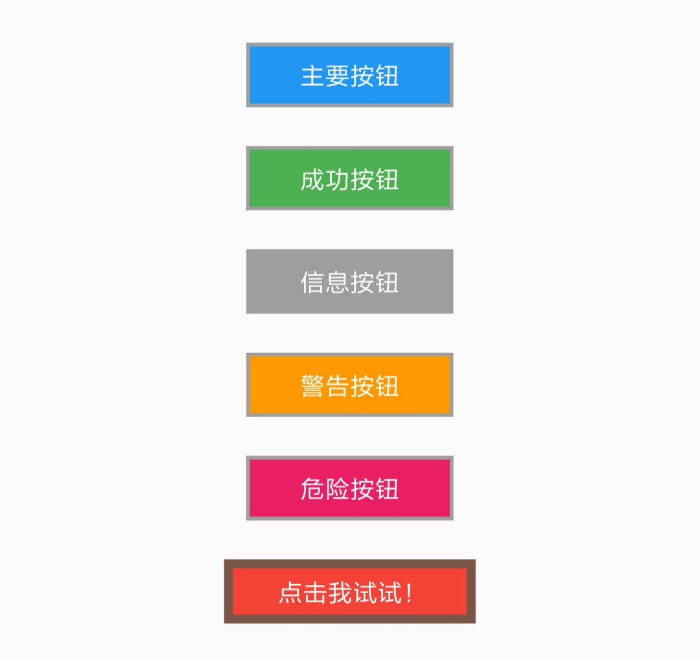


##### RaisedButton

**简介**

> Raised button “凸起按钮”
- Raised button 基于  a Material widget 窗口widget，按下 button 时，Material.elevation 会增加;
- 使用 Raised button 可将尺寸添加到大多数平面布局中;
- 例如在复杂的内容列表中，或在宽阔的空间中。避免在已经提出的内容（例如对话框或卡片）上使用 Raised button;

[官方文档]() - [示例代码]()

**基本用法**

> 参数的默认的 button 和禁用 button;
- 如果onPressed回调为null，则该按钮将被禁用，不会对触摸做出反应，并且将按 disabledColor 属性而不是color属性指定的颜色进行着色;
- 如果您尝试更改按钮的颜色并且没有任何效果，请检查您是否正在传递非null onPressed处理程序;

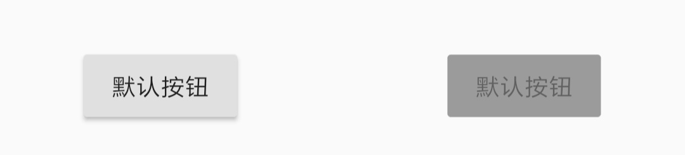

**进阶用法1**

> RaisedButton.icon 的用方法，按钮图标和标签的widget创建文本按钮;

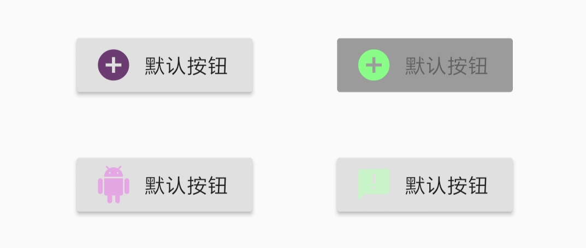

**进阶用法2**

> 更改项参数的自定义,比如:边框，点击效果，内容文字,颜色,圆角等
- 如果您想要 ink-splash  的墨水效果，但又不想使用按钮，请考虑直接使用InkWell;
- Raised buttons 的最小尺寸为88.0×36.0，可以用 ButtonTheme 覆盖;
- 通过 shape 属性的设置，改变边框样式和圆角;

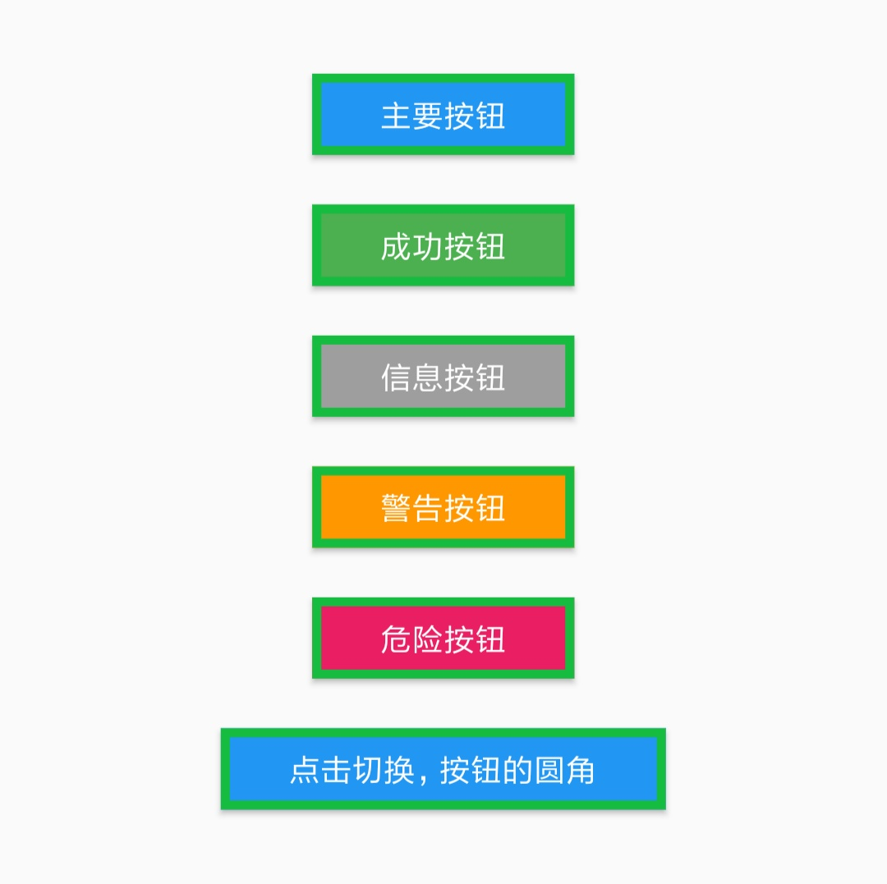

##### IconButton

**简介**

> Icon button “图标按钮”
- IconButton widget上的图片，通过填充颜色（墨水）来对触摸作出反应;

[官方文档]() - [示例代码]()

**基本用法**

> 参数的默认的按钮和禁用按钮
- 图标按钮通常在AppBar.actions字段中使用，但它们也可以在许多其他地方使用;
- 如果您尝试更改按钮的颜色并且没有任何效果，请检查您是否正在传递非null onPressed处理程序;

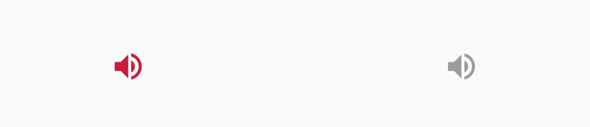

**进阶用法**

> 更改项参数的自定义,比如:边框，点击效果，内容文字,颜色,圆角等;
- 如果可能，图标按钮的命中区域的大小至少为48.0像素，与实际的iconSize无关，以满足 Material Design规范中的触摸目标大小要求。的对准控制图标本身如何定位命中区域内;
- ** 长按可弹出 tip 文字

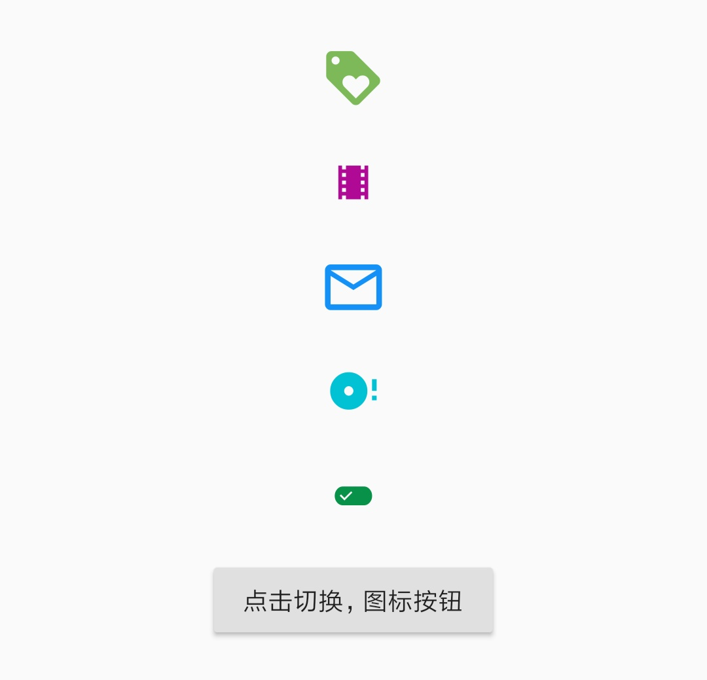


##### PopupMenuButton

**简介**

> 按下时显示菜单
- 当菜单因为选择了项目而被解除时调用onSelected。传递给onSelected的值是所选菜单项的值;
- 可以提供 `child` 或 `icon` 中的一个，但不是能同时设置两者。如果提供了 `icon` ，则 `PopupMenuButton` 的行为类似于 `IconButton`;
- 如果两者都为null，则创建一个标准 overflow icon（取决于平台）;

[官方文档]() - [示例代码]()

**基本用法**

> 此示例显示一个包含四个项目的菜单
- 在枚举值之间进行选择，并_selection根据选择设置字段;

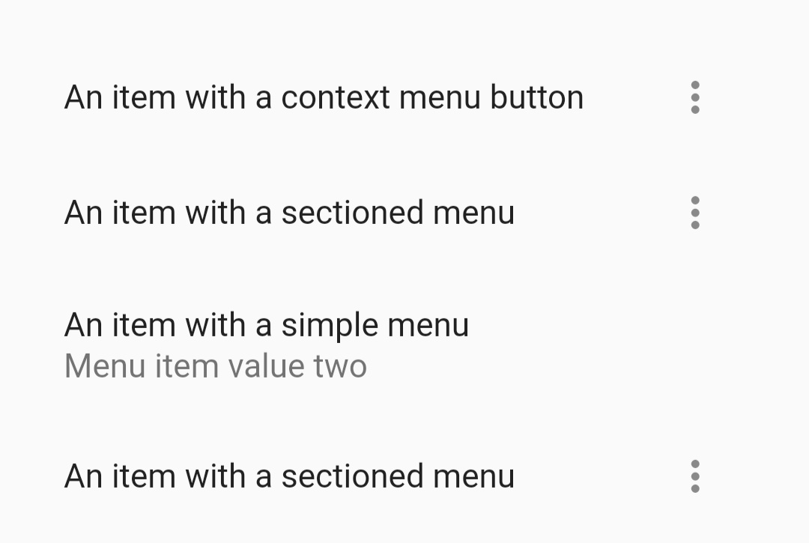
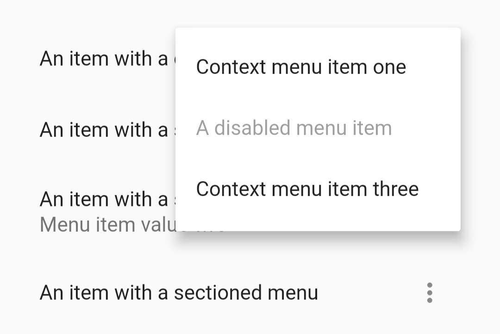

**进阶用法**

> 此示例尝试调整所有属性，展示出效果
- 默认选择第二个;
- 再次打开,`PopupMenuItem` 保留上次的选择结果;


##### FloatingActionButton

**简介**

> FloatingAction Button “浮动动作按钮”
- FloatingActionButton 按钮是一个圆形图标按钮，悬停在内容上以提升应用程序中的主要操作。浮动操作按钮最常用于Scaffold.floatingActionButton字段中;
- 每个屏幕最多使用一个浮动操作按钮。浮动操作按钮应用于积极操作，例如“创建”，“共享”或“导航”;
- 一般用来处理界面中最常用，最基础的用户动作。它一般出现在屏幕内容的前面，通常是一个圆形，中间有一个图标。 FAB有三种类型：regular, mini, extended。不要强行使用FAB，只有当使用场景符合FAB功能的时候使用才最为恰当;

[官方文档](https://docs.flutter.io/flutter/material/FloatingActionButton-class.html) - [示例代码]()

**基本用法**

> 默认参数的 button 和禁用 button 
- 如果 onPressed 回调为null，则该 button 将被禁用，并且不会对触摸作出反应,不会变成灰色;

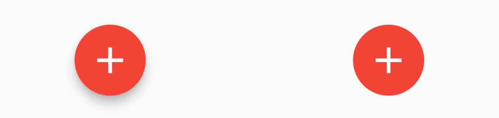

**进阶用法1**

> 更改项参数的自定义,比如:边框，点击效果，内容文字,颜色,圆角等

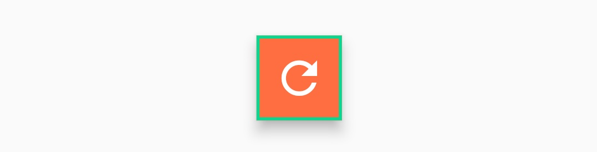

**进阶用法2**

> 更改项参数的自定义,比如:边框，点击效果，内容文字,颜色,圆角等

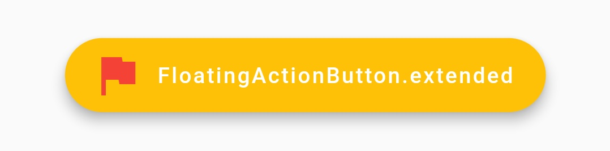


##### RawMaterialButton

**简介**

> RawMaterial button “RawMaterial 按钮”
- 基于 Semantics，Material 和InkWell 小部件创建按钮;
- 此类不使用当前 Theme 或 ButtonTheme 来计算未指定参数的默认值。它旨在用于自定义 Material button，可选择包含主题或特定于应用程序源的默认值;


[官方文档](https://docs.flutter.io/flutter/material/RawMaterialButton-class.html) - [示例代码]()

**基本用法**

> 参数的默认的 button 和禁用 button

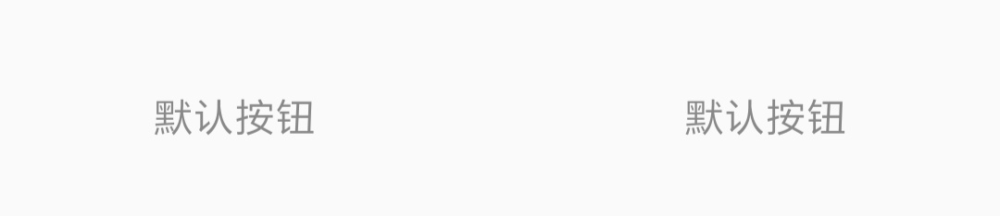

**进阶用法**

> 更改项参数的自定义

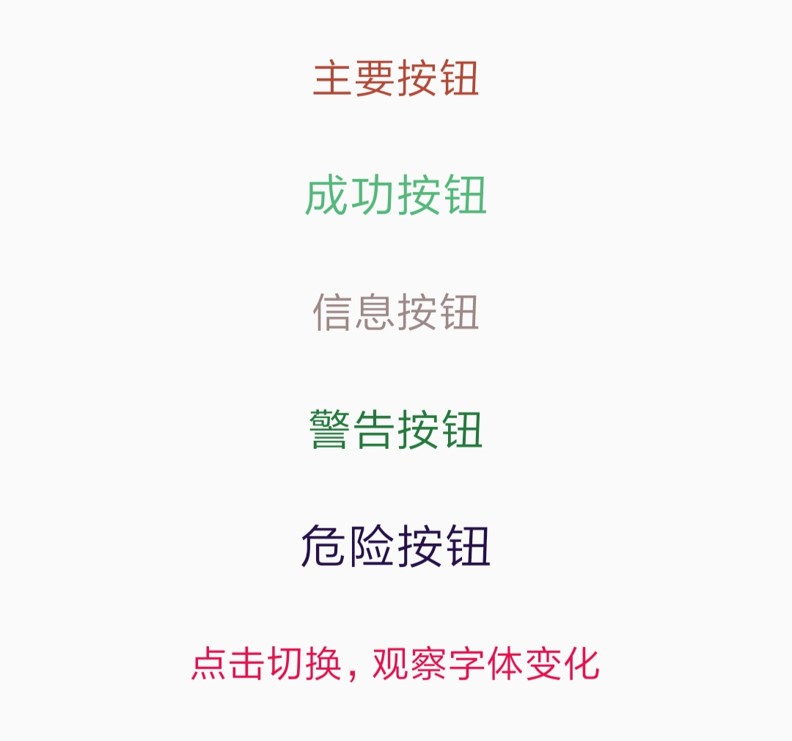


##### DropdownButton

**简介**

> Dropdown button “用于从项目列表中进行选择的按钮”
- 参数类型 T 是下拉菜单表示的值的类型。给定菜单中的所有条目必须表示具有一致类型的值。通常，使用枚举。每个DropdownMenuItem在项目必须专门与同类型的说法；

[官方文档]() - [示例代码]()

**基本用法**

> 此示例显示一个包含四个项目的菜单

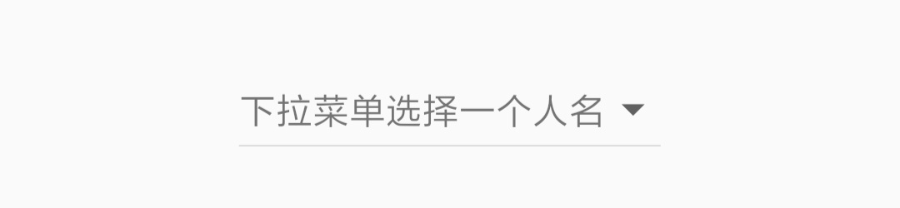

**进阶用法**

> 此示例尝试调整所有属性，展示出效果

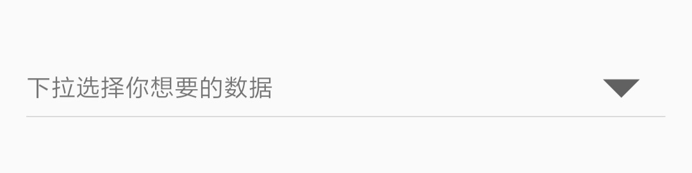


##### OutlineButton

**简介**

> Outline button “边框按钮”
- RaisedButton和FlatButton之间的交叉：一个有边框的按钮，当按下按钮时，其高度增加，背景变得不透明；
- 高程最初为0.0，其背景颜色 为透明。按下按钮时，其背景变为不透明，然后其高程增加到highlightElevation；

[官方文档]() - [示例代码]()

**基本用法**

> 参数的默认的 button 和禁用 button
- 如果onPressed回调为null，则该按钮将被禁用，不会对触摸做出反应，并且将按 disabledColor 属性而不是color属性指定的颜色进行着色；
- 如果您尝试更改按钮的颜色并且没有任何效果，请检查您是否正在传递非null onPressed处理程序；""";

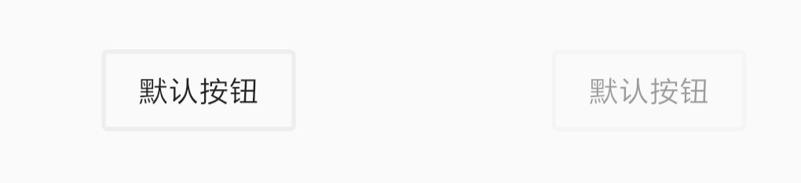

**进阶用法1**

> OutlineButton.icon 的用法，按钮图标和标签的widget创建文本按钮

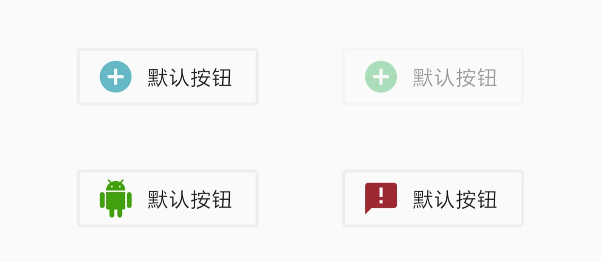

**进阶用法2**

> 更改参数的自定义,比如:边框，点击效果，内容文字,颜色,圆角等；
- Outline buttons 按钮有一个边框，其形状由形状定义 ，其外观由borderSide，disabledBorderColor 和 highlightedBorderColor 定义；
- 如果您想要 ink-splash 效果，但又不想使用 button ，请考虑直接使用 InkWell；
- Outline buttons 的最小尺寸为88.0×36.0，可以用 ButtonTheme 覆盖；
- 通过 shape 属性的设置，改变边框样式和圆角;
- 可以尝试长按按钮，button 突出显示;

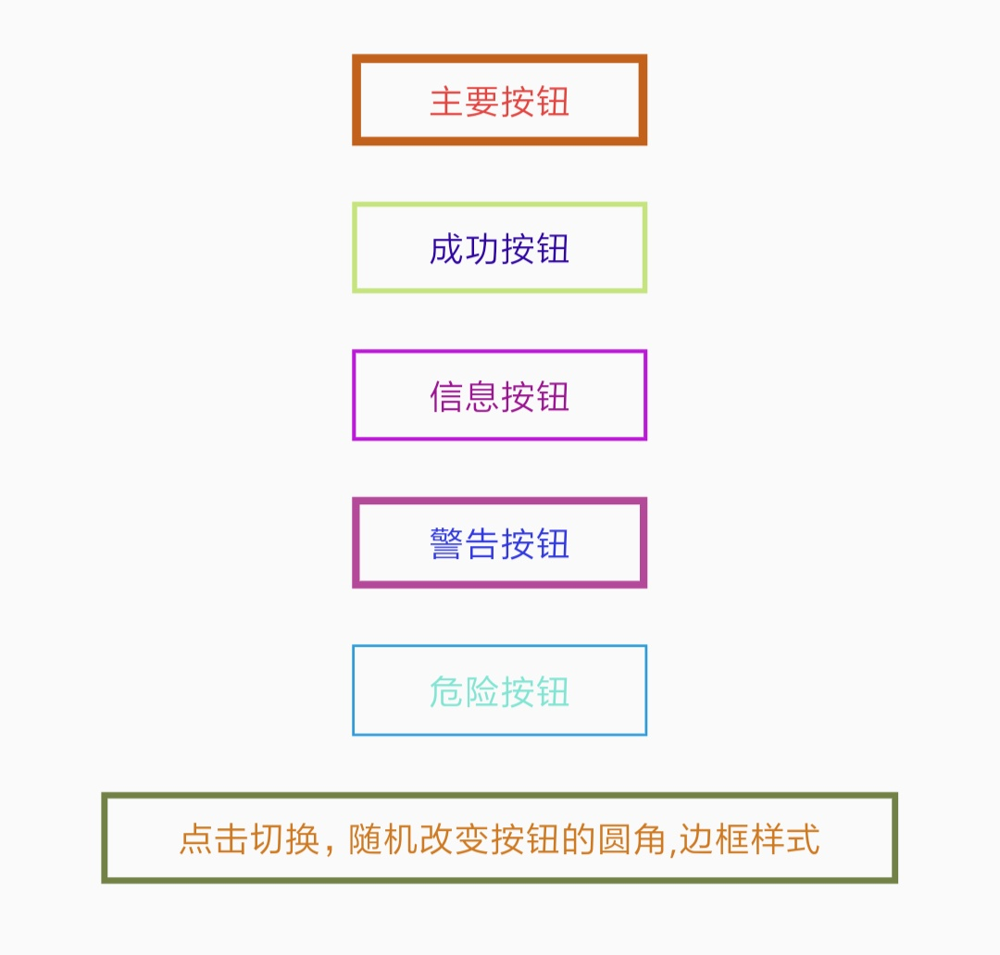

#### Text
##### Text

**简介**

> 具有某个单一样式的文本显示的widget组件, 显示支持一行或者多行. 默认样式会继承层级最为接近的 *DefaultStyle* 

当然, 你也可以重新他的样式 将 *DefaultStyle.inherit 设置为 false* 

是最基本的文本显示组件

[官方文档]() - [示例代码]()

**基本用法**

在这里介绍一下他的基本属性说明.

- data	Text显示的文本，必填参数	String
- textAlign	文本的对齐方式,可以选择左对齐、右对齐还是居中对齐	TextAlign
- maxLines	文本显示的最大行数	int
- overflow	文本显示的截断方式	TextOverflow
- textScaleFactor	文本的缩放比例	double
- style	用于指定文本显示的样式如颜色、字体、粗细、背景等

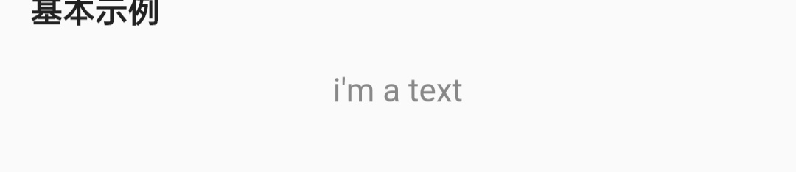


##### RichText

**简介**

> 具有复杂样式的文本显示组件

在富文本使用多个不同风格的widget显示文本。要显示的文本使用TextSpan对象树来描述，每个对象都有一个用于该子树的关联样式。文本可能会跨越多行，也可能全部显示在同一行上，具体取决于布局约束。

无论是Text或者Text.rich, 查看源代码发现. 都是由RichText构建出来

[官方文档]() - [示例代码]()

**基本用法**

我们可以让一段文本通过使用不同的TextSpan显示不同的样式。比如我们让"Hello beautiful world"的每个单词都显示不同的样式.

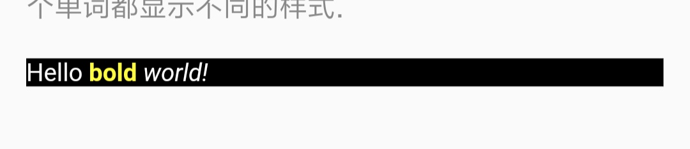


#### Radio
##### Radio

**简介**

> material design 风格的单选按钮

Radio widget 代表表单中的单选按钮, 当groupValue = value时代表组件被选中。

在表单中, 单选按钮是表示一组互斥选项按钮中的一个。当一个按钮被选中，之前选中的按钮就变为非选中的。

[官方文档]() - [示例代码]()

**基本用法**

以下是Radio的属性主产明
- activeColor → Color - 激活时的颜色。
- groupValue → T - 选择组的值。
- onChanged → ValueChanged - 改变时触发。
- value → T - 单选的值。


##### RadioListTile

**简介**

> material design 风格的单选按钮附加文字label

点击文字的同时 , 将会触发Radio的点击效果.

功能同 @Radio

[官方文档]() - [示例代码]()

**基本用法**

Radio是单选框，和checkbox一样本身不包含状态，当groupValue = value时代表选中状态


#### Slider
##### Slider

**简介**

> 用来选择范围性的数据

slider 用来选择连续性的或者非连续性的数据. 默认是在一段最大值最小值间做任意值的选择. 如果你想选择间隔性的值, 例如0.0到50.0间,选择10, 15,...50.0这样的值, 给divisions设定一个非空的整数5,, 去分割区间范围.

[官方文档]() - [示例代码]()

**基本用法**

关于slider有以下的术语:

* **thumb** 滑块  用户可以水平拖拽移动的区域

* **track** 滑轨 thumb 可以滑动的线条区域

* **value indicator** 值指示器 当用户拖拽thumb的时候. 显示用户当前所选的属性值

* **active** 选中区

* **inactive** 非选中区

如果**onChanged**属性为空或者**min** .. **max**给出的范围 为空（例如如果min等于max），则将禁用滑块。

滑块小部件本身不保持任何状态State。相反，当滑块状态发生变化时，窗口小部件会调用 **onChanged** 回调。大多数使用滑块的小部件将侦听 **onChanged** 回调并使用新值重建滑块以更新滑块的视觉外观。要知道值何时开始更改，或何时更改，请设置可选回调**onChangeStart**或**onChangeEnd**。

默认情况下，滑块将尽可能宽，垂直居中。当给定无限制约束时，它将尝试使轨道宽144像素（每边有边距）并垂直收缩。


**进阶用法**

> 自定义Slider 样式

如果当前Slider样式 无法满足需求, 可以通过 ** SliderTheme ** 定制复杂样式

```dart
 SliderTheme(
  data: SliderTheme.of(context).copyWith(
    activeTrackColor: Colors.yellowAccent,//实际进度的颜色
    inactiveTickMarkColor:Colors.black
    thumbColor: Colors.black,//滑块中心的颜色
    inactiveTrackColor:Colors.red,//默 认进度条的颜色
    valueIndicatorColor: Colors.blue,//提示进度的气派的背景色
    valueIndicatorTextStyle:  TextStyle(//提示气泡里面文字的样式
      color: Colors.white,
    ),
    inactiveTickMarkColor:Colors.blue,//divisions对进度线分割后 断续线中间间隔的颜色
    overlayColor: Colors.pink,//滑块边缘颜色
  child:  Slider()
)
```


##### SliderTheme

**简介**

> 用来更改Slider样式的上层部件

将滑块主题应用于后代Slider小部件。

[官方文档](https://docs.flutter.io/flutter/material/SliderTheme-class.html) - [示例代码]()

**基本用法**

> 通过更改sliderTheme.data, 修改Slider总体样式

基本属性参考以下代码: 

```dart
 SliderTheme(
  data: SliderThemeData({
    @required Color activeTrackColor,
    @required Color inactiveTrackColor,
    @required Color disabledActiveTrackColor,
    @required Color disabledInactiveTrackColor,
    @required Color activeTickMarkColor,
    @required Color inactiveTickMarkColor,
    @required Color disabledActiveTickMarkColor,
    @required Color disabledInactiveTickMarkColor,
    @required Color thumbColor,
    @required Color disabledThumbColor,
    @required Color overlayColor,
    @required Color valueIndicatorColor,
    @required SliderComponentShape thumbShape,
    @required SliderComponentShape valueIndicatorShape,
    @required ShowValueIndicator showValueIndicator,
    @required TextStyle valueIndicatorTextStyle
  }),
  child: anyWidgetContain(Slider) // 用来包含slider的widget容器窗口
),
```


##### SliderThemeData

**简介**

> SliderTheme的data修饰属性 **SliderThemeData**

[官方文档]() - [示例代码]()

**基本用法**

> 配合SliderTheme, 修改slider组件各个部件的样式, 参照@Slider的各组件命名, 修改各部件样式


#### Switch
##### Switch

**简介**

> Switch 是一个切换按钮组件，通常用于设置的选项里。

[官方文档]() - [示例代码]()

**基本用法**

通常用于Bool值参数的设置.

ios 风格的实例

如果需要ios风格下的实例, 我们可以使用**Switch**的子类**adaptive**,参数使用与Switch相同, 实例如下:


**进阶用法**

当默认的样式无法满足需求时, 我们可以通过自定义各部件样式.

- activeColor[**Color**] 当按钮状态通激活态时, 按钮的背景颜色
- activeThumbImage [**ImageProvider**] 当按钮状态处于激活态时, 按钮的背景图像
- activeTrackColor  [**Color**]  当按钮状态处于激活态时, 滑轨的颜色
- inactiveThumbColor [**Color**] 当按钮处于非激活状态时, 按钮的背景颜色, 与activeColor正好状态相反
- inactiveThumbImage  [**ImageProvider**] 当按钮状态处于非激活态时, 按钮的背景图像
- inactiveTrackColor  [**Color**] 当按钮状态处于非激活态时, 滑轨的颜色

下面是自定义, 更改了以上属性的实例


##### SwitchListTile

**简介**

> Switch 的一个衍生组件

基本用法与Switch相同.具体参考@Switch, 支持各种自定义样式.

[官方文档]() - [示例代码]()


##### AnimatedSwitcher

**简介**

> 一个在新旧组件. 做渐变切换的组件. 有一定的动画效果

*注意*: 
- 如果你切换的足够快.超过了间隔时间, 组件只会隐藏第一个 .并渐渐显示最后一个生效的组件.
- 如果你变更的组件.只是同一个组件, 不同的state或者不同的显示数据与状态. 请为当前组件每一个状态加入一个Key. 强制生效动画效果.


[官方文档]() - [示例代码]()


### Frame
#### Align
##### Align

**简介**

> Align控件即对齐控件，能将子控件所指定方式对齐，并根据子控件的大小调整自己的大小。
- 根据自己需求，进行控件对齐

[官方文档]() - [示例代码]()

**基本用法**

> alignment → AlignmentGeometry
- 要对齐右下方的框，那么对这个框对要求会比对子控件更加严肃的约束，使用：Alignment.bottomRight
- 同理：Alignment.center，Alignment.bottomLeft，Alignment.topLeft等


**进阶用法**

>  widthFactor / heightFactor → double
- 如果widthFactor / heightFactor 为空，并且外部无任何约束，child控件大小默认，那么这个控件将根据自身尺寸最大化
- 如果widthFactor / heightFactor 不为空，并且外部无约束，align将匹配对应的child尺寸
- ex：widthFactor/ heightFactor 为2.0；那么widget的宽高为child宽高的两倍
- 如果widthFactor / heightFactor 为空，并且外部无约束，child控件将会设置自身大小


#### Stack
##### Stack

**简介**

> 用于将多个childs相对于其框的边缘定位，多用于以简单方式重叠children
- 当第一个child置于底部时，堆栈按顺序绘制其子项。如果更改子项绘制顺序，可以使用新顺序重新建立堆栈
- 注意：stack的每一个子节点都已定位或未定位，定位子项必须至少一个非null属性的定位。

[官方文档]() - [示例代码]()

**基本用法**

> 1.alignment → AlignmentGeometry
- 对齐方式，默认是右上角,详情请点击Layout-row页面，类似
- 多个positioned叠加图层，Alignment.center事例

> fit → StackFit
- loose:放开了子节点宽高的约束，可以让子节点从0到最大尺寸
- expand: 子节点最大可能的占用空间，允许最大大小
- passthrough：不改变子节点约束

>textDirection → TextDirection
- 文本方向

> overflow → Overflow
- 超过的部分是否裁剪掉
- overflow: Overflow.clip/visible


##### IndexedStack

**简介**

> 显示一个子项列表的单个子项。
- 只显示指定位置的widget，其他的位置的widget不会显示，所以indexedStack的尺寸永远和最大的子节点一样。
- 显示的子项widget是给到了具体的索引选择出来的widget
- 如果value 为null，将不显示任何内容

[官方文档]() - [示例代码](https://docs.flutter.io/flutter/widgets/IndexedStack-class.html)

**基本用法**

> index → int
- 控制显示child的索引
- ex:可以通过多个图片转化表示状态（正确，错误，警告等）。
  


#### Layout
##### Row

**简介**

> Row 是一个将其child显示在水平数组的widget
- 将其child填充可用的横向水平空间，一行高度是childs的最大高度（即：总是满足传入的垂直约束）
- 如果你只有一个child，只需要考虑使用对其或者中间位置，如果多个child，注意扩展水平空间(Expanded)，可以将child封装在一个扩展部件里面
- 当我们看到行有黄色和黑色条纹警告时候，说明行已经溢出，当行溢出，行之间空间将没有任何空间可供扩展。


[官方文档]() - [示例代码](https://docs.flutter.io/flutter/widgets/Row-class.html)

**基本用法**

> 水平布局，设置位置对齐方式

mainAxisSize 属性
- 一行的高度是有mainAxisSize属性控制，默认是max

 mainAxisAlignment属性s
- 将children放置在主轴某位置

 CrossAxisAlignment 属性
- crossAxisAlignment: crossAxisAlignment.center/end/start,
- 即，根据设定的位置交叉对齐


##### Column

**简介**

> Column 是一个将其child显示在竖直方向数组的widget，于Row相对
- 将其child填充可用的竖直水平空间，默认竖直空间无法滚动，如有很多children，竖直空间饱和无法放置，你可以使用listView搭配使用
- 如果你只有一个child，只需要使用对齐（Align）或者居中（Center）来展示child

[官方文档]() - [示例代码](https://docs.flutter.io/flutter/widgets/Column-class.html)

**基本用法**

> 竖直布局，设置位置对齐方式

mainAxisSize 属性
- 一行的高度是有mainAxisSize属性控制，默认是max

mainAxisAlignment属性
- 将children放置在主轴某位置

CrossAxisAlignment 属性
- crossAxisAlignment: crossAxisAlignment.center/end/start,
- 即，根据设定的位置交叉对齐


##### Container

**简介**

> 一个常用的widget，它结合了常见的绘画，定位和大小调整
- 该容器首先让child填充绘制，然后再将其他的约束应用于填充范围。
- 在绘画过程中，容器先应用给定的转换，再绘制装饰以填充的范围，然后绘制child，最后绘制前景，同时填充需要填充的范围
- 没有child的容器将尽可能的大，除非传入的约束是无限制的。child的大小会被width，height等约束覆盖。

[官方文档]() - [示例代码](https://docs.flutter.io/flutter/widgets/Container-class.html)

**基本用法**

> Container 可以结合多种其他widget，每个widget都有自己的布局行为，因此Container的布局行为有点复杂。
- 简单说，就是如果窗口小部件没有子窗口，没有height，没有width，没有约束，并且父窗口提供无限制约束，则Container会尝试尽可能小。


##### Center

**简介**

> 一个将child 放置于中心
- 如果它的尺寸受到外界约束，并且widthFactor和heightFactor 为null，则widget将会尽可能的大。
- 如果它的尺寸不受外界约束，并且相应的大小为null，则widget将会匹配child widget的大小
- 如果相应尺寸不为null，则widget的相应尺寸将是child 尺寸和尺寸因子的乘积（例如：widthFactor是2.0,那么widget的宽度始终是其child widget宽度的2倍）


[官方文档]() - [示例代码](https://docs.flutter.io/flutter/widgets/Column-class.html)

**基本用法**

- 如果widthFactor是2.0，那么widget的宽度将始终是其子宽度的两倍。
- 如果heightFactor是2.0，那么widget的高度将始终是其子高度的两倍。


#### Box
##### ConstrainedBox

**简介**

> 添加额外的限制条件到child上
- 比如说，你限制child最小高度为50.0像素，就可以用constraints: const BoxConstraints(minHeight：50）

[官方文档]() - [示例代码](https://docs.flutter.io/flutter/widgets/ConstrainedBox-class.html)

**基本用法**

> 添加额外的限制条件到child上
- ex:添加ConstrainedBox约束如下，传入不同Width约束的Container效果  
minWidth: 100.0,  
minHeight: 20.0,  
maxWidth: 300.0,  
maxHeight: 50.0


##### OverflowBox

**简介**

> 它对child施加的约束不同于从其父控件获得的约束，可能允许child溢出父控件的空间.
- 当OverflowBox的最大尺寸大于child的时候，child可以完整显示，当其小于child的时候，则以最大尺寸为基准，当然，这个尺寸都是可以突破父节点的

[官方文档]() - [示例代码](https://docs.flutter.io/flutter/widgets/OverflowBox-class.html)

**基本用法**

> OverflowBox设置最大/最小尺寸
- SizedOverflowBox，一个特定大小的小部件，但将其原始约束传递给它的子节点，然后可能会溢出。
- ConstrainedBox，一个对其子项施加额外约束的小部件。
- UnconstrainedBox，一个试图让它的child在没有约束的情况下绘制的容器。
- SizedBox，一个具有指定大小的盒子。


##### DecoratedBox

**简介**

> 在child绘制前或绘制后，添加额外的限制条件到child上的widget
- 根据边界的宽高，对其child进行插入绘制

[官方文档]() - [示例代码](https://docs.flutter.io/flutter/widgets/DecoratedBox-class.html)

**基本用法**

> decoration → Decoration
- 常用于BoxDecoration
- BoxDecoration提供多种方式来绘制以一个框
- 盒子形状可以是圆形也可以是矩形，用borderRadius属性来绘制角度

> position → DecorationPosition
- position: DecorationPosition.foreground,


##### FittedBox

**简介**

> 根据自己的需要，对child进行缩放和定位
- 可以看看变换，在绘制时任意变换应用在子窗口的widget


[官方文档]() - [示例代码](https://docs.flutter.io/flutter/widgets/FittedBox-class.html)

**基本用法**

> 根据外部约束，调整child
- 如果外部没有约束，按照child的大小。
- 如果外部有约束，按照外部约束调整自身大小，然后缩放调整child，根据条件进行放置
- BoxFix 属性，可修改child写入布局时期分配的空间
- alignment修改child于父空间对齐方式，默认：Alignment.center,


##### LimitedBox

**简介**

> 对最大宽高进行限制的控件（前提是LimitedBox不受约束）
- 即：将child限制在指定的最大宽高中
- 这就使得child自身没有约束大小的时候具有了外部约束，依然控制了其大小
- 例如：通过给LimitedBox最大高度(maxHeight)，widget通常会调整其自身的大小去适应父窗体，但是，当放置在竖直（cloumn）列表中时，它将采用给定的高度

[官方文档]() - [示例代码](https://docs.flutter.io/flutter/widgets/LimitedBox-class.html)

**基本用法**

> widget 限制child最大宽高，如下：
- 如果LimitedBox外部宽度没有被约束，child的宽受到LimitedBox最大宽度（maxWidth）属性限制
- 同理，LimitedBox外部高度没有约束，child的高受到LimitedBox最大高度（maxHeight）属性限制


##### RotatedBox

**简介**

> 可以将子widget旋转整数的四分之一
 - 和Transform不同，该对象在布局之前应用其旋转，整个旋转的范围仅消耗旋转的子widget所需要的空间

[官方文档]() - [示例代码](https://docs.flutter.io/flutter/widgets/RotatedBox-class.html)

**基本用法**

> 旋转widget
- 通过quarterTurns，设置child的顺时针四分之一的转数
- ex:quarterTurns=3/8


##### SizedOverflowBox

**简介**

> 一个特定大小的窗口小部件,将其原始约束传递给其子节点,可能会溢出。
### **基本用法**
> alignment：对齐
> size： 设置部件大小
- ex:为方便看效果，现设置幕布大小为(Container)200*50。图一

- ex:图一，基础上添加一个不设置size属性的SizeOverflowBox。图二

- ex:图二，添加size属性，100*20,图三

- ex:图三，添加 alignment: Alignment.center,

[官方文档]() - [示例代码](https://docs.flutter.io/flutter/widgets/SizedBox-class.html)


##### UnconstrainedBox

**简介**

> 跟ConstrainedBox相反，是不添加任何约束条件到child上，让child按照其原始的尺寸渲染
- 它的作用就是给child一个尽可能大的空间，不加约束的让其显示。
- 如果该widget不能扩展到到足够容纳整个child的空间，child将被裁剪

[官方文档]() - [示例代码](https://docs.flutter.io/flutter/widgets/UnconstrainedBox-class.html)

**基本用法**

- alignment  属性:控制child对齐方式
- textDirection 属性：控制文本对齐
- constrainedAxis 属性：如果有，就使用


#### Expanded
##### Expanded

**简介**

> 一个用于撑开 flex 布局子组件空间的widget
- 用于在Row、Column、Flex子组件内
- 会沾满所有可用空间

[官方文档]() - [示例代码](https://docs.flutter.io/flutter/widgets/Expanded-class.html)

**基本用法**

> 以下示例对比使用 ```Expanded```
- 使用Expanded 可以使 Row、Column或者Flex的子项能够填充主轴的全部可用空间
- 如果存在多个子项，则根据 flex 属性来划分可用空间
- Expanded widget 必须是Row,Column或者Flex的后代


#### Spacing
##### Padding

**简介**

> widget 内边距
- 类似于前端中的 div+css:padding 效果
- Container + padding = Padding

[官方文档]() - [示例代码](https://docs.flutter.io/flutter/widgets/Padding-class.html)

**基本用法**

> Padding widget 的padding必须设置，不能为null
- 通过给定的padding值来隔开子组件
- 通过EdgeInsets 类来计算 padding的大小


##### SliverPadding

**简介**

> SliverPadding 属于 Flutter Slivers大家族中的一个
- SliverPadding 是 Slivers 大家族中的一类padding
- 可以配合各种 Sliver成员使用

[官方文档]() - [示例代码](https://docs.flutter.io/flutter/widgets/SliverPadding-class.html)

**基本用法**

> 这里我们结合Slivers家族中的 SliverList 来演示使用
- Flutter 中的Slivers大家族基本都是配合CustomScrollView来实现一些自定义滚动效果
- padding作用于每一个item
- 对于有些特殊的sliver可能会有副作用，比如对于 ```pinned:true``` 的 SliverPersisitentHeader 设置可能会导致 APPBar与之前的sliver重叠


##### AnimatedPadding

**简介**

> 属于Flutter动画成员的一部分

[官方文档]() - [示例代码](https://docs.flutter.io/flutter/widgets/AnimatedPadding-class.html)

**基本用法**

> 动画版本的Padding
- 在给定的时间内，自动完成转换缩进到给定的padding值
- 通过设置curve 来指定动画的运行速率动画


#### Table
##### Table

**简介**

> 一种布局方法
- 一个可以对齐子元素进行table 布局算法的Widget

[官方文档]() - [示例代码]()

**基本用法**

> 大多用于多行多列的需求
- 如果你只有一行或者一列，其实选择Row和Column更合适一些
- 表格中行的大小是根据列行数和宽度计算的来，控制列宽可以使用 columnWidth 属性
- 注意，Table中每一行的列数需要一致，否则报错


### Media
#### Image
##### AssetImage

**简介**

> 从AssetBundle中获取图像，根据上下文来确定使用确切的图像

根据给定的一些资源，AssetImage 可以根据你给定的配置，然后根据设备的像素比率和大小，然后选择合适的资源文件

[官方文档]() - [示例代码]()

**基本用法**

> 从AssetBundle中获取图像，根据上下文来确定使用确切的图像

#### 使用命名资源文件去匹配不同像素的设备

以'Nx'的形式命名图片资源文件，其中N标识改资源文件的标称设备像素比率

假如某一个应用程序使用命名为 heart.png 的图标，此图标的表示为1.0（主图标），以及 1.5和2.0像素比。然后我们在资源包中应如下命名：

  ```
  heart.png
  1.5x/heart.png
  2.0x/heart.png
  ```
在具有1.0设备像素比的设备上，所选择的图片是 heart.png ，在具有1.3设备的像素比的设备上，所选择图片是 1.5x/heart.png.
只要变量命名处于同一个目录层级，资源文件的目录层级就无关紧要。如下也是有效的目录结构。

```
  icons/heart.png
  icons/1.5x/heart.png
  icons/2.0x/heart.png
```

#### 获取资源文件
需要从package中获取资源文件，需要提供package的参数。我们需要在项目中的 pubspec.yaml 文件里加上具体的asset文件：

```yaml
flutter:
  assets:
    - icons/heart/.png
```
然后可以如下使用
```
AssetImage('icons/heart.png');
```

**在package中的资源**

如果需要从package中获取资源文件，必须提供package参数。加入下面的结构位于一个名为 my_icons 的包中，然后获取图像：

```dart
AssetImage('icons/heart.png', package: 'my_icons')
```
如果在package的pubspec.yaml中指定了所需资源，则会自动将其与应用程序捆绑在一起。 特别是，package本身使用的资产必须在pubspec.yaml中指定。

package 还可以选择在其'lib /'文件夹中具有未在其pubspec.yaml中指定的资源。 在这种情况下，对于要捆绑的图像，应用程序必须指定要包含的图像。 例如，名为fancy_backgrounds的包可能具有

```yaml
lib/backgrounds/background1.png
lib/backgrounds/background2.png
lib/backgrounds/background3.png
```

比如说第一张图片，应用程序的pubspec.yaml应该在资源部分指定它：
```yaml
assets:
   - packages/fancy_backgrounds/backgrounds/background1.png
```
lib /是隐含的，因此它不应包含在 assets 路径中。


> 一下demo分别作为背景图片和配合Image使用


##### DecorationImage

**简介**

> 修饰Box的图片

[官方文档]() - [示例代码]()

**基本用法**

> demo演示作为背景图片的样例

- 一般配合BoxDecoration的img属性使用,设置背景图片
- 也可以配合paintImage使用


##### ExactAssetImage

**简介**

> 类似带有scale属性的AssetImage

从```Image.asset```源码中可以看到

[官方文档]() - [示例代码](https://docs.flutter.io/flutter/painting/ExactAssetImage-class.html)

**基本用法**

- 使用方法与AssetImage类似
- 可以理解为带有scale属性的AssetImage


##### FadeInImage

**简介**

> placeHodler image到目标图片的一种过渡widget
- 使用FadeInImage可以类似网络加载的图片以一个更加优雅的形式出现在屏幕上
- 如果这个图片已经被加载了，或者已经存在内存中，那么placeholder图片将不会显示

[官方文档]() - [示例代码](https://docs.flutter.io/flutter/widgets/FadeInImage-class.html)

**基本用法**

> FadeInImage的写法跟Image类似，有很多别的命名构造函数。
- fadeOutDuration和fadeOutCurve控制placeholder的淡出动画
- fadeInDuration和fadeInCurve控制目标图像的淡入动画
- 对于placeholder，更倾向于使用已经缓存的，以防止他也会突然的出现在屏幕上


##### FileImage

**简介**

> 用于展示本地的文件
- 将给定的File对象解码为图片
- 可以指定缩放scale

[官方文档]() - [示例代码](https://docs.flutter.io/flutter/painting/FileImage-class.html)

**基本用法**

> 简写形式和Image也都非常相似
- Image.file 是ImageFile 的一种简写形式


##### NetworkImage

**简介**

> 展示网络图片的widget
- 我们可以使用NetworkImage来获取网络图片并展示

[官方文档]() - [示例代码](https://docs.flutter.io/flutter/painting/NetworkImage-class.html)

**基本用法**

> Image.network 是 NetworkImage 提供给Image widget 的一种简写形式
- 支持scale属性进行图片的缩放


##### RawImage

**简介**

> 一个直接显示dart:ui.Image的widget

[官方文档]() - [示例代码](https://docs.flutter.io/flutter/widgets/RawImage-class.html)

**基本用法**

> RawIamge很少使用，推荐使用Image
- RawImage 是通过 paintImage 绘制出来的Image。这个方法更加详细的描述了各个字段的含义
- 传递给RawImage中的Image是dart：ui下的Image而不是Material下的Image，见Demo注释


**进阶用法**

> 关于更多详细介绍，请看paintImage的属性说明


##### MemoryImage

**简介**

> 将给定的Uint8List 缓冲区解码为图像的widget
- 甚至我们也可以利用的来实现将Base64编码的图片展示出来（利用 Uint8List.fromtList 构造函数） 

[官方文档]() - [示例代码](https://docs.flutter.io/flutter/painting/MemoryImage-class.html)

**基本用法**

> demo中我们作为读取内存图片来展示
- 提供给MemoryImage的字节不应该再有更改
- 如果需要经常改变的图片，请使用ImageProvider下的子类


##### Image

**简介**

> 用于展示图片的widget
- 对于原始解码图像数据的不透明处理
- 如果需要获取Image对象，可以考虑使用 instantiateImageCodec
- 如果需要绘制图片，可以考虑使用  Canvas,比如： Canvas.drawImage

[官方文档]() - [示例代码](https://docs.flutter.io/flutter/dart-ui/Image-class.html)

**基本用法**

> 这里主要介绍加入图片的几种方式
- Image.asset:加载资源图片，就是加载项目资源目录中的图片,加入图片后会增大打包的包体体积，用的是相对路径
- Image.network:网络资源图片，意思就是你需要加入一段http://xxxx.xxx的这样的网络路径地址
- Image.file:加载本地图片，就是加载本地文件中的图片，这个是一个绝对路径，跟包体无关
- Image.memory: 加载Uint8List资源图片


#### Icon
##### Icon

**简介**

> 使用IconData中描述的字体（ 例如素材中预定义的IconDatas） 中的字形绘制的图形图标。 
- 该图标不是交互示， 只是展示图标样式。 如果对于有交互要求， 可以使用IconButton

[官方文档]() - [示例代码](https://docs.flutter.io/flutter/material/Icons-class.html)

**基本用法**

- 多用于图标的使用选择 
- 可对图标设置大小， 颜色， 标签等


##### ImageIcon

**简介**

> 来自ImageProvider的图标，例如AssetImage。
- 图标由其名称标示

[官方文档]() - [示例代码](https://docs.flutter.io/flutter/widgets/ImageIcon-class.html)

**基本用法**

### **基本用法**
- 创建图像图标,在size和color默认为当前给定的值IconTheme
- 当你用一个图片时，这个图片会被填充你设置的颜色，只保留图片的形状，
- 即填充图片像素所在的所有位置


##### IconTheme

**简介**

> 用于应用栏图标的颜色，不透明度和大小。
- 图标主题Icon和ImageIcon的依赖

[官方文档]() - [示例代码](https://docs.flutter.io/flutter/widgets/IconTheme-class.html)

**基本用法**

- 通常，这与backgroundColor，brightness，textTheme一起设置。
默认为ThemeData.primaryIconTheme。


##### IconData

**简介**

> 字体表示符合表示的图标说明
- 可参考图标

[官方文档]() - [示例代码](https://docs.flutter.io/flutter/widgets/IconData-class.html)

**基本用法**

- 多用于图标的使用选择 
- 可对图标设置大小， 颜色， 标签等


##### IconThemeData

**简介**

> IconThemeData为图标提供属性，必须是Icon的父级
- 图标主题Icon和ImageIcon的依赖,获取当前主题，是用IconTheme.of

[官方文档]() - [示例代码](https://docs.flutter.io/flutter/widgets/IconThemeData-class.html)

**基本用法**

- 部分widget无法管理大小，IconThemeData的size属性失效。
- 通过opacity属性，修改widget透明度，如下图


#### Canvas
##### Canvas

**简介**

> 用于操作图形的界面;
- canvas 对象用于创建图片对象，这些对象本身可以与 SceneBuilder 一起用于构建场景;

[官方文档]() - [示例代码](https://docs.flutter.io/flutter/dart-ui/Canvas-class.html)

**基本用法**

> 绘制点
- 绘制点有三种模式, points（点），lines（线，隔点连接），polygon（线，相邻连接）


> 绘制直线


> 绘制圆


> 绘制圆弧
- Rect 来确认圆弧的位置，还需要开始的弧度、结束的弧度、是否使用中心点绘制、以及 paint 弧度

> 绘制椭圆
- 使用左上和右下角坐标来确定矩形的大小和位置,椭圆是在这个矩形之中内切的形状


> 绘制矩形，圆角矩形
- 用 Rect构建矩形
- 根据上面的矩形,构建一个圆角矩形

> 绘制两个相套矩形


> 绘制图片到canvas


> 绘制一个星形
- 它可以使用“平移”、“缩放”、“旋转”、“倾斜”和“变换”方法进行修改;
- 可以使用 clipRect、clipCorrect 和 clipPath 方法进行修改;
- 可以使用由 save、savelayer和 restore 方法管理的堆栈来保存和还原当前的转换和剪辑。


**进阶用法**


**进阶用法**


##### PainterSketch

**简介**

> 操作图形的界面;

[官方文档]() - [示例代码](https://docs.flutter.io/flutter/dart-ui/Paint-class.html)

**基本用法**

- canvas + paint + GestureDetector 实现一个 简易的画板;


**进阶用法**


**进阶用法**


##### PainterPath

**简介**

> 在 canvas 上绘制的图案;
-  canvas + paint 的应用。

[官方文档]() - [示例代码](https://docs.flutter.io/flutter/dart-ui/Paint-class.html)

**基本用法**

- canvas 的 painter 的自定义绘制线的方法;


> 绘制简单直线


> 绘制折线


> 二阶贝塞尔曲线


> 三阶贝塞尔曲线


##### CircleProgressBarPainter

TODO


## Component
### Navigation
#### BottomNavigationBarItem

**简介**

[官方文档]() - [示例代码]()

**基本用法**


**进阶用法**


**进阶用法**


#### BottomNavigationBar

**简介**

[官方文档]() - [示例代码]()

**基本用法**


**进阶用法**


**进阶用法**


### List
#### AnimatedList

**简介**

[官方文档]() - [示例代码]()

**基本用法**


**进阶用法**


**进阶用法**


#### ListView

**简介**

[官方文档]() - [示例代码]()

**基本用法**


**进阶用法**


**进阶用法**


#### ListBody

**简介**

[官方文档]() - [示例代码]()

**基本用法**


**进阶用法**


**进阶用法**


### Card
#### Card

**简介**

[官方文档]() - [示例代码]()

**基本用法**


**进阶用法**


**进阶用法**


### Bar
#### AppBar

**简介**

[官方文档]() - [示例代码]()

**基本用法**


**进阶用法**


**进阶用法**


#### BottomAppBar

**简介**

[官方文档]() - [示例代码]()

**基本用法**


**进阶用法**


**进阶用法**


#### SnackBar

**简介**

[官方文档]() - [示例代码]()

**基本用法**


**进阶用法**


**进阶用法**


#### SliverAppBar

**简介**

[官方文档]() - [示例代码]()

**基本用法**


**进阶用法**


**进阶用法**


#### FlexibleSpaceBar

**简介**

[官方文档]() - [示例代码]()

**基本用法**


**进阶用法**


**进阶用法**


#### ButtonBar

**简介**

[官方文档]() - [示例代码]()

**基本用法**


**进阶用法**


**进阶用法**


#### SnackBarAction

**简介**

[官方文档]() - [示例代码]()

**基本用法**


**进阶用法**


**进阶用法**


#### TabBar

**简介**

[官方文档]() - [示例代码]()

**基本用法**


**进阶用法**


**进阶用法**


### Dialog
#### AlertDialog

**简介**

[官方文档]() - [示例代码]()

**基本用法**


**进阶用法**


**进阶用法**


#### Dialog

**简介**

[官方文档]() - [示例代码]()

**基本用法**


**进阶用法**


**进阶用法**


#### AboutDialog

**简介**

[官方文档]() - [示例代码]()

**基本用法**


**进阶用法**


**进阶用法**


#### SimpleDialog

**简介**

[官方文档]() - [示例代码]()

**基本用法**


**进阶用法**


**进阶用法**


### Scaffold
#### Scaffold

**简介**

[官方文档]() - [示例代码]()

**基本用法**


**进阶用法**


**进阶用法**


#### ScaffoldState

**简介**

[官方文档]() - [示例代码]()

**基本用法**


**进阶用法**


**进阶用法**


### Grid
#### GridTile

**简介**

[官方文档]() - [示例代码]()

**基本用法**


**进阶用法**


**进阶用法**


#### GridView

**简介**

[官方文档]() - [示例代码]()

**基本用法**


**进阶用法**


**进阶用法**


#### GridPaper

**简介**

[官方文档]() - [示例代码]()

**基本用法**


**进阶用法**


**进阶用法**


#### SliverGrid

**简介**

[官方文档]() - [示例代码]()

**基本用法**


**进阶用法**


**进阶用法**


#### GridTileBar

**简介**

[官方文档]() - [示例代码]()

**基本用法**


**进阶用法**


**进阶用法**


### Scroll
#### ScrollView

**简介**

[官方文档]() - [示例代码]()

**基本用法**


**进阶用法**


**进阶用法**


#### Scrollable

**简介**

[官方文档]() - [示例代码]()

**基本用法**


**进阶用法**


**进阶用法**


#### ScrollbarPainter

**简介**

[官方文档]() - [示例代码]()

**基本用法**


**进阶用法**


**进阶用法**


#### ScrollMetrics

**简介**

[官方文档]() - [示例代码]()

**基本用法**


**进阶用法**


**进阶用法**


#### ScrollPhysics

**简介**

[官方文档]() - [示例代码]()

**基本用法**


**进阶用法**


**进阶用法**


#### BoxScrollView

**简介**

[官方文档]() - [示例代码]()

**基本用法**


**进阶用法**


**进阶用法**


#### CustomScrollView

**简介**

[官方文档]() - [示例代码]()

**基本用法**


**进阶用法**


**进阶用法**


#### NestedScrollView

**简介**

[官方文档]() - [示例代码]()

**基本用法**


**进阶用法**


**进阶用法**


### Tab
#### Tab

**简介**

[官方文档]() - [示例代码]()

**基本用法**


**进阶用法**


**进阶用法**


### Menu
#### CheckedPopupMenuItem

**简介**

[官方文档]() - [示例代码]()

**基本用法**


**进阶用法**


**进阶用法**


#### DropdownMenuItem

**简介**

[官方文档]() - [示例代码]()

**基本用法**


**进阶用法**


**进阶用法**


#### PopupMenuButton

**简介**

[官方文档]() - [示例代码]()

**基本用法**


**进阶用法**


**进阶用法**


#### PopupMenuDivider

**简介**

[官方文档]() - [示例代码]()

**基本用法**


**进阶用法**


**进阶用法**


#### PopupMenuEntry

**简介**

[官方文档]() - [示例代码]()

**基本用法**


**进阶用法**


**进阶用法**


#### PopupMenuItem

**简介**

[官方文档]() - [示例代码]()

**基本用法**


**进阶用法**


**进阶用法**


### Pick
#### DayPicker

**简介**

[官方文档]() - [示例代码]()

**基本用法**


**进阶用法**


**进阶用法**


#### MonthPicker

**简介**

[官方文档]() - [示例代码]()

**基本用法**


**进阶用法**


**进阶用法**


#### YearPicker

**简介**

[官方文档]() - [示例代码]()

**基本用法**


**进阶用法**


**进阶用法**


#### ShowdatePicker

**简介**

[官方文档]() - [示例代码]()

**基本用法**


**进阶用法**


**进阶用法**


#### CityPicker

**简介**

[官方文档]() - [示例代码]()

**基本用法**


**进阶用法**


**进阶用法**


### Chip
#### Chip

**简介**

[官方文档]() - [示例代码]()

**基本用法**


**进阶用法**


**进阶用法**


#### ChipTheme

**简介**

[官方文档]() - [示例代码]()

**基本用法**


**进阶用法**


**进阶用法**


#### ChipThemeData

**简介**

[官方文档]() - [示例代码]()

**基本用法**


**进阶用法**


**进阶用法**


#### ChoiceChip

**简介**

[官方文档]() - [示例代码]()

**基本用法**


**进阶用法**


**进阶用法**


#### FilterChip

**简介**

[官方文档]() - [示例代码]()

**基本用法**


**进阶用法**


**进阶用法**


#### InputChip

**简介**

[官方文档]() - [示例代码]()

**基本用法**


**进阶用法**


**进阶用法**


#### RawChip

**简介**

[官方文档]() - [示例代码]()

**基本用法**


**进阶用法**


**进阶用法**


### Panel
#### ExpansionPanel

**简介**

[官方文档]() - [示例代码]()

**基本用法**


**进阶用法**


**进阶用法**


#### ExpansionPanelList

**简介**

[官方文档]() - [示例代码]()

**基本用法**


**进阶用法**


**进阶用法**


#### ExpansionPanelRadio

**简介**

[官方文档]() - [示例代码]()

**基本用法**


**进阶用法**


**进阶用法**


**简介**

[官方文档]() - [示例代码]()

**基本用法**


**进阶用法**


**进阶用法**


### Progress
#### LinearProgressIndicator

**简介**

[官方文档]() - [示例代码]()

**基本用法**


**进阶用法**


**进阶用法**


#### CircularProgressIndicator

**简介**

[官方文档]() - [示例代码]()

**基本用法**


**进阶用法**


**进阶用法**


#### RefreshProgressIndicator

**简介**

[官方文档]() - [示例代码]()

**基本用法**


**进阶用法**


**进阶用法**


* Theme
### Material
#### MaterialApp

**简介**

[官方文档]() - [示例代码]()

**基本用法**


**进阶用法**


**进阶用法**


#### MaterialColor

**简介**

[官方文档]() - [示例代码]()

**基本用法**


**进阶用法**


**进阶用法**


#### MaterialButton

**简介**

[官方文档]() - [示例代码]()

**基本用法**


**进阶用法**


**进阶用法**


#### MaterialPageRoute

**简介**

[官方文档]() - [示例代码]()

**基本用法**


**进阶用法**


**进阶用法**


#### MaterialAccentColor

**简介**

[官方文档]() - [示例代码]()

**基本用法**


**进阶用法**


**进阶用法**


#### MergeableMaterialItem

**简介**

[官方文档]() - [示例代码]()

**基本用法**


**进阶用法**


**进阶用法**


### Cupertino
#### CupertinoApp

**简介**

[官方文档]() - [示例代码]()

**基本用法**


**进阶用法**


**进阶用法**


#### CupertinoButton

**简介**

[官方文档]() - [示例代码]()

**基本用法**


**进阶用法**


**进阶用法**


#### CupertinoColors

**简介**

[官方文档]() - [示例代码]()

**基本用法**


**进阶用法**


**进阶用法**


#### CupertinoIcons

**简介**

[官方文档]() - [示例代码]()

**基本用法**


**进阶用法**


**进阶用法**


#### CupertinoNavigationBar

**简介**

[官方文档]() - [示例代码]()

**基本用法**


**进阶用法**


**进阶用法**


#### CupertinoPageRoute

**简介**

[官方文档]() - [示例代码]()

**基本用法**


**进阶用法**


**进阶用法**


#### CupertinoPageScaffold

**简介**

[官方文档]() - [示例代码]()

**基本用法**


**进阶用法**


**进阶用法**


#### CupertinoPicker

**简介**

[官方文档]() - [示例代码]()

**基本用法**


**进阶用法**


**进阶用法**


#### CupertinoPopupSurface

**简介**

[官方文档]() - [示例代码]()

**基本用法**


**进阶用法**


**进阶用法**


#### CupertinoScrollbar

**简介**

[官方文档]() - [示例代码]()

**基本用法**


**进阶用法**


**进阶用法**


#### CupertinoSegmentedControl

**简介**

[官方文档]() - [示例代码]()

**基本用法**


**进阶用法**


**进阶用法**


#### CupertinoSlider

**简介**

[官方文档]() - [示例代码]()

**基本用法**


**进阶用法**


**进阶用法**


#### CupertinoSliverNavigationBar

**简介**

[官方文档]() - [示例代码]()

**基本用法**


**进阶用法**


**进阶用法**


#### CupertinoSwitch

**简介**

[官方文档]() - [示例代码]()

**基本用法**


**进阶用法**


**进阶用法**


#### CupertinoTabBar

**简介**

[官方文档]() - [示例代码]()

**基本用法**


**进阶用法**


**进阶用法**


#### CupertinoTabScaffold

**简介**

[官方文档]() - [示例代码]()

**基本用法**


**进阶用法**


**进阶用法**


#### CupertinoTabView

**简介**

[官方文档]() - [示例代码]()

**基本用法**


**进阶用法**


**进阶用法**


#### CupertinoTimerPicker

**简介**

[官方文档]() - [示例代码]()

**基本用法**


**进阶用法**


**进阶用法**


## 总结 
