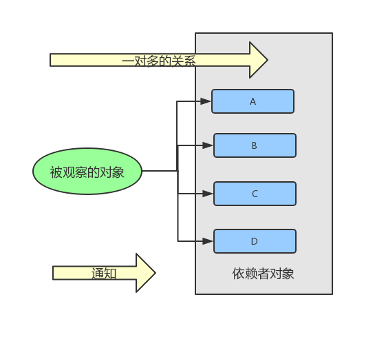
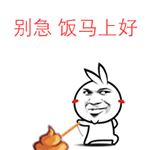

# Java 设计模式：观察者模式

观察者模式定义了对象之间的一对多关系，当一个对象改变状态时，它所有的依赖者都会收到通知。

> 对象之间是松耦合的，可以交互，但都不太清楚对方的细节。



假设我们现在有一个需求，实现一个气象站，当天气发生变化时需要在气象站的三个布告板上显示相关信息。

需求分析：
* 天气是被观察的对象，即被观察者 `Observable`。
* 三个布告板是依赖于天气对象，他们需要观察天气发生变化时，即观察者 `Observer`。

天气对象我们定义为 `Weather`，它有三个变量：
* `temperature`: 温度。
* `humidity`: 湿度。
* `pressure`: 气压。

三个布告板我们也需要进行定义，比如:
* `ConditionBoard`: 用于显示当前天气情况，温度、湿度和气压的具体值。
* `StatisticsBoard`: 用于显示温度统计情况，最高温度、最低温度、平均温度等。
* `ForecastBoard`: 用于显示气压预测天气情况，气压正在升高或降低。 

## 代码设计

由前面可知，观察者模式定义了「一个被观察者」对应「多个观察者」的关系。在编写具体实现代码前，我们先抽象出「被观察者」和「观察者」的一些方法。

作为被观察者，理论上它至少有以下三个方法：
* `registerObserver(...)`: 注册观察者。
* `removeObserver(...)`: 移除观察者。
* `notifyObserver()`: 通知观察者。

当被观察者发出通知时，观察者需要有一个方法来接收通知：
* `onNotify(...)`：接收被观察者的通知。

另外，在气象站这个需求中，每个布告板都是用来显示天气相关信息的，所以我们也可抽象出一个 `display()` 方法来显示信息内容。


## 具体实现

首先，我们来实现被观察者 `Weather`：

```java
// 被观察者抽象接口
public interface Observable {
    void registerObserver(Observer o);
    void removeObserver(Observer o);
    void notifyObserver();
}

// 天气对象
public class Weather implements Observable {
    private float mTemperature;
    private float mHumidity;
    private float mPressure;

    private List<Observer> mObservers;

    public Weather() {
        mObservers = new ArrayList<>();
    }

    @Override
    public void registerObserver(Observer o) {
        mObservers.add(o);
    }

    @Override
    public void removeObserver(Observer o) {
        mObservers.remove(o);
    }

    @Override
    public void notifyObserver() {
        for(Observer o : mObservers) {
            o.onNotify(mTemperature, mHumidity, mPressure);
        }
    }

    // 设置天气测量结果后，携带数据通知各个被观察者
    // 比如说：嘿，布告栏哥哥姐姐们，快根据最新天气情况更新布告内容吧
    public void setMeasurements(float temperature, float humidity, float pressure) {
        mTemperature = temperature;
        mHumidity = humidity;
        mPressure = pressure;
        notifyObserver();
    }
}
```

> 事实上，被观察者可以设计得更加丰富一些。比如说，提供 "清空观察者列表"、“获取观察者数量” 等方法。

接着，我们来实现作为观察者的三个布告板。

```java
// 布告板行为抽象接口
public interface Board {
    void display();
}

// 被观察者抽象接口
public interface Observer {
    void onNotify(float temperature, float humidity, float pressure);
}

// 当前天气情况布告板
public class ConditionBoard implements Board, Observer {
    private float mTemperature;
    private float mHumidity;
    private float mPressure;

    @Override
    public void display() {
        System.out.println("温度：" + mTemperature + "，湿度" + mHumidity + "，气压：" + mPressure);
    }

    @Override
    public void onNotify(float temperature, float humidity, float pressure) {
        mTemperature = temperature;
        mHumidity = humidity;
        mPressure = pressure;
        display();
    }
}

// 温度统计布告板
public class StatisticsBoard implements Board, Observer {
    private float mMaxTemperature = -Float.MAX_VALUE;
    private float mMinTemperature = Float.MAX_VALUE;
    private float mSumOfTemperature = 0f;
    private int mCount = 0;

    @Override
    public void display() {
        String text = "最高/最低/平均(温度)：";
        text += (mMaxTemperature + "/" + mMinTemperature + "/" + mSumOfTemperature / mCount);
        System.out.println(text);
    }

    @Override
    public void onNotify(float temperature, float humidity, float pressure) {
        if (temperature > mMaxTemperature) {
            mMaxTemperature = temperature;
        }
        if (temperature < mMinTemperature) {
            mMinTemperature = temperature;
        }
        mSumOfTemperature += temperature;
        mCount++;
        display();
    }
}

// 气压预测布告板
public class ForecastBoard implements Board, Observer {
    private float mCurrentPressure = Float.MAX_VALUE;
    private float mLastPressure = Float.MAX_VALUE;

    @Override
    public void display() {
        String message;
        if (mCurrentPressure > mLastPressure) {
            message = "气压正在升高";
        } else if (mCurrentPressure == mLastPressure) {
            message = "气压平稳";
        } else {
            message = "气压正在降低";
        }
        System.out.println(message);
    }


    @Override
    public void onNotify(float temperature, float humidity, float pressure) {
        mLastPressure = mCurrentPressure;
        mCurrentPressure = pressure;
        display();
    }
}
```

最后，我们来实现气象站 `WeatherStation`。

> 气象站相当一个管理者，管理「被观察者」和「观察者」对象的创建，以及他们之间订阅关系的建立和取消等。

```java
public class WeatherStation {
    private Weather mWeather;
    private ConditionBoard mConditionBoard;
    private StatisticsBoard mStatisticsBoard;
    private ForecastBoard mForecastBoard;

    public WeatherStation() {
        mWeather = new Weather();
        mConditionBoard = new ConditionBoard();
        mStatisticsBoard = new StatisticsBoard();
        mForecastBoard = new ForecastBoard();
    }

    public void onCreate() {
        mWeather.registerObserver(mConditionBoard);
        mWeather.registerObserver(mStatisticsBoard);
        mWeather.registerObserver(mForecastBoard);
    }

    public void onDestroy() {
        mWeather.removeObserver(mConditionBoard);
        mWeather.removeObserver(mStatisticsBoard);
        mWeather.removeObserver(mForecastBoard);
    }

    public void addBoard(Observer o) {
        mWeather.registerObserver(o);
    }

    public void removeBoard(Observer o) {
        mWeather.removeObserver(o);
    }

    public void start() {
        System.out.println("===第1次测量===");
        mWeather.setMeasurements(80, 65, 30.4f);
        System.out.println("===第2次测量===");
        mWeather.setMeasurements(82, 70, 29.2f);
        System.out.println("===第3次测量===");
        mWeather.setMeasurements(78, 90, 29.2f);
    }
}
```

好像差不多了，我们来创建一个气象站并开始天气测量，然后验证下布告栏的显示内容：

```java
public static void main(String[] args) {
    WeatherStation station = new WeatherStation();
    station.onCreate();
    station.start();
    station.onDestroy();
}
```

```
===第1次测量===
温度：80.0，湿度65.0，气压：30.4
最高/最低/平均(温度)：80.0/80.0/80.0
无法预测
===第2次测量===
温度：82.0，湿度70.0，气压：29.2
最高/最低/平均(温度)：82.0/80.0/81.0
气压正在降低
===第3次测量===
温度：78.0，湿度90.0，气压：29.2
最高/最低/平均(温度)：82.0/78.0/80.0
气压平稳
```

从打印日志来看，我们总共测量了三次天气，每次更新测量结果的时候布告栏的内容也发生了变化。如果你在这三次测量过程中新增或移除布告栏，是不会对其它布告栏造成影响的，可以理解为，订阅者之间也是松耦合的。


## 扩展

在前文中，我们是从无到右完成了观察者模式的设计和开发。但实际上，Java 本身已经内置了一套观察者模式相关的类，相关源码如下：

```java
package java.util;

public class Observable {
    private boolean changed = false;
    private Vector<Observer> obs;

    public Observable() {
        obs = new Vector<>();
    }

    public synchronized void addObserver(Observer o) {
        if (o == null)
            throw new NullPointerException();
        if (!obs.contains(o)) {
            obs.addElement(o);
        }
    }

    public synchronized void deleteObserver(Observer o) {
        obs.removeElement(o);
    }

    public void notifyObservers() {
        notifyObservers(null);
    }

    public void notifyObservers(Object arg) {
        Object[] arrLocal;

        synchronized (this) {
            if (!changed)
                return;
            arrLocal = obs.toArray();
            clearChanged();
        }

        for (int i = arrLocal.length-1; i>=0; i--)
            ((Observer)arrLocal[i]).update(this, arg);
    }

    public synchronized void deleteObservers() {
        obs.removeAllElements();
    }

    protected synchronized void setChanged() {
        changed = true;
    }

    protected synchronized void clearChanged() {
        changed = false;
    }

    public synchronized boolean hasChanged() {
        return changed;
    }

    public synchronized int countObservers() {
        return obs.size();
    }
}
```

```java
package java.util;

public interface Observer {
 
    void update(Observable o, Object arg);
}
```

Java 内置的观察者模式在实际应用上跟我们在前文中自创的姿势是差不多的，只不多多了一些同步上的控制，所以这里不再作相关代码的演示。接下来，我们来分析下 Java 内置的观察者模式具体是怎样运作的？



**如何把对象变成观察者？**

该对象需要实现观察者接口 `java.util.Observer`，然后通过 `Observable` 具体类的 `addObserver()` 方法在被观察者与观察者之间建立订阅关系。如果建立订阅关系后，我们想要移除某个观察者，调用对应的 `deleteObserver()` 方法来取消订阅关系即可。

**被观察者如何发出通知？**
  
首先，你要有一个被观察者（通过继承 `java.util.Observable` 类来实现），然后调用被观察者对象的 `setChanged()` 方法设置更改标识，最后调用 `notifyObservers()` 或 `notifyObservers(Object arg)` 方法来发出通知。

> 注：`Observable#notifyObservers(Object arg)` 方法中的 `arg` 参数刚好对应 `Observer#update(Observable o, Object arg)` 方法的 `arg` 参数。
> 
> 你可以这样理解 `update(Observable o, Object arg)` 方法中的两个参数：
> * `arg` 参数是被观察者额外「推送」过来的数据。
> * 如果你想获取被观察者其它数据的话就需要从 `o` 参数中进行「拉取」。

**为什么要有个碍事的 `setChanged()` 方法？**

嗯，这哥们确实是有点碍事，但如果你仔细想想的话，就会发现它的存在并不是没有意义的。`setChanged()` 方法可以让我们在通知观察者时有着更多的弹性，比如什么情况下不通知、什么情况下通知等。

举个栗子，实际生活中，气象站温度计的精度是很高的。如果每发现 0.001 度变化就更新数据的话，就会使得 `Weather` 对象持续不停地通知各个布告板。这不是我们想看到的，因为我们的预期可能是温度差至少达到 0.5 度时才更新数据。在这种情况下，我们就可以在满足某种条件时调用 `setChanged()` 方法，来掌控通知发出的时机。


## 总结

通过这篇文章，我们对观察者模式的基本思想已经有了一个基本了解，我们能从无到有、也能通过利用 Java 内置的观察者模式相关类进行代码设计和开发。

