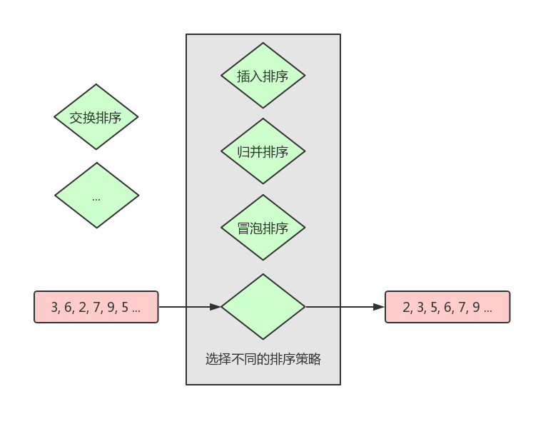

# Java 设计模式：策略模式

在策略模式中，一个类的行为或其内部的算法是可以在运行时进行更改的。

## 概述

当一个问题需要多种处理方式且这几种处理方式都仅仅是在具体行为上有差异时，我们可以将这个差异抽象出来作为一个统一的接口。然后，使用者在运行时就可以根据实际情况选择不同的接口实现来处理这个问题，这个接口实现可以理解为策略。用不同的策略来解决同一个或同一类问题，即策略模式。

比如说，我们现在要对一组数据进行排序，在排序时需要根据实际场景来选择排序的策略，比如插入排序、归并排序和冒泡排序等。针对这类需求，我们可以将排序逻辑抽象出来作为一个接口，然后默认提供该接口的一到多个实现 (策略)。在运行时，使用者根据需要去设置策略即可并执行排序即可。如果默认提供的策略不满足需求的话，使用者也可以自己根据接口来实现新的排序策略。

看文字有点抽象？那我们来画个图：



> 在上图中，我们想要对 `2, 6, 2, 7, 9, 5 ...` 这几个数字进行排序，默认提供了 `插入排序`、`归并排序`、`冒泡排序` 这三种排序策略，在排序时我们可选择其中一个参与排序逻辑即可。当然，如果我们想要通过其它排序策略进行排序的话，也可以自己去实现 (比如实现一个 `交换排序` 的策略)。


## 示例

言语万千，不如代码两行。

现在我们进入示例环节：设计一个运算系统，可以采用不同策略 (加、减、乘、除) 来对两个数字进行运算。

### 代码设计

```java
// 抽象出来的策略接口
public interface Strategy {
    int doOperation(int a, int b);
}

// 策略：加
public class AddStrategy implements Strategy {
    @Override
    public int doOperation(int a, int b) {
        return a + b;
    }
}

// 策略：减
public class SubtractionStrategy implements Strategy {
    @Override
    public int doOperation(int a, int b) {
        return a - b;
    }
}

// 策略：乘
public class MultiplyStrategy implements Strategy {
    @Override
    public int doOperation(int a, int b) {
        return a * b;
    }
}

// 策略：除
public class DivisionStrategy implements Strategy {
    @Override
    public int doOperation(int a, int b) {
        return a / b;
    }
}
```

```java
// 运算系统 (上下文)
public class Context {
    private int mA;
    private int mB;
    private Strategy mStrategy;

    public Context(int a, int b) {
        mA = a;
        mB = b;
        // 默认策略为 “加运算”
        mStrategy = new AddStrategy();
    }

    public int execute() {
        return mStrategy.doOperation(mA, mB);
    }

    public void setStrategy(Strategy strategy) {
        mStrategy = strategy;
    }
}
```

### 代码验证

```java
// 创建一个运算系统，设置不同的策略后再执行运算
public static void main(String[] args) {
    Context context = new Context(8, 5);
    System.out.println("加：" + context.execute());

    context.setStrategy(new SubtractionStrategy());
    System.out.println("减：" + context.execute());

    context.setStrategy(new DivisionStrategy());
    System.out.println("乘：" + context.execute());

    context.setStrategy(new SubtractionStrategy());
    System.out.println("除：" + context.execute());
}
```

```java
加：13
减：3
乘：40
除：1
```

由上面的输出日志可以看出，同一个运算系统，在设置不同的运算策略之后，运算的结果也是不一样的。


### 扩展

在上面的运算系统中，默认提供了加、减、乘、除四个运算策略，现在我们觉得还不满足需要，想要在系统之外定义一些其它策略，比如 “求余”：

```java
public class RemainStrategy implements Strategy {
    @Override
    public int doOperation(int a, int b) {
        return a % b;
    }
}

// context.setStrategy(new SubtractionStrategy());
// System.out.println("余：" + context.execute());
// 余：3
```


## 总结

策略模式优点：
* 算法可以自由切换。
* 避免使用多重条件进行判断。
* 扩展性好。

策略模式缺点：
* 策略类会增多。
* 所有策略类都需要对外暴露。

策略模式使用场景：
* 当同一类型的问题有多种且需要多种处理方式，且这多种处理方式仅仅是在行为上有差异时。
* 需要安全地封装多种同一类型的操作时。
* 出现同一抽象类有多个子类，且需要使用 `if-else` 或 `switch-case` 来选择子类时。