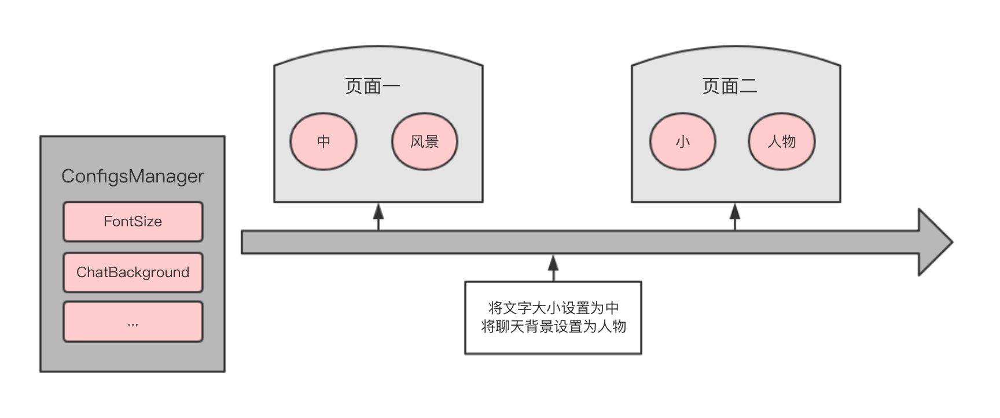
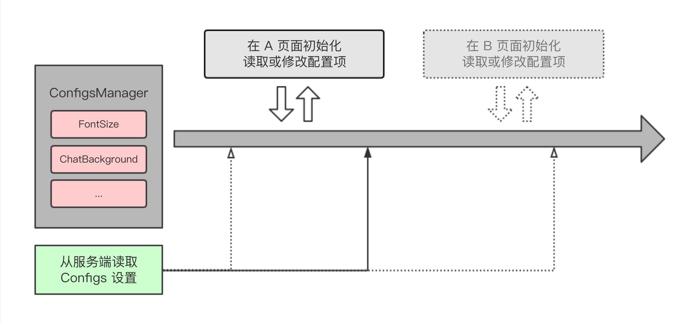

# Java 设计模式：单例模式

> 单例模式估计是最容易理解，也是最常用的设计模式了。

在单例设计模式中，需要设计一个单例类：
* 这个单例类只能有一个实例。
* 这个单例类本身必须能够创建自己的单一实例。
* 这个单例类必须能够给其它任何对象提供这一实例。

## 概述

在软件开发过程中，如果我们想保证一个类只有一个实例，并想一个全局访问点给使用方提供这个实例，则可以考虑下使用单例模式。单例模式可以避免类频繁创建和销毁所带来的开销，节省系统资源的同时，也简化了对该类相关逻辑的管理。

假设我们正在开发一个手机应用程序，该应用程序支持进行各种各样的设置，比如字体大小、聊天背景等。在编码上，我们可以设计一个 `ConfigsManager` 类，这个类封装了应用程序中所有的设置项 (每一项配置对应一个实例变量)，也封装了实例变量对应的 `get` 和 `set` 方法。

既然 `ConfigsManager` 已经封装了所有的设置项，那么我们就可以将其视为一个单例类，它只有一个实例：

```java
public class ConfigsManager {
    private String mFontSize;
    private String mChatBackground;

    private static ConfigsManager sConfigsManagers;

    private ConfigsManager() {
        System.out.println("初始化：从数据库中读取所有设置项");

        // 假设当前数据库文字大小为「中」，聊天背景为「风景」
        mFontSize = "中";
        mChatBackground = "风景";
    }

    public static ConfigsManager getInstance() {
        if (sConfigsManagers == null) {
            synchronized (ConfigsManager.class) {
                if (sConfigsManagers == null) {
                    sConfigsManagers = new ConfigsManager();
                }
            }
        }
        return sConfigsManagers;
    }

    // get and set methods ...

    public String getFontSize() {
        return mFontSize;
    }

    public void setFontSize(String fontSize) {
        mFontSize = fontSize;
        System.out.println("将数据库中文字大小设置为" + fontSize);
    }

    public String getChatBackground() {
        return mChatBackground;
    }

    public void setChatBackground(String chatBackground) {
        mChatBackground = chatBackground;
        System.out.println("将数据库中聊天背景设置为" + chatBackground);
    }
}
```

这就是我们设计好的 `ConfigsManager` 单例类。

你说是单例就是单例了？我要验证一下。

我们现在设计的是一个手机应用程序，手机应用程序一般都会有很多个页面。我们编写一个从「页面一」跳转「页面二」的小示例：
* 在「页面一」中修改 `ConfigsManager` 中的配置项
* 然后在「页面二」中看看读取到的配置项是不是在「页面一」轴修改后的值

```java
// 第一个页面
public class FirstPage {
  
    public void getCurrentConfigs() {
        ConfigsManager manager = ConfigsManager.getInstance();
        System.out.println("第一个页面："
                + "当前文字大小为" + manager.getFontSize()
                + ", 当前聊天背景为" + manager.getChatBackground());
    }

    public void changeFontSize(String fontSize) {
        ConfigsManager manager = ConfigsManager.getInstance();
        manager.setFontSize(fontSize);
    }

    public void changeChatBackground(String chatBackground) {
        ConfigsManager manager = ConfigsManager.getInstance();
        manager.setChatBackground(chatBackground);
    }
}

// 第二个页面
public class SecondPage {

    public void getCurrentConfigs() {
        ConfigsManager manager = ConfigsManager.getInstance();
        System.out.println("第二个页面："
                + "当前文字大小为" + manager.getFontSize()
                + ", 当前聊天背景为" + manager.getChatBackground());
    }
}

// 验证逻辑
public static void main(String[] args) {
    FirstPage firstPage = new FirstPage();
    firstPage.getCurrentConfigs();
    firstPage.changeFontSize("小");
    firstPage.changeChatBackground("人物");

    SecondPage secondPage = new SecondPage();
    secondPage.getCurrentConfigs();
}
```

日志输出如下：

```java
初始化：从数据库中读取所有设置项
第一个页面：当前文字大小为中, 当前聊天背景为风景
将数据库中文字大小设置为小
将数据库中聊天背景设置为人物
第二个页面：当前文字大小为小, 当前聊天背景为人物
```

我们在「页面一」中将文字大小设置为小、将聊天背景设置为人物，然后在「页面二」中读取到的配置项刚好是在「页面一」中设置后的值，由此间接验证了我们设计的 `ConfigsManager` 类是一个单例类。

该示例的逻辑示意图如下：




实际上，单例模式的实现方式有很多种：

* 懒汉式 (线程不安全)
* 懒汉式 (线程安全)
* 饿汉式
* 双检锁/双重校验锁方式 (DCL，即 double-checked locking)
* 登记式/静态内部类方式

下面我们来一一剖析这几种实现方式的代码编写，以及对应的优缺点。


## 懒汉式 (线程不安全)

```java
public class Singleton {  
    private static Singleton instance;  
    private Singleton (){}  
  
    public static Singleton getInstance() {  
    if (instance == null) {  
        instance = new Singleton();  
    }  
    return instance;  
    }  
}
```

延迟初始化实例，线程不安全。

因为没有加锁 `synchronized`，是非线程安全的。严格意义上来说这种实现方式并不是是单例模式，因为如果程序中刚好有多个线程同时执行 `getInstance()` 方法，它们获取到的 `Singleton` 对象可能不是同一个。


## 懒汉式 (线程安全)

```java
public class Singleton {  
    private static Singleton instance;  
    private Singleton (){}  
    public static synchronized Singleton getInstance() {  
    if (instance == null) {  
        instance = new Singleton();  
    }  
    return instance;  
    }  
}
```

延迟初始化实例，线程安全。

优点：第一次调用才初始化，避免内存浪费。
缺点：必须加锁 `synchronized` 才能保证单例，但加锁会影响效率。


## 饿汉式

```java
public class Singleton {  
    private static Singleton instance = new Singleton();  
    private Singleton (){}  
    public static Singleton getInstance() {  
    return instance;  
    }  
}
```

类装载时初始化实例，线程安全。

优点：没有加锁，执行效率更高。
缺点：类加载时就初始化实例，浪费资源。

该实现方式基于 `classloader` 机制避免了多线程的同步问题。但是 `instance` 是在类装载时实例化的，并没有达到延迟加载的效果。


## 双检锁/双重校验锁 (DCL)

```java
public class Singleton {  
    private volatile static Singleton singleton;  
    private Singleton (){}  
    public static Singleton getSingleton() {  
    if (singleton == null) {  
        synchronized (Singleton.class) {  
          if (singleton == null) {  
              singleton = new Singleton();  
          }  
        }  
    }  
    return singleton;  
    }  
}
```

> 这就是我们在设计 `ConfigsManager` 单例类时用到的实现方式。

延迟初始化实例，线程安全。

这种是实现方式采用了双重校验锁的机制，安全，并在多线程的情况下保持高性能。


## 登记式/静态内部类

```java
public class Singleton {  
    private static class SingletonHolder {  
      private static final Singleton INSTANCE = new Singleton();  
    }  

    private Singleton (){}  
    public static final Singleton getInstance() {  
      return SingletonHolder.INSTANCE;  
    }  
}
```

延迟初始化实例，线程安全。

与「双重校验锁」实现方式相比：

* 这种通过对静态域使用延迟初始化的实现方式能达到一样的效果，实现也相对简单点。
* 但这种实现方式只适用于 **静态域** 的情况，而「双重校验锁」方式可在 **实例域** 需要延迟初始化的情况下使用。

与「饿汉」实现方式相比：

* 这种实现方式在 `Singleton` 类被装载时，不一定会初始化 `instance`。因为内部类 `SingletonHolder` 还没有被主动使用，只有在显式调用 `getInstance()` 方法时，才会显式装载 `SingletonHolder` 类，从而实例化 `instance`。


## 扩展

回到一开始 `ConfigsManager` 的例子，`ConfigsManager` 中设计的配置项读写主要是面向手机本地的。但在实际的移动应用程序开发中，配置项在本地读取同时，可能也需要从服务器读取，所以我们还需要在设计上下点功夫。

一般情况下，在应用程序启动时，我们会调用接口从服务器获取到当前用户所有的配置项 `Configs`，获取到返回结果后我们再更新本地的配置项。配置项很多的情况下，我们就不能再简单的通过「每一项配置对应一个实例变量」进行设计了，而是：

* 直接将 `Configs` 作为 `ConfigsManager` 类的一个实例变量。
* 在 `ConfigsManager` 类中设计一个 `updateConfigs()` 的实例方法，调用该方法时不仅会修改 `Configs` 对应变量的值，也会将 `Configs` 持久化到数据库 (更新数据库中的配置项) 。
* 在 `ConfigsManager` 初始化时需要读取数据库中的 `Configs` 并设置到对应的实例变量，如果数据库中还没有相关 `Config` 配置项的话就针对每一个 `Config` 设置它的默认值。
* 在 `ConfigsManager` 还仍需保留 `fontSize`、`chatBackground` 等配置项的 `get` 和 `set` 方法，并不建议通过 `ConfigsManager` 获取到 `Configs` 对象，然后后再通过 `Configs` 对象调用对应的方法。

这样设计 `ConfigsManager` 的话，不仅能很好的管理整个应用程序的配置逻辑，也能保证本地配置和服务器端配置的一致性。

> 注：在 `CongfigsManager` 的使用过程中，我们是不需要关心服务器的配置结果是什么时候返回的。就好像是 `CongfigsManager` 在对你说：您尽管虐我，我保证不会出事儿。

同一开始的示例，在这里也上一盘示意图：




## 总结

在本篇文章中，我们学习了单例设计模式的几种实现方式，并通过设计一个「移动应用程序中的配置管理类」的示例来加深大家对该设计模式的理解。