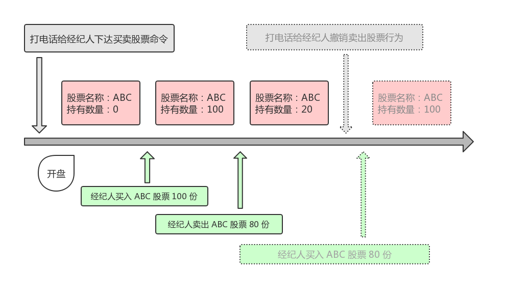

# Java 设计模式：命令模式

命令模式是一种数据驱动型的模式。

在命令模式中，我们可以将请求以命令的形式包裹在对象中，然后将该对象委托给接受者，接受者在获取到这些命令对象后，在合适的时机去执行这些对象里的命令。

## 示例


假设我们是股票持有人，现在想要买卖一些股票。一般情况下，我们会将买卖的行为委托给经纪人去执行。也就是说，我们传达买卖股票的命令给经纪人，在开盘后经纪人就会去执行这些命令。

想买股票？首先你要有一个股票类：

```java
public class Stock {
    private String name;
    private int quantity;

    public Stock(String name, int quantity) {
        this.name = name;
        this.quantity = quantity;
    }

    // getter and setter ...
```

想下命令？你得抽象出命令的接口，然后再实现买卖命令的具体类：

```java
// 命令接口
public interface Order {
    void execute();
}

// 购买股票的具体命令类
public class BuyOrder implements Order {
    private Stock mStock;

    public BuyOrder(Stock stock) {
        mStock = stock;
    }

    @Override
    public void execute() {
        System.out.println("Buy stock: name = " + mStock.getName()
                + ", quantity = " + mStock.getQuantity());
    }
}

// 卖出股票的具体命令类
public class SellOrder implements Order {
    private Stock mStock;

    public SellOrder(Stock stock) {
        mStock = stock;
    }

    @Override
    public void execute() {
        System.out.println("Sell stock: name = " + mStock.getName()
                + ", quantity = " + mStock.getQuantity());
    }
}
```

没有经济人？你得构造一个：

```java
public class Broker {
    // 买卖股票的命令
    private List<Order> mOrders;

    public Broker() {
        mOrders = new ArrayList<>();
    }

    // 接收命令
    public void takeOrder(Order order) {
        mOrders.add(order);
    }

    // 执行命令
    public void placeOrders() {
        for(Order order : mOrders) {
            order.execute();
        }
        mOrders.clear();
    }
}
```

好，铛铛铛... 开盘了！

```java
// 喂，哥们儿 (经纪人)，在开盘后你就帮我买进 ABC 股 100 份
// 然后在行情好时帮我卖掉 80 份，就酱，谢谢
public static void main(String[] args) {
    Stock stock1 = new Stock("ABC", 100);
    BuyOrder buyOrder = new BuyOrder(stock1);

    Stock stock2 = new Stock("ABC", 80);
    SellOrder sellOrder = new SellOrder(stock2);

    Broker broker = new Broker();
    broker.takeOrder(buyOrder);
    broker.takeOrder(sellOrder);
    broker.placeOrders();
}
```

经纪人在开盘后的行为如下：

```java
Buy stock: name = ABC, quantity = 100
Sell stock: name = ABC, quantity = 80
```

嗯，这就是我们要演示的「命令模式」栗子，下面是示意图：



咦.. 怎么后面多了个「撤销卖出股票行为」的命令？

因为股票是种神奇的东西呀，持有人在经纪人卖出 80 份股票后预期 ABC 还会继续涨，于是火急火燎地又给经纪人哥们打了个电话。


## 总结

关于命令模式

* 意图：将不同的请求封装成不同的命令对象，然后委托给命令接收者去执行。
* 命令：委托方 -> 接收者 -> 执行。
* 使用场景：在某些场景下，可能需要对行为进行「记录」、「撤销」/「重做」、「事务」等处理，如果通过常规的、无法抵御变化的、紧耦合的方式去实现是不合适的。在这些场景下，应该将这些行为抽象成对象，将「行为委托方」与「行为接收和执行方」进行松耦合。
* 优点：逻辑清晰，降低了系统耦合度，新的命令可以很容易地添加到系统中。
* 缺点：每增加一种命令时，都需要实现一个具体命令类，在一定程度上也增加了系统复杂度。