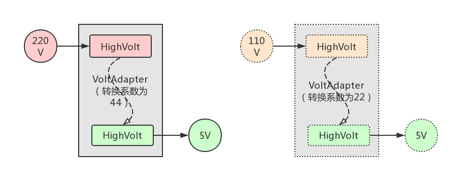
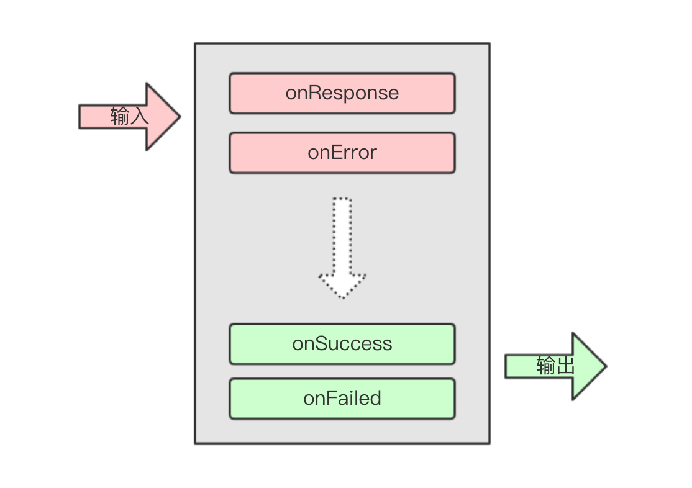

# Java 设计模式：适配器模式

适配器模式是一种结构型模式：
* 可实现一个适配器类作为两个不兼容接口之间的桥梁，
* 然后将一个接口适配成使用者所预期的另一个接口。

适配器模式的使用场景有：
* 系统需要使用现有的类，但此类的接口不符合系统的需要，即接口不兼容。
* 想要建立一个可以重复使用的类，使其与一些彼此之间没有太大关联的类 (当前有或将来会引进的类) 一起工作。
* 需要一个统一的输出接口，而输入端的类型还不知道，即无法预期。
  

## 简单示例

在日常生活中，我们手机的充电电压一般是 5V，而我国的供电电压一般是 220V，所以我们在为手机充电时需要通过「电源适配器」进行电压转换，将输入为 220V 的电压转换成 5V 再输出。

> 友情提示：如果你要去台湾旅游的话，可能还要备有一个将 110V 输入电压转换为 5V 输出的「电源适配器」噢。

接下来我们就通过这个「电源适配器」的案例来演示下适配器模式的代码编写：

```java
// 输入电压类
public class HighVolt {
    private int mVolt;

    public HighVolt(int volt) {
        mVolt = volt;
    }

    // getter and setter ...
}

// 抽象出来的输出接口
public interface LowVolt {
    int getFiveVolt();
}

// 电源适配器类
public class VoltAdapter implements LowVolt {
    // 每个电源适配器的硬件都是固定的 (可以理解为适配器类固有的一些适配逻辑)
    // 比如说，将 220V 输入电压转换为 5V 电压再输出，需要一个 44 的转换系数
    public static final int COEFFICIENT = 44;

    private HighVolt mHighVolt;

    public VoltAdapter(HighVolt highVolt) {
        mHighVolt = highVolt;
    }

    @Override
    public int getFiveVolt() {
        // 获取输入电压，转换后作为结果进行输出
        int highVolt = mHighVolt.getVolt();
        int result = highVolt / COEFFICIENT;
        return result;
    }
}
```

演示代码很简单，如果你还觉得抽象的话.. 别担心，我们有图：



裤子都脱了，你就让我看个图？呃.. 那我们再来看下测试代码：

```java
/// 首先，构造一个输入电压实体类
/// 然后，构建该输入类的实例，并传入到适配器实例中
/// 最后，从适配器实例中获取输出电压
public static void main(String[] args) {
    HighVolt highVolt = new HighVolt(220);
    VoltAdapter adapter = new VoltAdapter(highVolt);

    int lowerVolt = adapter.getFiveVolt();
    System.out.println("lowerVolt = " + lowerVolt);
}
```

日志输出如下：

```java
lowerVolt = 5
```

测试结果完全符合预期！

但是，工作几年后回头总结设计模式系列文章，想举一个抽象不实用的生活例子敷衍了事？

自然不是，我们再结合实际开发举一个栗子。


## 开发示例


在客户端应用程序开发中，我们通常会有一到多个「接口请求方法」，这些方法都会有一个「请求结果监听器」参数。下面是一个通过「用户 id」查询「用户名称」的接口请求方法：

```java
// 为简化演示代码，我们假设所有的接口响应都是一个格式为 "响应码,响应字符串" 的字符串
// 当响应码为 0 时，表示请求成功，"," 后面是响应结果
// 当响应码不为 0 时，表示请求失败，"," 后面是失败描述
// 
// 如果请求出错 (即还没有真正调用接口，或接口调用超时没有响应)
// 就根据出错情况回调自定义的响应码和出错描述
```

```java
public interface OnResponseListener {
    void onResponse(String response);
    void onError(String code, String message);
}

public class HttpManager {
    public static final String DIVIDER = ",";
    public static final String CODE_SUCCESS = "0";
    public static final String CODE_FAILED = "1";
    public static final String CODE_ERROR = "-1";

    // 如果没有传入 id 参数，回调请求失败
    // 如果传入的 id 参数为 1024，回调请求成功
    // 如果传入的 id 参数不为 1024，回调请求失败
    public void queryUserNameById(Map<String, String> params, OnResponseListener listener) {
        if (params == null) {
            listener.onError(CODE_ERROR, "参数不能为空");
            return;
        }
        String id = params.get("id");
        if ("1024".equals(id)) {
            listener.onResponse(CODE_SUCCESS + DIVIDER + "zhuanghongji");
            return;
        }
        listener.onResponse(CODE_FAILED + DIVIDER + "未找到对应用户");
    }
}
```

接口和请求方法都定义好之后，我们的请求姿势是这样的：

```java
HttpManager manager = new HttpManager();
Map<String, String> params = new HashMap<>();
params.put("id", "1024");

manager.queryUserNameById(params, new OnResponseListener() {
    @Override
    public void onResponse(String response) {
        System.out.println("请求响应: " + response);
        // 根据响应码执行不同的逻辑
        String[] res = response.split(HttpManager.DIVIDER);
        String code = res[0];
        String result = res[1];
        if (HttpManager.CODE_SUCCESS.equals(code)) {
            System.out.println("请求成功：username = " + result);
            return;
        }
        System.out.println("请求失败：message = " + result);
    }

    @Override
    public void onError(String code, String message) {
        System.out.println("请求出错: code = " + code + ", message = " + message);
    }
});
```

日志输出如下：

```java
请求响应: 0,zhuanghongji
请求成功：username = zhuanghongji
```

嗯，逻辑完全正确，接口请求方法的设计者心想：后面的小伙子就按我这个姿势作为模板进行接口请求吧。

然而，后面有个小伙子想了想，这个请求方法是没什么问题，但是每次响应成功后都需要在 [onResponse] 里判断响应码，这不是浪费大伙儿开发时间嘛，阅读起来也不友好。

于是，这个小伙子噼里啪啦敲了一段适配器代码：

```java
// 小伙子预期的输出接口应该是这样的
public interface OnResultListener {
    // 有响应且在响应码为 0 时回调，参数 s 是处理后的响应结果
    void onSuccess(String s);
    // ”有响应但响应码不为 0“ 或 ”请求出错“ 时回调
    void onFailed(String code, String message);
}

// 接口请求监听器的适配器
public abstract class OnResultAdapter
        implements OnResponseListener, OnResultListener {
    @Override
    public void onResponse(String response) {
        // 解析请求响应，
        // 根据响应码回调 onSuccess 或 onFailed
        String[] res = response.split(HttpManager.DIVIDER);
        String code = res[0];
        String result = res[1];
        if (HttpManager.CODE_SUCCESS.equals(code)) {
            onSuccess(result);
            return;
        }
        onFailed(code, result);
    }

    @Override
    public void onError(String code, String message) {
        // 直接回调 onFailed
        onFailed(code, message);
    }
}
```

该适配器的示意图如下：



从此以后，这个小伙子的请求姿势变成了酱紫：

```java
HttpManager manager = new HttpManager();
Map<String, String> params = new HashMap<>();
params.put("id", "1024");

// Adapter 中已经做了响应码的判断
manager.queryUserNameById(params, new OnResultAdapter() {
    @Override
    public void onSuccess(String s) {
        System.out.println("请求成功：username = " + s);
    }

    @Override
    public void onFailed(String code, String message) {
        System.out.println("请求出错: code = " + code + ", message = " + message);
    }
});
``` 

是不是简化了很多，如果后面还有其它小伙子想将输出适配成其它接口，那自然也是没有问题的。这就是适配器模式在实际开发中的应用，同时也凸显出了它强大的「后期」能力。

> 注意：**适配器并不是一开始进行代码设计的时候就添加好的，而是为了解决项目遇到的问题才添加的。** 当然，你也可以理解成：一开始设计的接口请求监听器仅是作为一个统一的输出接口，后面的使用者需要根据自身需要编写对应的适配器。

下面我们写一个 `main` 方法，对添加适配器之前和之后的接口调用代码做一个总结性的对比和验证：

```java
public static void main(String[] args) {
    HttpManager manager = new HttpManager();
    // 一开始
    OnResponseListener responseListener = new OnResponseListener() {
        @Override
        public void onResponse(String response) {
            System.out.println("onResponse: " + response);
        }

        @Override
        public void onError(String code, String message) {
            System.out.println("onError: code = " + code + ", message = " + message);
        }
    };
    // 后来
    OnResultAdapter resultAdapter = new OnResultAdapter() {
        @Override
        public void onSuccess(String s) {
            System.out.println("onSuccess: " + s);
        }

        @Override
        public void onFailed(String code, String message) {
            System.out.println("onFailed: code = " + code + ", message = " + message);
        }
    };

    // 请求出错
    System.out.println("-----");
    manager.queryUserNameById(null, responseListener);
    manager.queryUserNameById(null, resultAdapter);

    Map<String, String> params = new HashMap<>();
    // 有响应，且响应码表示成功
    params.put("id", "1024");
    System.out.println("-----");
    manager.queryUserNameById(params, responseListener);
    manager.queryUserNameById(params, resultAdapter);
    // 有响应，但响应码表示失败
    params.put("id", "1023");
    System.out.println("-----");
    manager.queryUserNameById(params, responseListener);
    manager.queryUserNameById(params, resultAdapter);
}
```

事实上，我们还可以对上述适配器的代码编写进行优化。因为在客户端的请求中，当请求出错或请求失败时，通常都会弹出一个对话框提示用户相关信息。然而上面的 `OnResultAdapter` 适配器并没有实现 `onFialed()` 方法弹出提示，所以我们接下来做一下补充实现：

```java
public abstract class OnResultAdapter
        implements OnResponseListener, OnResultListener {
    // ...

    @Override
    public void onFailed(String code, String message) {
        showAlert(message);
    }
}
```

这样，在请求时如果不需要对 `onFailed()` 进行特殊处理 (非弹出对话框)，就只需要实现 `onSuccess()` 方法：

```java
manager.queryUserNameById(params, new OnResultAdapter() {
    @Override
    public void onSuccess(String s) {
        System.out.println("请求成功：username = " + s);
    }
});
```

如果需要进行特殊处理，覆写 `onFailed()` 方法就是了：

```java
 manager.queryUserNameById(params, new OnResultAdapter() {
    @Override
    public void onSuccess(String s) {
        System.out.println("请求成功：username = " + s);
    }

    @Override
    public void onFailed(String code, String message) {
        // super.onFailed(code, message);
        System.out.println("对 onFailed 做特别处理");
    }
});
```

## 总结

好了，这就是我们这篇文章要讲的适配器模式。

如果写的不好或有错误，帮忙提个 Issue 噢。皮卡丘！


