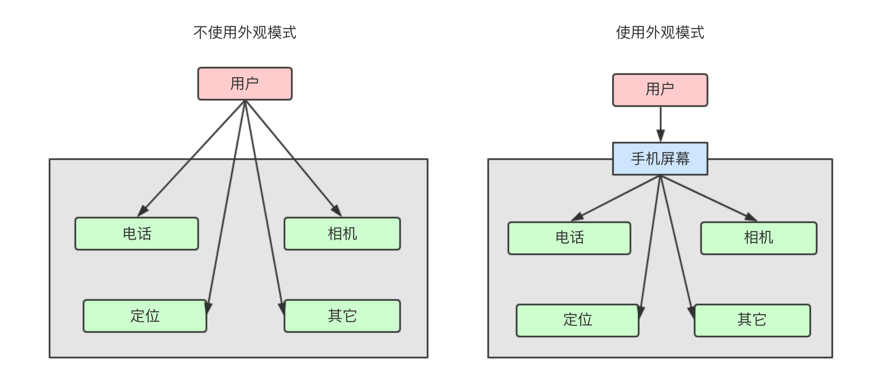

# Java 设计模式：外观模式

外观模式是一种结构型模式，通过外观模式可以隐藏系统的复杂性，提供给使用者调用的系统访问接口易用性更强。

使用场景：
* 为复杂的模块或子系统提供外界访问的模块。
* 子系统相对独立。
* 预防低水平人员带来的风险。

## 示例


废话不多说：描述 -> 画图 -> 写代码。

**描述**

生活中使用外观模式的栗子非常多，任何一个类似中央调度结构的组织都是一种外观模式的应用。比如手机，它集电话、短信、拍照等功能于一身，只需通过点击手机屏幕 (外观) 就可以使用，并不需要了解具体功能的内部细节 (系统复杂性)。

**画图**



**写代码**

手机系统模拟代码：

```java
// 抽象出电话功能接口 (如拨打电话、挂断电话)
public interface IPhone {
    void call(String phoneNumber);
    void hangup();
}

// 实现电话功能接口的具体类
public class DefaultPhoneImpl implements IPhone {
    @Override
    public void call(String phoneNumber) {
        System.out.println("拨打电话：" + phoneNumber);
    }

    @Override
    public void hangup() {
        System.out.println("挂断电话");
    }
}
```

```java
// 抽象出相机功能接口 (如打开相机、关闭相机)
public interface ICamera {
    void open();
    void close();
}

// 实现相机功能接口的具体类
public class DefaultCameraImpl implements ICamera {
    @Override
    public void open() {
        System.out.println("打开相机");
    }

    @Override
    public void close() {
        System.out.println("关闭相机");
    }
}
```

```java
// 手机 (集成了电话和相机功能，并提供了相关的方法)
public class MobilePhone {
    private IPhone mDefaultPhone;
    private ICamera mDefaultCamera;

    public MobilePhone() {
        mDefaultPhone = new DefaultPhoneImpl();
        mDefaultCamera = new DefaultCameraImpl();
    }

    public void callSomeone(String phoneNumber) {
        mDefaultPhone.call(phoneNumber);
    }

    public void hangup() {
        mDefaultPhone.hangup();
    }

    public void takePicture() {
        mDefaultCamera.open();
        System.out.println("拍照");
        mDefaultCamera.close();
    }

    public void startVideoChat() {
        mDefaultCamera.open();
        System.out.println("开始视频聊天");
        mDefaultCamera.close();
    }
}
```

模拟手机系统的代码到这里就差不多了，接下来是测试代码：

```java
public static void main(String[] args) {
    MobilePhone mobilePhone = new MobilePhone();

    mobilePhone.callSomeone("123456");
    mobilePhone.hangup();

    mobilePhone.takePicture();
    mobilePhone.startVideoChat();
}
```

日志输出如下：

```
拨打电话：123456
挂断电话
打开相机
拍照
关闭相机
打开相机
开始视频聊天
关闭相机
```

`MobilePhone` 类可以理解为手机的外观，`DefaultPhoneImpl` 和 `DefaultCameraImpl` 可以理解为手机内部的复杂细节。我们通过 `MobilePhone` 使用电话或相机功能的时候，只使用其暴露出来的方法就好了，并不需要了解其内部的细节。


## 扩展

使用者既然不需要了解外观模式隐藏了的复杂细节，那么日后我们在调整这些细节时也就不会对使用者造成影响了。比如说，系统自带相机拍出来的人像照并不好看，我们想改为使用第三方相机进行拍照，如「美颜相机」：

> 相信我，我真的不是在帮美颜相机打广告...   >_^

代码改写后如下：

```java
// 增加美图相机实现类
public class MeituCameraImpl implements ICamera {
    @Override
    public void open() {
        System.out.println("打开美图相机");
    }

    @Override
    public void close() {
        System.out.println("关闭美图相机");
    }
}

// 增加 mMeituCamera 实例变量
public class MobilePhone {
    private IPhone mDefaultPhone;
    private ICamera mDefaultCamera;
    private ICamera mMeituCamera;

    public MobilePhone() {
        mDefaultPhone = new DefaultPhoneImpl();
        mDefaultCamera = new DefaultCameraImpl();
        mMeituCamera = new MeituCameraImpl();
    }

    public void takePicture() {
        // 打开和关闭的都改为美图相机
        mMeituCamera.open();
        System.out.println("拍照");
        mMeituCamera.close();
    }
    
    // ...
}
```

此时，日志输出是酱紫的：

```java
打开美图相机
拍照
关闭关闭相机
```

OK，示例完毕。


## 总结

在这篇文章中，我们演示了外观模式的使用，它的：

* 意图：通过抽象出一组接口或方法，简化了使用者的操作逻辑。
* 优点：减少系统间的相互依赖，提高灵活性和安全性。
* 缺点：要改东西的话有点麻烦，继承和重写都不合适。

