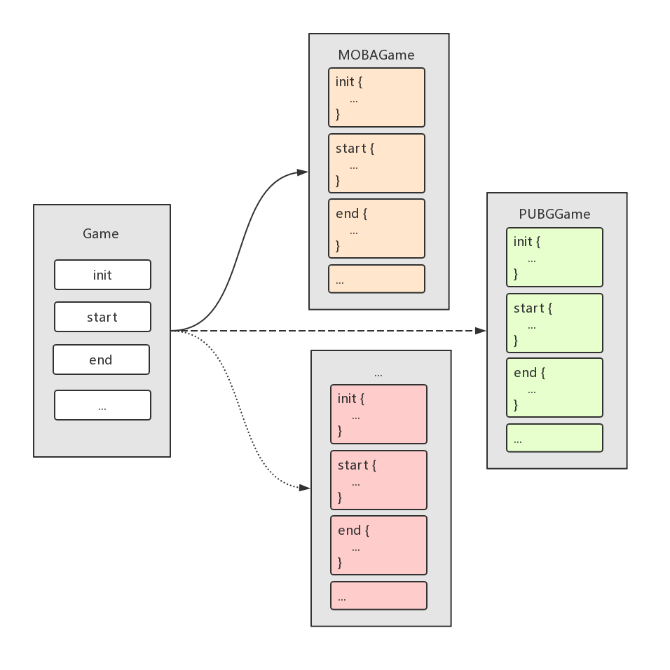

# Java 设计模式：模板方法模式

模板方法模式属于行为型模式。

在模板方法模式中有一个抽象的类，该抽象类定义了相关方法的模板，它的子类可以根据需要重写模板中的方法，但调用还是会以在抽象类中定义好的方式进行。


## 概述

意图：
* 定义一个操作算法的骨架，但有一些步骤延迟到子类中实现。

优点：
* 不变的部分已封装好，剩余可变的部分可随意扩展。
* 行为延迟到子类实现，但控制权在父类手中。
* 提取出了公共代码，维护变得简单。

缺点：
* 每个不同的实现都需要一个子类，会导致类的个数增加，使得系统更加庞大。
* 通过继承的方式实现，而不是组合。

使用场景：
* 多个子类共有一些方法，且逻辑相同时。
* 代码逻辑重要且复杂，可以将核心方法抽象出来设计为模板，且其它相关的方法可延迟到子类中实现时。
* 重构时模板方法模式也是一种常见的处理手段，可以把相同的代码抽取到父类中，然后通过钩子函数约束其行为。

> 如果想防止不规范操作，可在模板方法前面加上 `final` 关键字。


## 示例

平时我们玩手机游戏的姿势是大多是这样的：
* 点击桌面上的游戏应用图标启动游戏并等待初始化。
* 游戏初始化后，点击相关按钮，开始游戏。
* 噼里啪啦一技能二技能紧接大招，五杀完胜，玩腻了，关闭游戏。

不管是什么游戏，玩的步骤差不多都是这样的，即：初始化游戏 -> 开始游戏 -> 结束游戏。

所以我们可以把这些步骤都抽象出来作为游戏的一个模板：

```java
// 游戏抽象类
public abstract class Game {
    abstract void init();
    abstract void start();
    abstract void end();

    public final void play() {
        init();
        start();
        end();
    }
}
```

```java
// 王者荣耀游戏具体类
public class MOBAGame extends Game {
    @Override
    void init() {
        System.out.println("王者荣耀：已准备好");
    }

    @Override
    void start() {
        System.out.println("王者荣耀：开始，一技能二技能紧接大招");
    }

    @Override
    void end() {
        System.out.println("王者荣耀：结束");
    }
}

// 绝地求生游戏具体类
public class PUBGGame extends Game {
    @Override
    void init() {
        System.out.println("绝地求生：已准备好");
    }

    @Override
    void start() {
        System.out.println("绝地求生：开始，补血步枪仅接着手榴弹");
    }

    @Override
    void end() {
        System.out.println("绝地求生：结束");
    }
}
```




到这里就已经把游戏都设计好了，接下来我们来玩一下：

```java
public static void main(String[] args) {
    Game mobaGame = new MOBAGame();
    mobaGame.play();

    Game pubgGame = new PUBGGame();
    pubgGame.play();
}
```

日志输出如下：

```
王者荣耀：已准备好
王者荣耀：开始，一技能二技能紧接大招
王者荣耀：结束
绝地求生：已准备好
绝地求生：开始，补血步枪仅接着手榴弹
绝地求生：结束
```

## 总结

在这篇文章中，我们了解了模板方法模式的基本思想和使用姿势。

> 模板方法实际上可以理解成一个封装好了的固定流程，第一步该做什么，第二步该做什么其实都已经在抽象类中定义好了。子类可以有不同的算法实现，可以在框架不被修改的情况下实现某些步骤的算法替换。