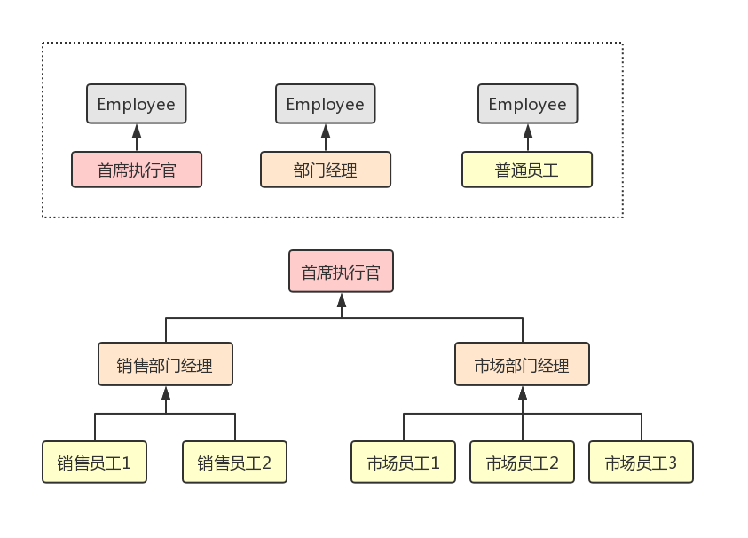
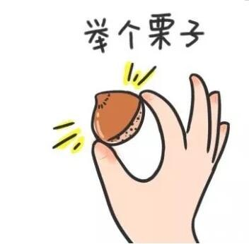
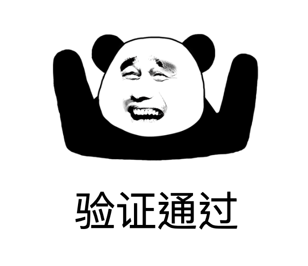

# Java 设计模式：组合模式

组合模式也称为部分整体模式，是结构型设计模式的一种。

组合模式将一组相似的对象看作一个对象进行处理，这组对象是根据一个树状结构进行组合的，处理时提供一个统一的方法来访问相应的对象，使得可以忽略对象与对象组之间的差异。

举一个跟公司相关的例子：
* 一个公司里会有一个「首席执行官」
* 一个「首席执行官」会管理着多个「部门经理」，
* 一个「部门经理」会管理着多个「普通员工」。

但其实对公司而言，不管是「首席执行官」还是「部门经理」还是「普通员工」，它们的本质都是公司的员工。示意图如下：




## 代码示例



上面举的公司员工这个栗子，如果想通过组合模式进行编码的话，姿势是酱紫的：

```java
public class Employee {

    private String mName;
    private String mPosition;
    private int mSalary;
    private List<Employee> mSubordinates;

    public Employee(String name, String position, int salary) {
        mName = name;
        mPosition = position;
        mSalary = salary;
        mSubordinates = new ArrayList<>();
    }

    // name, position, salary getter and setter ...

    // 增加管理的员工
    public void add(Employee employee) {
        mSubordinates.add(employee);
    }

    // 移除管理的员工
    public void remove(Employee employee) {
        mSubordinates.remove(employee);
    }

    // 获取管理的员工列表
    public List<Employee> getSubordinates() {
        return mSubordinates;
    }

    // 获取管理的员工列表
    public String getSubordinateNames() {
        if (mSubordinates.isEmpty()) {
            return "无";
        }
        StringBuilder builder = new StringBuilder();
        for (Employee e : mSubordinates) {
            builder.append(e.getName()).append(",");
        }
        String result = builder.toString();
        return result.substring(0, result.length() - 1);
    }

    // 获取自己以及管理的员工的总工资
    public int getSubordinateTotalSalary() {
        int result = mSalary;
        for (Employee e : mSubordinates) {
            result += e.getSubordinateTotalSalary();
        }
        return result;
    }
}
```

上面的 `Employee` 是我们抽象出来的公司员工类。接下来我们写一段测试代码，来构建出一个公司里面的 CEO、部门经理、普通员工等人员，并验证我们提供的 "统一访问对象的方法" 逻辑是否正确：

```java
public static void main(String[] args) {
    Employee ceo = new Employee("张三", "CEO", 30000);
    Employee salesManager = new Employee("李四", "销售部经理", 20000);
    Employee marketingManager = new Employee("王五", "市场部经理", 20000);
    Employee sale1 = new Employee("销售员工1", "销售员工", 10000);
    Employee sale2 = new Employee("销售员工2", "销售员工", 11000);
    Employee marketing1 = new Employee("市场员工1", "市场员工", 10000);
    Employee marketing2 = new Employee("市场员工2", "市场员工", 11000);
    Employee marketing3 = new Employee("市场员工3", "市场员工", 12000);

    salesManager.add(sale1);
    salesManager.add(sale2);
    marketingManager.add(marketing1);
    marketingManager.add(marketing2);
    marketingManager.add(marketing3);
    ceo.add(salesManager);
    ceo.add(marketingManager);

    System.out.println("张三管理的员工有：" + ceo.getSubordinateNames());
    System.out.println("李四管理的员工有：" + salesManager.getSubordinateNames());
    System.out.println("王五管理的员工有：" + marketingManager.getSubordinateNames());
    System.out.println("----------------");
    System.out.println("张三及其管理的员工总工资：" + ceo.getSubordinateTotalSalary());
    System.out.println("李四及其管理的员工总工资：" + salesManager.getSubordinateTotalSalary());
    System.out.println("王五及其管理的员工总工资：" + marketingManager.getSubordinateTotalSalary());
    System.out.println("----------------");
    System.out.println("销售员工1管理的员工有：" + sale1.getSubordinateNames());
    System.out.println("销售员工1及其管理的员工总工资：" + sale1.getSubordinateTotalSalary());
    System.out.println("----------------");
    marketingManager.remove(marketing1);
    System.out.println("市场员工1离职后");
    System.out.println("王五管理的员工有：" + marketingManager.getSubordinateNames());
    System.out.println("王五及其管理的员工总工资：" + marketingManager.getSubordinateTotalSalary());
}
```

日志输出是这样的：

```java
张三管理的员工有：李四,王五
李四管理的员工有：销售员工1,销售员工2
王五管理的员工有：市场员工1,市场员工2,市场员工3
----------------
张三及其管理的员工总工资：124000
李四及其管理的员工总工资：41000
王五及其管理的员工总工资：53000
----------------
销售员工1管理的员工有：无
销售员工1及其管理的员工总工资：10000
----------------
市场员工1离职后
王五管理的员工有：市场员工2,市场员工3
王五及其管理的员工总工资：43000
```



由此可见，尽管 `Employ` 类的实现很简单，但是通过组合的形式可以构建出一个庞大的公司员工结构。


## 总结

组合模式类包含了一个本身对象的集合，并提供了访问该集合的统一方法。

意图：
* 将对象组合成树形，以表示「部分-整体」的层次结构。
* 使得用户对单个对象和组合对象的使用具有一致性。

主要解决：
* 在树型结构的问题中，模糊了简单元素和复杂元素的概念。
* 客户程序可以向处理简单元素一样来处理复杂元素，从而使得客户程序与复杂元素的内部结构进行解耦。

如何解决：树枝和叶子实现统一接口，树枝内部组合该接口。

关键逻辑：树枝内部组合该接口，并且含有内部属性 `List`，里面放 `Component`。

优点：高层模块调用简单，节点可自由增加。

缺点：在使用组合模式时，其叶子和树枝的声明都是实现类，而不是接口，违反了依赖倒置原则。

使用场景：「部分-整体」相关场景，如树形菜单、文件及文件夹的管理等。

注意事项：定义时为具体类。


