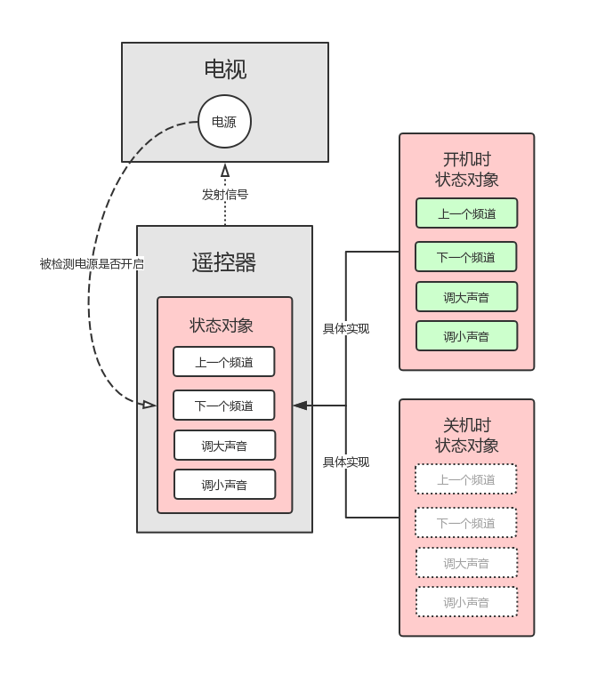

# Java 设计模式：状态模式

状态模式一种行为型模式。

在状态模式中，允许对象在内部状态发生改变的同时也改变它的行为。

以电视遥控器为例：
* 当电视电源关闭时，遥控器检测到当前是「关机状态」，点击遥控器中的按钮时会亮红灯，不发射任何遥控信号。
* 而当电视电源开启时，遥控器检测到当前是「开机状态」，点击遥控器中的按钮时会亮绿灯，并发射按钮对应的遥控信号。

一看到需求，先风骚地创建一个含有 `PowerFlag` (电视电源开关标识) 实例变量的 `TvController` 类来表示遥控器，在接收到按钮事件后通过判断 `powerFlag` 标识来决定是否发射对应信号，比如：

```java
public class TvController {
  // ...

  private boolean mPowerFlag;

  public void onNextChannel() {
    if (mPowerFlag) {
      System.out.println("亮绿灯，并切换到下一个频道");
      return;
    }
    System.out.println("仅红灯");
  }
}
```

这样做在逻辑上当然没有问题，因为我们只有一个 `PowerFlag` 标识呀，只需判断当前电视是否开机来决定是否发射信号就好了。但在实际生活中，遥控器的功能可能没那么简单噢，比如说：

* 电视除了有电源开关状态外，还有一个是否待机的状态，预期在待机状态下遥控器是不能发射遥控信号的。
* 另外，遥控器是有电池的吧，当电池快没电时，预期点击按钮发射信号时不再亮绿灯，而是亮黄灯，以提示用户电源不足。
* ...

如果我们要实现的遥控器这么复杂，就需要在 `onNextChannel()` 等事件通知方法中写大量 `if - else` 判断逻辑，这无疑增加了系统的复杂性。

那么，有没有一种好的设计模式可用来处理这种场景呢？

有，那便是状态模式。下面我们不再通过 `if - else` 的方式来编写遥控器代码了，大家都是成年人，编码姿势要优雅一点。


## 优雅的编码姿势

前面废了好多话，说好的图文并茂呢小老弟：



* 电视的电源开关状态可以被遥控器检测到。
* 遥控器内部的有一个抽象出来的行为接口，根据电视电源开关状态有着不一样的具体实现，如：「开机时状态对象」和「关机时状态对象 (按钮点击发射信号)」。
* 点击遥控器中的按钮时，遥控器会通过当前的状态对象执行定义好的逻辑。

代码如下：

```java
// 抽象出遥控器的行为 (状态)
public interface TvState {
    void onNextChannel();
    void onPrevChannel();
    void onTurnUp();
    void onTurnDown();
}

// 当电视电源为开启时的状态实现
public class PowerOnState implements TvState {
    @Override
    public void onNextChannel() {
        System.out.println("* 亮绿灯，切换到下一个频道");
    }

    @Override
    public void onPrevChannel() {
        System.out.println("* 亮绿灯，切换到上一个频道");
    }

    @Override
    public void onTurnUp() {
        System.out.println("* 亮绿灯，调大声音");
    }

    @Override
    public void onTurnDown() {
        System.out.println("* 亮绿灯，调小声音");
    }
}

// 当电视电源为关闭时的状态实现
public class PowerOffState implements TvState {

    @Override
    public void onNextChannel() {
        System.out.println("* 仅亮红灯");
    }

    @Override
    public void onPrevChannel() {
        System.out.println("* 仅亮红灯");
    }

    @Override
    public void onTurnUp() {
        System.out.println("* 仅亮红灯");
    }

    @Override
    public void onTurnDown() {
        System.out.println("* 仅亮红灯");
    }
}
```

```java
// 电源开或关的行为 (通知)
public interface PowerController {
    void powerOn();
    void powerOff();
}

// 遥控器类 (可接收电源开关的通知、可处理按钮的点击事件)
public class TvController implements PowerController, TvState {
    private TvState mState;

    public TvController() {
        mState = new PowerOffState();
    }

    @Override
    public void powerOn() {
        System.out.println("- 检测到电视已开机");
        mState = new PowerOnState();
    }

    @Override
    public void powerOff() {
        System.out.println("- 检测到电视已关机");
        mState = new PowerOffState();
    }


    @Override
    public void onNextChannel() {
        mState.onNextChannel();
    }

    @Override
    public void onPrevChannel() {
        mState.onPrevChannel();
    }

    @Override
    public void onTurnUp() {
        mState.onTurnUp();
    }

    @Override
    public void onTurnDown() {
        mState.onTurnDown();
    }
}
```

在上述遥控器的相关代码中：
* 当检测到电视电源状态发生变化时，遥控器会设置对应的具体状态对象。
* 当接收到按钮点击事件时，直接使用当前最新的状态对象执行对应方法即可，不用再写繁琐的 `if - else` 判断了。


当然是真的，不信我们来验证一下：

```java
public static void main(String[] args) {
    // 创建遥控对象时，发现电视正处于关机状态
    TvController controller = new TvController();

    // 电视开机之前，点击遥控的控制按钮都没有用
    controller.onNextChannel();
    controller.onTurnUp();

    System.out.println("点击电视上的电源按钮");
    controller.powerOn();
    controller.onNextChannel();
    controller.onPrevChannel();
    controller.onTurnUp();
    controller.onTurnDown();

    System.out.println("再次点击电视上的电源按钮");
    controller.powerOff();

    // 电视关机之后，点击遥控的控制按钮都没有用
    controller.onNextChannel();
    controller.onTurnUp();
    controller.onTurnDown();
}
```

日志输出如下：

```java
* 仅亮红灯
* 仅亮红灯
点击电视上的电源按钮
- 检测到电视已开机
* 亮绿灯，切换到下一个频道
* 亮绿灯，切换到上一个频道
* 亮绿灯，调大声音
* 亮绿灯，调小声音
再次点击电视上的电源按钮
- 检测到电视已关机
* 仅亮红灯
* 仅亮红灯
* 仅亮红灯
```

由输出日志可知，改善后的遥控器代码的运行逻辑是完全符合预期的。


## 总结

当代码中包含大量与对象状态有关的逻辑判断时，可以将这些逻辑相关的行为抽象出来，并作不同的状态实现。当状态发生变化时，只需根据最新状态设置不同的对象即可。

优点： 
* 封装了转换规则。 
* 枚举可能的状态，在枚举状态之前已经确定好了状态种类。 
* 将所有与某个状态有关的行为放到一个类中，可以方便地增加新的状态，只需要改变对象状态即可改变对象的行为。 
* 允许状态转换逻辑与状态对象合成一体，而不是写一长串儿条件语句。 
* 可以让多个环境共享一个状态对象，从而减少系统中对象的个数。

缺点:
*  状态模式的使用必然会增加系统类和对象的个数。 
*  状态模式的结构与实现都较为复杂，如果使用不当将导致程序结构和代码的混乱。 
*  状态模式对 "开闭原则" 的支持并不太好，增加新的状态类时需要修改那些负责状态转换的代码逻辑，否则无法切换到新增状态。
