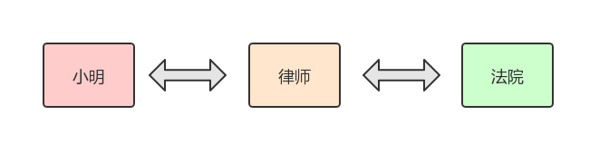

# Java 设计模式：代理模式

定义：为其它对象提供一种代理，以控制对这个对象的访问。

使用场景：当无法或不想直接访问某个对象，亦或是访问某个对象存在困难时，可以通过一个代理对象来进行间接访问。

> 为了保证客户端使用的透明性，委托对象与代理对象需要实现相同的接口。


## 示例


感觉文字表述枯燥？那让柯南举个栗子：
* 从前有个哥们欠了小明一大笔钱，拖欠了几年还没还，于是小明通过法律途径来解决这个问题。
* 既然选择了通过法律途径解决问题，那么小明就得请个律师来作为自己的代理诉讼人，而不是直接跟法院进行沟通。

也就是说，律师需要作为小明跟法院的中间代理人负责相互传递消息。示意图如下：



示例代码如下：

```java
// 抽象出诉讼行为步骤的接口
public interface ILawsuit {
    void summit();  // 提交申请
    void burden();  // 进行举证
    void defend();  // 开始辩护
    void finish();  // 诉讼完成
}
```

```java
// 小明 (实现了诉讼接口)
public class XiaoMing implements ILawsuit {
    @Override
    public void summit() {
        System.out.println("小明：有人欠钱不还，当然提交诉讼。");
    }

    @Override
    public void burden() {
        System.out.println("小明：这是借条和转账记录。");
    }

    @Override
    public void defend() {
        System.out.println("小明：证据确凿，就让法院裁决。");
    }

    @Override
    public void finish() {
        System.out.println("小明：诉讼成功，判决欠款人七日内归还借款。");
    }
}

// 律师 (也实现了诉讼接口)
public class Lawer implements ILawsuit{
    private ILawsuit mLawsuit;

    public Lawer(ILawsuit lawsuit) {
        mLawsuit = lawsuit;
    }

    @Override
    public void summit() {
        System.out.println("律师：是否要提交诉讼？");
        mLawsuit.summit();
        System.out.println("律师：已向法院提起诉讼。");

    }

    @Override
    public void burden() {
        System.out.println("律师：请提供相关证据。");
        mLawsuit.burden();
        System.out.println("律师：已提供相关证据到法院。");
    }

    @Override
    public void defend() {
        System.out.println("律师：开庭辩护，是否可以私下协商解决？");
        mLawsuit.defend();
        System.out.println("律师：等待法院的判决结果。");
    }

    @Override
    public void finish() {
        System.out.println("律师：已收到法院的判决结果。");
        mLawsuit.finish();
        System.out.println("律师：结案。");
    }
}
```

测试代码如下：

```java
public static void main(String[] args) {
    XiaoMing xiaoMing = new XiaoMing();
    Lawer lawer = new Lawer(xiaoMing);
    lawer.summit();
    lawer.burden();
    lawer.defend();
    lawer.finish();
}
```

日志输出如下：

```java
律师：是否要提交诉讼？
小明：有人欠钱不还，当然提交诉讼。
律师：已向法院提起诉讼。
律师：请提供相关证据。
小明：这是借条和转账记录。
律师：已提供相关证据到法院。
律师：开庭辩护，是否可以私下协商解决？
小明：证据确凿，就让法院裁决。
律师：等待法院的判决结果。
律师：已收到法院的判决结果。
小明：诉讼成功，判决欠款人七日内归还借款。
律师：结案。
```

从上面的示例和测试代码可以看出，代码模式的使用并不难，主要是一种委托机制的实现。真实对象将方法的执行委托给代理对象，代理对象在执行委托方法的前后，是可以执行一些其它逻辑的。

> 补充：因为我们已经抽象出了诉讼行为的接口 `ILawsuit`，律师 `Lawer` 也对该接口也做了实现。如果有其他人也想发起诉讼的话，在实现 `ILawsuit` 接口之后，可直接将 `Lawer` 作为自己的代理。


## 扩展 

**生活中还有哪些常用例子？**
* Windows 里面的快捷方式。
* 买火车票不一定要去车站，可以去代售点。

**和适配器模式有什么区别？**
* 适配器模式的目的是为了转换适配对象的接口，而代理模式仅仅是代理接口而不能做任何改变。

**和装饰器模式有什么区别？**
* 装饰器模式是为了增强功能，而代理模式是为了加以控制。

**代理模式有什么优缺点？**
* 优点：职责清晰，扩展性高，智能化。
* 缺点：由于增加了代理对象，额外工作量增加，有些类型的代理模式可能会造成请求的处理速度变慢。 


## 总结

这篇文章通过诉讼案件的讲述了代理模式的基本思想和使用姿势，同时也列举了它与其它常见模式的区别。


