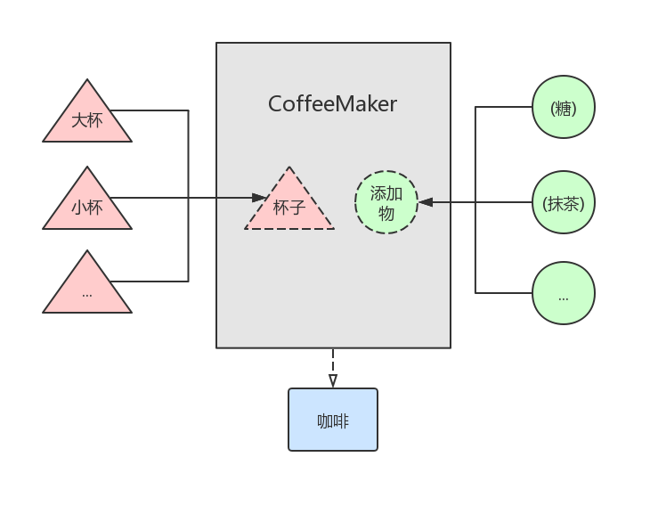

# Java 设计模式：桥接模式


桥接模式是一种结构模式，顾名思义，它承担的作用是连接「两边」。


## 概述

桥接模式使得「抽象部分」和「实现部分」相分离，它们都可以独立地进行变化。虽说是「两边」，但实际上任意多个树状结构的类之间的耦合都可以使用桥接模式来解耦。

使用场景：
* 如果一个系统想在抽象和具体之间增加更多灵活性，但又不想在这两个层次之间建立静态的继承关系，则可以使用桥接模式来为它们建立一个关联关系。
* 如果一个类存在多个独立变化的维度，且这多个维度都需要有自由扩展的能力，也可以使用桥接模式来进行解耦。

举个栗子？


小红去咖啡店买咖啡的时候，看到菜单上的咖啡分为四种：
* 大杯加糖
* 大杯加抹茶
* 小杯加糖
* 小杯加抹茶

但实际对于咖啡本身来说，就只分两种变化：
* 大杯或小杯
* 加糖或加抹茶

上述两种变化无非就是「杯子」和「添加物」的变化，那我们先将其抽象出来，然后再做不同的实现就好了：

```java
// 抽象出来的杯子
public interface Cup {
    String getDesc();
}

// 大杯
public class LargeCup implements Cup {
    @Override
    public String getDesc() {
        return "大杯";
    }
}

// 小杯
public class SmallCup implements Cup {
    @Override
    public String getDesc() {
        return "小杯";
    }
}
```

```java
// 抽象出来的添加物
public interface Additive {
    String getDesc();
}

// 加糖
public class SugarAdditive implements Additive{
    @Override
    public String getDesc() {
        return "加糖";
    }
}

// 加抹茶
public class matchaAdditive implements Additive{

    @Override
    public String getDesc() {
        return "加抹茶";
    }
}
```

小红买的是咖啡 (可以理解为是杯子和添加物组成了咖啡)，那自然要有个表示咖啡的类：

```java
// 咖啡类
public class Coffee {
    private String mCup;
    private String mAdditives;

    // 构造函数参数：具体杯子和具体添加物
    public Coffee(String cup, String additives) {
        mCup = cup;
        mAdditives = additives;
    }

    // getter, setter and toString ..
}
```

杯子、添加物和咖啡类都有了，那杯子和咖啡是如何组合成咖啡的呢？我们需要一个桥接类：

```java
// 用于桥接杯子和添加物来制作咖啡的类
public class CoffeeMaker {
    // 桥接方法，接收杯子和添加物的抽象作为参数
    public Coffee makeCoffee(Cup cup, Additive additive) {
        String cupDesc = cup.getDesc();
        String additiveDesc = additive.getDesc();
        return new Coffee(cupDesc, additiveDesc);
    }
}
```

听着键盘声敲了一大堆代码，现在终于可以开始咖啡的制作了：

```java
public static void main(String[] args) {
    // 准备好各种杯子和各种添加物
    Cup largeCup = new LargeCup();
    Cup smallCup = new SmallCup();
    Additive sugar = new SugarAdditive();
    Additive matcha = new matchaAdditive();

    CoffeeMaker maker = new CoffeeMaker();
    Coffee largeSugar = maker.makeCoffee(largeCup, sugar);
    Coffee largeMatcha = maker.makeCoffee(largeCup, matcha);

    Coffee smallSugar = maker.makeCoffee(smallCup, sugar);
    Coffee smallMatcha = maker.makeCoffee(smallCup, matcha);

    System.out.println(largeSugar
            + "\n" + largeMatcha
            + "\n" + smallSugar
            + "\n" + smallMatcha);
}
```

日志输出如下：

```java
Coffee{mCup=大杯, mAdditives=加糖}
Coffee{mCup=大杯, mAdditives=加抹茶}
Coffee{mCup=小杯, mAdditives=加糖}
Coffee{mCup=小杯, mAdditives=加抹茶}
```

以上便是桥接模式的一个简单应用，示意图如下：

| *左边是一个树状结构，右边也是一个树状结构* 
| - |
| 


在前面对桥接模式进行概述时，「扩展」两个字提到了好几次，如何在制作咖啡这个示例中体现？

客人的需求是刁钻的，比如说有个客人想要一个中杯加糖的咖啡。好，来满足客人的需求：扩展出一个中杯的杯子。

```java
// 创建一个实现了 Cup 接口的「中杯」
public class MiddleCup implements Cup {
    @Override
    public String getDesc() {
        return "中杯";
    }
}

// 然后就可以制作中杯加糖或加抹茶的咖啡了
Cup middleCup = new MiddleCup();
Coffee middleSugar = maker.makeCoffee(middleCup, sugar);
Coffee middleMatcha = maker.makeCoffee(middleCup, matcha);
System.out.println(middleSugar
        + "\n" + middleMatcha);

// 日志输出如下：
Coffee{mCup=中杯, mAdditives=加糖}
Coffee{mCup=中杯, mAdditives=抹茶}
```

当然，如果你想增加一种「奶油」添加物，那也是完全没问题的。

> 支持奶油添加物的姿势与支持制作中杯咖啡的姿势类似。


## 总结

在这篇文章中，我们先概述了什么是桥接模式，然后在咖啡制作的例子中进行了实际应用。

使用桥接模式能够解决 "在有多种可能会变化的情况下，用继承会造成类爆炸问题，扩展起来不灵活" 的问题。它的：

* 优点：抽象和实现相分离，扩展能力强，实现细节对客户透明。
* 缺点：桥接模式的引入会增加系统的理解与设计难度。
* 注意：对于两个独立变化的维度，使用桥接模式再适合不过了。
